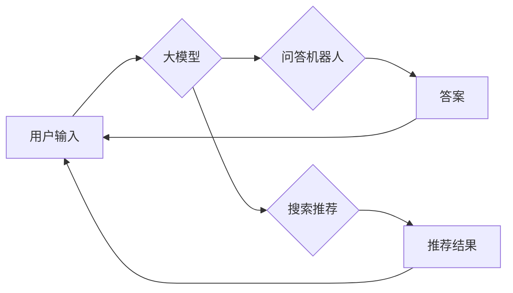

> 大模型、问答机器人、搜索推荐、互补性、自然语言处理、人工智能

## 1. 背景介绍

随着人工智能技术的飞速发展，大模型在自然语言处理领域展现出强大的能力，例如文本生成、翻译、摘要等。其中，问答机器人和搜索推荐作为两个重要的应用场景，都依赖于大模型的强大语义理解和知识表示能力。然而，它们各自存在着局限性，也存在着互补的可能性。

**1.1 问答机器人的局限性**

传统的问答机器人主要依赖于规则引擎或基于知识图谱的检索方式，难以应对开放式、复杂的问题，且知识库的更新和维护成本高昂。

**1.2 搜索推荐的局限性**

传统的搜索引擎主要依赖于关键词匹配和页面排名算法，难以理解用户真实意图，推荐结果可能与用户需求不符。

**1.3 大模型的优势**

大模型通过海量文本数据训练，具备强大的语义理解、知识表示和文本生成能力，可以有效解决问答机器人和搜索推荐的局限性。

## 2. 核心概念与联系

**2.1 核心概念**

* **大模型:** 指训练参数数量超过数十亿甚至千亿的深度学习模型，例如GPT-3、BERT、LaMDA等。
* **问答机器人:** 利用自然语言处理技术，能够理解用户问题并提供相关答案的智能系统。
* **搜索推荐:** 根据用户历史行为、偏好等信息，推荐用户感兴趣的商品、服务或内容。

**2.2 联系**

大模型可以为问答机器人和搜索推荐提供强大的语义理解和知识表示能力，从而提升它们的性能和用户体验。

**2.3 架构图**



## 3. 核心算法原理 & 具体操作步骤

**3.1 算法原理概述**

大模型问答机器人和搜索推荐的核心算法原理主要基于深度学习技术，包括：

* **Transformer网络:** 用于捕捉文本序列中的长距离依赖关系，提升语义理解能力。
* **BERT模型:** 预训练语言模型，能够理解上下文信息，提升问答和推荐的准确性。
* **检索模型:** 用于从海量数据中检索相关信息，例如BM25、TF-IDF等。

**3.2 算法步骤详解**

**3.2.1 问答机器人**

1. 用户输入问题。
2. 将问题转换为文本向量表示。
3. 利用BERT模型对问题进行语义理解，提取关键信息。
4. 从知识库中检索相关信息。
5. 利用Transformer网络生成自然语言答案。

**3.2.2 搜索推荐**

1. 用户输入搜索关键词或浏览行为。
2. 将关键词或行为转换为文本向量表示。
3. 利用BERT模型对关键词或行为进行语义理解，提取用户意图。
4. 利用检索模型从海量数据中检索相关信息。
5. 利用Transformer网络生成个性化推荐结果。

**3.3 算法优缺点**

**优点:**

* 能够理解复杂的问题和用户意图。
* 推荐结果更加个性化和精准。
* 知识库更新和维护成本降低。

**缺点:**

* 训练成本高昂，需要大量数据和计算资源。
* 模型解释性较差，难以理解模型决策过程。
* 存在潜在的偏见和错误。

**3.4 算法应用领域**

* **问答机器人:** 智能客服、教育机器人、虚拟助手等。
* **搜索推荐:** 搜索引擎、电商平台、内容平台等。

## 4. 数学模型和公式 & 详细讲解 & 举例说明

**4.1 数学模型构建**

大模型问答机器人和搜索推荐的数学模型主要基于深度学习框架，例如TensorFlow或PyTorch。模型结构通常包括多个神经网络层，例如卷积层、池化层、全连接层等。

**4.2 公式推导过程**

深度学习模型的训练过程基于梯度下降算法，目标函数通常是交叉熵损失函数。公式推导过程较为复杂，涉及到微积分、概率论等数学知识。

**4.3 案例分析与讲解**

例如，BERT模型的训练目标是最大化预测目标词的概率，公式如下：

$$
P(token_i | context) = \frac{exp(score(token_i, context))}{\sum_{j} exp(score(token_j, context))}
$$

其中，$token_i$ 是目标词，$context$ 是上下文信息，$score$ 是模型预测的得分。

## 5. 项目实践：代码实例和详细解释说明

**5.1 开发环境搭建**

* Python 3.x
* TensorFlow 或 PyTorch
* CUDA 和 cuDNN

**5.2 源代码详细实现**

```python
# 使用BERT模型进行问答
from transformers import AutoModelForQuestionAnswering, AutoTokenizer

# 加载预训练模型和词典
model_name = "bert-base-uncased"
tokenizer = AutoTokenizer.from_pretrained(model_name)
model = AutoModelForQuestionAnswering.from_pretrained(model_name)

# 输入问题和上下文
question = "What is the capital of France?"
context = "France is a country in Europe. Its capital is Paris."

# 将问题和上下文转换为文本向量
inputs = tokenizer(question, context, return_tensors="pt")

# 使用模型进行预测
outputs = model(**inputs)

# 获取答案
answer_start = outputs.start_logits.argmax().item()
answer_end = outputs.end_logits.argmax().item()
answer = tokenizer.decode(inputs["input_ids"][0][answer_start:answer_end+1])

# 打印答案
print(answer)
```

**5.3 代码解读与分析**

* 使用HuggingFace Transformers库加载预训练的BERT模型和词典。
* 将问题和上下文转换为文本向量，并输入到模型中。
* 模型输出答案的起始和结束位置，通过解码器将位置转换为文本答案。

**5.4 运行结果展示**

```
Paris
```

## 6. 实际应用场景

**6.1 问答机器人**

* **智能客服:** 自动回答用户常见问题，例如订单查询、退换货等。
* **教育机器人:** 为学生提供个性化学习辅导，回答学生提出的问题。
* **虚拟助手:** 帮助用户完成日常任务，例如设置提醒、预订酒店等。

**6.2 搜索推荐**

* **搜索引擎:** 根据用户搜索关键词，提供更精准的搜索结果。
* **电商平台:** 根据用户浏览历史和购买记录，推荐用户感兴趣的商品。
* **内容平台:** 根据用户阅读习惯，推荐用户感兴趣的文章或视频。

**6.3 未来应用展望**

* **更个性化和智能化的服务:** 大模型可以根据用户的个人喜好和需求，提供更个性化和智能化的服务。
* **跨模态交互:** 大模型可以理解和生成多种模态信息，例如文本、图像、音频等，实现更丰富的用户交互体验。
* **自动代码生成:** 大模型可以根据用户需求自动生成代码，提高开发效率。

## 7. 工具和资源推荐

**7.1 学习资源推荐**

* **书籍:**
    * 《深度学习》
    * 《自然语言处理》
* **在线课程:**
    * Coursera: 深度学习
    * Udacity: 自然语言处理
* **博客和论坛:**
    * HuggingFace Blog
    * TensorFlow Blog
    * PyTorch Blog

**7.2 开发工具推荐**

* **深度学习框架:** TensorFlow, PyTorch
* **自然语言处理库:** NLTK, SpaCy, Transformers
* **云计算平台:** AWS, Azure, Google Cloud

**7.3 相关论文推荐**

* BERT: Pre-training of Deep Bidirectional Transformers for Language Understanding
* GPT-3: Language Models are Few-Shot Learners
* LaMDA: Language Models for Dialogue Applications

## 8. 总结：未来发展趋势与挑战

**8.1 研究成果总结**

大模型问答机器人和搜索推荐取得了显著的进展，能够理解复杂的问题和用户意图，提供更精准的推荐结果。

**8.2 未来发展趋势**

* **模型规模和能力提升:** 随着计算资源的不断发展，大模型的规模和能力将进一步提升。
* **跨模态交互:** 大模型将能够理解和生成多种模态信息，实现更丰富的用户交互体验。
* **个性化定制:** 大模型将能够根据用户的个人喜好和需求，提供更个性化的服务。

**8.3 面临的挑战**

* **训练成本高昂:** 训练大模型需要大量的计算资源和数据，成本较高。
* **模型解释性差:** 大模型的决策过程难以理解，缺乏可解释性。
* **潜在的偏见和错误:** 大模型可能存在潜在的偏见和错误，需要进行严格的评估和控制。

**8.4 研究展望**

未来研究将重点关注以下几个方面:

* **降低训练成本:** 研究更有效的训练方法和算法，降低训练成本。
* **提升模型解释性:** 研究模型解释技术，提高模型的可解释性。
* **解决模型偏见和错误:** 研究方法来识别和解决模型中的偏见和错误。


## 9. 附录：常见问题与解答

**9.1 问：大模型问答机器人和搜索推荐的性能如何？**

答：大模型问答机器人和搜索推荐的性能显著优于传统方法，能够理解复杂的问题和用户意图，提供更精准的推荐结果。

**9.2 问：大模型问答机器人和搜索推荐的应用场景有哪些？**

答：大模型问答机器人和搜索推荐的应用场景广泛，例如智能客服、教育机器人、搜索引擎、电商平台等。

**9.3 问：大模型问答机器人和搜索推荐的未来发展趋势是什么？**

答：大模型问答机器人和搜索推荐的未来发展趋势包括模型规模和能力提升、跨模态交互、个性化定制等。


作者：禅与计算机程序设计艺术 / Zen and the Art of Computer Programming 
<end_of_turn>