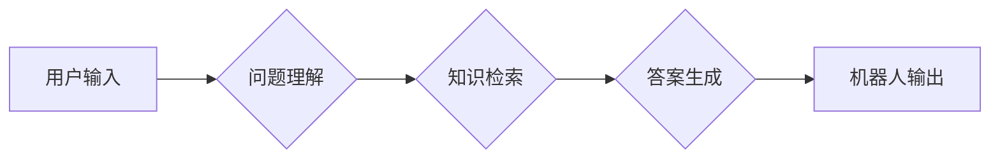

> 大模型、预训练语言模型、问答机器人、自然语言处理、Transformer

## 1. 背景介绍

近年来，人工智能领域取得了令人瞩目的进展，其中自然语言处理（NLP）领域尤为突出。大规模预训练语言模型（如GPT-3、BERT、LaMDA等）的出现，为NLP任务带来了革命性的变革，显著提升了机器对自然语言的理解和生成能力。

问答机器人作为一种重要的NLP应用，旨在通过与用户进行自然语言交互，回答用户的提问。传统的问答机器人通常依赖于规则或模板匹配，难以应对复杂、开放式的问答场景。而基于大模型的预训练语言模型的问答机器人，则能够利用其强大的语义理解和知识表示能力，实现更准确、更自然、更智能的对话体验。

## 2. 核心概念与联系

### 2.1 预训练语言模型

预训练语言模型是指在海量文本数据上进行预训练的深度学习模型，其目标是学习语言的语法、语义和知识表示。常见的预训练任务包括：

* **语言建模（Language Modeling）：**预测下一个词，学习语言的上下文依赖关系。
* **掩码语言建模（Masked Language Modeling）：**遮盖部分词，预测被遮盖的词，学习词语的语义和上下文关系。
* **句子对分类（Sentence Pair Classification）：**判断两个句子之间的关系（例如相似、矛盾、蕴含等），学习句子之间的语义关联。

### 2.2 问答机器人

问答机器人是一种能够理解用户问题并提供相关答案的智能系统。其核心功能包括：

* **问题理解（Question Understanding）：**识别问题类型、提取关键信息、理解问题的意图。
* **知识检索（Knowledge Retrieval）：**从知识库或外部数据源中检索与问题相关的知识。
* **答案生成（Answer Generation）：**根据检索到的知识，生成自然流畅的答案。

### 2.3 核心架构

基于大模型的预训练语言模型的问答机器人通常采用以下架构：



## 3. 核心算法原理 & 具体操作步骤

### 3.1 算法原理概述

基于大模型的预训练语言模型的问答机器人主要依赖于Transformer模型的强大能力。Transformer模型通过自注意力机制（Self-Attention）和多头注意力机制（Multi-Head Attention）学习语言的上下文依赖关系，能够捕捉长距离依赖和复杂的语义关系。

### 3.2 算法步骤详解

1. **预训练阶段:** 在海量文本数据上进行预训练，学习语言的语法、语义和知识表示。
2. **微调阶段:** 使用特定任务的数据对预训练模型进行微调，例如问答任务。
3. **问题理解:** 将用户输入的问题进行分词、词性标注、依存句法分析等处理，提取关键信息和意图。
4. **知识检索:** 根据问题信息，从知识库或外部数据源中检索相关知识。
5. **答案生成:** 利用预训练模型的生成能力，根据问题和检索到的知识，生成自然流畅的答案。

### 3.3 算法优缺点

**优点:**

* 能够理解复杂、开放式的问答场景。
* 答案质量高，更自然、更流畅。
* 可扩展性强，可以接入外部知识库和数据源。

**缺点:**

* 预训练模型参数量大，训练和部署成本高。
* 容易受到训练数据质量的影响。
* 缺乏对真实世界知识的理解和推理能力。

### 3.4 算法应用领域

* **客服机器人:** 自动回答用户常见问题，提高客服效率。
* **教育机器人:** 为学生提供个性化学习辅导，解答学习疑问。
* **搜索引擎:** 理解用户搜索意图，提供更精准的搜索结果。
* **新闻资讯:** 自动生成新闻摘要和问答，提高信息获取效率。

## 4. 数学模型和公式 & 详细讲解 & 举例说明

### 4.1 数学模型构建

Transformer模型的核心是自注意力机制和多头注意力机制。

**自注意力机制:**

自注意力机制允许模型关注输入序列中的每个词与其他词之间的关系，从而学习词语之间的上下文依赖关系。

公式：

$$
Attention(Q, K, V) = softmax(\frac{QK^T}{\sqrt{d_k}})V
$$

其中：

* $Q$：查询矩阵
* $K$：键矩阵
* $V$：值矩阵
* $d_k$：键向量的维度
* $softmax$：softmax函数

**多头注意力机制:**

多头注意力机制将自注意力机制应用于多个不同的子空间，从而学习更丰富的上下文信息。

公式：

$$
MultiHead(Q, K, V) = Concat(head_1, head_2, ..., head_h)W^O
$$

其中：

* $head_i$：第 $i$ 个注意力头的输出
* $h$：注意力头的数量
* $W^O$：最终输出层的权重矩阵

### 4.2 公式推导过程

自注意力机制的公式推导过程如下：

1. 将输入序列 $X$ 转换为查询矩阵 $Q$、键矩阵 $K$ 和值矩阵 $V$。
2. 计算每个词与所有其他词之间的注意力权重。
3. 使用注意力权重对值矩阵进行加权求和，得到每个词的上下文表示。

### 4.3 案例分析与讲解

假设我们有一个句子 "The cat sat on the mat"，使用自注意力机制计算每个词与其他词之间的注意力权重，可以发现：

* "cat" 与 "sat" 之间有较高的注意力权重，因为它们是动作和主语的关系。
* "sat" 与 "mat" 之间也有较高的注意力权重，因为它们是动作和宾语的关系。

## 5. 项目实践：代码实例和详细解释说明

### 5.1 开发环境搭建

* Python 3.7+
* PyTorch 1.7+
* Transformers 4.0+

### 5.2 源代码详细实现

```python
from transformers import AutoModelForQuestionAnswering, AutoTokenizer

# 加载预训练模型和分词器
model_name = "bert-base-uncased"
model = AutoModelForQuestionAnswering.from_pretrained(model_name)
tokenizer = AutoTokenizer.from_pretrained(model_name)

# 定义问题和上下文
question = "What did the cat sit on?"
context = "The cat sat on the mat."

# 将问题和上下文转换为模型输入格式
inputs = tokenizer(question, context, return_tensors="pt")

# 获取模型输出
outputs = model(**inputs)

# 从模型输出中提取答案
start_logits = outputs.start_logits
end_logits = outputs.end_logits

# 找到答案起始和结束位置
start_index = torch.argmax(start_logits).item()
end_index = torch.argmax(end_logits).item()

# 从上下文文本中提取答案
answer = context[start_index:end_index + 1]

# 打印答案
print(f"Answer: {answer}")
```

### 5.3 代码解读与分析

* 代码首先加载预训练模型和分词器。
* 然后定义问题和上下文文本。
* 使用分词器将问题和上下文转换为模型输入格式。
* 调用模型进行推理，获取模型输出。
* 从模型输出中提取答案起始和结束位置。
* 最后从上下文文本中提取答案并打印输出。

### 5.4 运行结果展示

```
Answer: the mat
```

## 6. 实际应用场景

### 6.1 客服机器人

基于大模型的预训练语言模型的问答机器人可以用于构建智能客服机器人，自动回答用户常见问题，例如：

* 产品信息查询
* 订单状态查询
* 退换货流程
* 常见问题解答

### 6.2 教育机器人

预训练语言模型的问答机器人可以用于教育领域，例如：

* 为学生提供个性化学习辅导，解答学习疑问。
* 自动生成习题和答案，帮助学生练习和巩固知识。
* 提供知识问答服务，帮助学生拓展知识面。

### 6.3 搜索引擎

预训练语言模型的问答机器人可以用于搜索引擎，例如：

* 理解用户搜索意图，提供更精准的搜索结果。
* 自动生成搜索结果摘要和问答，提高信息获取效率。
* 提供个性化搜索推荐，根据用户的搜索历史和偏好提供相关信息。

### 6.4 未来应用展望

随着大模型技术的发展，预训练语言模型的问答机器人将有更广泛的应用场景，例如：

* **医疗问答:** 帮助医生诊断疾病、提供治疗方案。
* **法律问答:** 帮助律师查找法律法规、分析法律问题。
* **金融问答:** 帮助用户理财规划、投资决策。

## 7. 工具和资源推荐

### 7.1 学习资源推荐

* **Hugging Face Transformers:** https://huggingface.co/docs/transformers/index
* **OpenAI GPT-3:** https://openai.com/blog/gpt-3/
* **Google BERT:** https://ai.googleblog.com/2018/11/open-sourcing-bert-state-of-art-pre.html

### 7.2 开发工具推荐

* **PyTorch:** https://pytorch.org/
* **TensorFlow:** https://www.tensorflow.org/

### 7.3 相关论文推荐

* **Attention Is All You Need:** https://arxiv.org/abs/1706.03762
* **BERT: Pre-training of Deep Bidirectional Transformers for Language Understanding:** https://arxiv.org/abs/1810.04805

## 8. 总结：未来发展趋势与挑战

### 8.1 研究成果总结

基于大模型的预训练语言模型的问答机器人取得了显著的进展，在准确率、流畅度和可扩展性方面都表现出色。

### 8.2 未来发展趋势

* **模型规模和能力的提升:** 预训练模型参数量将继续增加，模型能力将进一步提升。
* **多模态问答:** 将文本、图像、音频等多模态信息融合到问答系统中，实现更丰富的交互体验。
* **个性化问答:** 根据用户的偏好和需求，定制个性化的问答服务。
* **可解释性增强:** 提高模型的透明度和可解释性，帮助用户理解模型的决策过程。

### 8.3 面临的挑战

* **数据质量和偏见:** 预训练模型的性能依赖于训练数据的质量，数据中的偏见可能会导致模型输出不准确或不公平。
* **计算资源需求:** 大模型训练和部署需要大量的计算资源，这对于资源有限的机构或个人来说是一个挑战。
* **安全性和隐私性:** 问答机器人需要处理用户敏感信息，需要采取措施保障用户隐私和数据安全。

### 8.4 研究展望

未来，预训练语言模型的问答机器人将朝着更智能、更安全、更可解释的方向发展，为人们的生活和工作带来更多便利。


## 9. 附录：常见问题与解答

**Q1: 预训练语言模型的训练成本很高吗？**

A1: 是的，预训练语言模型的训练成本很高，需要大量的计算资源和时间。

**Q2: 预训练语言模型的性能如何？**

A2: 预训练语言模型在许多NLP任务上都取得了state-of-the-art的性能，例如问答、文本摘要、机器翻译等。

**Q3: 如何使用预训练语言模型构建问答机器人？**

A3: 可以使用现有的预训练模型库，例如Hugging Face Transformers，加载预训练模型并进行微调，即可构建问答机器人。

**Q4: 预训练语言模型有哪些局限性？**

A4: 预训练语言模型仍然存在一些局限性，例如