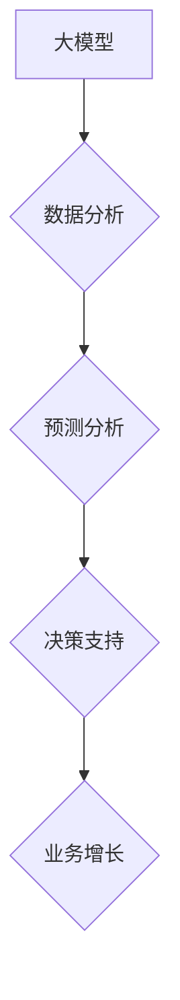

> 大模型、深度学习、自然语言处理、计算机视觉、商业智能、人工智能、机器学习

## 1. 背景介绍

近年来，人工智能（AI）技术取得了飞速发展，其中大模型作为AI领域的重要突破口，正在深刻地改变着我们生活和工作方式。大模型是指参数规模庞大、训练数据海量的人工智能模型，其强大的学习能力和泛化能力使其能够在各种复杂任务中展现出卓越的性能。

商业智能（BI）作为一种利用数据分析和挖掘技术，帮助企业提高决策效率和竞争力的重要手段，也正在受到大模型的深刻影响。大模型的应用为BI领域带来了新的机遇和挑战，例如：

* **更精准的预测分析:** 大模型能够从海量数据中提取更深层的模式和趋势，从而实现更精准的预测分析，帮助企业更好地预测市场需求、客户行为和潜在风险。
* **更智能的决策支持:** 大模型可以自动分析数据，生成可视化报表和洞察报告，为企业决策者提供更智能的决策支持，帮助他们做出更明智的决策。
* **更个性化的客户体验:** 大模型可以根据用户的行为和偏好，提供个性化的产品推荐、服务建议和营销内容，提升客户体验和品牌忠诚度。

## 2. 核心概念与联系

大模型的核心概念包括：

* **深度学习:** 大模型通常基于深度学习算法，例如卷积神经网络（CNN）、循环神经网络（RNN）和Transformer等，通过多层神经网络结构，学习数据中的复杂特征和关系。
* **参数规模:** 大模型的参数规模通常非常庞大，可能包含数十亿甚至数千亿个参数，这使得它们能够学习更复杂的模式和关系。
* **训练数据:** 大模型的训练数据通常也非常庞大，可能包含海量文本、图像、音频等多种类型的数据，这使得它们能够获得更广泛的知识和技能。

**大模型与商业智能的联系:**

大模型可以为商业智能提供强大的数据分析、预测和决策支持能力，从而帮助企业更好地理解市场趋势、客户需求和业务运营，最终实现业务增长和效益提升。



## 3. 核心算法原理 & 具体操作步骤

### 3.1  算法原理概述

大模型的训练主要基于深度学习算法，其中Transformer模型在自然语言处理领域取得了显著的成果。Transformer模型的核心思想是利用注意力机制，学习文本序列中不同词语之间的关系，从而更好地理解文本的语义和上下文。

### 3.2  算法步骤详解

1. **数据预处理:** 将原始数据进行清洗、格式化和编码，例如将文本数据转换为词向量表示。
2. **模型构建:** 根据具体的任务需求，选择合适的Transformer模型架构，例如BERT、GPT或T5等。
3. **模型训练:** 使用训练数据训练模型，通过反向传播算法不断调整模型参数，使模型的预测结果与真实值尽可能接近。
4. **模型评估:** 使用测试数据评估模型的性能，例如计算准确率、召回率和F1-score等指标。
5. **模型部署:** 将训练好的模型部署到生产环境中，用于实际应用。

### 3.3  算法优缺点

**优点:**

* **强大的学习能力:** Transformer模型能够学习文本序列中复杂的语义关系，从而实现更精准的文本理解和生成。
* **并行训练效率高:** Transformer模型的注意力机制可以并行计算，从而提高训练效率。
* **可迁移性强:** 预训练的Transformer模型可以迁移到不同的下游任务中，例如文本分类、问答系统和机器翻译等。

**缺点:**

* **参数规模庞大:** Transformer模型的参数规模通常非常庞大，需要大量的计算资源和存储空间进行训练和部署。
* **训练数据需求高:** Transformer模型需要海量的数据进行训练，否则容易出现过拟合问题。
* **解释性差:** Transformer模型的内部机制比较复杂，难以解释模型的决策过程。

### 3.4  算法应用领域

Transformer模型在自然语言处理领域有着广泛的应用，例如：

* **文本分类:** 识别文本的类别，例如情感分析、主题分类和垃圾邮件过滤。
* **问答系统:** 回答用户的自然语言问题，例如搜索引擎和聊天机器人。
* **机器翻译:** 将文本从一种语言翻译成另一种语言。
* **文本生成:** 生成新的文本内容，例如文章写作、故事创作和代码生成。

## 4. 数学模型和公式 & 详细讲解 & 举例说明

### 4.1  数学模型构建

Transformer模型的核心是注意力机制，其数学模型可以表示为：

$$
Attention(Q, K, V) = softmax(\frac{QK^T}{\sqrt{d_k}})V
$$

其中：

* $Q$：查询矩阵
* $K$：键矩阵
* $V$：值矩阵
* $d_k$：键向量的维度
* $softmax$：softmax函数

### 4.2  公式推导过程

注意力机制的目的是计算查询向量 $Q$ 与键向量 $K$ 之间的相似度，然后根据相似度加权求和值向量 $V$，得到最终的注意力输出。

* $QK^T$：计算查询向量与键向量的点积，得到一个得分矩阵。
* $\frac{QK^T}{\sqrt{d_k}}$：对得分矩阵进行归一化，使得每个元素的范围在0到1之间。
* $softmax$：对归一化后的得分矩阵应用softmax函数，得到每个键向量的权重。
* $softmax(\frac{QK^T}{\sqrt{d_k}})V$：将权重与值向量 $V$ 进行加权求和，得到最终的注意力输出。

### 4.3  案例分析与讲解

例如，在机器翻译任务中，查询向量 $Q$ 表示源语言的词向量，键向量 $K$ 表示目标语言的词向量，值向量 $V$ 表示目标语言的词嵌入。注意力机制可以计算每个源语言词与每个目标语言词之间的相似度，然后根据相似度选择最相关的目标语言词作为翻译结果。

## 5. 项目实践：代码实例和详细解释说明

### 5.1  开发环境搭建

* Python 3.7+
* TensorFlow 2.0+
* PyTorch 1.0+
* CUDA Toolkit 10.2+

### 5.2  源代码详细实现

```python
import tensorflow as tf

# 定义Transformer模型
class Transformer(tf.keras.Model):
    def __init__(self, vocab_size, embedding_dim, num_heads, num_layers):
        super(Transformer, self).__init__()
        self.embedding = tf.keras.layers.Embedding(vocab_size, embedding_dim)
        self.transformer_layers = tf.keras.layers.StackedRNNCells([
            tf.keras.layers.MultiHeadAttention(num_heads=num_heads, key_dim=embedding_dim)
            for _ in range(num_layers)
        ])
        self.output_layer = tf.keras.layers.Dense(vocab_size)

    def call(self, inputs):
        embeddings = self.embedding(inputs)
        outputs = self.transformer_layers(embeddings)
        outputs = self.output_layer(outputs)
        return outputs

# 实例化模型
model = Transformer(vocab_size=10000, embedding_dim=128, num_heads=8, num_layers=6)

# 训练模型
model.compile(optimizer='adam', loss='sparse_categorical_crossentropy', metrics=['accuracy'])
model.fit(x_train, y_train, epochs=10)
```

### 5.3  代码解读与分析

* **模型定义:** Transformer模型由嵌入层、多头注意力层和输出层组成。
* **嵌入层:** 将输入词转换为词向量表示。
* **多头注意力层:** 计算每个词与其他词之间的注意力权重，并根据权重加权求和，得到上下文信息。
* **输出层:** 将上下文信息映射到目标词的概率分布。
* **训练模型:** 使用Adam优化器、交叉熵损失函数和准确率指标训练模型。

### 5.4  运行结果展示

训练完成后，可以将模型应用于文本生成、机器翻译等任务，并评估模型的性能。

## 6. 实际应用场景

### 6.1  客户关系管理（CRM）

大模型可以分析客户的购买历史、浏览记录和社交媒体行为，识别潜在客户需求，提供个性化的产品推荐和服务建议，提升客户满意度和忠诚度。

### 6.2  市场营销

大模型可以分析市场趋势、消费者偏好和竞争对手信息，帮助企业制定更精准的营销策略，例如目标客户群体的精准定位、个性化广告投放和营销内容创作。

### 6.3  财务分析

大模型可以分析财务数据、市场趋势和经济指标，识别潜在的财务风险和投资机会，帮助企业做出更明智的财务决策。

### 6.4  未来应用展望

随着大模型技术的不断发展，其在商业智能领域的应用场景将更加广泛，例如：

* **智能客服:** 利用大模型构建智能客服系统，能够自动回答客户常见问题，提高客服效率和客户满意度。
* **智能决策支持:** 利用大模型分析海量数据，为企业决策者提供更智能的决策支持，帮助他们做出更明智的决策。
* **个性化产品设计:** 利用大模型分析客户需求和市场趋势，帮助企业设计更符合客户需求的个性化产品。

## 7. 工具和资源推荐

### 7.1  学习资源推荐

* **书籍:**
    * 《深度学习》
    * 《自然语言处理》
    * 《Transformer模型详解》
* **在线课程:**
    * Coursera: 深度学习
    * Udacity: 自然语言处理
    * fast.ai: 深度学习

### 7.2  开发工具推荐

* **TensorFlow:** 开源深度学习框架
* **PyTorch:** 开源深度学习框架
* **HuggingFace:** 提供预训练的Transformer模型和工具

### 7.3  相关论文推荐

* 《Attention Is All You Need》
* 《BERT: Pre-training of Deep Bidirectional Transformers for Language Understanding》
* 《GPT-3: Language Models are Few-Shot Learners》

## 8. 总结：未来发展趋势与挑战

### 8.1  研究成果总结

大模型在商业智能领域取得了显著的成果，例如：更精准的预测分析、更智能的决策支持和更个性化的客户体验。

### 8.2  未来发展趋势

* **模型规模更大:** 未来大模型的规模将继续扩大，参数数量将达到数万亿甚至数千亿级别。
* **模型架构更复杂:** 未来大模型的架构将更加复杂，例如多模态大模型，能够处理文本、图像、音频等多种数据类型。
* **应用场景更广泛:** 未来大模型将应用于更多商业智能场景，例如智能客服、智能决策支持和个性化产品设计。

### 8.3  面临的挑战

* **计算资源需求高:** 训练和部署大模型需要大量的计算资源和存储空间，这对于中小企业来说是一个挑战。
* **数据隐私安全:** 大模型的训练需要海量数据，如何保证数据隐私安全是一个重要的挑战。
* **模型解释性差:** 大模型的内部机制比较复杂，难以解释模型的决策过程，这对于一些需要透明度高的应用场景来说是一个挑战。

### 8.4  研究展望

未来研究方向包括：

* **高效训练大模型:** 研究更有效的训练方法，降低训练成本和时间。
* **保障数据隐私安全:** 研究隐私保护技术，保证大模型训练和应用过程中的数据隐私安全。
* **提升模型解释性:** 研究模型解释技术，提高大模型的透明度和可解释性。

## 9. 附录：常见问题与解答

**Q1: 大模型的训练需要多少数据？**