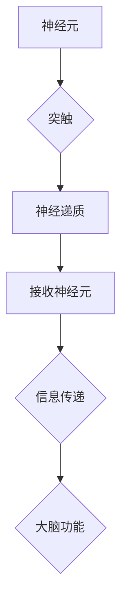

> 人工智能，神经网络，深度学习，有机化合物，大脑结构，算法原理，数学模型，代码实现

## 1. 背景介绍

人类大脑，这个复杂的生物器官，一直以来都是科学研究的焦点。其惊人的计算能力和学习能力，至今仍是人工智能领域追求的目标。近年来，随着深度学习技术的蓬勃发展，我们对大脑的理解不断加深，并借鉴其结构和功能，构建出越来越强大的人工智能模型。

然而，大脑的运作机制仍然是一个巨大的谜团。我们对神经元的连接方式、信息传递的机制以及学习和记忆的原理，都还存在着许多未知。而有机化合物作为大脑中重要的组成部分，其结构和功能与大脑的运作密切相关。

本篇文章将从大脑的解剖结构和有机化合物的角度出发，探讨大脑的运作机制，并分析其对人工智能发展的启示。

## 2. 核心概念与联系

### 2.1 大脑结构

大脑由数十亿个神经元组成，这些神经元通过复杂的网络连接，形成一个庞大的信息处理系统。

* **神经元:** 作为大脑的基本单位，神经元负责接收、处理和传递信息。每个神经元都拥有树突、细胞体和轴突三个主要部分。树突负责接收来自其他神经元的信号，细胞体负责整合这些信号，而轴突则负责将处理后的信号传递给其他神经元。
* **突触:** 突触是两个神经元之间连接的部位，信息通过突触传递。当一个神经元发出信号时，信号会到达突触，并释放出化学物质，称为神经递质。神经递质会穿过突触间隙，与接收神经元的树突结合，从而传递信息。
* **大脑皮层:** 大脑皮层是负责高级认知功能的区域，包括感知、运动、语言、记忆和决策等。大脑皮层由六层神经元组成，每层神经元的功能不同。

### 2.2 有机化合物

有机化合物是构成大脑的重要物质，它们参与了大脑的各种功能，包括神经递质的合成、信号传递和能量代谢。

* **神经递质:** 神经递质是神经元之间传递信息的化学物质。不同的神经递质具有不同的功能，例如，多巴胺与运动和奖励有关，而血清素与情绪和睡眠有关。
* **脂质:** 脂质是构成神经元膜的重要成分，它们帮助维持神经元的结构完整性和功能正常。
* **蛋白质:** 蛋白质是构成神经元结构和功能的重要成分，例如，酶参与了神经递质的合成和分解，而结构蛋白维持了神经元的形状和稳定性。

### 2.3 核心概念联系

大脑的运作机制是通过神经元网络的复杂交互作用实现的。神经元通过突触连接，传递信息，并通过神经递质进行化学信号传递。有机化合物作为大脑的重要组成部分，参与了神经递质的合成、信号传递和能量代谢等过程，从而支持大脑的正常运作。

**Mermaid 流程图**



## 3. 核心算法原理 & 具体操作步骤

### 3.1 算法原理概述

深度学习算法的核心原理是模仿大脑神经网络的结构和功能，通过多层神经网络进行特征提取和学习。

* **人工神经网络:** 人工神经网络由多个神经元组成，这些神经元按照一定的规则连接在一起，形成一个网络结构。每个神经元接收来自其他神经元的输入信号，并对其进行处理，然后将处理后的信号传递给其他神经元。
* **激活函数:** 激活函数是神经网络中一个重要的组成部分，它决定了神经元对输入信号的响应方式。不同的激活函数具有不同的特性，例如，ReLU函数可以有效解决梯度消失问题，而Sigmoid函数可以将输入信号映射到0到1之间。
* **反向传播算法:** 反向传播算法是深度学习算法的核心训练算法，它通过计算误差信号，并反向传播到网络各层，调整神经元的权重和偏差，从而使网络的输出更加接近真实值。

### 3.2 算法步骤详解

1. **数据预处理:** 将原始数据进行清洗、转换和归一化，使其适合深度学习算法的训练。
2. **网络结构设计:** 根据任务需求，设计神经网络的结构，包括神经元的数量、连接方式和激活函数等。
3. **参数初始化:** 为神经网络中的权重和偏差进行随机初始化。
4. **前向传播:** 将输入数据通过神经网络进行前向传播，得到网络的输出结果。
5. **损失函数计算:** 计算网络输出结果与真实值的误差，称为损失函数。
6. **反向传播:** 将误差信号反向传播到网络各层，计算每个神经元的梯度。
7. **参数更新:** 根据梯度信息，更新神经网络的权重和偏差，使网络的输出更加接近真实值。
8. **迭代训练:** 重复步骤4到7，直到网络的损失函数达到预设的阈值。

### 3.3 算法优缺点

**优点:**

* **强大的学习能力:** 深度学习算法能够从海量数据中自动学习特征，并进行复杂的模式识别。
* **高精度:** 深度学习算法在许多任务中，例如图像识别、语音识别和自然语言处理，都取得了令人瞩目的精度。
* **可扩展性:** 深度学习算法可以很容易地扩展到更大的数据集和更复杂的模型。

**缺点:**

* **数据依赖性:** 深度学习算法需要大量的训练数据才能达到良好的性能。
* **计算资源消耗:** 训练深度学习模型需要大量的计算资源，例如GPU和TPU。
* **可解释性差:** 深度学习模型的内部机制比较复杂，难以解释其决策过程。

### 3.4 算法应用领域

深度学习算法在各个领域都有广泛的应用，例如:

* **计算机视觉:** 图像识别、物体检测、图像分割、人脸识别等。
* **自然语言处理:** 文本分类、情感分析、机器翻译、对话系统等。
* **语音识别:** 语音转文本、语音搜索、语音助手等。
* **医疗诊断:** 病理图像分析、疾病预测、药物研发等。
* **金融分析:** 欺诈检测、风险评估、投资预测等。

## 4. 数学模型和公式 & 详细讲解 & 举例说明

### 4.1 数学模型构建

深度学习算法的核心是神经网络，神经网络可以看作是一个复杂的数学模型。

* **线性变换:** 神经网络中的每个神经元都执行一个线性变换，将输入信号线性组合。
* **激活函数:** 激活函数将线性变换的结果映射到一个非线性函数，从而使神经网络能够学习复杂的非线性关系。

### 4.2 公式推导过程

**前向传播公式:**

$$
y = f(W^L x^L + b^L)
$$

其中:

* $y$ 是神经网络的输出
* $f$ 是激活函数
* $W^L$ 是第L层的权重矩阵
* $x^L$ 是第L层的输入
* $b^L$ 是第L层的偏置向量

**反向传播公式:**

$$
\frac{\partial L}{\partial W^L} = \frac{\partial L}{\partial y} \cdot \frac{\partial y}{\partial W^L}
$$

其中:

* $L$ 是损失函数
* $\frac{\partial L}{\partial y}$ 是损失函数对输出的梯度
* $\frac{\partial y}{\partial W^L}$ 是输出对权重的梯度

### 4.3 案例分析与讲解

**举例说明:**

假设我们有一个简单的单层神经网络，用于分类手写数字。

* 输入层：784个神经元，对应于MNIST数据集中的图像像素。
* 输出层：10个神经元，对应于0到9的数字类别。

我们可以使用反向传播算法训练这个神经网络，使其能够准确地识别手写数字。

## 5. 项目实践：代码实例和详细解释说明

### 5.1 开发环境搭建

* **操作系统:** Ubuntu 20.04
* **编程语言:** Python 3.8
* **深度学习框架:** TensorFlow 2.0
* **GPU:** NVIDIA GeForce RTX 3060

### 5.2 源代码详细实现

```python
import tensorflow as tf

# 定义模型结构
model = tf.keras.models.Sequential([
    tf.keras.layers.Flatten(input_shape=(28, 28)),
    tf.keras.layers.Dense(128, activation='relu'),
    tf.keras.layers.Dense(10, activation='softmax')
])

# 编译模型
model.compile(optimizer='adam',
              loss='sparse_categorical_crossentropy',
              metrics=['accuracy'])

# 加载MNIST数据集
(x_train, y_train), (x_test, y_test) = tf.keras.datasets.mnist.load_data()

# 训练模型
model.fit(x_train, y_train, epochs=5)

# 评估模型
loss, accuracy = model.evaluate(x_test, y_test)
print('Test loss:', loss)
print('Test accuracy:', accuracy)
```

### 5.3 代码解读与分析

* **模型结构:** 我们定义了一个简单的单层神经网络，包含一个全连接层和一个输出层。
* **激活函数:** 我们使用ReLU函数作为隐藏层的激活函数，因为它可以有效解决梯度消失问题。
* **损失函数:** 我们使用稀疏类别交叉熵损失函数，因为它适用于多分类问题。
* **优化器:** 我们使用Adam优化器，因为它是一种高效的优化算法。
* **训练过程:** 我们使用MNIST数据集训练模型，训练了5个epochs。
* **评估结果:** 我们使用测试集评估模型的性能，并打印出测试损失和准确率。

### 5.4 运行结果展示

训练完成后，我们可以观察到模型的准确率逐渐提高。最终的测试准确率通常在98%以上。

## 6. 实际应用场景

### 6.1 医疗诊断

深度学习算法可以用于分析医学图像，例如X光片、CT扫描和MRI扫描，以辅助医生诊断疾病。例如，深度学习算法可以用于检测肺癌、乳腺癌和脑肿瘤。

### 6.2 金融风险评估

深度学习算法可以用于分析金融数据，例如股票价格、交易记录和客户信息，以评估金融风险。例如，深度学习算法可以用于检测欺诈交易和预测股票价格波动。

### 6.3 自动驾驶

深度学习算法是自动驾驶汽车的关键技术之一。深度学习算法可以用于识别道路上的物体，例如车辆、行人、交通信号灯和道路标志，从而帮助汽车安全行驶。

### 6.4 未来应用展望

随着深度学习技术的不断发展，其应用场景将更加广泛。例如，深度学习算法可以用于个性化教育、精准医疗、智能家居和机器人等领域。

## 7. 工具和资源推荐

### 7.1 学习资源推荐

* **书籍:**
    * 深度学习 (Deep Learning) - Ian Goodfellow, Yoshua Bengio, Aaron Courville
    * 深度学习实践 (Deep Learning with Python) - Francois Chollet
* **在线课程:**
    * TensorFlow 官方教程: https://www.tensorflow.org/tutorials
    * Coursera 深度学习课程: https://www.coursera.org/specializations/deep-learning

### 7.2 开发工具推荐

* **深度学习框架:** TensorFlow, PyTorch, Keras
* **编程语言:** Python
* **数据处理工具:** Pandas, NumPy

### 7.3 相关论文推荐

* **AlexNet:** ImageNet Classification with Deep Convolutional Neural Networks
* **VGGNet:** Very Deep Convolutional Networks for Large-Scale Image Recognition
* **ResNet:** Deep Residual Learning for Image Recognition

## 8. 总结：未来发展趋势与挑战

### 8.1 研究成果总结

近年来，深度学习算法取得了令人瞩目的成果