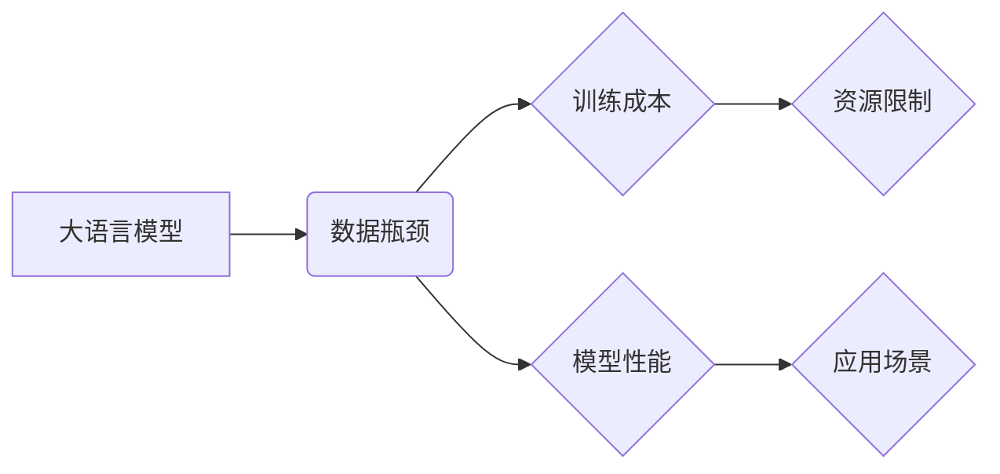

> 大语言模型，数据瓶颈，训练方法，模型架构，应用场景，未来趋势

## 1. 背景介绍

近年来，大语言模型（Large Language Model，LLM）在自然语言处理领域取得了显著进展，展现出强大的文本生成、翻译、摘要、问答等能力。这些模型通常拥有数十亿甚至数千亿的参数，通过海量文本数据的训练，学习了语言的复杂结构和语义关系。然而，LLM的训练和部署面临着巨大的挑战，其中数据瓶颈是最为突出的一项。

数据瓶颈是指训练大型语言模型所需的庞大训练数据难以获取、处理和存储的困境。一方面，高质量的文本数据是LLM训练的基石，但高质量数据往往稀缺且昂贵。另一方面，训练大型模型需要消耗大量的计算资源和时间，这使得数据规模的扩展变得更加困难。

## 2. 核心概念与联系

**2.1 大语言模型 (LLM)**

大语言模型是指参数量巨大、训练数据海量的人工智能模型，能够理解和生成人类语言。它们通常基于Transformer架构，并通过自监督学习的方式从海量文本数据中学习语言的规律。

**2.2 数据瓶颈**

数据瓶颈是指训练大型语言模型所需的庞大训练数据难以获取、处理和存储的困境。

**2.3 核心概念关系图**



## 3. 核心算法原理 & 具体操作步骤

**3.1 算法原理概述**

大语言模型的训练主要基于Transformer架构和自监督学习方法。Transformer是一种基于注意力机制的神经网络架构，能够有效地捕捉文本序列中的长距离依赖关系。自监督学习是指通过预训练模型在无标签数据上学习语言表示，然后在特定任务上进行微调。

**3.2 算法步骤详解**

1. **数据预处理:** 将原始文本数据进行清洗、分词、标记等预处理操作，使其适合模型训练。
2. **模型构建:** 根据Transformer架构构建大语言模型，并设定模型参数。
3. **预训练:** 使用海量文本数据对模型进行预训练，学习语言的语法和语义表示。
4. **微调:** 将预训练模型在特定任务数据上进行微调，例如文本分类、机器翻译等。
5. **评估:** 使用测试数据评估模型的性能，并根据结果进行模型优化。

**3.3 算法优缺点**

**优点:**

* 能够学习复杂的语言表示，展现出强大的文本理解和生成能力。
* 自监督学习方法能够有效利用无标签数据，降低训练成本。

**缺点:**

* 训练成本高，需要大量的计算资源和时间。
* 数据瓶颈限制了模型的规模和性能。
* 模型容易受到训练数据偏差的影响。

**3.4 算法应用领域**

* 文本生成：小说、诗歌、剧本等。
* 机器翻译：将一种语言翻译成另一种语言。
* 文本摘要：提取文本的关键信息。
* 问答系统：回答用户提出的问题。
* 对话系统：与用户进行自然语言交互。

## 4. 数学模型和公式 & 详细讲解 & 举例说明

**4.1 数学模型构建**

大语言模型通常基于Transformer架构，其核心是注意力机制。注意力机制允许模型关注输入序列中与当前任务相关的部分，从而提高模型的理解能力。

**4.2 公式推导过程**

注意力机制的计算公式如下：

$$
Attention(Q, K, V) = softmax(\frac{QK^T}{\sqrt{d_k}})V
$$

其中：

* $Q$：查询矩阵
* $K$：键矩阵
* $V$：值矩阵
* $d_k$：键向量的维度
* $softmax$：softmax函数

**4.3 案例分析与讲解**

假设我们有一个句子“我爱学习编程”，想要计算每个词对“学习”的注意力权重。

1. 将句子转换为词嵌入向量。
2. 计算查询向量 $Q$、键向量 $K$ 和值向量 $V$。
3. 计算注意力权重矩阵，每个元素代表词对“学习”的注意力权重。
4. 将注意力权重矩阵与值向量 $V$ 进行加权求和，得到最终的输出向量。

## 5. 项目实践：代码实例和详细解释说明

**5.1 开发环境搭建**

* Python 3.7+
* PyTorch 1.7+
* CUDA 10.2+

**5.2 源代码详细实现**

```python
import torch
import torch.nn as nn

class Transformer(nn.Module):
    def __init__(self, vocab_size, embedding_dim, num_heads, num_layers):
        super(Transformer, self).__init__()
        self.embedding = nn.Embedding(vocab_size, embedding_dim)
        self.transformer_layers = nn.ModuleList([
            nn.TransformerEncoderLayer(embedding_dim, num_heads)
            for _ in range(num_layers)
        ])
        self.linear = nn.Linear(embedding_dim, vocab_size)

    def forward(self, x):
        x = self.embedding(x)
        for layer in self.transformer_layers:
            x = layer(x)
        x = self.linear(x)
        return x
```

**5.3 代码解读与分析**

* `Transformer` 类定义了Transformer模型的结构。
* `embedding` 层将词索引转换为词嵌入向量。
* `transformer_layers` 是一个模块列表，包含多个Transformer编码器层。
* `linear` 层将编码后的输出转换为预测概率分布。

**5.4 运行结果展示**

训练完成后，可以使用模型对新的文本进行预测，例如生成文本续写、翻译等。

## 6. 实际应用场景

**6.1 文本生成**

* 自动生成小说、诗歌、剧本等创意内容。
* 生成营销文案、产品描述等商业文本。

**6.2 机器翻译**

* 将一种语言翻译成另一种语言，例如英语翻译成中文。
* 支持多种语言的翻译，打破语言障碍。

**6.3 文本摘要**

* 自动提取文本的关键信息，生成简洁的摘要。
* 用于新闻报道、学术论文等文本的快速阅读。

**6.4 未来应用展望**

* 更智能的聊天机器人和虚拟助手。
* 个性化的教育和学习体验。
* 更高效的代码生成和软件开发。

## 7. 工具和资源推荐

**7.1 学习资源推荐**

* **论文:**
    * Attention Is All You Need (Vaswani et al., 2017)
    * BERT: Pre-training of Deep Bidirectional Transformers for Language Understanding (Devlin et al., 2018)
* **书籍:**
    * Deep Learning (Goodfellow et al., 2016)
    * Natural Language Processing with PyTorch (Bird et al., 2019)

**7.2 开发工具推荐**

* **PyTorch:** 深度学习框架
* **TensorFlow:** 深度学习框架
* **Hugging Face Transformers:** 预训练模型库

**7.3 相关论文推荐**

* GPT-3: Language Models are Few-Shot Learners (Brown et al., 2020)
* T5: Text-to-Text Transfer Transformer (Raffel et al., 2019)
* LaMDA: Language Model for Dialogue Applications (Google AI Blog, 2021)

## 8. 总结：未来发展趋势与挑战

**8.1 研究成果总结**

近年来，大语言模型取得了显著进展，展现出强大的文本理解和生成能力。

**8.2 未来发展趋势**

* 模型规模的进一步扩大
* 更加高效的训练方法
* 更强的泛化能力和鲁棒性
* 跨模态理解和生成

**8.3 面临的挑战**

* 数据瓶颈
* 计算资源限制
* 模型可解释性和安全性
* 伦理和社会影响

**8.4 研究展望**

未来，大语言模型的研究将继续朝着更强大、更安全、更可解释的方向发展。


## 9. 附录：常见问题与解答

**9.1 如何获取高质量的文本数据？**

* 公开数据集：例如Wikipedia、Common Crawl等。
* 数据爬虫：自动爬取网络上的文本数据。
* 数据标注：人工标注文本数据，例如情感分类、实体识别等。

**9.2 如何解决数据瓶颈问题？**

* 数据增强：通过文本变换、 paraphrasing等方法扩充数据规模。
* 模型压缩：通过知识蒸馏、剪枝等方法减小模型规模。
* Federated Learning：在分布式数据环境下进行模型训练，避免数据集中化。

**9.3 如何评估大语言模型的性能？**

* 标准测试集：例如GLUE、SuperGLUE等。
* 领域特定指标：根据具体任务设计评估指标。
* 人工评估：由人类专家对模型输出进行评价。


作者：禅与计算机程序设计艺术 / Zen and the Art of Computer Programming 
<end_of_turn>