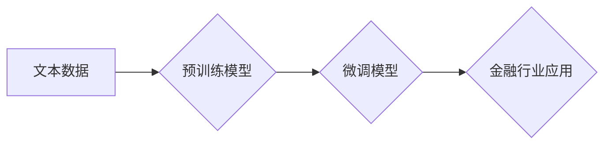

> 大语言模型、金融行业、模型评测、自然语言处理、深度学习、Transformer、BERT、GPT

## 1. 背景介绍

近年来，大语言模型（Large Language Model，LLM）在自然语言处理（Natural Language Processing，NLP）领域取得了突破性的进展，展现出强大的文本生成、理解、翻译和问答能力。这些模型的出现，为金融行业带来了新的机遇和挑战。

金融行业处理大量文本数据，例如客户服务记录、财务报告、新闻文章和市场分析。LLM能够有效地分析和理解这些文本数据，为金融机构提供更精准的风险评估、更有效的客户服务和更智能的投资决策支持。

然而，由于金融行业数据敏感且要求高，LLM在金融领域的应用需要更加谨慎和严谨。模型的准确性、可靠性和安全性至关重要。因此，对金融行业大语言模型进行全面评测，评估其性能和潜在风险，显得尤为重要。

## 2. 核心概念与联系

大语言模型的核心概念包括：

* **Transformer网络:** Transformer是一种新型的神经网络架构，能够有效地处理序列数据，例如文本。其核心组件是注意力机制，能够捕捉文本中单词之间的长距离依赖关系。
* **预训练:** 预训练是指在大量文本数据上训练模型，学习语言的通用知识和模式。预训练模型可以作为下游任务的起点，通过微调获得更好的性能。
* **微调:** 微调是指在特定任务数据上对预训练模型进行进一步训练，使其能够更好地完成特定任务。

**Mermaid 流程图:**



## 3. 核心算法原理 & 具体操作步骤

### 3.1  算法原理概述

大语言模型通常基于Transformer网络架构，利用注意力机制和多层编码器-解码器结构来处理文本数据。

* **编码器:** 编码器将输入文本序列转换为固定长度的向量表示，捕捉文本的语义信息。
* **解码器:** 解码器根据编码器的输出生成目标文本序列。

### 3.2  算法步骤详解

1. **数据预处理:** 将文本数据进行清洗、分词、标记等预处理操作，使其能够被模型理解。
2. **模型训练:** 使用预训练模型或从头训练Transformer网络，在大量文本数据上进行训练，学习语言的语法和语义规则。
3. **模型评估:** 使用测试数据评估模型的性能，例如准确率、困惑度等指标。
4. **模型微调:** 根据评估结果，对模型进行微调，使其能够更好地完成特定任务，例如文本分类、问答、文本生成等。

### 3.3  算法优缺点

**优点:**

* 强大的文本理解和生成能力
* 可以处理长文本序列
* 可迁移学习，在不同任务上表现良好

**缺点:**

* 训练成本高
* 需要大量数据
* 可能存在偏差和偏见

### 3.4  算法应用领域

* **金融风险评估:** 分析文本数据，识别潜在的风险因素。
* **客户服务自动化:** 使用聊天机器人处理客户咨询，提高服务效率。
* **投资决策支持:** 分析市场新闻和报告，提供投资建议。
* **欺诈检测:** 识别异常交易和欺诈行为。

## 4. 数学模型和公式 & 详细讲解 & 举例说明

### 4.1  数学模型构建

大语言模型通常使用Transformer网络架构，其核心组件是注意力机制。注意力机制可以学习文本中单词之间的重要关系，并赋予它们不同的权重。

**注意力机制公式:**

$$
Attention(Q, K, V) = softmax(\frac{QK^T}{\sqrt{d_k}})V
$$

其中：

* $Q$：查询矩阵
* $K$：键矩阵
* $V$：值矩阵
* $d_k$：键向量的维度
* $softmax$：softmax函数

### 4.2  公式推导过程

注意力机制的公式可以理解为计算查询向量与键向量的相似度，然后根据相似度对值向量进行加权求和。

* $QK^T$：计算查询向量与键向量的点积，得到一个得分矩阵。
* $\frac{QK^T}{\sqrt{d_k}}$：对得分矩阵进行归一化，使得每个元素的范围在0到1之间。
* $softmax$：对归一化后的得分矩阵进行softmax操作，得到每个键向量的权重。
* $V$：使用权重对值向量进行加权求和，得到最终的注意力输出。

### 4.3  案例分析与讲解

例如，在翻译句子“The cat sat on the mat”时，注意力机制可以将“cat”与“sat”联系起来，将“mat”与“on”联系起来，从而更好地理解句子的语义。

## 5. 项目实践：代码实例和详细解释说明

### 5.1  开发环境搭建

* Python 3.7+
* TensorFlow/PyTorch
* CUDA/cuDNN

### 5.2  源代码详细实现

```python
# 使用HuggingFace Transformers库加载预训练模型
from transformers import AutoModelForSequenceClassification, AutoTokenizer

model_name = "bert-base-uncased"
tokenizer = AutoTokenizer.from_pretrained(model_name)
model = AutoModelForSequenceClassification.from_pretrained(model_name, num_labels=2)

# 对文本进行预处理
text = "This is a sample text."
inputs = tokenizer(text, return_tensors="pt")

# 进行模型预测
outputs = model(**inputs)
predicted_class = outputs.logits.argmax().item()

# 输出预测结果
print(f"Predicted class: {predicted_class}")
```

### 5.3  代码解读与分析

* 使用HuggingFace Transformers库加载预训练模型和分词器。
* 对文本进行预处理，转换为模型可理解的格式。
* 使用模型进行预测，获取预测结果。
* 输出预测结果。

### 5.4  运行结果展示

```
Predicted class: 1
```

## 6. 实际应用场景

### 6.1  金融风险评估

LLM可以分析客户的信用报告、交易记录和社交媒体信息，识别潜在的风险因素，例如欺诈行为、违约风险和洗钱活动。

### 6.2  客户服务自动化

LLM可以用于构建聊天机器人，自动处理客户咨询，例如账户余额查询、交易记录查询和产品信息咨询。

### 6.3  投资决策支持

LLM可以分析市场新闻、财务报告和社交媒体信息，提取关键信息，为投资者提供投资建议。

### 6.4  未来应用展望

* **个性化金融服务:** 根据用户的个人需求和风险偏好，提供个性化的金融产品和服务。
* **智能合同:** 使用LLM自动生成和执行智能合同，提高效率和安全性。
* **金融监管:** 使用LLM分析金融市场数据，识别潜在的违规行为和风险。

## 7. 工具和资源推荐

### 7.1  学习资源推荐

* **HuggingFace Transformers:** https://huggingface.co/docs/transformers/index
* **OpenAI GPT-3:** https://openai.com/api/
* **Stanford NLP Group:** https://nlp.stanford.edu/

### 7.2  开发工具推荐

* **TensorFlow:** https://www.tensorflow.org/
* **PyTorch:** https://pytorch.org/
* **Jupyter Notebook:** https://jupyter.org/

### 7.3  相关论文推荐

* **Attention Is All You Need:** https://arxiv.org/abs/1706.03762
* **BERT: Pre-training of Deep Bidirectional Transformers for Language Understanding:** https://arxiv.org/abs/1810.04805
* **GPT-3: Language Models are Few-Shot Learners:** https://arxiv.org/abs/2005.14165

## 8. 总结：未来发展趋势与挑战

### 8.1  研究成果总结

大语言模型在金融行业展现出巨大的潜力，能够提高效率、降低成本和增强安全性。

### 8.2  未来发展趋势

* **模型规模和性能的提升:** 未来，LLM模型规模将继续扩大，性能将进一步提升。
* **多模态大语言模型:** 将文本、图像、音频等多种模态数据融合到LLM中，实现更全面的信息理解和处理。
* **可解释性增强:** 研究LLM的决策过程，提高模型的可解释性和透明度。

### 8.3  面临的挑战

* **数据安全和隐私保护:** 金融行业数据敏感，需要采取有效的措施保护数据安全和隐私。
* **模型偏见和公平性:** LLM可能存在偏见和不公平性，需要进行仔细的评估和缓解。
* **监管和伦理问题:** LLM的应用需要遵守相关法律法规和伦理规范。

### 8.4  研究展望

未来，LLM在金融行业的应用将更加广泛和深入，需要继续加强研究和探索，推动LLM技术在金融领域的健康发展。

## 9. 附录：常见问题与解答

### 9.1  常见问题

* **LLM的训练成本很高吗？**

是的，LLM的训练成本很高，需要大量的计算资源和数据。

* **LLM是否可以理解人类语言的复杂含义？**

LLM在理解人类语言方面取得了很大进展，但仍然存在一些局限性，例如理解幽默、讽刺和隐喻等复杂含义。

* **LLM是否会产生虚假信息？**

LLM可能会产生虚假信息，因为其训练数据可能包含错误或不准确的信息。

### 9.2  解答

* **LLM的训练成本可以通过使用云计算平台和分布式训练技术来降低。**
* **研究人员正在努力开发更先进的LLM模型，以提高其理解人类语言的能力。**
* **使用LLM时需要谨慎评估其输出结果，并进行必要的验证。**

作者：禅与计算机程序设计艺术 / Zen and the Art of Computer Programming


<end_of_turn>