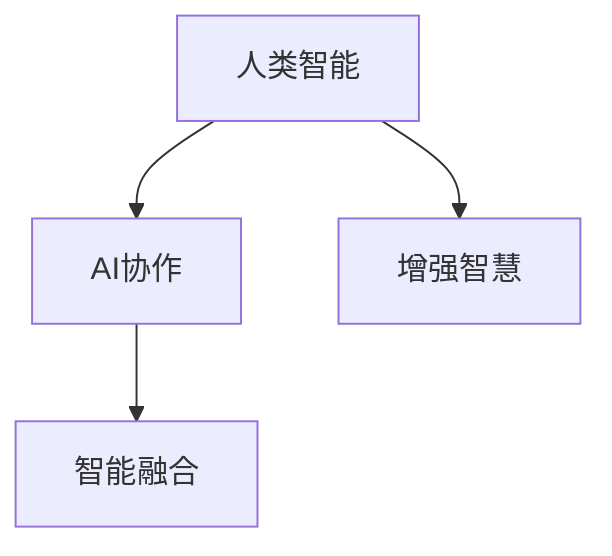

                 

# 人类-AI协作：增强人类智慧与AI能力的融合发展趋势与机遇

> 关键词：AI协作, 增强智慧, 智能融合, 人工智能, 人机交互, 未来技术

## 1. 背景介绍

在数字化转型的浪潮中，人工智能（AI）正迅速渗透到各行各业，改变着我们的工作和生活方式。然而，AI并非取代人类，而是作为工具和助手，增强人类的智慧与能力。本文将探讨人类与AI协作的最新发展趋势，以及未来潜在的机遇与挑战。

## 2. 核心概念与联系

### 2.1 核心概念概述

要理解人类与AI协作的未来趋势，首先需要明确几个关键概念：

- **AI协作（AI Collaboration）**：指人类与AI系统共同工作，实现目标的过程。AI协作旨在通过智能算法，辅助人类决策，提升工作效率和质量。
- **增强智慧（Augmented Intelligence）**：指AI技术增强人类认知能力，帮助人类更快、更准确地解决问题，做出决策。
- **智能融合（Smart Integration）**：指AI技术与人类智能在各自擅长的领域协同工作，优势互补，形成更高效、更全面的解决方案。

### 2.2 核心概念原理和架构的 Mermaid 流程图



在上述流程图中，人类智能作为起始点，通过AI协作增强自身能力，最终与AI系统融合，实现更高效的工作流程。这种结构展示了人类与AI在合作中的互补性。

## 3. 核心算法原理 & 具体操作步骤

### 3.1 算法原理概述

人类与AI协作的核心算法原理可以归纳为以下几点：

1. **知识共享**：AI系统通过机器学习技术，从大量数据中提取知识，并将其存储在模型中。人类可以通过查询这些知识库，快速获取相关信息。
2. **决策支持**：AI系统可以提供数据分析、预测和建议，帮助人类做出更准确的决策。
3. **自动化执行**：AI系统能够自动执行重复性高、耗时长的任务，释放人类从繁琐劳动中解放出来，专注于更有创造性的工作。
4. **人机交互优化**：通过自然语言处理（NLP）和计算机视觉技术，AI系统能够更好地理解人类指令，提供更符合需求的输出。

### 3.2 算法步骤详解

AI协作的算法步骤主要包括以下几个关键环节：

1. **数据采集与预处理**：收集相关领域的文本、图像、视频等数据，并进行清洗、标注等预处理工作。
2. **模型训练与优化**：使用深度学习模型对数据进行训练，并通过超参数调优和模型融合等方法，提升模型性能。
3. **知识提取与存储**：从训练好的模型中提取知识，并存储到知识库中，方便后续查询和应用。
4. **交互界面设计**：设计易于使用的界面，支持人类与AI系统进行自然语言交互。
5. **应用场景测试与优化**：在实际应用场景中进行测试，收集反馈，不断优化AI系统的功能和性能。

### 3.3 算法优缺点

AI协作的算法优缺点如下：

#### 优点：
- **提升效率**：AI系统可以自动化处理大量数据，显著提升工作效率。
- **提高精度**：AI系统通过大数据分析和机器学习，提供更准确的预测和决策支持。
- **跨领域应用**：AI协作可以应用于多个领域，如医疗、金融、教育等，具有广泛的适用性。

#### 缺点：
- **数据依赖**：AI系统的性能高度依赖于训练数据的质量和数量，数据不足或质量不高会影响效果。
- **模型偏见**：AI模型可能继承训练数据中的偏见，导致输出结果存在偏差。
- **人机信任问题**：人类对AI系统的信任度可能影响其应用效果，信任问题需长期解决。

### 3.4 算法应用领域

AI协作在多个领域都有广泛应用，主要包括：

1. **医疗**：辅助医生进行疾病诊断、治疗方案推荐、手术辅助等。
2. **金融**：提供市场分析、风险评估、欺诈检测等金融服务。
3. **教育**：个性化教学、智能辅导、教育资源推荐等。
4. **制造**：智能质量检测、设备维护、供应链管理等。
5. **交通**：智能交通管理、自动驾驶、交通预测等。
6. **零售**：个性化推荐、库存管理、客户服务等。

## 4. 数学模型和公式 & 详细讲解 & 举例说明

### 4.1 数学模型构建

AI协作的数学模型通常基于深度学习框架，如TensorFlow、PyTorch等。以自然语言处理（NLP）为例，模型的输入为文本数据，输出为目标变量（如分类、生成等）。模型构建过程包括数据预处理、模型选择、超参数调优等步骤。

### 4.2 公式推导过程

以文本分类为例，假设模型输入为$x$，输出为$y$，模型为$M(x;w)$。分类问题的目标函数为：

$$
L(w) = -\frac{1}{N} \sum_{i=1}^{N} \log P(y_i|x_i)
$$

其中$N$为样本数，$P(y_i|x_i)$为模型对样本$x_i$的预测概率。使用梯度下降等优化算法，最小化目标函数，更新模型参数$w$。

### 4.3 案例分析与讲解

以医疗诊断为例，AI系统通过分析患者症状和历史数据，给出诊断结果和建议。模型训练时，输入为患者症状描述，输出为诊断结果（如疾病种类）。通过不断调整模型参数，提高诊断准确率。

## 5. 项目实践：代码实例和详细解释说明

### 5.1 开发环境搭建

AI协作项目的开发环境搭建包括：

- **硬件配置**：高性能计算集群、GPU/TPU等。
- **软件环境**：Python、TensorFlow、PyTorch等。
- **数据集**：收集、标注相关领域的数据集。

### 5.2 源代码详细实现

以文本分类为例，展示如何使用TensorFlow构建分类模型：

```python
import tensorflow as tf

# 定义模型
model = tf.keras.Sequential([
    tf.keras.layers.Embedding(input_dim=vocab_size, output_dim=embedding_dim, input_length=max_length),
    tf.keras.layers.Bidirectional(tf.keras.layers.LSTM(units=hidden_units)),
    tf.keras.layers.Dense(units=num_classes, activation='softmax')
])

# 编译模型
model.compile(loss='categorical_crossentropy', optimizer='adam', metrics=['accuracy'])

# 训练模型
model.fit(x_train, y_train, epochs=num_epochs, batch_size=batch_size, validation_data=(x_test, y_test))
```

### 5.3 代码解读与分析

上述代码中，`Sequential`模型表示按顺序连接多个层。`Embedding`层用于将文本转化为向量表示，`Bidirectional LSTM`层用于处理双向依赖关系，`Dense`层用于输出分类结果。`compile`函数用于配置模型参数，`fit`函数用于训练模型。

### 5.4 运行结果展示

训练后，可以通过`evaluate`函数评估模型性能：

```python
loss, accuracy = model.evaluate(x_test, y_test, verbose=0)
print('Test loss:', loss)
print('Test accuracy:', accuracy)
```

## 6. 实际应用场景

### 6.1 医疗领域

AI协作在医疗领域的应用包括智能诊断、治疗方案推荐、手术辅助等。例如，IBM Watson Health通过AI技术，辅助医生进行癌症诊断和治疗方案推荐，显著提高了诊断准确率和患者治疗效果。

### 6.2 金融领域

AI协作在金融领域的应用包括市场分析、风险评估、欺诈检测等。例如，JP Morgan Chase使用机器学习模型，对交易数据进行分析，识别出潜在欺诈行为，大幅提高了风险控制能力。

### 6.3 教育领域

AI协作在教育领域的应用包括个性化教学、智能辅导、教育资源推荐等。例如，Khan Academy使用AI技术，根据学生的学习行为，推荐个性化的学习路径和资源，提高了学习效率。

### 6.4 未来应用展望

未来，AI协作在更多领域将发挥重要作用，包括智慧城市、智能制造、农业等领域。例如，在智慧城市中，AI系统可以通过数据分析，优化交通流量，减少拥堵；在智能制造中，AI系统可以实时监控设备状态，预测维护需求。

## 7. 工具和资源推荐

### 7.1 学习资源推荐

- **机器学习课程**：Coursera、edX等平台提供的机器学习课程，系统介绍机器学习算法和实践。
- **NLP资源**：Stanford NLP课程、NLP Notebook等，提供NLP领域的资源和代码。
- **论文推荐**：阅读最新研究论文，了解AI协作的最新进展。

### 7.2 开发工具推荐

- **深度学习框架**：TensorFlow、PyTorch、Keras等。
- **数据处理工具**：Pandas、NumPy等。
- **可视化工具**：TensorBoard、Weights & Biases等。

### 7.3 相关论文推荐

- **机器学习经典论文**：《Deep Learning》、《Pattern Recognition and Machine Learning》等。
- **NLP前沿论文**：《Attention is All You Need》、《BERT: Pre-training of Deep Bidirectional Transformers for Language Understanding》等。

## 8. 总结：未来发展趋势与挑战

### 8.1 研究成果总结

AI协作技术在医疗、金融、教育等多个领域已取得显著成果，未来有望在更多领域发挥更大作用。

### 8.2 未来发展趋势

1. **模型精度提升**：通过更先进的算法和更丰富的数据，提高AI协作模型的预测准确率和鲁棒性。
2. **跨领域应用**：AI协作技术将进一步拓展到更多领域，如智能制造、智慧城市等。
3. **人机协同**：更智能的交互界面和更人性化的用户体验，提升人机协同效率。
4. **隐私保护**：保护用户数据隐私，确保AI协作的透明性和可信度。
5. **伦理规范**：制定AI协作的伦理规范，确保AI系统的公平性和安全性。

### 8.3 面临的挑战

1. **数据隐私**：如何保护用户数据隐私，防止数据泄露和滥用。
2. **模型偏见**：如何减少模型偏见，确保输出结果的公平性。
3. **人机信任**：如何增强人类对AI系统的信任度，推动AI协作的应用。
4. **技术可解释性**：如何提升AI协作模型的可解释性，帮助人类理解AI的决策过程。
5. **跨领域适配**：如何将AI协作技术应用于不同领域，确保跨领域适应的高效性。

### 8.4 研究展望

未来的研究应关注以下几个方向：

1. **隐私保护技术**：研究隐私保护算法和数据加密技术，确保用户数据安全。
2. **模型公平性**：研究公平性算法和偏见检测方法，确保AI协作的公平性。
3. **人机协同理论**：研究人机协同模型和交互界面设计，提升用户体验。
4. **跨领域融合**：研究跨领域知识融合技术，提升AI协作的适应性。
5. **伦理与安全**：研究AI协作的伦理规范和安全机制，确保系统可信。

## 9. 附录：常见问题与解答

**Q1：AI协作技术是否适用于所有领域？**

A: AI协作技术可以在多个领域应用，但效果因领域特性而异。对于数据密集型领域，如金融、医疗等，AI协作效果显著。对于数据稀缺或数据质量不高的领域，如农业、旅游等，AI协作的提升效果可能有限。

**Q2：如何选择合适的AI协作模型？**

A: 选择AI协作模型需考虑多个因素，包括任务类型、数据量、计算资源等。一般来说，对于文本处理任务，RNN、LSTM、Transformer等模型效果较好；对于图像处理任务，CNN等模型较为适合。

**Q3：如何应对AI协作中的偏见问题？**

A: 应对偏见问题的方法包括：
1. 数据集平衡：确保训练数据集的多样性和代表性。
2. 公平性算法：使用公平性算法，减少模型偏见。
3. 偏见检测：定期检测和评估模型的偏见，及时进行调整。

**Q4：如何提升AI协作的解释性？**

A: 提升AI协作的解释性可以通过以下方法：
1. 可解释性模型：使用可解释性较强的模型，如决策树、线性回归等。
2. 可视化工具：使用可视化工具，展示模型的决策过程。
3. 特征解释：分析模型特征重要性，帮助理解模型决策依据。

**Q5：AI协作的未来发展趋势是什么？**

A: AI协作的未来发展趋势包括：
1. 模型精度提升：通过更先进算法和更多数据，提高模型性能。
2. 跨领域应用：AI协作技术将拓展到更多领域，如智能制造、智慧城市等。
3. 人机协同：更智能的交互界面和更人性化的用户体验，提升协同效率。
4. 隐私保护：保护用户数据隐私，确保系统可信。
5. 伦理规范：制定AI协作的伦理规范，确保公平性和安全性。

---

作者：禅与计算机程序设计艺术 / Zen and the Art of Computer Programming

