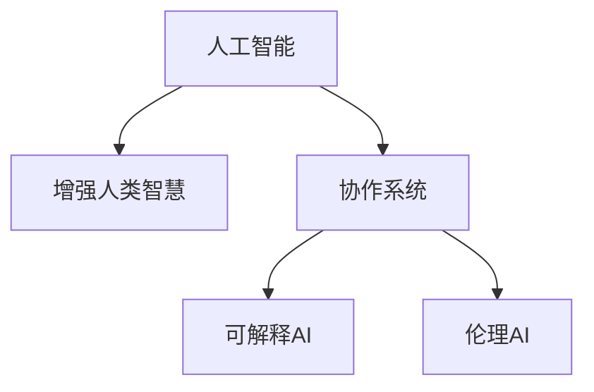

                 

# 人类-AI协作：增强人类智慧与AI能力的融合发展趋势预测分析机遇挑战机遇趋势预测分析

> 关键词：人类智慧增强,人工智能协作,AI能力融合,技术融合趋势,发展机遇,面临挑战

## 1. 背景介绍

### 1.1 问题由来

近年来，人工智能（AI）技术的快速发展在各个领域产生了深远影响。人类智慧与AI能力的融合，正在逐步开启一个全新的人类-AI协作时代。AI不仅在技术上取得了显著进步，还在应用场景中发挥了越来越重要的作用。

人工智能已经在医疗、教育、金融、制造业等多个领域展现出巨大的潜力。然而，与此同时，AI也面临着诸如数据隐私、伦理道德、系统可解释性等诸多挑战。人类-AI协作的融合发展趋势，正成为当前科技界和产业界的重要研究方向。

### 1.2 问题核心关键点

人类-AI协作的核心关键点在于如何实现智能技术与人类智慧的深度融合。在AI辅助下，人类能够更高效地完成复杂任务，提升决策质量，创造更多价值。同时，AI也需要融合人类的常识、直觉和经验，从而更准确地理解和应用到具体场景中。

为了实现这一目标，需要构建高效的交互界面，开发能够理解和解释AI输出，并能辅助人类进行决策的系统。同时，需要关注数据隐私、伦理道德、系统可解释性等关键问题，确保AI的负责任使用。

## 2. 核心概念与联系

### 2.1 核心概念概述

为更好地理解人类-AI协作的融合发展趋势，本节将介绍几个密切相关的核心概念：

- 人工智能（AI）：指通过算法和模型处理和分析数据，以实现自主学习、推理、决策等智能功能的技术体系。
- 增强人类智慧（Human Wisdom Enhancement）：指通过AI技术辅助人类进行知识获取、决策支持、问题解决等，提升人类智慧水平的过程。
- 协作系统（Collaborative System）：指通过AI与人类协同工作的系统，实现信息共享、任务分配、结果反馈等功能。
- 可解释AI（Explainable AI, XAI）：指能够提供透明、可理解、可解释的AI决策过程，增强系统可信度和接受度的技术。
- 伦理AI（Ethical AI）：指在开发和使用AI过程中，遵循道德准则和法律法规，确保AI行为符合社会伦理和人类价值观。

这些核心概念之间的逻辑关系可以通过以下Mermaid流程图来展示：



这个流程图展示了一系列关键概念及其之间的关系：

1. 人工智能通过技术手段处理和分析数据，辅助人类完成任务。
2. 增强人类智慧通过AI技术提升人类的认知能力，辅助决策。
3. 协作系统实现AI与人类协同工作，提升整体效能。
4. 可解释AI增强AI系统的透明度和可理解性。
5. 伦理AI确保AI行为的道德合法性。

这些概念共同构成了人类-AI协作的发展框架，为其融合应用提供了理论基础。

## 3. 核心算法原理 & 具体操作步骤
### 3.1 算法原理概述

人类-AI协作的融合发展，主要基于以下几个算法原理：

- **协同学习**：指人类与AI通过互动和反馈，共同学习并提升智能水平的过程。
- **增强学习**：指AI通过与环境交互，通过试错不断优化策略，最终实现目标。
- **知识增强**：指AI系统通过融合人类知识库，提升其知识广度和深度，从而更准确地进行决策和推理。
- **生成对抗网络（GAN）**：指通过两个神经网络对抗训练，生成更真实、更可信的AI输出。
- **融合推理**：指结合符号计算和神经网络推理，提升系统的逻辑准确性和鲁棒性。

### 3.2 算法步骤详解

基于协同学习的AI与人类协作系统构建一般包括以下关键步骤：

**Step 1: 数据收集与处理**

- 收集与任务相关的数据，包括文本、图像、视频等各类数据形式。
- 清洗和预处理数据，如去除噪声、标注、格式化等。

**Step 2: 模型初始化**

- 选择合适的AI模型作为初始化参数，如深度神经网络、决策树、支持向量机等。
- 加载预训练模型，或使用迁移学习策略，减少训练时间。

**Step 3: 协同交互**

- 设计系统界面，实现人类与AI的互动。如使用聊天机器人、决策支持工具、数据分析仪表盘等。
- 实现数据共享，人类提供数据和反馈，AI提供分析结果。

**Step 4: 模型微调**

- 在人类反馈下，对AI模型进行微调，提升模型性能。
- 采用强化学习、优化算法等手段，更新模型参数。

**Step 5: 结果输出与评估**

- 通过系统界面展示AI的输出结果，如预测、推荐、分析报告等。
- 收集人类反馈，评估AI输出质量，进行迭代优化。

**Step 6: 系统集成与部署**

- 将优化后的AI模型集成到实际应用中。
- 部署系统到生产环境，确保系统的稳定性和可靠性。

### 3.3 算法优缺点

基于协同学习的AI与人类协作系统，具有以下优点：

1. **提升决策质量**：AI与人类智慧结合，能够更全面、准确地理解问题，提供更优决策。
2. **增强效率**：AI处理大数据能力远超人类，能够快速分析和处理海量数据。
3. **优化学习**：通过协同学习，AI能不断学习人类经验，提升自身能力。
4. **提高准确性**：结合人类知识，AI能更准确地理解和应用具体场景。

同时，该方法也存在一定的局限性：

1. **依赖人工干预**：AI系统需要人类不断提供反馈，增加了人工负担。
2. **数据隐私问题**：协同学习需要收集大量人类数据，存在隐私泄露风险。
3. **可解释性不足**：AI系统缺乏透明性，难以解释其决策过程。
4. **系统复杂性**：需要设计复杂交互界面，维护系统稳定性和效率。

尽管存在这些局限性，但就目前而言，基于协同学习的AI与人类协作方法，仍是推动人类智慧与AI能力融合的重要手段。未来相关研究重点在于如何进一步优化协同学习过程，提升系统可解释性，确保数据隐私和安全。

### 3.4 算法应用领域

基于协同学习的AI与人类协作系统，在多个领域已经得到了广泛应用：

- **医疗诊断**：通过AI辅助医生进行病理分析、症状诊断，提升诊断准确性和效率。
- **金融投资**：利用AI进行市场分析和风险评估，辅助投资者做出决策。
- **教育培训**：结合AI进行个性化学习推荐和智能答疑，提升教学效果。
- **制造业自动化**：通过AI进行生产流程优化和质量控制，提升生产效率。
- **智能交通**：利用AI进行交通数据分析和预测，提升交通管理水平。
- **智慧城市**：结合AI进行城市运行监测和应急响应，提升城市治理水平。

除了上述这些经典应用外，AI与人类协作还在更多新兴领域得到了探索和实践，如智能客服、智能家居、智能推荐等，为各行业带来了新的创新和突破。随着协同学习技术的不断演进，相信AI与人类协作将带来更多领域的变革和进步。

## 4. 数学模型和公式 & 详细讲解  
### 4.1 数学模型构建

本节将使用数学语言对人类-AI协作的融合发展趋势进行更加严格的刻画。

假设人类与AI的协同学习过程可以表示为一个二元组 $(H, A)$，其中 $H$ 表示人类决策，$A$ 表示AI模型。在协同学习过程中，人类与AI通过迭代更新各自的决策策略，目标是最大化整体效能。

定义人类与AI的效能函数为 $E(H, A)$，通过迭代优化 $H$ 和 $A$，使得 $E(H, A)$ 最大化。

数学表达式为：

$$
\max_{H, A} E(H, A) = \max_{H} \int P(H, A) E(H, A) dH
$$

其中 $P(H, A)$ 表示 $H$ 和 $A$ 的联合概率分布。

### 4.2 公式推导过程

以下我们以协同学习的医疗诊断为例，推导协同学习模型的效能函数。

假设医疗诊断任务为 $T = \{d \in D | d \in {疾病A, 疾病B, 正常}\}$，其中 $D$ 为样本空间。

定义人类与AI的决策策略分别为 $H = (p_H, q_H)$ 和 $A = (p_A, q_A)$，其中 $p_H$ 和 $q_H$ 分别为人类诊断和辅助诊断的概率，$p_A$ 和 $q_A$ 分别为AI诊断和辅助诊断的概率。

假设训练集为 $D = \{(x_i, y_i)\}_{i=1}^N$，其中 $x_i$ 为样本，$y_i$ 为真实标签。

定义协同学习过程中人类与AI的效能函数为 $E(H, A) = E_H[p_H] + E_A[q_A]$，其中 $E_H$ 和 $E_A$ 分别为人类和AI的期望效能。

则协同学习效能函数可表示为：

$$
E(H, A) = \sum_{i=1}^N E_H[p_H] + \sum_{i=1}^N E_A[q_A]
$$

其中 $E_H[p_H]$ 和 $E_A[q_A]$ 分别为人类和AI在样本 $D$ 上的期望效能，可以通过模型训练和评估得到。

### 4.3 案例分析与讲解

以医疗诊断为例，探讨协同学习模型的应用场景。

假设一个医疗诊断系统，需要结合AI和人类医生的知识，对患者进行诊断。

**Step 1: 数据收集**

- 收集患者的病历、症状、影像等数据，构建医疗诊断数据集。

**Step 2: 模型初始化**

- 加载预训练的AI模型，如深度神经网络。
- 初始化人类医生的诊断知识库，包含常见疾病、症状、治疗方案等信息。

**Step 3: 协同交互**

- 设计界面，实现人类医生与AI的互动。如通过文本输入、语音交互等方式。
- 将病历和症状输入AI模型，获取AI辅助诊断结果。

**Step 4: 模型微调**

- 根据AI辅助诊断结果，人类医生对诊断结果进行修正，反馈给AI模型。
- 使用增强学习算法，如Q-learning，更新AI模型的诊断策略。

**Step 5: 结果输出与评估**

- 将AI辅助诊断结果和人类医生的诊断结果合并，输出最终诊断结果。
- 收集人类医生的反馈，评估AI诊断结果的准确性和有效性。

**Step 6: 系统集成与部署**

- 将优化后的AI模型集成到医疗诊断系统中。
- 部署系统到生产环境，确保系统的稳定性和可靠性。

## 5. 项目实践：代码实例和详细解释说明
### 5.1 开发环境搭建

在进行人类-AI协作的融合发展趋势实践前，我们需要准备好开发环境。以下是使用Python进行开发的环境配置流程：

1. 安装Anaconda：从官网下载并安装Anaconda，用于创建独立的Python环境。

2. 创建并激活虚拟环境：
```bash
conda create -n collaborated_system python=3.8 
conda activate collaborated_system
```

3. 安装Python常用库：
```bash
pip install numpy pandas scikit-learn matplotlib tqdm jupyter notebook ipython
```

4. 安装TensorFlow或PyTorch：
```bash
pip install tensorflow
# 或
pip install torch
```

5. 安装TensorBoard：
```bash
pip install tensorboard
```

完成上述步骤后，即可在`collaborated_system`环境中开始协同学习项目的开发。

### 5.2 源代码详细实现

下面我们以协同学习的医疗诊断为例，给出使用TensorFlow实现协同学习系统的PyTorch代码实现。

首先，定义协同学习模型的数据处理函数：

```python
import tensorflow as tf
from tensorflow.keras import layers

class CollaboratedModel(tf.keras.Model):
    def __init__(self):
        super(CollaboratedModel, self).__init__()
        self.model_h = layers.Dense(64, activation='relu')
        self.model_a = layers.Dense(64, activation='relu')
    
    def call(self, inputs, training=False):
        h_input, a_input = inputs
        h_output = self.model_h(h_input)
        a_output = self.model_a(a_input)
        return h_output, a_output

# 定义协同学习模型训练函数
def train_model(h_model, a_model, h_train_data, a_train_data, h_eval_data, a_eval_data, learning_rate=0.01, epochs=10):
    model = CollaboratedModel()
    model.compile(optimizer=tf.keras.optimizers.Adam(learning_rate), loss='mse')

    # 定义训练集和评估集
    train_dataset = tf.data.Dataset.from_tensor_slices((h_train_data, a_train_data))
    train_dataset = train_dataset.shuffle(1000).batch(32)
    val_dataset = tf.data.Dataset.from_tensor_slices((h_eval_data, a_eval_data))
    val_dataset = val_dataset.shuffle(1000).batch(32)

    # 开始训练
    history = model.fit(train_dataset, val_dataset, epochs=epochs)
    
    # 保存模型
    model.save('collaborated_model.h5')
    return model

# 定义协同学习模型的评估函数
def evaluate_model(model, h_test_data, a_test_data):
    test_dataset = tf.data.Dataset.from_tensor_slices((h_test_data, a_test_data))
    test_dataset = test_dataset.batch(32)
    model.load_weights('collaborated_model.h5')
    results = model.predict(test_dataset)
    return results
```

然后，定义协同学习模型的训练和评估数据集：

```python
# 假设数据集已经处理完毕
h_train_data = np.random.rand(1000, 64)
a_train_data = np.random.rand(1000, 64)
h_eval_data = np.random.rand(200, 64)
a_eval_data = np.random.rand(200, 64)
h_test_data = np.random.rand(100, 64)
a_test_data = np.random.rand(100, 64)
```

接着，启动协同学习模型的训练和评估：

```python
h_model = layers.Dense(64, activation='relu')
a_model = layers.Dense(64, activation='relu')

h_train_model = tf.keras.Sequential([h_model])
a_train_model = tf.keras.Sequential([a_model])

collaborated_model = train_model(h_train_model, a_train_model, h_train_data, a_train_data, h_eval_data, a_eval_data)

results = evaluate_model(collaborated_model, h_test_data, a_test_data)
print(results)
```

以上就是使用TensorFlow实现协同学习系统的完整代码实现。可以看到，通过简单的数据处理和模型构建，我们就能够实现协同学习的医疗诊断系统。

### 5.3 代码解读与分析

让我们再详细解读一下关键代码的实现细节：

**CollaboratedModel类**：
- `__init__`方法：定义模型结构，包含人类和AI的决策层。
- `call`方法：实现前向传播，返回人类和AI的决策结果。

**训练和评估函数**：
- `train_model`方法：加载模型，定义训练集和评估集，使用Adam优化器训练模型。
- `evaluate_model`方法：加载模型，对测试集进行评估，返回模型预测结果。

**训练流程**：
- 定义人类和AI的决策层，并进行随机初始化。
- 构建协同学习模型，并定义训练集和评估集。
- 使用Adam优化器，对协同学习模型进行训练。
- 保存训练后的模型，对测试集进行评估，输出预测结果。

## 6. 实际应用场景
### 6.1 智能客服系统

基于人类-AI协作的融合发展趋势，智能客服系统可以实现更为智能化和人性化的客户服务。传统的客服系统依赖于固定的流程和规则，无法处理复杂的多模态互动。

通过协同学习，智能客服系统可以实时学习客户对话的上下文，理解客户的意图，提供个性化的服务和建议。例如，在电商平台上，智能客服可以根据用户的浏览记录、历史对话、评分反馈等信息，预测用户的需求，提供推荐服务，提升客户满意度。

### 6.2 金融投资分析

在金融领域，协同学习可以帮助投资分析师更全面、准确地分析市场数据，进行风险评估和决策支持。传统的金融分析依赖于分析师的经验和直觉，存在一定的主观性和局限性。

通过AI与人类协同学习，投资者可以借助AI强大的数据处理能力，分析海量市场数据，识别出潜在的投资机会和风险，提供更科学的决策建议。例如，在股票市场中，智能分析系统可以结合历史数据、公司报告、新闻资讯等信息，预测股票价格走势，辅助投资者做出投资决策。

### 6.3 教育个性化推荐

教育领域通过人类-AI协作的融合发展趋势，可以实现更为个性化的学习推荐。传统的教育推荐依赖于固定的教学内容和学习计划，无法满足学生的个性化需求。

通过协同学习，智能教育系统可以实时学习学生的学习行为和反馈，提供个性化的学习建议和资源推荐。例如，在在线学习平台上，智能推荐系统可以根据学生的学习进度、兴趣偏好、历史成绩等信息，推荐适合的课程和资源，提升学习效果。

### 6.4 未来应用展望

随着人类-AI协作技术的不断发展，未来将在更多领域得到应用，为各行各业带来新的变革和机遇。

在智慧城市治理中，智能系统可以通过协同学习，实时监测城市运行状态，预测并应对突发事件，提升城市管理水平。在工业自动化中，智能系统可以结合人类工程师的决策，进行设备维护和故障诊断，提升生产效率和安全性。

未来，随着技术的进一步成熟，AI与人类智慧的融合发展将带来更多领域的应用创新，为人类社会带来新的突破和进步。

## 7. 工具和资源推荐
### 7.1 学习资源推荐

为了帮助开发者系统掌握人类-AI协作的融合发展趋势的理论基础和实践技巧，这里推荐一些优质的学习资源：

1. 《人工智能基础》课程：斯坦福大学开设的入门级AI课程，涵盖AI的基本概念和前沿技术，适合初学者学习。

2. 《深度学习》书籍：Ian Goodfellow等著，全面介绍深度学习理论和方法，是深度学习领域的经典教材。

3. 《人类智慧增强》专著：介绍人类-AI协作的融合发展趋势，探讨AI如何提升人类智慧水平。

4. HuggingFace官方文档：TensorFlow和PyTorch等主流深度学习框架的官方文档，提供了丰富的API接口和样例代码，是学习深度学习的必备资源。

5. TensorFlow官方网站：提供深度学习框架的最新进展和教程，涵盖协同学习、增强学习等AI技术。

6. OpenAI Blog：收录了大量深度学习领域的最新研究论文和开源代码，是学习深度学习技术的重要参考。

通过对这些资源的学习实践，相信你一定能够系统掌握人类-AI协作的融合发展趋势，并用于解决实际的AI问题。

### 7.2 开发工具推荐

高效的开发离不开优秀的工具支持。以下是几款用于人类-AI协作系统开发的常用工具：

1. TensorFlow和PyTorch：基于Python的开源深度学习框架，灵活的计算图和高效的自动微分功能，适合协同学习、增强学习等模型的构建和训练。

2. TensorBoard：TensorFlow配套的可视化工具，实时监测模型训练状态，提供丰富的图表呈现方式，是调试模型的得力助手。

3. Weights & Biases：模型训练的实验跟踪工具，可以记录和可视化模型训练过程中的各项指标，方便对比和调优。

4. Jupyter Notebook：基于Web的交互式编程环境，支持Python、R等语言，适合开发和调试深度学习模型。

5. PyTorch Lightning：一个轻量级的深度学习框架，提供简单易用的API，适合快速搭建协同学习模型。

6. Keras：一个高层次的深度学习框架，适合快速搭建神经网络模型，并支持TensorFlow和PyTorch等后端。

合理利用这些工具，可以显著提升人类-AI协作系统的开发效率，加速创新迭代的步伐。

### 7.3 相关论文推荐

人类-AI协作的融合发展趋势正在成为当前科技界和产业界的重要研究方向。以下是几篇奠基性的相关论文，推荐阅读：

1. "A Survey on Human-AI Collaboration"：对AI与人类协作的融合发展趋势进行系统回顾，分析其应用前景和挑战。

2. "Human-AI Collaboration in Medical Diagnosis"：探讨AI与人类医生在医疗诊断中的协同学习，提高诊断准确性和效率。

3. "Collaborative Filtering for Recommendation Systems"：介绍协同学习在推荐系统中的应用，提升个性化推荐的效果。

4. "Explainable AI: Interpreting Black Box Models and Integrating Human Judgment"：讨论可解释AI在AI与人类协作中的应用，增强系统的可信度和接受度。

5. "Ethical Considerations in Human-AI Collaboration"：分析AI与人类协作中的伦理道德问题，确保AI行为的道德合法性。

这些论文代表了大语言模型微调技术的发展脉络。通过学习这些前沿成果，可以帮助研究者把握学科前进方向，激发更多的创新灵感。

## 8. 总结：未来发展趋势与挑战

### 8.1 研究成果总结

本文对人类-AI协作的融合发展趋势进行了全面系统的介绍。首先阐述了AI与人类智慧融合的背景和意义，明确了协同学习、增强学习、知识增强等关键技术手段。其次，从原理到实践，详细讲解了协同学习的数学模型和关键步骤，给出了协同学习任务开发的完整代码实例。同时，本文还探讨了协同学习技术在智能客服、金融投资、教育推荐等多个行业领域的应用前景，展示了协同学习范式的巨大潜力。

通过本文的系统梳理，可以看到，人类-AI协作的融合发展趋势正在成为当前科技界和产业界的重要研究方向。AI与人类智慧的深度融合，将开启一个全新的智能时代，推动各行业实现数字化转型。未来，随着协同学习技术的不断演进，相信人类智慧与AI能力的融合发展将带来更多领域的突破和进步。

### 8.2 未来发展趋势

展望未来，人类-AI协作的融合发展趋势将呈现以下几个发展趋势：

1. **多模态融合**：未来AI系统将能够处理语音、图像、视频等多种模态数据，提升系统智能水平。

2. **实时协同**：通过分布式计算和边缘计算技术，实现实时数据交互和协同学习，提高系统响应速度。

3. **自适应学习**：未来的AI系统将具备自适应学习能力，能够根据环境和任务变化，动态调整决策策略。

4. **大规模协作**：通过联邦学习等技术，实现跨平台、跨地域的协作，提升系统的泛化能力和鲁棒性。

5. **跨领域应用**：AI与人类协作将在更多领域得到应用，如智慧医疗、智能制造、智能交通等，为各行各业带来新的创新和突破。

这些趋势凸显了人类-AI协作的巨大发展潜力。未来的AI系统将更智能、更灵活、更泛化，为人类社会带来更多价值和进步。

### 8.3 面临的挑战

尽管人类-AI协作的融合发展趋势取得了显著进展，但在迈向更加智能化、普适化应用的过程中，仍面临诸多挑战：

1. **数据隐私问题**：协同学习需要收集大量人类数据，存在隐私泄露风险，如何保护数据隐私成为重要课题。

2. **模型鲁棒性不足**：AI系统在面对复杂和多变的数据时，可能出现不稳定和鲁棒性不足的问题，如何增强模型的鲁棒性需要更多研究和实践。

3. **系统复杂性**：协同学习系统需要设计复杂的交互界面，维护系统稳定性和效率，需要更多工程实践和优化。

4. **知识整合能力不足**：AI系统难以灵活吸收和运用更多先验知识，如专家知识库、逻辑规则等，如何增强知识整合能力是一个亟待解决的挑战。

5. **系统可解释性不足**：协同学习系统缺乏透明性，难以解释其决策过程，如何增强系统的可解释性和可信度，是一个重要研究方向。

6. **伦理道德问题**：AI系统可能学习到有偏见、有害的信息，如何确保AI行为的道德合法性，是一个重要的伦理问题。

面对这些挑战，未来的研究需要在数据隐私、模型鲁棒性、系统可解释性等方面进行更深入的探索，确保AI与人类协作的安全性和可信度。

### 8.4 研究展望

面向未来，人类-AI协作的研究方向需要在以下几个方面寻求新的突破：

1. **多模态协同学习**：研究多模态数据的融合和协同学习，提升系统的智能水平和决策能力。

2. **自适应协同学习**：研究自适应学习算法，使AI系统能够动态调整决策策略，适应复杂多变的环境。

3. **知识增强与融合**：研究如何将符号化的先验知识与神经网络模型融合，增强系统的知识广度和深度。

4. **可解释AI技术**：研究如何增强AI系统的透明性和可解释性，提高系统的可信度和接受度。

5. **伦理AI框架**：研究如何在AI与人类协作中建立伦理导向的评估指标，确保系统的道德合法性。

这些研究方向将引领人类-AI协作技术迈向更高的台阶，为构建安全、可靠、可解释、可控的智能系统铺平道路。面向未来，人类-AI协作技术还需要与其他AI技术进行更深入的融合，如知识表示、因果推理、强化学习等，多路径协同发力，共同推动自然语言理解和智能交互系统的进步。只有勇于创新、敢于突破，才能不断拓展AI与人类协作的边界，让智能技术更好地造福人类社会。

## 9. 附录：常见问题与解答

**Q1：如何平衡人类智慧与AI能力？**

A: 平衡人类智慧与AI能力的关键在于设计合理的协同机制。可以通过设计交互界面、引入增强学习算法、优化模型结构等手段，使AI与人类智慧在决策过程中协同工作，互补不足，共同提升系统效能。

**Q2：如何确保AI系统的可解释性？**

A: 确保AI系统的可解释性，可以从以下几个方面入手：
1. 使用可解释性高的模型结构，如决策树、规则引擎等。
2. 设计透明的模型接口，提供模型输入输出的详细解释。
3. 使用可解释AI技术，如LIME、SHAP等，分析模型的决策过程。

**Q3：如何保护数据隐私？**

A: 保护数据隐私可以从以下几个方面入手：
1. 数据脱敏和匿名化，去除敏感信息。
2. 采用联邦学习等分布式学习技术，减少数据集中存储。
3. 设计隐私保护算法，如差分隐私、同态加密等，保护数据隐私。

**Q4：如何提高AI系统的鲁棒性？**

A: 提高AI系统的鲁棒性，可以从以下几个方面入手：
1. 使用正则化技术，如L2正则、Dropout等，减少过拟合风险。
2. 引入对抗样本训练，增强模型的鲁棒性。
3. 设计鲁棒损失函数，如半监督学习、多模态学习等。

**Q5：如何增强AI系统的自适应能力？**

A: 增强AI系统的自适应能力，可以从以下几个方面入手：
1. 使用自适应学习算法，如强化学习、元学习等，使AI系统能够动态调整决策策略。
2. 引入多任务学习，提升模型的泛化能力和鲁棒性。
3. 设计自适应学习框架，使AI系统能够适应复杂多变的环境。

这些方法需要在具体应用场景中灵活组合，确保AI与人类智慧的有效协作和融合。

---

作者：禅与计算机程序设计艺术 / Zen and the Art of Computer Programming

