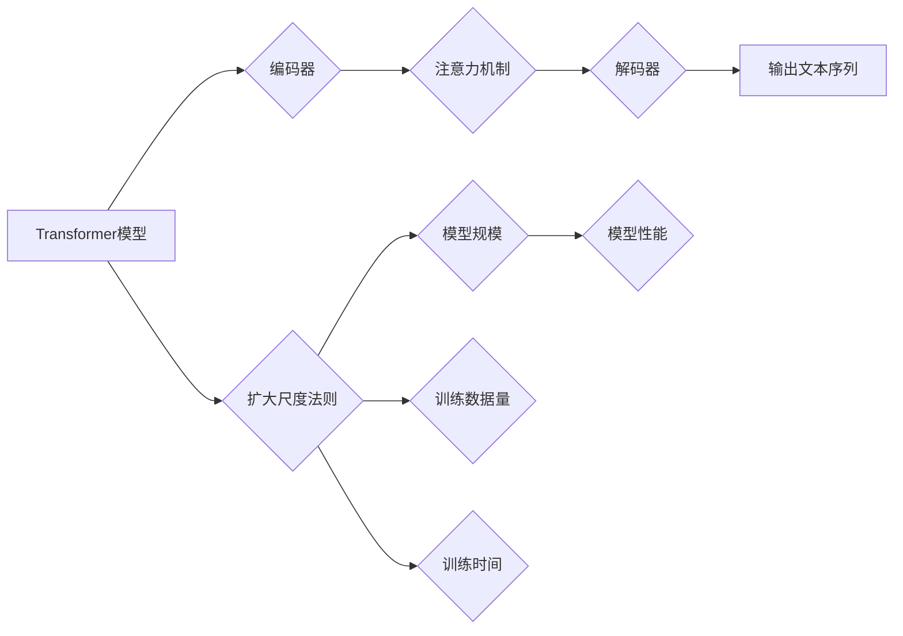

> 大语言模型、Transformer、扩大尺度法则、深度学习、自然语言处理

## 1. 背景介绍

近年来，深度学习技术取得了飞速发展，特别是Transformer模型的出现，为自然语言处理（NLP）领域带来了革命性的变革。大语言模型（LLM）作为Transformer模型的升级版，拥有海量参数和强大的文本生成能力，在文本分类、机器翻译、对话系统等领域展现出令人瞩目的应用潜力。

LLM的训练需要海量文本数据和强大的计算资源，其规模不断扩大，成为当前人工智能研究的热点之一。扩大尺度法则（Scaling Laws）指出，模型规模、训练数据量和训练时间等因素与模型性能之间存在着明确的关联，模型规模的增加能够显著提升模型性能。

## 2. 核心概念与联系

**2.1  Transformer模型**

Transformer模型是一种基于注意力机制的序列到序列模型，它能够有效地捕捉文本中的长距离依赖关系。Transformer模型的核心结构包括编码器和解码器，编码器负责将输入文本序列编码成固定长度的向量表示，解码器则根据编码后的向量表示生成输出文本序列。

**2.2  大语言模型（LLM）**

LLM是指参数量巨大、训练数据量庞大的Transformer模型，其参数数量通常在数十亿甚至数千亿级别。LLM能够学习到丰富的语言知识和模式，从而具备强大的文本生成、理解和推理能力。

**2.3  扩大尺度法则**

扩大尺度法则指出，模型规模、训练数据量和训练时间等因素与模型性能之间存在着明确的关联。模型规模的增加能够显著提升模型性能，但同时也带来更高的计算成本和训练难度。

**Mermaid 流程图**



## 3. 核心算法原理 & 具体操作步骤

**3.1  算法原理概述**

LLM的训练基于深度学习的监督学习框架，其核心算法是反向传播算法（Backpropagation）。训练过程包括以下步骤：

1.  **数据预处理:** 将原始文本数据进行清洗、分词、标记等预处理操作，使其能够被模型理解和处理。
2.  **模型输入:** 将预处理后的文本数据输入到Transformer模型中。
3.  **模型输出:** 模型根据输入数据生成预测输出。
4.  **损失函数计算:** 计算模型预测输出与真实标签之间的差异，即损失函数值。
5.  **反向传播:** 将损失函数值反向传播到模型参数，更新模型参数以减小损失函数值。

**3.2  算法步骤详解**

1.  **数据预处理:**

    *   **清洗:** 去除文本数据中的停用词、标点符号等无用信息。
    *   **分词:** 将文本数据分割成单个单词或子词。
    *   **标记:** 为文本数据添加标签，例如词性标注、命名实体识别等。

2.  **模型输入:** 将预处理后的文本数据输入到Transformer模型中，每个单词或子词会被映射成一个词向量，并通过编码器进行编码，生成固定长度的向量表示。

3.  **模型输出:** 解码器根据编码后的向量表示生成预测输出，例如下一个单词的预测概率分布。

4.  **损失函数计算:** 使用交叉熵损失函数计算模型预测输出与真实标签之间的差异。

5.  **反向传播:** 使用梯度下降算法反向传播损失函数值，更新模型参数以减小损失函数值。

**3.3  算法优缺点**

**优点:**

*   能够有效地捕捉文本中的长距离依赖关系。
*   训练数据量大，模型性能强。
*   可用于多种NLP任务，例如文本分类、机器翻译、对话系统等。

**缺点:**

*   训练成本高，需要大量的计算资源和时间。
*   模型参数量大，部署成本高。
*   容易受到训练数据偏差的影响。

**3.4  算法应用领域**

*   **文本分类:** 识别文本的类别，例如情感分析、主题分类等。
*   **机器翻译:** 将文本从一种语言翻译成另一种语言。
*   **对话系统:** 创建能够与人类进行自然对话的系统。
*   **文本生成:** 生成高质量的文本内容，例如文章、故事、诗歌等。

## 4. 数学模型和公式 & 详细讲解 & 举例说明

**4.1  数学模型构建**

LLM的数学模型主要基于Transformer模型的架构，其核心是注意力机制和多头注意力机制。

**注意力机制:**

注意力机制能够帮助模型关注输入序列中与当前输出相关的部分，从而提高模型的理解能力。注意力机制的计算公式如下：

$$
\text{Attention}(Q, K, V) = \text{softmax}\left(\frac{Q K^T}{\sqrt{d_k}}\right) V
$$

其中：

*   $Q$：查询矩阵
*   $K$：键矩阵
*   $V$：值矩阵
*   $d_k$：键向量的维度

**多头注意力机制:**

多头注意力机制将注意力机制应用于多个不同的子空间，从而能够捕捉到更丰富的文本信息。多头注意力机制的计算公式如下：

$$
\text{MultiHeadAttention}(Q, K, V) = \text{Concat}\left(\text{head}_1, \text{head}_2, ..., \text{head}_h\right) W_o
$$

其中：

*   $\text{head}_i$：第$i$个注意力头的输出
*   $h$：注意力头的数量
*   $W_o$：最终输出层的权重矩阵

**4.2  公式推导过程**

注意力机制的公式推导过程可以参考相关文献，例如Vaswani et al. (2017)的论文《Attention Is All You Need》。

**4.3  案例分析与讲解**

例如，在机器翻译任务中，注意力机制可以帮助模型关注源语言文本中与目标语言文本相关的部分，从而提高翻译的准确性。

## 5. 项目实践：代码实例和详细解释说明

**5.1  开发环境搭建**

*   操作系统：Linux
*   Python版本：3.7+
*   深度学习框架：PyTorch或TensorFlow

**5.2  源代码详细实现**

```python
import torch
import torch.nn as nn

class Transformer(nn.Module):
    def __init__(self, vocab_size, embedding_dim, num_heads, num_layers):
        super(Transformer, self).__init__()
        self.embedding = nn.Embedding(vocab_size, embedding_dim)
        self.transformer_layers = nn.ModuleList([
            nn.TransformerEncoderLayer(embedding_dim, num_heads)
            for _ in range(num_layers)
        ])
        self.linear = nn.Linear(embedding_dim, vocab_size)

    def forward(self, x):
        x = self.embedding(x)
        for layer in self.transformer_layers:
            x = layer(x)
        x = self.linear(x)
        return x
```

**5.3  代码解读与分析**

*   `__init__`方法：初始化模型参数，包括词嵌入层、Transformer编码器层和输出层。
*   `forward`方法：定义模型的正向传播过程，将输入序列经过词嵌入层、Transformer编码器层和输出层，最终生成预测输出。

**5.4  运行结果展示**

训练完成后，可以使用模型对新的文本数据进行预测，例如生成文本、翻译文本等。

## 6. 实际应用场景

**6.1  文本生成**

LLM可以用于生成各种类型的文本内容，例如文章、故事、诗歌、代码等。

**6.2  机器翻译**

LLM可以用于将文本从一种语言翻译成另一种语言，例如英语翻译成中文。

**6.3  对话系统**

LLM可以用于构建能够与人类进行自然对话的系统，例如聊天机器人、虚拟助手等。

**6.4  未来应用展望**

LLM在未来将有更广泛的应用场景，例如：

*   **个性化教育:** 根据学生的学习情况提供个性化的学习内容和辅导。
*   **医疗诊断:** 辅助医生进行疾病诊断和治疗方案制定。
*   **法律服务:** 帮助律师进行法律研究和案件分析。

## 7. 工具和资源推荐

**7.1  学习资源推荐**

*   **书籍:**
    *   《深度学习》
    *   《自然语言处理》
*   **在线课程:**
    *   Coursera: 深度学习
    *   edX: 自然语言处理

**7.2  开发工具推荐**

*   **深度学习框架:** PyTorch, TensorFlow
*   **文本处理工具:** NLTK, SpaCy

**7.3  相关论文推荐**

*   《Attention Is All You Need》
*   《BERT: Pre-training of Deep Bidirectional Transformers for Language Understanding》

## 8. 总结：未来发展趋势与挑战

**8.1  研究成果总结**

近年来，LLM取得了显著的进展，其性能在许多NLP任务上都超过了人类水平。

**8.2  未来发展趋势**

*   模型规模的进一步扩大
*   训练数据的多样化和高质量化
*   模型训练效率的提升
*   模型的解释性和可解释性增强

**8.3  面临的挑战**

*   训练成本高
*   模型参数量大
*   容易受到训练数据偏差的影响
*   缺乏对模型行为的解释性

**8.4  研究展望**

未来研究将重点关注解决上述挑战，例如探索更有效的训练方法、开发更小的但性能更强的模型、提高模型的鲁棒性和安全性。

## 9. 附录：常见问题与解答

**9.1  什么是LLM？**

LLM是指参数量巨大、训练数据量庞大的Transformer模型，其参数数量通常在数十亿甚至数千亿级别。

**9.2  LLM的训练需要哪些资源？**

LLM的训练需要大量的计算资源、存储资源和训练数据。

**9.3  LLM有哪些应用场景？**

LLM可以用于多种NLP任务，例如文本分类、机器翻译、对话系统、文本生成等。


作者：禅与计算机程序设计艺术 / Zen and the Art of Computer Programming<end_of_turn>