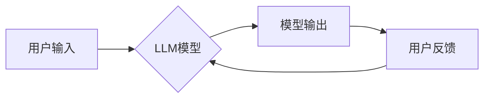

> 大语言模型，LLM，提示工程，文本生成，自然语言处理，AI应用

## 1. 背景介绍

近年来，大语言模型（LLM）在自然语言处理（NLP）领域取得了令人瞩目的成就。从文本生成、翻译到问答和代码编写，LLM展现出强大的能力，为我们带来了全新的应用场景。然而，LLM的潜力并非一蹴而就，需要通过精心设计的“提示”（prompt）来引导模型，使其发挥最佳性能。

提示工程（Prompt Engineering）成为LLM应用的关键环节，它涉及如何设计有效的输入，以获得期望的输出。一个精心设计的提示可以显著提升模型的准确性、流畅度和创造力，而一个糟糕的提示则可能导致模型产生错误、模糊或无关的输出。

本指南旨在为读者提供大语言模型应用指南，重点介绍提示的基础技巧，帮助您更好地理解和利用LLM的强大能力。

## 2. 核心概念与联系

### 2.1  大语言模型（LLM）

大语言模型是一种基于深度学习的强大人工智能模型，能够理解和生成人类语言。它们通过训练海量文本数据，学习语言的语法、语义和上下文关系。

### 2.2  提示（Prompt）

提示是指输入给LLM的文本指令或问题，它引导模型生成特定的输出。提示可以是简单的关键词、完整的句子，甚至是一段故事的开头。

### 2.3  提示工程

提示工程是指设计和优化提示以获得最佳模型输出的过程。它是一个迭代的过程，需要不断尝试和调整提示，以找到最有效的表达方式。

**Mermaid 流程图**



## 3. 核心算法原理 & 具体操作步骤

### 3.1  算法原理概述

LLM通常基于Transformer架构，利用自注意力机制学习语言的上下文关系。

**自注意力机制**

自注意力机制允许模型关注输入序列中的不同位置，并计算它们之间的相关性。通过这种机制，LLM能够理解句子中的长距离依赖关系，从而生成更流畅、更准确的文本。

### 3.2  算法步骤详解

1. **输入处理:** 将用户输入的文本转换为模型可理解的格式，例如词嵌入。
2. **编码:** 使用Transformer编码器将输入文本编码成一个隐藏状态向量，该向量包含文本的语义信息。
3. **解码:** 使用Transformer解码器根据隐藏状态向量生成输出文本。
4. **输出生成:** 将解码器输出的概率分布转换为文本序列。

### 3.3  算法优缺点

**优点:**

* 能够处理长文本序列
* 能够捕捉长距离依赖关系
* 表现出强大的文本生成能力

**缺点:**

* 计算量大，训练成本高
* 对训练数据质量要求高
* 容易受到恶意输入的影响

### 3.4  算法应用领域

* 文本生成：小说、诗歌、剧本、代码等
* 翻译：将一种语言翻译成另一种语言
* 问答：回答用户提出的问题
* 对话系统：与用户进行自然语言对话
* 文本摘要：生成文本的简短摘要

## 4. 数学模型和公式 & 详细讲解 & 举例说明

### 4.1  数学模型构建

LLM通常使用Transformer架构，其核心是自注意力机制和多头注意力机制。

**自注意力机制公式:**

$$
Attention(Q, K, V) = \frac{exp(Q \cdot K^T / \sqrt{d_k})}{exp(Q \cdot K^T / \sqrt{d_k})} \cdot V
$$

其中：

* $Q$：查询矩阵
* $K$：键矩阵
* $V$：值矩阵
* $d_k$：键向量的维度

**多头注意力机制:**

多头注意力机制将自注意力机制应用于多个不同的子空间，并将其结果进行融合。

### 4.2  公式推导过程

自注意力机制的公式推导过程涉及矩阵运算和softmax函数。

**softmax函数:**

$$
softmax(x_i) = \frac{exp(x_i)}{\sum_{j=1}^{n} exp(x_j)}
$$

### 4.3  案例分析与讲解

通过调整自注意力机制中的参数，例如查询矩阵、键矩阵和值矩阵，可以改变模型对输入文本的关注程度，从而影响模型的输出结果。

## 5. 项目实践：代码实例和详细解释说明

### 5.1  开发环境搭建

使用Python语言和深度学习框架TensorFlow或PyTorch搭建开发环境。

### 5.2  源代码详细实现

使用预训练的LLM模型，例如GPT-3或BERT，并根据需要进行微调。

```python
from transformers import pipeline

# 使用预训练的文本生成模型
generator = pipeline("text-generation", model="gpt2")

# 生成文本
text = generator("写一首关于春天的诗", max_length=100, num_return_sequences=3)

# 打印结果
for i in range(len(text)):
    print(f"输出{i+1}: {text[i]['generated_text']}")
```

### 5.3  代码解读与分析

代码首先使用transformers库加载预训练的文本生成模型。然后，使用pipeline函数创建一个文本生成器。

`generator("写一首关于春天的诗", max_length=100, num_return_sequences=3)`

这段代码调用文本生成器，输入提示“写一首关于春天的诗”，并设置最大文本长度为100个词，生成3个不同的文本序列。

### 5.4  运行结果展示

代码运行后，将输出3首关于春天的诗歌。

## 6. 实际应用场景

### 6.1  内容创作

LLM可以帮助作家、诗人、脚本家等创作内容，例如小说、诗歌、剧本等。

### 6.2  教育培训

LLM可以用于生成个性化的学习内容，例如习题、练习题、案例分析等，帮助学生更好地理解知识。

### 6.3  客户服务

LLM可以用于构建聊天机器人，提供24小时在线客户服务，解答用户疑问，解决问题。

### 6.4  未来应用展望

LLM在未来将应用于更广泛的领域，例如医疗诊断、法律分析、科学研究等。

## 7. 工具和资源推荐

### 7.1  学习资源推荐

* **OpenAI API:** https://beta.openai.com/docs/api-reference/introduction
* **Hugging Face Transformers:** https://huggingface.co/docs/transformers/index

### 7.2  开发工具推荐

* **Python:** https://www.python.org/
* **TensorFlow:** https://www.tensorflow.org/
* **PyTorch:** https://pytorch.org/

### 7.3  相关论文推荐

* **Attention Is All You Need:** https://arxiv.org/abs/1706.03762
* **BERT: Pre-training of Deep Bidirectional Transformers for Language Understanding:** https://arxiv.org/abs/1810.04805

## 8. 总结：未来发展趋势与挑战

### 8.1  研究成果总结

LLM在文本生成、翻译、问答等领域取得了显著进展，展现出强大的应用潜力。

### 8.2  未来发展趋势

LLM将朝着更强大、更安全、更可解释的方向发展。

* **模型规模:** 模型规模将继续扩大，从而提升模型的性能。
* **多模态学习:** LLM将融合视觉、音频等多模态数据，实现更全面的理解和生成。
* **可解释性:** 研究将更加注重LLM的解释性，使其决策过程更加透明。

### 8.3  面临的挑战

LLM还面临一些挑战，例如：

* **数据偏见:** 训练数据可能存在偏见，导致模型输出存在偏差。
* **安全风险:** 恶意用户可能利用LLM进行攻击或生成有害内容。
* **伦理问题:** LLM的应用可能引发伦理问题，例如著作权问题、隐私问题等。

### 8.4  研究展望

未来研究将重点关注解决LLM面临的挑战，并探索其在更多领域的应用。

## 9. 附录：常见问题与解答

### 9.1  如何选择合适的LLM模型？

选择合适的LLM模型取决于具体的应用场景和需求。

### 9.2  如何优化提示以获得更好的输出？

可以通过以下方式优化提示：

* 使用更具体的关键词
* 提供更多上下文信息
* 使用示例数据

### 9.3  如何避免LLM生成错误或有害的输出？

可以通过以下方式避免LLM生成错误或有害的输出：

* 使用高质量的训练数据
* 对模型进行严格的测试和评估
* 设置合理的输出限制

作者：禅与计算机程序设计艺术 / Zen and the Art of Computer Programming


<end_of_turn>