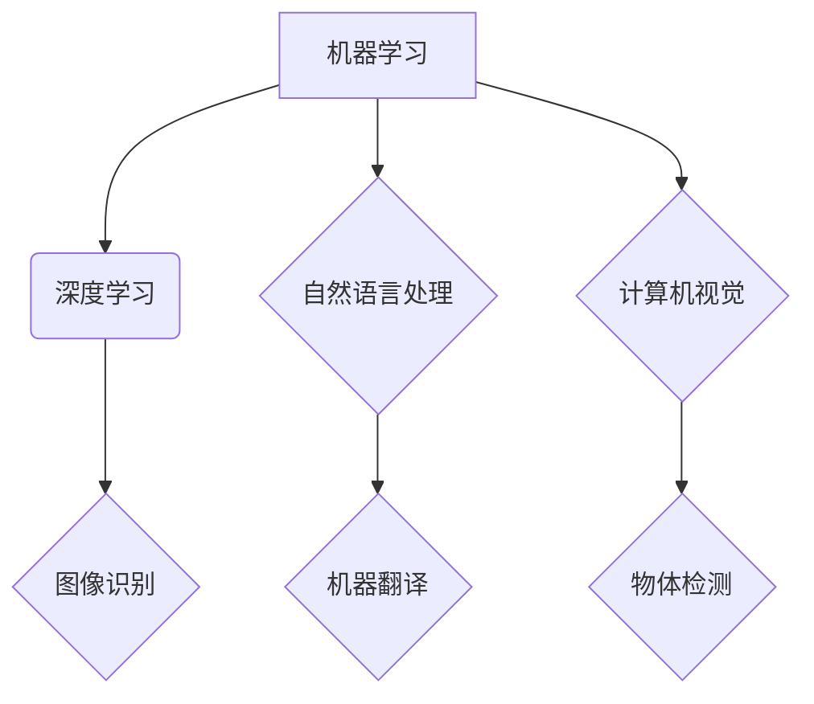

>  人工智能、机器学习、深度学习、大数据、云计算、物联网、经济增长

## 1. 背景介绍

自工业革命以来，人类社会经历了前所未有的变革。蒸汽机、电力、内燃机等技术的革新，推动了生产力的飞跃，带来了经济的爆发式增长。如今，我们正站在一个新的历史节点上，人工智能（AI）的兴起，如同工业革命的再次降临，势必将重塑经济格局，催生新的增长引擎。

人工智能技术的快速发展，得益于以下几个关键因素：

* **大数据时代的到来:**  互联网、移动互联网、物联网等技术的普及，产生了海量的数据，为人工智能算法的训练提供了充足的燃料。
* **计算能力的提升:**  摩尔定律的持续发展，使得计算机的处理能力不断增强，能够处理越来越复杂的计算任务。
* **算法的突破:**  深度学习等算法的出现，突破了传统机器学习的瓶颈，使得人工智能能够更好地理解和处理复杂的数据。

## 2. 核心概念与联系

人工智能的核心概念包括：

* **机器学习:**  让计算机从数据中学习，无需明确编程，自动发现模式和规律。
* **深度学习:**  一种更高级的机器学习方法，利用多层神经网络模拟人类大脑的学习过程。
* **自然语言处理:**  让计算机能够理解和处理人类语言，例如文本分析、机器翻译、语音识别等。
* **计算机视觉:**  让计算机能够“看”世界，例如图像识别、物体检测、视频分析等。

这些核心概念相互关联，共同构成了人工智能的生态系统。



## 3. 核心算法原理 & 具体操作步骤

### 3.1  算法原理概述

深度学习算法的核心是多层神经网络。神经网络由许多相互连接的神经元组成，每个神经元接收输入信号，经过处理后输出信号。通过调整神经元之间的连接权重，神经网络能够学习数据中的模式和规律。

### 3.2  算法步骤详解

1. **数据预处理:**  将原始数据清洗、转换、规范化，使其适合深度学习算法的训练。
2. **网络结构设计:**  根据任务需求，设计神经网络的层数、节点数、激活函数等参数。
3. **参数初始化:**  随机初始化神经网络的参数，例如权重和偏置。
4. **前向传播:**  将输入数据通过神经网络层层传递，最终得到输出结果。
5. **反向传播:**  计算输出结果与真实值的误差，并根据误差反向调整神经网络的参数，使输出结果更接近真实值。
6. **迭代训练:**  重复前向传播和反向传播的过程，直到模型的性能达到预期的水平。

### 3.3  算法优缺点

**优点:**

* 能够学习复杂的数据模式，性能优于传统机器学习算法。
* 能够自动提取特征，无需人工特征工程。

**缺点:**

* 训练数据量大，计算资源消耗高。
* 模型解释性差，难以理解模型的决策过程。

### 3.4  算法应用领域

深度学习算法广泛应用于以下领域:

* **图像识别:**  人脸识别、物体检测、图像分类等。
* **自然语言处理:**  机器翻译、文本摘要、情感分析等。
* **语音识别:**  语音助手、语音搜索等。
* **推荐系统:**  商品推荐、内容推荐等。
* **医疗诊断:**  疾病诊断、影像分析等。

## 4. 数学模型和公式 & 详细讲解 & 举例说明

### 4.1  数学模型构建

深度学习模型的核心是神经网络，其数学模型可以表示为一系列的矩阵运算。

假设一个神经网络有 L 层，每层有 N_l 个神经元，输入数据为 x，输出为 y。则神经网络的数学模型可以表示为：

```latex
y = f_L(W_L * f_{L-1}(W_{L-1} * ... * f_1(W_1 * x) + b_1) + b_L)
```

其中：

* $f_l$ 表示第 l 层神经元的激活函数。
* $W_l$ 表示第 l 层神经网络的权重矩阵。
* $b_l$ 表示第 l 层神经网络的偏置向量。

### 4.2  公式推导过程

深度学习模型的训练过程是通过最小化损失函数来实现的。损失函数衡量模型的预测结果与真实值的差距。常用的损失函数包括均方误差 (MSE) 和交叉熵 (Cross-Entropy)。

**均方误差 (MSE):**

$$
MSE = \frac{1}{N} \sum_{i=1}^{N} (y_i - \hat{y}_i)^2
$$

其中：

* $N$ 表示样本数量。
* $y_i$ 表示第 i 个样本的真实值。
* $\hat{y}_i$ 表示第 i 个样本的预测值。

**交叉熵 (Cross-Entropy):**

$$
Cross-Entropy = -\sum_{i=1}^{N} y_i \log(\hat{y}_i)
$$

其中：

* $y_i$ 表示第 i 个样本的真实值 (one-hot编码)。
* $\hat{y}_i$ 表示第 i 个样本的预测值 (概率分布)。

通过梯度下降算法，不断调整模型参数，使得损失函数最小化。

### 4.3  案例分析与讲解

例如，在图像分类任务中，可以使用卷积神经网络 (CNN) 作为深度学习模型。CNN 可以自动学习图像特征，并将其用于分类。

假设我们有一个包含 1000 张猫狗图片的训练数据集。我们可以使用 CNN 模型训练，并将其用于识别新的猫狗图片。

在训练过程中，我们会将图片输入到 CNN 模型中，并计算模型的输出结果与真实标签之间的损失。然后，我们会使用梯度下降算法，调整 CNN 模型的参数，使得损失最小化。

经过多次训练后，CNN 模型能够学习到猫狗的特征，并能够准确地识别新的猫狗图片。

## 5. 项目实践：代码实例和详细解释说明

### 5.1  开发环境搭建

为了实现深度学习项目，我们需要搭建一个合适的开发环境。常用的开发环境包括：

* **Python:**  深度学习的编程语言。
* **TensorFlow/PyTorch:**  深度学习框架。
* **GPU:**  加速深度学习训练的硬件。

### 5.2  源代码详细实现

以下是一个简单的深度学习代码示例，使用 TensorFlow 框架实现一个简单的线性回归模型：

```python
import tensorflow as tf

# 定义模型
model = tf.keras.models.Sequential([
  tf.keras.layers.Dense(units=1, input_shape=[1])
])

# 编译模型
model.compile(optimizer='sgd', loss='mean_squared_error')

# 训练模型
model.fit(x=tf.constant([[1.0], [2.0], [3.0]]), y=tf.constant([[2.0], [4.0], [6.0]]), epochs=100)

# 预测结果
prediction = model.predict(tf.constant([[4.0]]))
print(prediction)
```

### 5.3  代码解读与分析

这段代码定义了一个简单的线性回归模型，包含一个全连接层。模型的输入是一个单一的特征，输出是一个预测值。

模型使用随机梯度下降 (SGD) 作为优化器，均方误差 (MSE) 作为损失函数。

模型训练了 100 个 epochs，并使用训练数据预测了新的数据点。

### 5.4  运行结果展示

运行这段代码后，会输出模型的预测结果，例如：

```
[[7.0]]
```

这表示模型预测了输入数据点 4.0 的预测值为 7.0。

## 6. 实际应用场景

### 6.1  金融领域

* **欺诈检测:**  利用深度学习算法识别异常交易行为，防止金融欺诈。
* **信用评分:**  根据客户的财务数据，预测客户的信用风险，为贷款决策提供参考。
* **投资预测:**  分析市场数据，预测股票价格走势，辅助投资决策。

### 6.2  医疗领域

* **疾病诊断:**  利用深度学习算法分析医学影像，辅助医生诊断疾病。
* **药物研发:**  加速药物研发过程，预测药物的疗效和安全性。
* **个性化医疗:**  根据患者的基因信息和生活习惯，提供个性化的医疗方案。

### 6.3  制造业领域

* **设备故障预测:**  利用传感器数据，预测设备的故障时间，进行预防性维护。
* **质量控制:**  利用图像识别技术，检测产品缺陷，提高产品质量。
* **生产优化:**  利用数据分析，优化生产流程，提高生产效率。

### 6.4  未来应用展望

随着人工智能技术的不断发展，其应用场景将更加广泛，例如：

* **自动驾驶:**  利用深度学习算法，实现车辆的自动驾驶功能。
* **机器人:**  利用深度学习算法，赋予机器人更强的感知和决策能力。
* **个性化教育:**  根据学生的学习情况，提供个性化的学习方案。

## 7. 工具和资源推荐

### 7.1  学习资源推荐

* **在线课程:**  Coursera、edX、Udacity 等平台提供丰富的深度学习课程。
* **书籍:**  《深度学习》、《动手学深度学习》等书籍是深度学习学习的经典教材。
* **博客:**  机器之心、AI 算法等博客提供最新的深度学习研究进展和应用案例。

### 7.2  开发工具推荐

* **TensorFlow:**  Google 开发的开源深度学习框架。
* **PyTorch:**  Facebook 开发的开源深度学习框架。
* **Keras:**  基于 TensorFlow 或 Theano 的高层深度学习 API。

### 7.3  相关论文推荐

* **AlexNet:**  ImageNet 大规模图像识别挑战赛的冠军论文。
* **VGGNet:**  另一个经典的卷积神经网络架构。
* **ResNet:**  解决深度神经网络训练困难的残差网络。

## 8. 总结：未来发展趋势与挑战

### 8.1  研究成果总结

近年来，人工智能领域取得了令人瞩目的进展，深度学习算法在图像识别、自然语言处理等领域取得了突破性成果。

### 8.2  未来发展趋势

未来，人工智能的发展趋势包括：

* **模型更加强大:**  模型规模将继续扩大，性能将进一步提升。
* **应用更加广泛:**  人工智能将应用于更多领域，例如自动驾驶、机器人、医疗保健等。
* **算法更加智能:**  人工智能算法将更加智能，能够更好地理解和处理复杂数据。

### 8.3  面临的挑战

人工智能发展也面临着一些挑战，例如：

* **数据安全:**  人工智能算法依赖于大量数据，数据安全问题需要得到重视。
* **算法可解释性:**  深度学习算法的决策过程难以理解，需要提高算法的可解释性。
* **伦理问题:**  人工智能的应用可能带来一些伦理问题，需要进行深入探讨和规范。

### 8.4  研究展望

未来，人工智能研究将继续深入，探索更强大的算法、更广泛的应用场景，并解决人工智能发展面临的挑战。

## 9. 附录：常见问题与解答

**Q1: 深度学习和机器学习有什么区别？**

**A1:**  机器学习是人工智能的一个子领域，而深度学习是机器学习的一种具体方法。深度学习利用多层神经网络，能够学习更复杂的特征，而传统机器学习算法需要人工特征工程。

**Q2: 如何选择合适的深度学习框架？**

**A2:**  TensorFlow 和 PyTorch 是两个流行的深度学习框架，TensorFlow 更适合于生产