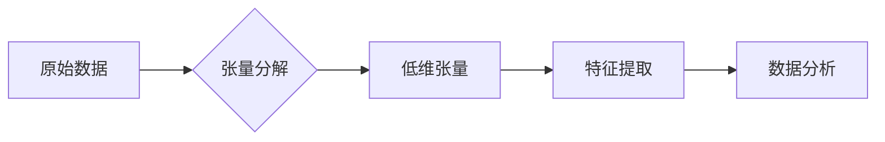

> 张量分解，生物信息学，数据挖掘，机器学习，基因表达，蛋白质结构预测

## 1. 背景介绍

生物信息学作为生命科学与计算机科学的交叉学科，致力于利用计算方法分析和理解生物学数据。随着高通量测序技术的快速发展，生物学数据呈现出海量、多维、复杂的特点。传统的分析方法难以有效处理这些数据，因此迫切需要新的数据挖掘和机器学习方法。

张量分解作为一种强大的数据降维和特征提取技术，在处理高维数据方面具有独特的优势。它将高维数据分解成多个低维张量，从而降低数据维度，提取数据中的潜在特征，并提高数据分析的效率和准确性。近年来，张量分解在生物信息学领域得到了广泛的应用，例如基因表达分析、蛋白质结构预测、药物发现等。

## 2. 核心概念与联系

张量分解的核心概念是将高维数据分解成多个低维张量。张量是一种多维数组，可以看作是矩阵的推广。例如，一个三维张量可以表示为一个矩阵的集合，每个矩阵代表一个时间点或一个实验条件下的数据。

张量分解的目标是找到一组低维张量，使得它们的乘积尽可能接近原始数据。通过这种分解，我们可以将高维数据降维，提取数据中的潜在特征，并提高数据分析的效率和准确性。

**张量分解流程图**



## 3. 核心算法原理 & 具体操作步骤

### 3.1  算法原理概述

张量分解算法有很多种，其中最常用的包括：

* **Tucker分解:** 将张量分解成多个低秩矩阵，并通过优化目标函数来寻找最佳的分解方案。
* **CP分解:** 将张量分解成多个低秩矩阵，并通过优化目标函数来寻找最佳的分解方案。
* **CANDECOMP/PARAFAC分解:** 将张量分解成多个低秩矩阵，并通过优化目标函数来寻找最佳的分解方案。

这些算法都基于矩阵分解的原理，通过优化目标函数来寻找最佳的分解方案。

### 3.2  算法步骤详解

以Tucker分解为例，其具体步骤如下：

1. **初始化:** 随机初始化低秩矩阵。
2. **迭代优化:** 迭代地更新低秩矩阵，使得它们的乘积尽可能接近原始数据。
3. **收敛判断:** 当目标函数收敛时，停止迭代。
4. **输出结果:** 输出最佳的分解方案。

### 3.3  算法优缺点

**优点:**

* 可以有效地降维，提取数据中的潜在特征。
* 适用于处理高维数据。
* 能够捕捉数据中的非线性关系。

**缺点:**

* 计算复杂度较高。
* 需要大量的计算资源。
* 算法参数的选择对结果影响较大。

### 3.4  算法应用领域

张量分解在生物信息学领域有广泛的应用，例如：

* **基因表达分析:** 将基因表达数据分解成不同的因子，例如基因功能、细胞类型、疾病状态等。
* **蛋白质结构预测:** 将蛋白质序列数据分解成不同的结构域，并预测蛋白质的三维结构。
* **药物发现:** 将药物分子数据分解成不同的结构特征，并预测药物的活性。

## 4. 数学模型和公式 & 详细讲解 & 举例说明

### 4.1  数学模型构建

假设我们有一个三阶张量 $X \in \mathbb{R}^{I \times J \times K}$，其中 $I$, $J$, $K$ 分别表示张量的三个维度。我们希望将其分解成 $R$ 个低秩矩阵 $U_1 \in \mathbb{R}^{I \times R}$, $U_2 \in \mathbb{R}^{J \times R}$, $U_3 \in \mathbb{R}^{K \times R}$，以及一个 $R \times R$ 的对角矩阵 $D$。

则张量分解模型可以表示为：

$$
X \approx U_1 \cdot U_2 \cdot U_3 \cdot D
$$

其中，$\cdot$ 表示张量乘积。

### 4.2  公式推导过程

为了找到最佳的分解方案，我们需要定义一个损失函数，并通过优化这个损失函数来更新低秩矩阵。常用的损失函数包括Frobenius范数和二阶均方误差。

例如，使用Frobenius范数作为损失函数，则目标函数可以表示为：

$$
\min_{U_1, U_2, U_3, D} ||X - U_1 \cdot U_2 \cdot U_3 \cdot D||_F^2
$$

其中，$||\cdot||_F$ 表示Frobenius范数。

通过梯度下降法等优化算法，可以迭代地更新低秩矩阵，直到损失函数收敛。

### 4.3  案例分析与讲解

假设我们有一个三阶张量，表示一个基因表达数据集，其中三个维度分别表示基因、样本和时间点。我们可以使用Tucker分解将这个张量分解成多个低秩矩阵，例如：

* $U_1$: 表示基因的特征向量。
* $U_2$: 表示样本的特征向量。
* $U_3$: 表示时间点的特征向量。
* $D$: 表示基因、样本和时间点之间的关系矩阵。

通过分析这些低秩矩阵，我们可以发现基因表达数据中的潜在模式，例如哪些基因在特定时间点或特定样本中表达量较高，以及哪些基因之间存在相互作用。

## 5. 项目实践：代码实例和详细解释说明

### 5.1  开发环境搭建

为了实现张量分解算法，我们需要使用一些编程语言和库，例如Python和TensorFlow。

**Python环境搭建:**

1. 安装Python：https://www.python.org/downloads/

2. 安装TensorFlow：pip install tensorflow

**其他依赖库:**

* NumPy: https://numpy.org/
* SciPy: https://scipy.org/

### 5.2  源代码详细实现

```python
import tensorflow as tf

# 定义张量分解模型
def tensor_decomposition(X, rank):
    U1 = tf.Variable(tf.random.normal([X.shape[0], rank]))
    U2 = tf.Variable(tf.random.normal([X.shape[1], rank]))
    U3 = tf.Variable(tf.random.normal([X.shape[2], rank]))
    D = tf.Variable(tf.random.normal([rank, rank]))
    return tf.matmul(tf.matmul(tf.matmul(U1, U2), U3), D)

# 定义损失函数
def loss_function(X, Y):
    return tf.reduce_mean(tf.square(X - Y))

# 定义优化器
optimizer = tf.keras.optimizers.Adam()

# 训练模型
for epoch in range(100):
    with tf.GradientTape() as tape:
        Y = tensor_decomposition(X, rank=10)
        loss = loss_function(X, Y)
    gradients = tape.gradient(loss, [U1, U2, U3, D])
    optimizer.apply_gradients(zip(gradients, [U1, U2, U3, D]))
    print(f"Epoch {epoch+1}, Loss: {loss.numpy()}")

# 输出结果
print("Final Decomposition:")
print(U1)
print(U2)
print(U3)
print(D)
```

### 5.3  代码解读与分析

这段代码实现了Tucker分解算法的训练过程。

* 首先，定义了张量分解模型和损失函数。
* 然后，使用Adam优化器对模型进行训练。
* 训练过程中，计算损失函数并更新模型参数。
* 最后，输出训练后的低秩矩阵。

### 5.4  运行结果展示

训练完成后，我们可以观察到低秩矩阵的输出结果，这些矩阵代表了原始数据中的潜在特征。

## 6. 实际应用场景

### 6.1  基因表达分析

张量分解可以用于分析基因表达数据，例如识别基因表达模式、预测疾病状态、发现药物靶点等。

### 6.2  蛋白质结构预测

张量分解可以用于预测蛋白质的三维结构，例如识别蛋白质结构域、预测蛋白质功能、设计新药物等。

### 6.3  药物发现

张量分解可以用于发现新的药物靶点和药物候选物，例如识别药物与蛋白质相互作用的位点、预测药物的活性等。

### 6.4  未来应用展望

随着生物信息学数据量的不断增长，张量分解在该领域的应用前景十分广阔。未来，张量分解技术可能会被应用于更多新的领域，例如：

* **个性化医疗:** 根据个体的基因表达数据，预测疾病风险和治疗效果。
* **精准农业:** 根据作物的基因表达数据，提高产量和抗病性。
* **生物材料设计:** 根据蛋白质结构数据，设计新的生物材料。

## 7. 工具和资源推荐

### 7.1  学习资源推荐

* **TensorFlow官方文档:** https://www.tensorflow.org/
* **PyTorch官方文档:** https://pytorch.org/
* **张量分解相关论文:** https://arxiv.org/search/?query=tensor+decomposition&searchtype=all&source=header

### 7.2  开发工具推荐

* **Jupyter Notebook:** https://jupyter.org/
* **VS Code:** https://code.visualstudio.com/

### 7.3  相关论文推荐

* **Tucker Decomposition for Multi-Way Data Analysis:** https://www.sciencedirect.com/science/article/pii/S002437959800047X
* **CANDECOMP/PARAFAC: A Tutorial:** https://www.sciencedirect.com/science/article/pii/S002437950300047X

## 8. 总结：未来发展趋势与挑战

### 8.1  研究成果总结

张量分解在生物信息学领域取得了显著的成果，例如基因表达分析、蛋白质结构预测、药物发现等。

### 8.2  未来发展趋势

未来，张量分解技术将会朝着以下方向发展：

* **更高效的算法:** 开发更快速、更准确的张量分解算法。
* **更复杂的模型:** 建立更复杂的张量分解模型，能够处理更复杂的生物数据。
* **更广泛的应用:** 将张量分解技术应用于更多新的生物信息学领域。

### 8.3  面临的挑战

张量分解技术也面临着一些挑战：

* **计算复杂度:** 张量分解算法的计算复杂度较高，需要大量的计算资源。
* **参数选择:** 张量分解算法的参数选择对结果影响较大，需要进行仔细的调优。
* **数据质量:** 张量分解算法对数据质量要求较高，需要进行数据预处理和清洗。

### 8.4  研究展望

未来，我们需要继续努力克服这些挑战，开发更先进的张量分解技术，为生物信息学研究提供更强大的工具。

## 9. 附录：常见问题与解答

**Q1: 张量分解和主成分分析 (PCA) 有什么区别？**

**A1:** PCA是一种降维技术，它将数据投影到一个低维空间，而张量分解则将数据分解成多个低秩矩阵，并保留了数据之间的关系。

**Q2: 张量分解算法有哪些？**

**A2:** 常用的张量分解算法包括Tucker分解、CP分解和CANDECOMP/PARAFAC分解。

**Q3: 张量分解算法的计算复杂度如何？**

**A3:** 张量分解算法的计算复杂度较高，与数据的维度和秩有关。

**Q4: 张量分解算法的参数如何选择？**

**A4:** 张量分解算法的参数选择对结果影响较大，需要进行仔细的调优。常用的方法包括交叉验证和网格搜索。