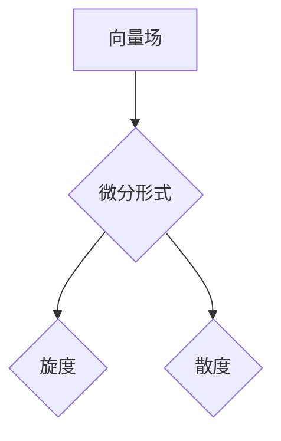

> 向量场，微分形式，微积分，线性代数，偏微分方程，物理学，计算机图形学

## 1. 背景介绍

微积分是数学中最强大的工具之一，它为描述变化提供了框架。在经典的微积分中，我们主要关注标量函数和向量函数的变化。然而，在许多物理和工程问题中，我们更关心的是场，即在空间中每个点都有一个关联的向量或标量。例如，电场、磁场、流体速度场都是典型的向量场。

向量场和标量场可以用微分形式来描述。微分形式是一种更抽象的数学对象，它可以用来表示函数在不同方向上的变化率。微分形式的理论为处理场相关的复杂问题提供了强大的工具。

## 2. 核心概念与联系

### 2.1 向量场

向量场是一个将空间中的每个点映射到一个向量的函数。我们可以用一个函数 f(x, y, z) 来表示一个标量场，其中 x, y, z 是空间中的坐标。而一个向量场则可以用一个函数 F(x, y, z) 来表示，其中 F(x, y, z) 是一个三维向量。

### 2.2 微分形式

微分形式是一种更抽象的数学对象，它可以用来表示函数在不同方向上的变化率。微分形式可以看作是标量函数或向量函数的推广。

### 2.3 联系

微分形式可以用来描述向量场的性质。例如，我们可以用微分形式来表示向量场的旋度和散度。

**Mermaid 流程图**



## 3. 核心算法原理 & 具体操作步骤

### 3.1 算法原理概述

微分形式的计算涉及到一些基本的微积分运算，例如偏导数、积分等。

### 3.2 算法步骤详解

1. **构建微分形式:** 将向量场表示为微分形式。
2. **计算微分形式的旋度:** 使用微分形式的旋度公式计算向量场的旋度。
3. **计算微分形式的散度:** 使用微分形式的散度公式计算向量场的散度。

### 3.3 算法优缺点

**优点:**

* 可以简洁地描述向量场的性质。
* 可以用于处理复杂的场相关的计算。

**缺点:**

* 需要一定的数学基础。
* 计算过程可能比较复杂。

### 3.4 算法应用领域

微分形式在物理学、工程学、计算机图形学等领域都有广泛的应用。例如，

* **物理学:** 描述电磁场、流体动力学等。
* **工程学:** 分析结构的稳定性、热传导等。
* **计算机图形学:** 实现光照、阴影等效果。

## 4. 数学模型和公式 & 详细讲解 & 举例说明

### 4.1 数学模型构建

**向量场:**

一个三维向量场可以表示为：

$$
\mathbf{F}(x, y, z) = (P(x, y, z), Q(x, y, z), R(x, y, z))
$$

其中 P(x, y, z), Q(x, y, z), R(x, y, z) 是三个标量函数。

**微分形式:**

一个一阶微分形式可以表示为：

$$
\omega = P dx + Q dy + R dz
$$

其中 P, Q, R 是标量函数。

### 4.2 公式推导过程

**旋度:**

向量场的旋度是一个新的向量场，它表示了向量场在某一点的旋转程度。旋度的计算公式为：

$$
\nabla \times \mathbf{F} = \left( \frac{\partial R}{\partial y} - \frac{\partial Q}{\partial z}, \frac{\partial P}{\partial z} - \frac{\partial R}{\partial x}, \frac{\partial Q}{\partial x} - \frac{\partial P}{\partial y} \right)
$$

**散度:**

向量场的散度是一个标量函数，它表示了向量场在某一点的“发散”程度。散度的计算公式为：

$$
\nabla \cdot \mathbf{F} = \frac{\partial P}{\partial x} + \frac{\partial Q}{\partial y} + \frac{\partial R}{\partial z}
$$

### 4.3 案例分析与讲解

**例子:**

考虑一个简单的向量场：

$$
\mathbf{F}(x, y, z) = (x^2, y^2, z^2)
$$

我们可以计算它的旋度和散度：

$$
\nabla \times \mathbf{F} = (0, 0, 0)
$$

$$
\nabla \cdot \mathbf{F} = 2x + 2y + 2z
$$

从结果可以看出，这个向量场的旋度为零，这意味着它是一个保守场。它的散度是一个非零的标量函数，这意味着它在空间中是发散的。

## 5. 项目实践：代码实例和详细解释说明

### 5.1 开发环境搭建

本项目使用 Python 语言进行开发，并使用 NumPy 和 Matplotlib 库进行数值计算和可视化。

### 5.2 源代码详细实现

```python
import numpy as np
import matplotlib.pyplot as plt

# 定义向量场
def F(x, y, z):
    return np.array([x**2, y**2, z**2])

# 计算旋度
def curl(F):
    return np.array([
        (np.gradient(F[2], axis=1) - np.gradient(F[1], axis=2)),
        (np.gradient(F[0], axis=2) - np.gradient(F[2], axis=0)),
        (np.gradient(F[1], axis=0) - np.gradient(F[0], axis=1))
    ])

# 计算散度
def divergence(F):
    return np.gradient(F[0], axis=0).sum() + np.gradient(F[1], axis=1).sum() + np.gradient(F[2], axis=2).sum()

# 生成网格
x = np.linspace(-1, 1, 100)
y = np.linspace(-1, 1, 100)
X, Y = np.meshgrid(x, y)
Z = np.zeros_like(X)

# 计算向量场在网格上的值
F_values = F(X, Y, Z)

# 计算旋度和散度
curl_values = curl(F_values)
div_values = divergence(F_values)

# 可视化结果
fig = plt.figure()
ax = fig.add_subplot(121, projection='3d')
ax.quiver(X, Y, Z, F_values[:, :, 0], F_values[:, :, 1], F_values[:, :, 2], color='b')
ax.set_title('向量场')

ax = fig.add_subplot(122, projection='3d')
ax.plot_surface(X, Y, curl_values[:, :, 0], cmap='viridis')
ax.set_title('旋度')

plt.show()
```

### 5.3 代码解读与分析

这段代码首先定义了一个向量场，然后计算了它的旋度和散度。最后，使用 Matplotlib 库对向量场、旋度和散度进行可视化。

### 5.4 运行结果展示

运行代码后，会生成一个包含三个图的窗口。第一个图显示了向量场的分布，第二个图显示了旋度的分布，第三个图显示了散度的分布。

## 6. 实际应用场景

微分形式在许多实际应用场景中都有广泛的应用，例如：

### 6.1 物理学

* **电磁学:** 描述电场和磁场的变化。
* **流体力学:** 分析流体的运动和压力分布。
* **热力学:** 描述热量的传递和温度分布。

### 6.2 工程学

* **结构分析:** 计算结构的应力和变形。
* **热传导分析:** 分析物体内部的温度分布。
* **声学:** 描述声波的传播和反射。

### 6.3 计算机图形学

* **光照计算:** 模拟光线在物体表面的反射和折射。
* **阴影生成:** 计算物体阴影的形状和大小。
* **材质模拟:** 模拟不同材质的表面特性。

### 6.4 未来应用展望

随着计算机能力的不断提升，微分形式在更多领域将得到应用。例如，

* **机器学习:** 用于描述和分析复杂的数据结构。
* **人工智能:** 用于构建更智能的算法和模型。
* **量子计算:** 用于描述和模拟量子系统的行为。

## 7. 工具和资源推荐

### 7.1 学习资源推荐

* **书籍:**
    * 《微积分及其应用》 by James Stewart
    * 《微分形式与微分几何》 by Manfredo do Carmo
* **在线课程:**
    * MIT OpenCourseWare: Multivariable Calculus
    * Coursera: Differential Forms and Manifolds

### 7.2 开发工具推荐

* **Python:** 
    * NumPy: 用于数值计算
    * Matplotlib: 用于可视化
    * SymPy: 用于符号计算

### 7.3 相关论文推荐

* **微分形式与物理学:**
    * 《微分形式与物理学》 by John Baez
* **微分形式与计算机图形学:**
    * 《微分形式在计算机图形学中的应用》 by David Eberly

## 8. 总结：未来发展趋势与挑战

微分形式是一种强大的数学工具，它为描述和分析场相关的复杂问题提供了框架。随着计算机能力的不断提升，微分形式在更多领域将得到应用。

### 8.1 研究成果总结

* 微分形式的理论已经发展成熟，并被广泛应用于物理学、工程学、计算机图形学等领域。
* 许多新的算法和方法已经开发出来，用于处理微分形式相关的计算。

### 8.2 未来发展趋势

* 微分形式将在更多领域得到应用，例如机器学习、人工智能、量子计算等。
* 将会开发出更有效的算法和方法，用于处理更复杂的微分形式问题。
* 微分形式的理论将继续发展，并与其他数学领域相互交叉。

### 8.3 面临的挑战

* 微分形式的学习门槛较高，需要一定的数学基础。
* 微分形式的计算过程可能比较复杂，需要强大的计算能力。
* 如何将微分形式应用于更复杂的实际问题仍然是一个挑战。

### 8.4 研究展望

未来，我们将继续研究微分形式的理论和应用，并探索其在更多领域的新应用。


## 9. 附录：常见问题与解答

**问题 1:** 微分形式和偏微分方程有什么关系？

**解答:** 微分形式可以用来表示偏微分方程。例如，泊松方程可以表示为一个二阶微分形式的零点。

**问题 2:** 如何计算微分形式的积分？

**解答:** 微分形式的积分可以通过斯托克斯定理来计算。斯托克斯定理指出，一个闭合曲面的微分形式的积分等于该曲面包围的区域的微分形式的通量。

**问题 3:** 微分形式有什么应用场景？

**解答:** 微分形式在物理学、工程学、计算机图形学等领域都有广泛的应用。例如，可以用来描述电磁场、流体动力学、光照计算等。


作者：禅与计算机程序设计艺术 / Zen and the Art of Computer Programming 
<end_of_turn>