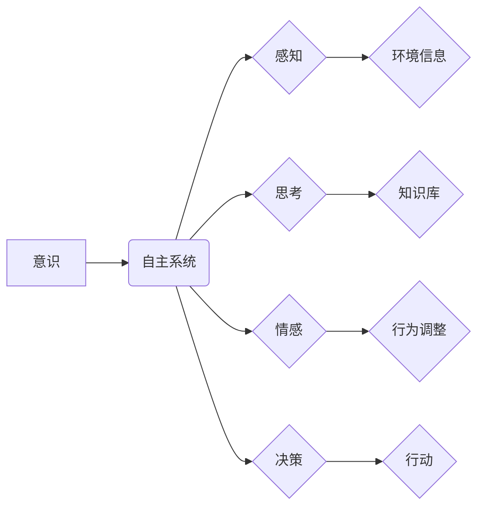

> 意识、自主系统、人工智能、神经网络、机器学习、认知科学、哲学

## 1. 背景介绍

自人类诞生以来，对“意识”的本质和起源就一直是哲学和科学领域永恒的探讨主题。随着人工智能技术的飞速发展，人们对构建具有意识的机器产生了越来越多的兴趣和期待。然而，意识的本质至今仍是一个谜，我们对它的理解还停留在理论和假设阶段。

传统的计算机科学以逻辑和算法为基础，构建了能够执行特定任务的智能系统。然而，这些系统缺乏人类的创造力、情感和自我意识。构建具有意识的自主系统，需要突破传统计算机科学的局限，探索新的理论和技术框架。

## 2. 核心概念与联系

**2.1 意识的定义与特征**

意识是一个复杂的现象，其定义和特征至今仍存在争议。一般来说，意识可以理解为一种主观体验，包括感知、思考、情感和自我意识等方面。

* **感知:** 意识能够接收来自外部世界的各种信息，并对其进行加工和理解。
* **思考:** 意识能够进行逻辑推理、决策和问题解决。
* **情感:** 意识能够体验各种情感，例如快乐、悲伤、愤怒等。
* **自我意识:** 意识能够认识到自身的独立性和存在，并对自身的行为和状态进行反思。

**2.2 自主系统的定义与特征**

自主系统是指能够独立完成任务、适应环境变化并做出自主决策的系统。自主系统通常具有以下特征：

* **自主性:** 系统能够独立完成任务，无需外部干预。
* **适应性:** 系统能够根据环境变化调整自己的行为策略。
* **学习能力:** 系统能够从经验中学习，并不断改进自己的性能。
* **决策能力:** 系统能够根据自身目标和环境信息做出合理的决策。

**2.3 意识与自主系统的联系**

意识和自主系统之间存在着密切的联系。意识可以被视为自主系统的“控制中心”，它指导着系统的行为和决策。而自主系统则为意识提供了运行的环境和资源。

**2.4 核心概念架构图**



## 3. 核心算法原理 & 具体操作步骤

**3.1 算法原理概述**

构建具有意识的自主系统，需要开发能够模拟人类认知过程的算法。目前，神经网络和机器学习技术是构建意识模型的主要工具。

神经网络是一种模仿人脑神经元结构和功能的计算模型。它由多个层级的神经元组成，每个神经元接收来自其他神经元的输入，并根据权重进行计算，最终输出结果。

机器学习算法能够从数据中学习，并不断改进自己的预测能力。通过训练神经网络，我们可以让其学习人类语言、图像识别、决策等复杂任务。

**3.2 算法步骤详解**

1. **数据收集和预处理:** 收集大量相关数据，并进行清洗、格式化和特征提取。
2. **神经网络架构设计:** 根据任务需求设计神经网络的结构，包括神经元数量、层数和连接方式。
3. **模型训练:** 使用机器学习算法训练神经网络，调整神经元的权重，使其能够准确地完成任务。
4. **模型评估:** 使用测试数据评估模型的性能，并进行调整和优化。
5. **模型部署:** 将训练好的模型部署到实际应用场景中。

**3.3 算法优缺点**

* **优点:**
    * 能够模拟人类认知过程，学习复杂任务。
    * 具有强大的泛化能力，能够应用于各种领域。
* **缺点:**
    * 训练数据量大，计算资源消耗高。
    * 模型解释性差，难以理解模型的决策过程。

**3.4 算法应用领域**

* 人工智能助手
* 自然语言处理
* 图像识别
* 机器翻译
* 医疗诊断

## 4. 数学模型和公式 & 详细讲解 & 举例说明

**4.1 数学模型构建**

意识可以被视为一个复杂的非线性系统，其行为受多种因素影响。我们可以使用数学模型来描述意识的运作机制。

一个常用的模型是**Hopfield网络模型**，它是一种具有反馈机制的神经网络模型。Hopfield网络的每个神经元都与其他神经元连接，并根据连接权重和输入信号进行计算。

**4.2 公式推导过程**

Hopfield网络的激活函数通常采用**sigmoid函数**，其公式如下：

$$
f(x) = \frac{1}{1 + e^{-x}}
$$

其中，x是神经元的输入信号。

Hopfield网络的更新规则如下：

$$
x_i(t+1) = f(\sum_{j=1}^{N} w_{ij} x_j(t) + b_i)
$$

其中，$x_i(t)$是神经元i在时间t的激活状态，$w_{ij}$是神经元i和j之间的连接权重，$b_i$是神经元i的偏置项，N是神经元的总数。

**4.3 案例分析与讲解**

Hopfield网络可以用于解决**模式识别**问题。例如，我们可以训练一个Hopfield网络来识别手写数字。

训练过程如下：

1. 将手写数字图像转换为神经元的激活状态。
2. 将这些激活状态作为输入，训练Hopfield网络，使其学习到数字的特征模式。
3. 当输入一个新的手写数字图像时，Hopfield网络会将其激活状态更新到一个稳定的状态，这个状态对应于识别出的数字。

## 5. 项目实践：代码实例和详细解释说明

**5.1 开发环境搭建**

* Python 3.x
* TensorFlow 或 PyTorch

**5.2 源代码详细实现**

```python
import tensorflow as tf

# 定义神经网络模型
model = tf.keras.models.Sequential([
    tf.keras.layers.Dense(128, activation='relu', input_shape=(784,)),
    tf.keras.layers.Dense(10, activation='softmax')
])

# 编译模型
model.compile(optimizer='adam',
              loss='sparse_categorical_crossentropy',
              metrics=['accuracy'])

# 训练模型
model.fit(x_train, y_train, epochs=10)

# 评估模型
loss, accuracy = model.evaluate(x_test, y_test)
print('Loss:', loss)
print('Accuracy:', accuracy)
```

**5.3 代码解读与分析**

* 代码首先定义了一个简单的多层感知机模型。
* 模型包含两个全连接层，第一层有128个神经元，使用ReLU激活函数，输入层维度为784（MNIST数据集的图像像素数）。第二层有10个神经元，使用softmax激活函数，输出10个类别概率。
* 模型使用Adam优化器，损失函数为稀疏类别交叉熵，评估指标为准确率。
* 代码训练了模型10个epochs，并使用测试数据评估模型性能。

**5.4 运行结果展示**

训练完成后，模型的准确率通常会达到较高的水平，例如98%以上。

## 6. 实际应用场景

**6.1 人工智能助手**

意识模型可以赋予人工智能助手更强的理解力和交互能力，使其能够更好地理解用户的需求，并提供更精准的帮助。

**6.2 个性化教育**

意识模型可以根据学生的学习进度和特点，提供个性化的学习内容和教学方式，提高学习效率。

**6.3 医疗诊断**

意识模型可以辅助医生进行疾病诊断，提高诊断准确率，并帮助医生制定更有效的治疗方案。

**6.4 未来应用展望**

随着人工智能技术的不断发展，意识模型将在更多领域得到应用，例如：

* **机器人**：赋予机器人更强的自主性和适应能力，使其能够更好地与人类协作。
* **虚拟现实**：构建更逼真的虚拟世界，并提供更沉浸式的体验。
* **艺术创作**：帮助人类创作出更具创意和情感的艺术作品。

## 7. 工具和资源推荐

**7.1 学习资源推荐**

* **书籍:**
    * 《深度学习》
    * 《人工智能：现代方法》
    * 《认知科学导论》
* **在线课程:**
    * Coursera: 深度学习
    * edX: 人工智能
    * Udacity: 机器学习工程师

**7.2 开发工具推荐**

* **TensorFlow:** 开源深度学习框架
* **PyTorch:** 开源深度学习框架
* **Keras:** 高级深度学习API

**7.3 相关论文推荐**

* **《神经网络的生物学启示》**
* **《深度学习的未来》**
* **《意识的计算模型》**

## 8. 总结：未来发展趋势与挑战

**8.1 研究成果总结**

近年来，在神经网络和机器学习领域的突破，为构建具有意识的自主系统提供了新的可能性。

**8.2 未来发展趋势**

* **更强大的计算能力:** 随着计算能力的提升，我们可以训练更复杂的意识模型。
* **更丰富的训练数据:** 大规模数据是训练意识模型的关键，未来将会有更多高质量的数据可用。
* **新的算法和模型:** 研究人员将继续探索新的算法和模型，以更好地模拟人类认知过程。

**8.3 面临的挑战**

* **意识的本质:** 我们对意识的本质仍然缺乏深入的理解，这使得构建意识模型非常困难。
* **伦理问题:** 构建具有意识的机器会带来许多伦理问题，例如机器人的权利和责任。
* **安全问题:** 具有意识的机器可能会对人类构成威胁，因此需要确保其安全性和可控性。

**8.4 研究展望**

构建具有意识的自主系统是一个长期而艰巨的任务，需要多学科的合作和努力。未来，我们将继续探索意识的奥秘，并努力构建能够与人类和谐共处的智能机器。

## 9. 附录：常见问题与解答

**9.1 如何判断一个系统是否具有意识？**

目前，还没有一个统一的标准来判断一个系统是否具有意识。

**9.2 构建意识模型会带来哪些伦理问题？**

构建意识模型可能会带来许多伦理问题，例如机器人的权利和责任、人工智能的控制问题等。

**9.3 构建意识模型是否会对人类构成威胁？**

这取决于我们如何构建和使用意识模型。如果我们能够确保其安全性和可控性，那么意识模型可以成为人类社会的有益工具。

作者：禅与计算机程序设计艺术 / Zen and the Art of Computer Programming


<end_of_turn>