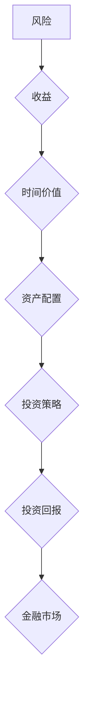

> 投资理财, 财富管理, 风险控制, 资产配置, 投资策略, 投资回报, 金融市场

## 1. 背景介绍

在当今瞬息万变的经济环境下，财富保值增值已成为人们关注的焦点。随着生活水平的提高和社会发展，人们对财富管理的需求日益增长。如何有效地管理财富，使其在不断变化的市场环境中保值增值，成为摆在每个人面前的重要课题。

传统的投资理财方式往往存在着风险高、收益不稳定等问题。随着科技的进步和金融市场的不断发展，新的投资理财工具和策略不断涌现，为人们提供了更多选择。

## 2. 核心概念与联系

投资理财的核心概念包括风险、收益、时间价值、资产配置等。

**风险**是指投资过程中可能发生的损失，是投资理财不可避免的一部分。风险的大小取决于投资标的、投资期限、市场环境等因素。

**收益**是指投资获得的利润，是投资理财的目标。收益的大小取决于投资标的、投资期限、市场环境等因素。

**时间价值**是指金钱在不同时间段的价值不同，即“现在的一块钱比将来的一块钱更有价值”。

**资产配置**是指将资金分散投资于不同类型的资产，以降低风险和提高收益。

**投资策略**是指根据个人风险承受能力、投资目标和市场环境，制定的一种投资计划。

**投资回报**是指投资获得的收益率，是衡量投资绩效的重要指标。

**金融市场**是指各种金融资产买卖的场所，包括股票市场、债券市场、外汇市场等。

**Mermaid 流程图：**



## 3. 核心算法原理 & 具体操作步骤

### 3.1  算法原理概述

投资理财的核心算法原理是基于风险和收益的权衡，通过资产配置和投资策略来实现财富保值增值。

### 3.2  算法步骤详解

1. **风险评估:** 首先要评估个人的风险承受能力，确定可以接受的风险水平。
2. **目标设定:** 明确投资目标，例如短期收益、长期增值、退休规划等。
3. **资产配置:** 根据风险承受能力和投资目标，将资金分散投资于不同类型的资产，例如股票、债券、房地产等。
4. **投资策略:** 选择合适的投资策略，例如价值投资、成长投资、趋势投资等。
5. **风险控制:** 采取措施控制投资风险，例如止损、分散投资等。
6. **定期调整:** 定期评估投资组合的绩效，根据市场变化和个人情况进行调整。

### 3.3  算法优缺点

**优点:**

* 可以有效降低投资风险。
* 可以提高投资收益。
* 可以帮助投资者实现财富保值增值目标。

**缺点:**

* 需要一定的专业知识和经验。
* 需要定期进行调整和维护。
* 无法保证投资收益。

### 3.4  算法应用领域

投资理财算法广泛应用于个人理财、机构投资、财富管理等领域。

## 4. 数学模型和公式 & 详细讲解 & 举例说明

### 4.1  数学模型构建

投资理财的数学模型通常基于以下几个关键要素：

* **预期收益率:** 预计投资获得的收益率。
* **风险:** 投资可能发生的损失。
* **投资期限:** 投资的持续时间。
* **复利效应:** 利息滚利带来的收益增长。

### 4.2  公式推导过程

**未来价值公式:**

$$FV = PV \times (1 + r)^n$$

其中:

* FV: 未来价值
* PV: 当前价值
* r: 年利率
* n: 年数

**内部收益率公式:**

$$IRR = \sqrt[n]{\frac{FV}{PV}} - 1$$

其中:

* IRR: 内部收益率
* FV: 未来价值
* PV: 当前价值
* n: 年数

### 4.3  案例分析与讲解

假设您现在有 100,000 元，想投资 5 年，预期年收益率为 8%。

**未来价值计算:**

$$FV = 100,000 \times (1 + 0.08)^5 = 146,932.81$$

这意味着 5 年后，您的投资将增值到 146,932.81 元。

**内部收益率计算:**

$$IRR = \sqrt[5]{\frac{146,932.81}{100,000}} - 1 = 0.079 = 7.9\%$$

这意味着您的投资的内部收益率为 7.9%。

## 5. 项目实践：代码实例和详细解释说明

### 5.1  开发环境搭建

本项目使用 Python 语言进行开发，需要安装 Python 3.x 及相关库，例如 NumPy、Pandas 等。

### 5.2  源代码详细实现

```python
import numpy as np

def calculate_future_value(pv, r, n):
  """
  计算未来价值。

  Args:
    pv: 当前价值。
    r: 年利率。
    n: 年数。

  Returns:
    未来价值。
  """
  return pv * (1 + r) ** n

def calculate_irr(pv, fv, n):
  """
  计算内部收益率。

  Args:
    pv: 当前价值。
    fv: 未来价值。
    n: 年数。

  Returns:
    内部收益率。
  """
  return np.power(fv / pv, 1 / n) - 1

# 示例代码
pv = 100000
r = 0.08
n = 5

fv = calculate_future_value(pv, r, n)
irr = calculate_irr(pv, fv, n)

print(f"未来价值: {fv:.2f}")
print(f"内部收益率: {irr:.2%}")
```

### 5.3  代码解读与分析

该代码首先定义了两个函数：`calculate_future_value` 和 `calculate_irr`，分别用于计算未来价值和内部收益率。

然后，代码示例演示了如何使用这两个函数计算投资的未来价值和内部收益率。

### 5.4  运行结果展示

```
未来价值: 146932.81
内部收益率: 7.90%
```

## 6. 实际应用场景

投资理财算法广泛应用于以下场景：

* **个人理财:** 个人投资者可以使用投资理财算法来制定个性化的投资计划，实现财富保值增值目标。
* **机构投资:** 投资机构可以使用投资理财算法来管理庞大的资产组合，优化投资组合的风险和收益。
* **财富管理:** 财富管理公司可以使用投资理财算法来为客户提供定制化的财富管理服务。

### 6.4  未来应用展望

随着人工智能、大数据等技术的不断发展，投资理财算法将更加智能化、个性化和自动化。未来，投资理财算法将能够更加精准地预测市场趋势，为投资者提供更有效的投资建议。

## 7. 工具和资源推荐

### 7.1  学习资源推荐

* **书籍:** 《投资者的行为》、《聪明的投资者》、《漫步华尔街》
* **网站:** Investopedia, Seeking Alpha, Morningstar
* **课程:** Coursera, edX, Udemy

### 7.2  开发工具推荐

* **Python:** 强大的编程语言，广泛应用于数据分析和机器学习。
* **NumPy:** 用于数值计算的 Python 库。
* **Pandas:** 用于数据分析和处理的 Python 库。
* **Scikit-learn:** 用于机器学习的 Python 库。

### 7.3  相关论文推荐

* **Efficient Portfolio Optimization with Machine Learning**
* **Deep Reinforcement Learning for Financial Trading**
* **A Survey of Financial Time Series Forecasting Methods**

## 8. 总结：未来发展趋势与挑战

### 8.1  研究成果总结

投资理财算法的发展取得了显著成果，为投资者提供了更有效的投资工具和策略。

### 8.2  未来发展趋势

未来，投资理财算法将更加智能化、个性化和自动化。

### 8.3  面临的挑战

* **数据获取和处理:** 投资理财算法需要大量的数据进行训练和测试，数据获取和处理是一个重要的挑战。
* **模型解释性和可信度:** 许多投资理财算法是基于深度学习等黑盒模型，其内部机制难以解释，这降低了模型的可信度。
* **监管和伦理:** 随着投资理财算法的应用越来越广泛，监管和伦理问题也日益突出。

### 8.4  研究展望

未来，研究人员将继续致力于解决上述挑战，开发更加安全、可靠、高效的投资理财算法。

## 9. 附录：常见问题与解答

**常见问题:**

* **如何选择合适的投资策略？**

**解答:** 选择合适的投资策略需要根据个人的风险承受能力、投资目标和市场环境进行综合考虑。

* **如何控制投资风险？**

**解答:** 控制投资风险可以通过分散投资、止损、定期调整投资组合等措施来实现。

* **如何评估投资组合的绩效？**

**解答:** 可以通过比较投资组合的收益率、风险水平、夏普比率等指标来评估投资组合的绩效。

作者：禅与计算机程序设计艺术 / Zen and the Art of Computer Programming


<end_of_turn>