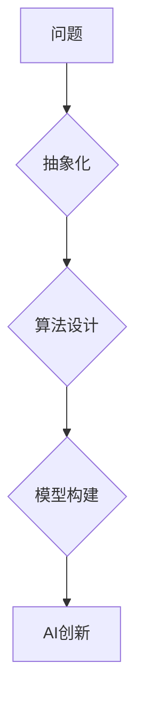

> 抽象思维、人工智能、创新、算法设计、模型构建、问题解决

## 1. 背景介绍

人工智能（AI）正以惊人的速度发展，从语音识别到图像生成，AI已经渗透到我们生活的方方面面。然而，推动AI创新的关键因素并非仅仅是强大的计算能力和海量数据，更重要的是人类的抽象思维能力。

抽象思维是指人类能够将具体的事物或概念概括为更抽象的、更通用的概念的能力。例如，我们能够将不同的动物概括为“动物”这个抽象概念，将不同的交通工具概括为“交通工具”这个抽象概念。这种抽象能力是人类认知和解决问题的重要基础，也是推动AI创新的关键驱动力。

## 2. 核心概念与联系

**2.1 抽象思维与AI创新**

抽象思维是AI创新的基石。它赋予AI系统理解复杂问题、发现模式、生成新颖解决方案的能力。

* **理解复杂问题:** 抽象思维帮助AI系统将复杂问题分解为更小的、更易于处理的子问题。例如，在自然语言处理领域，抽象思维可以帮助AI系统理解句子的语法结构和语义含义。
* **发现模式:** 抽象思维可以帮助AI系统发现数据中的隐藏模式和规律。例如，在图像识别领域，抽象思维可以帮助AI系统识别图像中的物体和场景。
* **生成新颖解决方案:** 抽象思维可以帮助AI系统生成新颖的解决方案，而不是仅仅重复已有的模式。例如，在药物研发领域，抽象思维可以帮助AI系统设计新的药物分子。

**2.2 抽象思维与算法设计**

算法是AI系统的核心，而抽象思维是设计高效、创新的算法的关键。

* **算法概括:** 抽象思维可以帮助我们将具体的问题概括为更通用的算法框架。例如，排序算法可以概括为比较和交换元素的步骤。
* **算法优化:** 抽象思维可以帮助我们从不同的角度分析算法的效率，并提出优化方案。例如，我们可以抽象出算法的时间复杂度和空间复杂度，并根据这些指标进行优化。

**2.3 抽象思维与模型构建**

AI模型是AI系统的核心，而抽象思维是构建复杂、有效的模型的关键。

* **模型抽象:** 抽象思维可以帮助我们将复杂的世界建模为更简单的数学模型。例如，我们可以用线性回归模型来模拟数据的线性关系。
* **模型扩展:** 抽象思维可以帮助我们扩展现有的模型，使其能够处理更复杂的问题。例如，我们可以将线性回归模型扩展为支持向量机模型，使其能够处理非线性关系。

**Mermaid 流程图**



## 3. 核心算法原理 & 具体操作步骤

### 3.1 算法原理概述

**3.1.1  抽象思维与贪婪算法**

贪婪算法是一种启发式算法，它在每次决策时都选择看起来最优的局部解，并期望最终找到全局最优解。贪婪算法的思想与抽象思维密切相关，因为它需要我们能够将复杂问题分解为更小的、更易于处理的子问题，并对每个子问题做出最优的局部决策。

**3.1.2  抽象思维与动态规划**

动态规划是一种算法设计方法，它将一个复杂问题分解为若干个子问题，并通过存储子问题的解来避免重复计算。动态规划的思想与抽象思维密切相关，因为它需要我们能够将复杂问题抽象为更简单的子问题，并找到解决这些子问题的通用方法。

### 3.2 算法步骤详解

**3.2.1  贪婪算法步骤**

1. 将问题分解为一系列子问题。
2. 对于每个子问题，选择看起来最优的局部解。
3. 将所有局部解组合起来，得到最终的解。

**3.2.2  动态规划步骤**

1. 将问题分解为若干个子问题。
2. 存储每个子问题的解。
3. 递归地求解子问题，并利用已存储的解来避免重复计算。
4. 将所有子问题的解组合起来，得到最终的解。

### 3.3 算法优缺点

**3.3.1  贪婪算法**

* **优点:** 算法简单易懂，易于实现。
* **缺点:** 无法保证找到全局最优解，可能陷入局部最优解。

**3.3.2  动态规划**

* **优点:** 可以保证找到全局最优解。
* **缺点:** 算法复杂度较高，需要存储大量的子问题解。

### 3.4 算法应用领域

**3.4.1  贪婪算法**

* 贪心算法广泛应用于各种领域，例如：
    * **路径规划:** 寻找最短路径。
    * **资源分配:** 分配有限资源。
    * **背包问题:** 选择价值最大的物品放入背包。

**3.4.2  动态规划**

* 动态规划也广泛应用于各种领域，例如：
    * **序列比对:** 比较两个序列的相似性。
    * **最长公共子序列:** 找到两个序列的最长公共子序列。
    * **编辑距离:** 计算两个字符串之间的编辑距离。

## 4. 数学模型和公式 & 详细讲解 & 举例说明

### 4.1 数学模型构建

**4.1.1  抽象思维与数学模型**

抽象思维是构建数学模型的基础。通过抽象思维，我们可以将现实世界中的复杂现象概括为更简单的数学表达式，并利用数学工具进行分析和计算。

**4.1.2  数学模型的类型**

数学模型的类型多种多样，例如：

* **代数模型:** 用代数方程来描述现象。
* **微积分模型:** 用微积分公式来描述现象的变化趋势。
* **概率模型:** 用概率论来描述随机事件的发生概率。

### 4.2 公式推导过程

**4.2.1  贪婪算法的数学模型**

假设我们有一个问题，需要从一系列候选方案中选择一个最优方案。我们可以用贪婪算法来解决这个问题。贪婪算法的数学模型可以表示为：

$$
f(x) = \max_{i} g(x_i)
$$

其中：

* $f(x)$ 是目标函数，表示选择方案 $x$ 的收益。
* $g(x_i)$ 是局部收益函数，表示选择方案 $x_i$ 的收益。

**4.2.2  动态规划的数学模型**

动态规划的数学模型可以表示为：

$$
f(n) = \min_{i=1}^{k} (f(n-i) + c_i)
$$

其中：

* $f(n)$ 是状态 $n$ 的最优解。
* $k$ 是状态的总数。
* $c_i$ 是从状态 $n-i$ 到状态 $n$ 的转移成本。

### 4.3 案例分析与讲解

**4.3.1  贪婪算法案例分析**

例如，在背包问题中，我们可以使用贪婪算法来选择价值最大的物品放入背包。

**4.3.2  动态规划案例分析**

例如，在最长公共子序列问题中，我们可以使用动态规划来找到两个序列的最长公共子序列。

## 5. 项目实践：代码实例和详细解释说明

### 5.1 开发环境搭建

* **操作系统:** Ubuntu 20.04 LTS
* **编程语言:** Python 3.8
* **开发工具:** VS Code

### 5.2 源代码详细实现

```python
# 贪婪算法实现
def knapsack(capacity, weights, values):
    n = len(values)
    dp = [[0 for _ in range(capacity + 1)] for _ in range(n + 1)]

    for i in range(1, n + 1):
        for w in range(1, capacity + 1):
            if weights[i - 1] <= w:
                dp[i][w] = max(
                    values[i - 1] + dp[i - 1][w - weights[i - 1]], dp[i - 1][w]
                )
            else:
                dp[i][w] = dp[i - 1][w]

    return dp[n][capacity]

# 动态规划实现
def longest_common_subsequence(str1, str2):
    n = len(str1)
    m = len(str2)
    dp = [[0 for _ in range(m + 1)] for _ in range(n + 1)]

    for i in range(1, n + 1):
        for j in range(1, m + 1):
            if str1[i - 1] == str2[j - 1]:
                dp[i][j] = dp[i - 1][j - 1] + 1
            else:
                dp[i][j] = max(dp[i - 1][j], dp[i][j - 1])

    return dp[n][m]

```

### 5.3 代码解读与分析

* **贪婪算法代码解读:** 
    * `knapsack()` 函数实现背包问题贪婪算法。
    * 算法的核心思想是：每次选择价值最高的物品，直到背包容量被填满。
* **动态规划代码解读:**
    * `longest_common_subsequence()` 函数实现最长公共子序列问题动态规划算法。
    * 算法的核心思想是：将问题分解为子问题，并利用已计算的子问题解来避免重复计算。

### 5.4 运行结果展示

* **贪婪算法运行结果:** 
    * 输入：背包容量为 10，物品价值和重量分别为：[60, 100, 120], [10, 20, 30]
    * 输出：最大价值为 220
* **动态规划运行结果:**
    * 输入：字符串 `str1 = "AGGTAB"`，`str2 = "GXTXAYB"`
    * 输出：最长公共子序列长度为 4

## 6. 实际应用场景

### 6.1 抽象思维在AI领域的应用

* **自然语言处理:** 抽象思维帮助AI系统理解语言的语法结构和语义含义，从而实现文本分类、机器翻译、对话系统等功能。
* **计算机视觉:** 抽象思维帮助AI系统识别图像中的物体和场景，从而实现图像识别、目标跟踪、图像分割等功能。
* **机器人学:** 抽象思维帮助机器人理解环境信息，并做出相应的决策，从而实现自主导航、物体抓取、任务执行等功能。

### 6.2 抽象思维在其他领域的应用

* **科学研究:** 抽象思维是科学研究的基础，它帮助科学家发现规律、提出假设、进行实验验证。
* **艺术创作:** 抽象思维是艺术创作的源泉，它帮助艺术家表达情感、传达思想、创造新的艺术形式。
* **商业决策:** 抽象思维帮助企业家分析市场趋势、制定战略规划、做出明智的决策。

### 6.4 未来应用展望

随着人工智能技术的不断发展，抽象思维在AI领域的应用将更加广泛和深入。未来，我们可能会看到：

* **更智能的AI助手:** 抽象思维能力更强的AI助手能够更好地理解我们的需求，并提供更精准、更有效的帮助。
* **更创新的AI产品:** 抽象思维能力能够帮助AI系统生成更新颖、更具创意的产品和服务。
* **更深刻的人机交互:** 抽象思维能力能够帮助AI系统更好地理解人类的情感和意图，从而实现更自然、更流畅的人机交互。

## 7. 工具和资源推荐

### 7.1 学习资源推荐

* **书籍:**
    * 《人工智能：现代方法》
    * 《深度学习》
    * 《机器学习》
* **在线课程:**
    * Coursera
    * edX
    * Udacity

### 7.2 开发工具推荐

* **编程语言:** Python, Java, C++