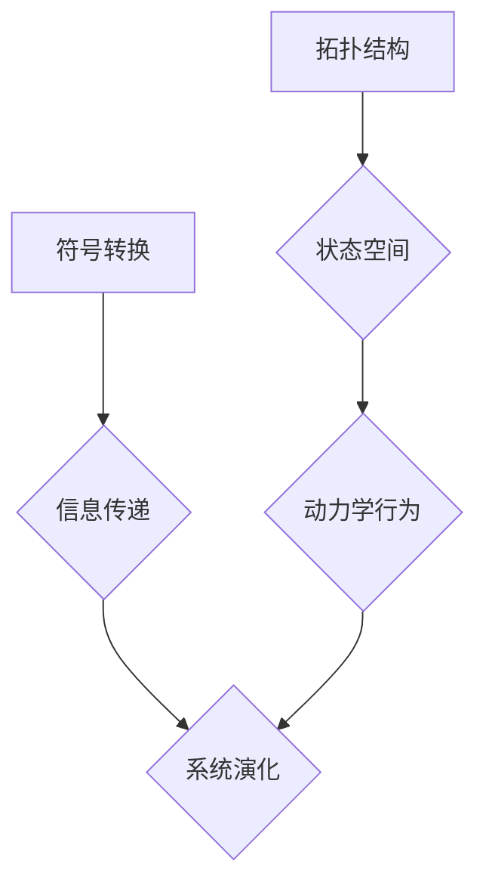

> 拓扑动力学，符号动力学，非线性动力学，混沌理论，复杂系统，信息处理，人工智能

## 1. 背景介绍

在信息时代，我们所处的世界呈现出越来越复杂的特征。从自然界到社会系统，从经济发展到科技进步，无处不在涌现着非线性、自组织、反馈等复杂现象。理解和预测这些复杂系统的行为，是当今科学和技术发展的重要课题。

拓扑动力学和符号动力学作为研究复杂系统动力学行为的两个重要分支，为我们提供了独特的视角和工具。拓扑动力学关注系统状态空间的拓扑结构，揭示系统行为的本质规律；符号动力学则从符号和信息处理的角度出发，研究系统如何通过符号转换和信息传递来演化和发展。

## 2. 核心概念与联系

**2.1 拓扑动力学**

拓扑动力学研究的是系统状态空间的拓扑结构及其对系统动力学行为的影响。它关注系统状态的连通性、环路、分叉点等拓扑性质，而非具体的数值特征。

**2.2 符号动力学**

符号动力学研究的是系统通过符号转换和信息传递来演化和发展的过程。它将系统看作一个符号系统，并用符号代数、逻辑和计算模型来描述系统的行为。

**2.3 联系**

拓扑动力学和符号动力学之间存在着密切的联系。拓扑动力学可以为符号动力学提供系统的状态空间结构，而符号动力学可以为拓扑动力学提供系统的行为规则和信息传递机制。

**2.3.1  Mermaid 流程图**



## 3. 核心算法原理 & 具体操作步骤

**3.1 算法原理概述**

拓扑动力学和符号动力学中常用的算法包括：

* **Lyapunov Exponent:** 用于衡量系统的混沌程度。
* **Bifurcation Analysis:** 用于研究系统在参数变化下的行为变化。
* **Symbolic Dynamics:** 用于将系统的连续动力学行为转化为符号序列。
* **Cellular Automata:** 用于模拟局部规则导致全局复杂行为的系统。

**3.2 算法步骤详解**

具体算法的步骤取决于具体的应用场景。例如，计算Lyapunov Exponent的步骤如下：

1. 选择一个初始状态。
2. 对系统进行数值模拟，记录状态随时间的变化。
3. 计算状态之间的距离变化率，并取其平均值。
4. 统计多个初始状态的平均值，得到Lyapunov Exponent。

**3.3 算法优缺点**

不同的算法具有不同的优缺点。例如，Lyapunov Exponent可以有效地衡量系统的混沌程度，但计算复杂度较高。Symbolic Dynamics可以将连续动力学行为转化为符号序列，方便分析和理解，但需要对系统进行符号化处理。

**3.4 算法应用领域**

拓扑动力学和符号动力学在许多领域都有广泛的应用，例如：

* **天气预报:** 研究大气动力学系统，提高天气预报的准确性。
* **金融市场预测:** 分析金融市场波动，预测市场趋势。
* **生物系统建模:** 研究生物系统的动力学行为，例如神经网络和免疫系统。
* **人工智能:** 研究智能体的学习和决策机制。

## 4. 数学模型和公式 & 详细讲解 & 举例说明

**4.1 数学模型构建**

拓扑动力学和符号动力学都依赖于数学模型来描述系统的行为。常见的数学模型包括：

* **微分方程:** 用于描述连续动力系统的演化。
* **差分方程:** 用于描述离散动力系统的演化。
* **图论:** 用于描述系统的拓扑结构。
* **符号代数:** 用于描述符号转换和信息传递。

**4.2 公式推导过程**

例如，一个简单的微分方程模型可以描述一个振荡系统：

$$
\frac{d^2x}{dt^2} + \omega^2x = 0
$$

其中，$x$ 是系统的位移，$t$ 是时间，$\omega$ 是系统的固有频率。

通过求解这个微分方程，我们可以得到系统的振动周期和振幅。

**4.3 案例分析与讲解**

例如，我们可以用拓扑动力学来分析双摆系统的行为。双摆系统是一个典型的混沌系统，其动力学行为非常复杂。通过分析双摆系统的状态空间拓扑结构，我们可以发现其存在分叉点和混沌吸引子，从而理解其混沌行为的本质。

## 5. 项目实践：代码实例和详细解释说明

**5.1 开发环境搭建**

可以使用Python语言和相关的库来实现拓扑动力学和符号动力学算法。例如，可以使用NumPy库进行数值计算，Matplotlib库进行可视化，SymPy库进行符号计算。

**5.2 源代码详细实现**

```python
import numpy as np
import matplotlib.pyplot as plt

# 定义双摆系统的微分方程
def double_pendulum(y, t, params):
    theta1, theta2, omega1, omega2 = y
    l1, l2, g = params
    dtheta1dt = omega1
    dtheta2dt = omega2
    domega1dt = (-g/l1 * np.sin(theta1) - g/l2 * np.sin(theta2) - (l2/l1) * omega2**2 * np.sin(theta1 - theta2))
    domega2dt = (g/l2 * np.sin(theta2) + (l1/l2) * omega1**2 * np.sin(theta1 - theta2) - (l1/l2) * domega1dt)
    return [dtheta1dt, dtheta2dt, domega1dt, domega2dt]

# 设置系统参数
l1 = 1.0
l2 = 1.0
g = 9.81

# 设置初始条件
y0 = [np.pi/2, np.pi/2, 0, 0]

# 设置时间步长
dt = 0.01

# 设置模拟时间
t_end = 10

# 使用数值积分方法求解微分方程
t = np.arange(0, t_end, dt)
y = odeint(double_pendulum, y0, t, args=(l1, l2, g))

# 可视化双摆系统运动轨迹
plt.plot(y[:, 0], y[:, 1])
plt.xlabel('theta1')
plt.ylabel('theta2')
plt.title('Double Pendulum Motion')
plt.show()
```

**5.3 代码解读与分析**

这段代码实现了双摆系统的数值模拟。首先，定义了双摆系统的微分方程，然后设置了系统参数和初始条件。接着，使用`odeint`函数进行数值积分，求解微分方程。最后，使用`matplotlib`库绘制双摆系统的运动轨迹。

**5.4 运行结果展示**

运行这段代码后，会生成一个双摆系统的运动轨迹图。从图中可以看出，双摆系统的运动轨迹非常复杂，呈现出混沌的特征。

## 6. 实际应用场景

**6.1 天气预报**

拓扑动力学和符号动力学可以用于分析大气动力学系统，提高天气预报的准确性。例如，可以利用Lyapunov Exponent来衡量天气系统的混沌程度，从而判断天气预报的可靠性。

**6.2 金融市场预测**

金融市场波动是一个典型的复杂系统，其行为受到多种因素的影响。拓扑动力学和符号动力学可以用于分析金融市场数据，识别市场趋势和风险。例如，可以利用Bifurcation Analysis来研究金融市场在参数变化下的行为变化，从而预测市场趋势。

**6.3 生物系统建模**

生物系统是一个高度复杂的系统，其行为受到基因表达、蛋白质相互作用等多种因素的影响。拓扑动力学和符号动力学可以用于建模生物系统，例如神经网络和免疫系统。例如，可以利用Cellular Automata来模拟细胞的生长和分化，从而研究组织的形成和发育。

**6.4 人工智能**

拓扑动力学和符号动力学为人工智能的研究提供了新的视角和工具。例如，可以利用符号动力学来研究智能体的学习和决策机制，从而设计更智能的机器学习算法。

**6.4 未来应用展望**

随着计算能力和数据量的不断增长，拓扑动力学和符号动力学将在更多领域得到应用。例如，可以利用这些方法来研究社会网络、交通系统、能源系统等复杂系统，从而更好地理解和管理这些系统。

## 7. 工具和资源推荐

**7.1 学习资源推荐**

* **书籍:**
    * "Chaos: Making a New Science" by James Gleick
    * "Nonlinear Dynamics and Chaos" by Steven Strogatz
    * "Topological Data Analysis" by Gunnar Carlsson
* **在线课程:**
    * Coursera: "Introduction to Dynamical Systems"
    * edX: "Nonlinear Dynamics and Chaos"

**7.2 开发工具推荐**

* **Python:** 
    * NumPy
    * Matplotlib
    * SymPy
    * SciPy
* **MATLAB:** 
    * Symbolic Math Toolbox
    * Control System Toolbox

**7.3 相关论文推荐**

* "Topological Data Analysis for Complex Systems" by Gunnar Carlsson
* "Symbolic Dynamics and Chaos" by Robert L. Devaney
* "Nonlinear Dynamics and Chaos: With Applications to Physics, Biology, and Engineering" by Steven H. Strogatz

## 8. 总结：未来发展趋势与挑战

**8.1 研究成果总结**

拓扑动力学和符号动力学已经取得了显著的成果，为我们理解和预测复杂系统提供了新的视角和工具。这些方法在天气预报、金融市场预测、生物系统建模、人工智能等领域都有广泛的应用。

**8.2 未来发展趋势**

未来，拓扑动力学和符号动力学将继续发展，并朝着以下几个方向发展：

* **数据驱动:** 利用大数据和机器学习技术，开发新的拓扑动力学和符号动力学方法。
* **多尺度:** 研究不同尺度上的复杂系统动力学行为，并建立多尺度模型。
* **跨学科:** 将拓扑动力学和符号动力学与其他学科交叉融合，例如生物学、社会学、经济学等。

**8.3 面临的挑战**

拓扑动力学和符号动力学也面临着一些挑战：

* **计算复杂度:** 许多拓扑动力学和符号动力学算法计算复杂度较高，需要更高效的算法和计算资源。
* **模型构建:** 建立准确的复杂系统模型是一个困难的任务，需要对系统进行深入的理解和分析。
* **解释性:** 许多拓扑动力学和符号动力学方法的解释性较弱，需要进一步的研究和发展。

**8.4 研究展望**

尽管面临着挑战，但拓扑动力学和符号动力学仍然是一个充满希望的领域。随着技术的进步和研究的深入，这些方法将为我们理解和预测复杂系统提供更强大的工具，并推动科技进步和社会发展。

## 9. 附录：常见问题与解答

**9.1 什么是拓扑动力学？**

拓扑动力学研究的是系统状态空间的拓扑结构及其对系统动力学行为的影响。它关注系统状态的连通性、环路、分叉点等拓扑性质，而非具体的数值特征。

**9.2 什么是符号动力学？**

符号动力学研究的是系统通过符号转换和信息传递来演化和发展的过程。它将系统看作一个符号系统，并用符号代数、逻辑和计算模型来描述系统的行为。

**9.3 拓扑动力学和符号动力学有什么联系？**

拓扑动力学和符号动力学之间存在着密切的联系。拓扑动力学可以为符号动力学提供系统的状态空间结构，而符号动力学可以为