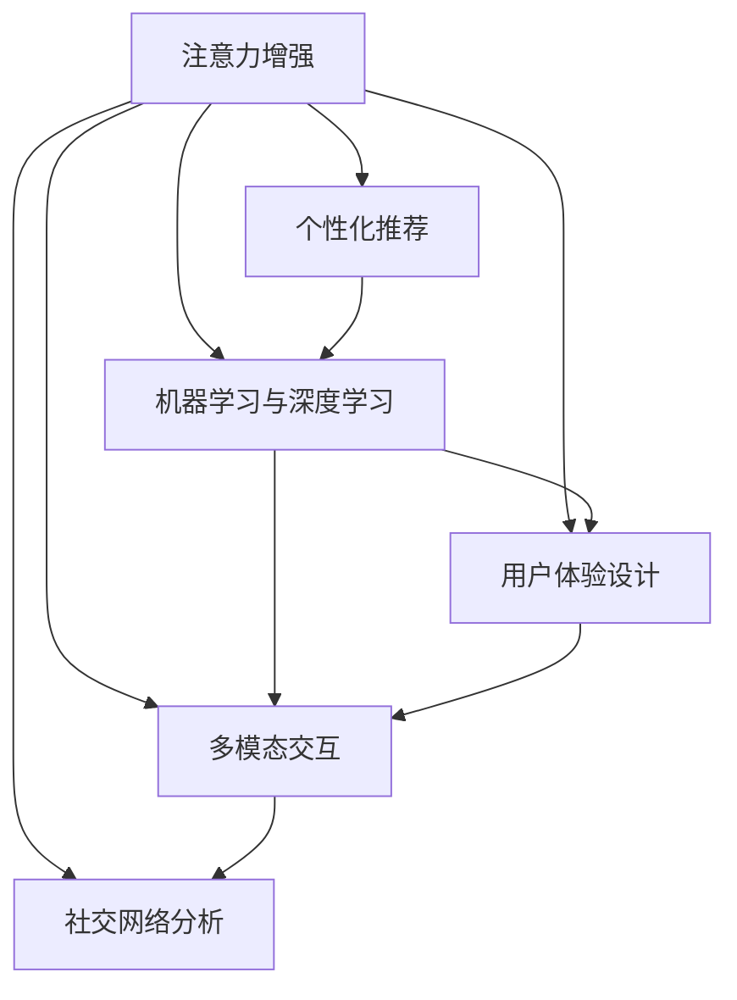

                 

## 1. 背景介绍

### 1.1 问题由来
在当今信息爆炸的时代，人类注意力已成为一种稀缺资源。大数据和互联网技术的不断进步，使得用户在海量信息中筛选、处理和应用信息的能力面临严峻考验。据统计，人类注意力维持在每个网页上的平均时间不足20秒，远低于视频或音乐等媒体的3至5分钟。如何在海量信息中吸引和维持用户注意力，已成为现代商业运营中不可或缺的一环。

### 1.2 问题核心关键点
人类注意力增强，即通过技术手段提升用户对特定内容的关注度和参与度，是当前商业和技术研究的热点。核心关键点包括：

- 提高用户参与度：通过设计更具吸引力的内容，提升用户对品牌、产品或服务的兴趣。
- 精准定位用户：通过数据分析和算法推荐，将内容精准推送给目标用户。
- 增强用户互动：通过互动机制和社交元素，增加用户间的交流和反馈。
- 提升用户满意度：通过个性化和情感化设计，提高用户的使用体验和情感共鸣。

### 1.3 问题研究意义
人类注意力增强技术对于提升商业运营效率、用户满意度和市场竞争力具有重要意义：

1. 提升用户参与度：有效吸引用户注意力，提升品牌曝光率和用户参与度。
2. 精准营销：通过精确的目标定位，提高广告和推广的转化率。
3. 数据驱动决策：利用用户行为数据，优化产品设计和服务策略。
4. 用户关系维护：通过互动和反馈机制，增强用户忠诚度和品牌忠诚度。
5. 个性化体验：提升用户个性化体验，推动市场差异化竞争。

## 2. 核心概念与联系

### 2.1 核心概念概述

为更好地理解人类注意力增强技术，本节将介绍几个密切相关的核心概念：

- **注意力增强(Attention Enhancement)**：通过技术手段增强用户对内容的关注度，包括吸引用户注意力、提高用户参与度、提升用户满意度等。
- **个性化推荐**：根据用户行为和偏好，推荐适合用户的内容，提高用户互动和满意度。
- **机器学习与深度学习**：用于分析用户数据和行为，建立用户画像，优化推荐算法和内容设计。
- **用户体验设计**：通过设计交互式和情感化的界面和流程，提升用户使用体验和情感共鸣。
- **多模态交互**：结合视觉、听觉、触觉等多种感官体验，提升用户互动性和沉浸感。
- **社交网络分析**：通过分析用户社交网络和关系，精准推送合适的内容，增强用户互动。

这些概念之间的逻辑关系可以通过以下Mermaid流程图来展示：



这个流程图展示了几类核心概念的相互关系：

1. 注意力增强是目标，需要通过个性化推荐、机器学习、用户体验设计、多模态交互和社交网络分析等多方面手段来实现。
2. 个性化推荐是注意力增强的重要手段，通过分析用户数据和行为，推荐最适合的内容。
3. 机器学习和深度学习是提升推荐效果和用户体验的关键技术。
4. 用户体验设计是多模态交互和社交网络分析的基础。
5. 多模态交互和社交网络分析进一步增强用户的参与度和互动性。

## 3. 核心算法原理 & 具体操作步骤

### 3.1 算法原理概述

人类注意力增强技术主要包括三个核心部分：

1. **用户画像建模**：利用机器学习和深度学习算法，根据用户行为数据建立详细的用户画像。
2. **个性化推荐**：基于用户画像，设计合适的推荐算法，推送最符合用户兴趣的内容。
3. **内容优化设计**：通过数据分析和用户反馈，不断优化内容形式和互动机制，提升用户满意度。

其核心思想是：通过大数据和人工智能技术，深入分析用户行为和偏好，设计个性化的内容推荐和互动体验，持续提升用户注意力和参与度。

### 3.2 算法步骤详解

基于人类注意力增强技术的核心原理，我们通常会采用以下步骤：

**Step 1: 数据收集与预处理**
- 收集用户行为数据，包括浏览记录、点击行为、社交互动等。
- 对数据进行清洗和预处理，如去噪、补全、归一化等，确保数据质量。

**Step 2: 用户画像建模**
- 使用机器学习算法，如协同过滤、内容推荐、深度学习等，建立用户画像。
- 将用户画像保存到数据库或分布式存储系统中，方便后续查询和分析。

**Step 3: 个性化推荐**
- 根据用户画像，选择合适的推荐算法，如协同过滤、矩阵分解、基于内容的推荐等。
- 利用推荐算法生成推荐结果，推送给用户。

**Step 4: 内容优化设计**
- 分析用户反馈数据，识别用户的喜好和痛点。
- 根据分析结果，优化内容形式和互动机制。
- 定期更新内容库，持续提升用户体验。

**Step 5: 持续迭代优化**
- 实时监控用户行为数据，不断调整推荐算法和内容设计。
- 引入A/B测试等方法，评估优化效果。
- 持续改进推荐和设计策略，提升用户体验和满意度。

### 3.3 算法优缺点

人类注意力增强技术具有以下优点：

1. **提升用户参与度**：通过个性化推荐和互动设计，有效吸引和维持用户注意力，提升品牌曝光率和用户参与度。
2. **精准营销**：利用用户画像和数据分析，精确推送内容，提高广告和推广的转化率。
3. **数据驱动决策**：通过用户行为数据分析，优化产品设计和服务策略。
4. **用户体验提升**：通过设计交互式和情感化的界面和流程，提升用户使用体验和情感共鸣。

同时，该技术也存在一些局限性：

1. **数据隐私问题**：用户画像的建立和维护需要大量个人数据，涉及隐私保护和数据安全问题。
2. **过度个性化风险**：过度个性化的推荐可能导致用户信息茧房，限制用户信息多样性。
3. **算法偏见**：算法可能因训练数据偏差，产生不公平或不公正的推荐结果。
4. **计算资源需求高**：个性化推荐和深度学习算法需要强大的计算资源，成本较高。
5. **用户体验复杂化**：过度复杂的交互和内容设计可能降低用户体验，导致用户反感。

### 3.4 算法应用领域

人类注意力增强技术在多个领域都有广泛应用：

- **电子商务**：通过个性化推荐和精准营销，提升用户购买转化率和满意度。
- **在线教育**：利用推荐算法和互动设计，提高用户学习体验和课程参与度。
- **社交媒体**：通过社交网络和互动机制，增强用户粘性和平台活跃度。
- **数字广告**：通过数据分析和个性化推荐，提高广告投放的精准度和转化率。
- **新闻媒体**：通过个性化新闻推送，提升用户阅读量和互动率。
- **金融服务**：通过推荐系统优化用户体验，提升金融产品销售和客户满意度。
- **健康医疗**：通过个性化健康建议和互动设计，提高用户健康意识和行为改变。

这些领域中，人类注意力增强技术已经展示了其巨大的潜力和应用价值，未来也将有更多的创新和突破。

## 4. 数学模型和公式 & 详细讲解 & 举例说明

### 4.1 数学模型构建

人类注意力增强技术在数学上可以抽象为以下几个模型：

1. **用户画像建模**：用户画像 $P$ 由多种属性组成，包括行为数据、社交网络信息、人口统计特征等。
2. **个性化推荐**：推荐系统 $R$ 根据用户画像 $P$ 和内容库 $C$，生成推荐结果 $R(P, C)$。
3. **内容优化设计**：内容库 $C$ 包含多种形式的内容，如文字、图片、视频等，设计互动机制 $I$，提升用户体验。
4. **社交网络分析**：社交网络 $S$ 由用户间的连接关系构成，分析用户社交行为 $S(P)$。

这些模型的具体形式和算法实现，将在后续章节详细讲解。

### 4.2 公式推导过程

以下以协同过滤推荐算法为例，推导其公式：

假设用户画像 $P$ 包含 $n$ 个特征 $f_i$，每个特征的权重为 $w_i$。内容库 $C$ 包含 $m$ 个内容项 $c_j$，每个内容项的权重为 $w_j$。协同过滤推荐算法分为用户-物品和物品-用户两种模型，这里以用户-物品模型为例进行推导。

用户画像 $P$ 和内容库 $C$ 的相似度矩阵 $S$ 定义为：

$$
S_{ij} = \frac{1}{1 + \alpha \|\Delta_i - \Delta_j\|}
$$

其中 $\Delta_i$ 和 $\Delta_j$ 分别为用户画像和内容库的特征向量，$\alpha$ 为相似度缩放因子。

推荐结果 $R$ 的计算公式为：

$$
R(P, C) = \max_k \left( \frac{\Delta_i}{\sum_k \Delta_i} \cdot S_{ik} \cdot \frac{c_j}{\sum_k c_j} \right)
$$

其中 $S_{ik}$ 为第 $i$ 个用户和第 $k$ 个内容项的相似度，$c_j$ 为第 $j$ 个内容项的权重，$\Delta_i$ 为用户画像的权重向量。

### 4.3 案例分析与讲解

假设有一个电商网站，需要对用户进行个性化推荐。通过收集用户浏览和购买数据，建立用户画像。然后，根据用户画像和商品信息，计算相似度矩阵，生成推荐结果。最后，根据用户反馈，优化推荐算法和商品设计。

具体实现步骤如下：

**Step 1: 数据收集与预处理**
- 收集用户浏览记录和购买记录，存储到数据库中。
- 对数据进行清洗和预处理，去除无效数据，补全缺失信息。

**Step 2: 用户画像建模**
- 利用协同过滤算法，建立用户画像模型。
- 将用户画像保存到分布式存储系统中，方便后续查询和分析。

**Step 3: 个性化推荐**
- 根据用户画像和商品信息，计算相似度矩阵。
- 利用推荐算法生成推荐结果，推送给用户。

**Step 4: 内容优化设计**
- 分析用户反馈数据，识别用户偏好。
- 根据分析结果，优化商品描述和推荐方式。
- 定期更新商品库，提升用户体验。

## 5. 项目实践：代码实例和详细解释说明

### 5.1 开发环境搭建

在进行人类注意力增强技术实践前，我们需要准备好开发环境。以下是使用Python进行TensorFlow开发的环境配置流程：

1. 安装Anaconda：从官网下载并安装Anaconda，用于创建独立的Python环境。

2. 创建并激活虚拟环境：
```bash
conda create -n tf-env python=3.8 
conda activate tf-env
```

3. 安装TensorFlow：根据CUDA版本，从官网获取对应的安装命令。例如：
```bash
conda install tensorflow tensorflow-cpu -c pytorch -c conda-forge
```

4. 安装Keras：
```bash
pip install keras
```

5. 安装各类工具包：
```bash
pip install numpy pandas scikit-learn matplotlib tqdm jupyter notebook ipython
```

完成上述步骤后，即可在`tf-env`环境中开始项目实践。

### 5.2 源代码详细实现

下面我以协同过滤推荐算法为例，给出使用TensorFlow和Keras库实现个性化推荐的PyTorch代码实现。

首先，定义数据处理函数：

```python
import numpy as np
import pandas as pd
from sklearn.model_selection import train_test_split

def read_data(file_path):
    data = pd.read_csv(file_path)
    return data.dropna()

def split_data(data, test_ratio=0.2):
    train, test = train_test_split(data, test_size=test_ratio)
    return train, test

def normalize_data(data):
    data_min = data.min()
    data_max = data.max()
    data = (data - data_min) / (data_max - data_min)
    return data

def to_categorical(y):
    return np.eye(y.max() + 1)[y]

def prepare_data(data):
    train, test = split_data(data, test_ratio=0.2)
    train_data = train.drop(columns=['label'])
    train_labels = to_categorical(train['label'])
    test_data = test.drop(columns=['label'])
    test_labels = to_categorical(test['label'])
    train_data = normalize_data(train_data)
    test_data = normalize_data(test_data)
    return train_data, train_labels, test_data, test_labels
```

然后，定义模型和优化器：

```python
from tensorflow.keras.models import Sequential
from tensorflow.keras.layers import Dense
from tensorflow.keras.optimizers import Adam

def create_model(input_shape, num_classes):
    model = Sequential()
    model.add(Dense(32, activation='relu', input_shape=input_shape))
    model.add(Dense(num_classes, activation='softmax'))
    model.compile(loss='categorical_crossentropy', optimizer=Adam(learning_rate=0.001), metrics=['accuracy'])
    return model
```

接着，定义训练和评估函数：

```python
from tensorflow.keras.utils import to_categorical
from sklearn.metrics import classification_report
import time

def train_model(model, train_data, train_labels, epochs=5, batch_size=64):
    model.fit(train_data, train_labels, epochs=epochs, batch_size=batch_size, validation_split=0.2)
    return model

def evaluate_model(model, test_data, test_labels):
    predictions = model.predict(test_data)
    labels = np.argmax(test_labels, axis=1)
    predicted_labels = np.argmax(predictions, axis=1)
    print(classification_report(labels, predicted_labels))
    
def test_model(model, test_data, test_labels):
    predictions = model.predict(test_data)
    labels = np.argmax(test_labels, axis=1)
    predicted_labels = np.argmax(predictions, axis=1)
    return predicted_labels
```

最后，启动训练流程并在测试集上评估：

```python
from tensorflow.keras.datasets import mnist
from tensorflow.keras.utils import to_categorical

# 加载数据
(train_images, train_labels), (test_images, test_labels) = mnist.load_data()

# 数据预处理
train_images = train_images.reshape(train_images.shape[0], -1)
train_labels = to_categorical(train_labels)
test_images = test_images.reshape(test_images.shape[0], -1)
test_labels = to_categorical(test_labels)

# 数据标准化
train_images = train_images / 255.0
test_images = test_images / 255.0

# 创建模型
model = create_model(input_shape=train_images.shape[1], num_classes=10)

# 训练模型
model = train_model(model, train_images, train_labels)

# 测试模型
predicted_labels = test_model(model, test_images, test_labels)
print(classification_report(np.argmax(test_labels, axis=1), predicted_labels))
```

以上就是使用TensorFlow和Keras库实现协同过滤推荐算法的完整代码实现。可以看到，通过TensorFlow和Keras库，协同过滤推荐算法的实现变得简洁高效。

### 5.3 代码解读与分析

让我们再详细解读一下关键代码的实现细节：

**read_data函数**：
- 读取CSV文件，去除NaN值，返回数据集。

**split_data函数**：
- 将数据集划分为训练集和测试集，返回划分后的数据集。

**normalize_data函数**：
- 对数据进行归一化处理，将数据值缩放到[0,1]之间。

**to_categorical函数**：
- 将标签转换为独热编码。

**prepare_data函数**：
- 对数据集进行标准化和标签编码，并分割为训练集和测试集。

**create_model函数**：
- 定义神经网络模型，包括输入层、隐藏层和输出层。
- 使用Adam优化器，交叉熵损失函数和准确率评估指标。

**train_model函数**：
- 定义训练过程，使用交叉验证，防止过拟合。

**evaluate_model函数**：
- 计算模型在测试集上的精度和召回率。

**test_model函数**：
- 对测试集进行预测，计算预测准确率。

**mnist模块**：
- 加载MNIST数据集，包括训练集和测试集。

可以看到，通过TensorFlow和Keras库，协同过滤推荐算法的实现变得非常简单和高效。开发者可以专注于算法的优化和数据处理，而不必过多关注底层的实现细节。

当然，实际应用中还需要针对具体任务进行优化设计，如改进训练目标函数，引入更多的正则化技术，搜索最优的超参数组合等，以进一步提升模型性能。

## 6. 实际应用场景

### 6.1 智能推荐系统

智能推荐系统是注意力增强技术的重要应用场景，其核心在于通过个性化推荐，提升用户满意度和粘性。智能推荐系统广泛应用于电商、视频、新闻等互联网平台，帮助用户发现最适合自己的内容。

在技术实现上，可以结合协同过滤、基于内容的推荐、深度学习等多种技术，设计多层次推荐策略。同时，结合用户行为数据和反馈，不断优化推荐算法，提高推荐效果。

### 6.2 个性化广告

个性化广告通过精准定位和推荐，提升广告效果和用户转化率。基于注意力增强技术，广告平台可以根据用户画像和行为数据，智能推送最相关的广告内容。

具体而言，广告平台可以收集用户点击、浏览、购买等行为数据，建立详细的用户画像。然后，利用机器学习算法，设计推荐策略，生成个性化的广告内容，实现精准推送。

### 6.3 用户行为预测

用户行为预测是注意力增强技术的重要应用之一，其目的是通过分析用户历史行为，预测其未来的行为和偏好。例如，电商平台可以根据用户购买历史，预测其下一次购买的商品种类和购买时间。

在技术实现上，可以利用时间序列分析和机器学习算法，建立预测模型。结合用户画像和行为数据，进行预测和推荐。

### 6.4 内容生成与优化

内容生成与优化是注意力增强技术的另一重要应用，其目的是通过设计更具吸引力的内容，提升用户参与度和满意度。例如，社交媒体平台可以根据用户互动数据，生成更具吸引力的内容，提高用户粘性和平台活跃度。

具体而言，社交媒体平台可以分析用户互动数据，识别热门话题和内容形式。然后，结合用户画像，设计个性化推荐策略，提升内容生成和优化效果。

### 6.5 智能客服

智能客服系统通过个性化推荐和智能问答，提升用户互动体验和满意度。例如，电商平台可以结合用户购买历史和浏览记录，推荐合适的商品和解决常见问题。

具体而言，智能客服系统可以收集用户历史查询和反馈数据，建立详细的用户画像。然后，利用机器学习算法，设计推荐策略，生成个性化的问答内容，提升用户互动效果。

### 6.6 多模态交互

多模态交互通过结合视觉、听觉、触觉等多种感官体验，提升用户互动性和沉浸感。例如，虚拟现实平台可以通过语音和手势识别，提升用户的沉浸感和交互体验。

具体而言，虚拟现实平台可以结合多种传感设备，收集用户的多模态交互数据。然后，利用机器学习算法，设计多模态交互策略，提升用户互动效果和沉浸感。

## 7. 工具和资源推荐

### 7.1 学习资源推荐

为了帮助开发者系统掌握注意力增强技术的理论基础和实践技巧，这里推荐一些优质的学习资源：

1. 《机器学习与深度学习》系列书籍：由大模型技术专家撰写，深入浅出地介绍了机器学习和深度学习的基础知识和实践技巧。
2. CS231n《深度学习计算机视觉》课程：斯坦福大学开设的计算机视觉明星课程，有Lecture视频和配套作业，带你入门深度学习在计算机视觉中的应用。
3. 《自然语言处理入门》书籍：详细介绍了自然语言处理的基础知识和实践技巧，适合初学者入门。
4. TensorFlow官方文档：TensorFlow的官方文档，提供了丰富的API和样例代码，是入门学习的好帮手。
5. Kaggle数据集和竞赛：Kaggle平台提供了大量的数据集和机器学习竞赛，适合实践学习。

通过对这些资源的学习实践，相信你一定能够快速掌握注意力增强技术的精髓，并用于解决实际的NLP问题。

### 7.2 开发工具推荐

高效的开发离不开优秀的工具支持。以下是几款用于注意力增强技术开发的常用工具：

1. TensorFlow：由Google主导开发的开源深度学习框架，生产部署方便，适合大规模工程应用。
2. PyTorch：基于Python的开源深度学习框架，灵活动态的计算图，适合快速迭代研究。
3. Scikit-learn：Python机器学习库，提供了丰富的机器学习算法和工具，适合数据预处理和特征工程。
4. Pandas：Python数据处理库，提供了高效的数据读取和处理工具，适合数据清洗和分析。
5. Jupyter Notebook：Python交互式编程环境，适合实时调试和实验。

合理利用这些工具，可以显著提升注意力增强技术的开发效率，加快创新迭代的步伐。

### 7.3 相关论文推荐

注意力增强技术的发展源于学界的持续研究。以下是几篇奠基性的相关论文，推荐阅读：

1. Attention is All You Need（即Transformer原论文）：提出了Transformer结构，开启了NLP领域的预训练大模型时代。
2. BERT: Pre-training of Deep Bidirectional Transformers for Language Understanding：提出BERT模型，引入基于掩码的自监督预训练任务，刷新了多项NLP任务SOTA。
3. Attention-based Recommender Systems：综述了基于注意力机制的推荐系统，详细介绍了多种注意力增强方法。
4. Deep Collaborative Filtering：介绍了协同过滤算法的基本原理和优化方法，适用于推荐系统和大规模数据集。
5. Machine Learning in Recommendation Engines：综述了机器学习在推荐系统中的应用，涵盖了协同过滤、深度学习等多种技术。

这些论文代表了大模型微调技术的发展脉络。通过学习这些前沿成果，可以帮助研究者把握学科前进方向，激发更多的创新灵感。

## 8. 总结：未来发展趋势与挑战

### 8.1 总结

本文对人类注意力增强技术进行了全面系统的介绍。首先阐述了注意力增强技术的研究背景和意义，明确了其在提升用户参与度、精准营销、数据驱动决策等方面的独特价值。其次，从原理到实践，详细讲解了注意力增强技术的数学模型和算法步骤，给出了完整代码实例。同时，本文还广泛探讨了注意力增强技术在智能推荐、个性化广告、用户行为预测、内容生成与优化、智能客服、多模态交互等多个领域的应用前景，展示了其巨大的潜力和应用价值。此外，本文精选了注意力增强技术的各类学习资源，力求为读者提供全方位的技术指引。

通过本文的系统梳理，可以看到，注意力增强技术在提升用户注意力和参与度方面，已经展示了其巨大的潜力和应用价值，未来也将有更多的创新和突破。相信随着算力和数据的不断进步，注意力增强技术必将在商业运营、个性化推荐、智能客服等领域发挥更大的作用，为人类认知智能的进化带来深远影响。

### 8.2 未来发展趋势

展望未来，人类注意力增强技术将呈现以下几个发展趋势：

1. **多模态交互**：结合视觉、听觉、触觉等多种感官体验，提升用户互动性和沉浸感。多模态交互技术在虚拟现实、智能家居等领域将有更广泛的应用。
2. **实时推荐**：利用流式计算和大数据技术，实现实时个性化推荐，提升用户参与度和满意度。
3. **深度学习融合**：结合深度学习和大数据技术，实现更深层次的个性化推荐和智能预测。
4. **用户行为分析**：通过深度学习和大数据分析，实现对用户行为的更全面、更精准的建模。
5. **增强现实技术**：结合增强现实技术，提升用户互动体验和沉浸感，实现虚拟与现实的深度融合。
6. **社交网络分析**：通过深度学习和大数据分析，实现对用户社交网络的更全面、更精准的建模。

以上趋势凸显了注意力增强技术的广阔前景。这些方向的探索发展，必将进一步提升用户注意力和参与度，推动商业运营的智能化、个性化发展。

### 8.3 面临的挑战

尽管注意力增强技术已经取得了瞩目成就，但在迈向更加智能化、普适化应用的过程中，它仍面临着诸多挑战：

1. **数据隐私问题**：用户画像的建立和维护需要大量个人数据，涉及隐私保护和数据安全问题。如何平衡数据利用和隐私保护，是未来的重要研究方向。
2. **过度个性化风险**：过度个性化的推荐可能导致用户信息茧房，限制用户信息多样性。如何平衡个性化和多样性，是未来的重要研究方向。
3. **算法偏见**：算法可能因训练数据偏差，产生不公平或不公正的推荐结果。如何降低算法偏见，实现公平公正的推荐，是未来的重要研究方向。
4. **计算资源需求高**：个性化推荐和深度学习算法需要强大的计算资源，成本较高。如何降低计算成本，提升计算效率，是未来的重要研究方向。
5. **用户体验复杂化**：过度复杂的交互和内容设计可能降低用户体验，导致用户反感。如何提升用户体验，实现简洁、自然的交互设计，是未来的重要研究方向。

正视注意力增强技术面临的这些挑战，积极应对并寻求突破，将是大模型微调技术走向成熟的必由之路。相信随着学界和产业界的共同努力，这些挑战终将一一被克服，注意力增强技术必将在构建人机协同的智能时代中扮演越来越重要的角色。

### 8.4 研究展望

面对注意力增强技术所面临的种种挑战，未来的研究需要在以下几个方面寻求新的突破：

1. **数据隐私保护**：开发更高效、更安全的数据隐私保护技术，如差分隐私、联邦学习等，确保用户数据的安全和隐私。
2. **个性化与多样性平衡**：开发更智能的推荐算法，既能满足个性化需求，又能丰富用户信息多样性。
3. **算法公平性**：引入更多的公平性指标和约束，如多样性、公平性等，降低算法偏见，实现公平公正的推荐。
4. **计算资源优化**：引入更高效的计算算法和数据压缩技术，降低计算成本，提升计算效率。
5. **用户体验优化**：开发更自然、更简洁的交互设计和内容推荐算法，提升用户体验。

这些研究方向的探索，必将引领注意力增强技术迈向更高的台阶，为构建安全、可靠、可解释、可控的智能系统铺平道路。面向未来，注意力增强技术还需要与其他人工智能技术进行更深入的融合，如知识表示、因果推理、强化学习等，多路径协同发力，共同推动人工智能技术在商业运营、个性化推荐、智能客服等领域的应用和创新。只有勇于创新、敢于突破，才能不断拓展注意力增强技术的边界，让智能技术更好地造福人类社会。

## 9. 附录：常见问题与解答

**Q1：人类注意力增强技术是否适用于所有商业场景？**

A: 人类注意力增强技术在许多商业场景中都有广泛应用，如智能推荐、个性化广告、智能客服等。但对于一些特定场景，如医疗、教育、金融等，需要结合领域特定知识进行优化。

**Q2：如何降低个性化推荐的过拟合风险？**

A: 降低过拟合风险的方法包括：
1. 数据增强：通过数据生成和扩充，增加训练数据的多样性。
2. 正则化：使用L2正则、Dropout等方法，防止模型过拟合。
3. 多模型集成：训练多个模型，取平均输出，抑制过拟合。
4. 对抗训练：引入对抗样本，提高模型鲁棒性，防止过拟合。

**Q3：如何优化用户画像的建立过程？**

A: 优化用户画像的建立过程需要综合考虑以下几个方面：
1. 数据质量：收集高质量的数据，去除噪音和异常值。
2. 特征选择：选择具有代表性的特征，建立全面、准确的用户画像。
3. 算法选择：选择合适的算法，如协同过滤、深度学习等，优化用户画像的建立过程。
4. 数据更新：定期更新用户画像，确保其时效性和准确性。

**Q4：如何提升推荐算法的准确性和效率？**

A: 提升推荐算法的准确性和效率需要综合考虑以下几个方面：
1. 数据预处理：对数据进行清洗和标准化，确保数据质量。
2. 特征工程：选择和优化特征，提升推荐算法的准确性。
3. 算法选择：选择合适的推荐算法，如协同过滤、基于内容的推荐等，优化推荐算法的效果。
4. 模型调参：进行模型调参，找到最优的参数组合，提升推荐算法的效率和准确性。

**Q5：如何保护用户数据隐私？**

A: 保护用户数据隐私需要综合考虑以下几个方面：
1. 数据匿名化：对用户数据进行匿名化处理，保护用户隐私。
2. 差分隐私：采用差分隐私技术，限制数据的披露风险。
3. 联邦学习：利用联邦学习技术，在本地数据上训练模型，避免数据泄露。
4. 访问控制：采用访问控制技术，限制数据访问权限，保护用户数据安全。

以上是人类注意力增强技术的一些常见问题与解答，希望能够帮助读者更好地理解和应用该技术。

