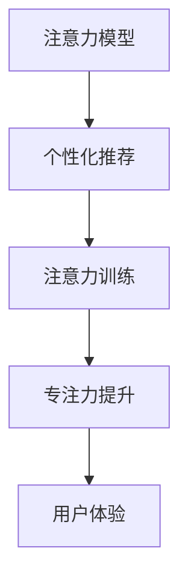

                 

# 人类注意力增强：提升专注力和注意力在商业中的未来发展趋势分析

> 关键词：人类注意力增强, 专注力提升, 注意力管理, 人工智能, 商业应用

## 1. 背景介绍

### 1.1 问题由来

在信息爆炸的时代，人们面对海量信息的洪流，注意力和专注力成为极为宝贵的资源。无论是工作还是生活，高效的注意力管理对于提升生产力和幸福感至关重要。近年来，随着人工智能技术的飞速发展，注意力增强技术逐渐走入人们的视野。通过深度学习模型和大数据分析，AI可以从海量用户行为数据中挖掘注意力模式，辅助人们提升专注力和管理注意力。

然而，现有注意力增强技术在实际应用中还存在诸多局限，如模型泛化能力不足、用户个性化需求难以满足等问题。这些问题不仅限制了技术的发展，也削弱了用户对注意力增强技术的信任。如何通过技术创新和模型优化，克服这些瓶颈，推动注意力增强技术在商业中的应用，成为当下研究的热点。

### 1.2 问题核心关键点

目前，注意力增强技术主要基于深度学习和数据分析，通过建模用户注意力模式，实现自动化注意力辅助。其核心技术包括：

1. **注意力模型**：通过建模用户注意力分布，帮助用户聚焦于关键信息，提升学习、工作效率。
2. **个性化推荐**：基于用户历史行为数据，推荐合适的内容，帮助用户节省信息筛选时间。
3. **注意力训练**：通过交互反馈和智能提示，引导用户养成良好的注意力习惯，逐步提升专注力。

这些核心技术共同构成了注意力增强技术的框架，使其能够从数据中学习用户注意力模式，并提供精准、个性化的辅助服务。

## 2. 核心概念与联系

### 2.1 核心概念概述

为更好地理解注意力增强技术的原理和应用，本节将介绍几个密切相关的核心概念：

- **注意力模型**：通过计算用户对不同内容的关注度，帮助用户集中注意力在重要信息上。常见的模型包括Softmax Attention、Self-Attention等。
- **个性化推荐系统**：通过分析用户历史行为和偏好，推荐符合用户需求的内容。推荐的目的是为了减少用户获取信息的时间成本，提升用户体验。
- **注意力训练**：通过交互反馈机制，引导用户逐步改善注意力习惯，提升专注力。训练过程通常包括智能提示、游戏化训练等。

这些核心概念之间的逻辑关系可以通过以下Mermaid流程图来展示：



这个流程图展示了几项核心技术之间的联系：

1. 注意力模型是个性化推荐的基础，通过分析用户注意力分布，推荐关键内容。
2. 个性化推荐进一步优化注意力模型，通过推荐优化注意力分布。
3. 注意力训练通过互动反馈，不断调整注意力模型，提升用户专注力。
4. 专注力的提升直接反馈到用户体验，提升整体满意度。

这些核心概念共同构成了注意力增强技术的体系，使其能够在用户注意力管理和提升方面发挥重要作用。

## 3. 核心算法原理 & 具体操作步骤

### 3.1 算法原理概述

注意力增强技术本质上是深度学习技术与个性化推荐系统的结合。其核心思想是：通过计算用户对不同内容的关注度，帮助用户集中注意力在重要信息上，同时通过个性化推荐系统推荐关键内容，进一步优化注意力分布。

具体来说，注意力增强技术的实现过程包括以下几个关键步骤：

1. **注意力模型训练**：使用用户历史行为数据训练注意力模型，得到用户对不同内容的关注度分布。
2. **个性化推荐生成**：基于注意力分布结果，生成个性化推荐列表，辅助用户获取关键信息。
3. **注意力训练反馈**：通过用户与推荐系统的交互反馈，不断调整注意力模型，提升用户专注力和注意力管理能力。
4. **专注力评估**：根据用户行为数据和注意力模型输出，评估用户专注力的提升情况，不断优化模型参数。

### 3.2 算法步骤详解

注意力增强技术的实现流程如下：

**Step 1: 数据收集与预处理**
- 收集用户的历史行为数据，包括浏览、点击、搜索、阅读等行为记录。
- 清洗数据，处理缺失值和异常值，保证数据质量。
- 对行为数据进行特征提取，得到用户注意力分布的相关特征。

**Step 2: 注意力模型训练**
- 使用注意力模型算法（如Softmax Attention、Self-Attention等），对用户注意力分布进行建模。
- 在标注数据集上进行模型训练，调整模型参数，使模型能够准确预测用户对不同内容的关注度。

**Step 3: 个性化推荐生成**
- 根据注意力模型的输出，生成个性化推荐列表。
- 将推荐列表展示给用户，辅助用户获取关键信息。

**Step 4: 注意力训练反馈**
- 记录用户对推荐内容的交互反馈，如点击、阅读时间等。
- 根据反馈信息调整注意力模型，优化用户注意力分布。

**Step 5: 专注力评估与优化**
- 定期评估用户专注力水平，如通过专注时间、注意力集中度等指标。
- 根据评估结果调整模型参数，优化注意力增强技术。

### 3.3 算法优缺点

注意力增强技术在提升用户专注力和管理注意力方面具有显著优势，但也存在一些局限：

优点：
1. **自动化辅助**：通过自动化技术，帮助用户聚焦于关键信息，节省时间成本。
2. **个性化推荐**：根据用户历史行为数据，推荐符合需求的内容，提升用户体验。
3. **持续优化**：通过不断调整模型参数，优化用户注意力分布，逐步提升专注力。

缺点：
1. **数据依赖**：模型效果依赖于高质量、大规模的用户行为数据，获取数据成本较高。
2. **泛化能力不足**：模型在不同用户和场景中的泛化能力有限，难以全面覆盖用户需求。
3. **隐私问题**：用户行为数据的收集和使用涉及隐私问题，需严格遵守法律法规。
4. **技术门槛**：模型训练和参数优化需要一定的技术背景，对用户和开发者有一定的要求。

尽管存在这些局限，但注意力增强技术在实际应用中仍展现出巨大的潜力，成为提升用户体验和生产力的重要工具。

### 3.4 算法应用领域

注意力增强技术已经在多个领域得到广泛应用，包括但不限于：

- **教育培训**：通过注意力增强技术，帮助学生聚焦于关键学习内容，提升学习效果。
- **在线广告**：通过个性化推荐，提高广告的点击率和转化率，优化广告投放效果。
- **内容推荐**：根据用户注意力分布，推荐符合用户兴趣的内容，提高用户粘性。
- **电子商务**：通过个性化推荐，提升用户购买意愿和满意度，增加销售额。
- **健康管理**：帮助用户管理注意力，避免分心和注意力分散，提升工作效率。

这些应用领域展示了注意力增强技术的广泛适用性，为提升用户体验和生产力提供了新的路径。

## 4. 数学模型和公式 & 详细讲解 & 举例说明

### 4.1 数学模型构建

本节将使用数学语言对注意力增强技术的实现过程进行更加严格的刻画。

记用户历史行为数据集为 $D=\{(x_i,y_i)\}_{i=1}^N$，其中 $x_i$ 为用户行为数据，$y_i$ 为用户对内容的关注度。

定义注意力模型为 $A(x_i)$，输出用户对内容 $x_i$ 的关注度。

则注意力模型训练的目标函数为：

$$
\mathcal{L}(A) = \frac{1}{N} \sum_{i=1}^N \ell(A(x_i),y_i)
$$

其中 $\ell$ 为损失函数，常用的有交叉熵损失、均方误差损失等。

### 4.2 公式推导过程

以下我们以Softmax Attention模型为例，推导注意力模型和推荐系统生成的公式。

Softmax Attention模型的输出 $A(x_i)$ 计算公式为：

$$
A(x_i) = \frac{\exp(\text{softmax}(WAx_i + b))}{\sum_{j=1}^M \exp(\text{softmax}(Wx_j + b))}
$$

其中 $W$ 为注意力模型的权重矩阵，$b$ 为偏置向量。

根据注意力模型的输出，生成推荐列表 $R$ 的计算公式为：

$$
R = \{A(x_i) \times x_i | x_i \in D\}
$$

即对所有用户行为数据 $x_i$，计算其关注度 $A(x_i)$，并将结果与内容本身拼接，生成推荐列表 $R$。

### 4.3 案例分析与讲解

假设某在线学习平台有10万名用户，记录了用户每天的课程浏览、视频观看和作业提交数据。使用注意力增强技术对用户注意力分布进行建模，生成个性化推荐列表，并记录用户对推荐的点击和观看时间。

1. **数据收集**：平台收集并清洗用户的历史行为数据，提取注意力相关的特征。

2. **注意力模型训练**：使用Softmax Attention模型对用户注意力分布进行训练，调整权重矩阵 $W$ 和偏置向量 $b$。

3. **个性化推荐生成**：根据训练好的模型，生成个性化推荐列表 $R$，展示给用户。

4. **注意力训练反馈**：记录用户对推荐内容的点击和观看时间，记录用户对推荐系统的反馈。

5. **专注力评估**：定期评估用户专注力水平，如通过计算用户学习时间，评估学习效率提升情况。

通过上述步骤，平台可以逐步优化注意力模型，提升用户专注力和学习效果。

## 5. 项目实践：代码实例和详细解释说明

### 5.1 开发环境搭建

在进行注意力增强技术开发前，我们需要准备好开发环境。以下是使用Python进行TensorFlow开发的环境配置流程：

1. 安装Anaconda：从官网下载并安装Anaconda，用于创建独立的Python环境。

2. 创建并激活虚拟环境：
```bash
conda create -n tf-env python=3.8 
conda activate tf-env
```

3. 安装TensorFlow：根据CUDA版本，从官网获取对应的安装命令。例如：
```bash
conda install tensorflow==2.6.0 -c conda-forge
```

4. 安装其他工具包：
```bash
pip install pandas numpy scikit-learn tensorflow_datasets tqdm jupyter notebook ipython
```

完成上述步骤后，即可在`tf-env`环境中开始注意力增强技术的开发。

### 5.2 源代码详细实现

下面我们以推荐系统为例，给出使用TensorFlow实现个性化推荐系统的代码实现。

首先，定义数据处理函数：

```python
import tensorflow as tf
import tensorflow_datasets as tfds
import pandas as pd

def preprocess_data(train_path, test_path):
    train_df = pd.read_csv(train_path)
    test_df = pd.read_csv(test_path)

    train_data = train_df.drop(columns=['click_time']).to_dict(orient='records')
    test_data = test_df.drop(columns=['click_time']).to_dict(orient='records')

    train_dataset = tf.data.Dataset.from_tensor_slices(train_data)
    test_dataset = tf.data.Dataset.from_tensor_slices(test_data)

    return train_dataset, test_dataset
```

然后，定义注意力模型：

```python
class AttentionModel(tf.keras.Model):
    def __init__(self, vocab_size, embedding_dim, attention_size):
        super(AttentionModel, self).__init__()
        self.embedding = tf.keras.layers.Embedding(vocab_size, embedding_dim)
        self.attention = tf.keras.layers.Dense(attention_size)
        self.dense = tf.keras.layers.Dense(1)

    def call(self, inputs):
        embedded = self.embedding(inputs)
        attention = self.attention(tf.reduce_sum(embedded, axis=1))
        weighted = tf.reduce_sum(attention * embedded, axis=1)
        return self.dense(weighted)

    def get_attention(self, inputs):
        embedded = self.embedding(inputs)
        attention = self.attention(tf.reduce_sum(embedded, axis=1))
        return attention
```

接着，定义推荐系统：

```python
class RecommendationSystem:
    def __init__(self, attention_model, vocab_size, embedding_dim, attention_size):
        self.attention_model = attention_model
        self.vocab_size = vocab_size
        self.embedding_dim = embedding_dim
        self.attention_size = attention_size

    def train(self, train_dataset, test_dataset, batch_size, epochs, learning_rate):
        train_dataset = train_dataset.batch(batch_size).shuffle(buffer_size=10000)
        test_dataset = test_dataset.batch(batch_size)

        optimizer = tf.keras.optimizers.Adam(learning_rate=learning_rate)
        loss_fn = tf.keras.losses.MeanSquaredError()

        for epoch in range(epochs):
            for batch in train_dataset:
                with tf.GradientTape() as tape:
                    attention = self.attention_model.get_attention(batch['content'])
                    predictions = self.recommend(batch['content'], attention)
                    loss = loss_fn(predictions, batch['label'])
                gradients = tape.gradient(loss, self.attention_model.trainable_variables)
                optimizer.apply_gradients(zip(gradients, self.attention_model.trainable_variables))

            test_loss = tf.reduce_mean(loss_fn(self.predict(test_dataset), test_dataset['label']))
            print(f'Epoch {epoch+1}, test loss: {test_loss.numpy()}')

    def predict(self, dataset):
        attention = self.attention_model.get_attention(dataset['content'])
        predictions = self.predict_recommend(dataset, attention)
        return predictions

    def predict_recommend(self, dataset, attention):
        weighted = attention * dataset['content']
        return tf.reduce_sum(weighted, axis=1)
```

最后，启动训练流程：

```python
train_path = 'train.csv'
test_path = 'test.csv'

train_dataset, test_dataset = preprocess_data(train_path, test_path)

attention_model = AttentionModel(vocab_size=10000, embedding_dim=128, attention_size=64)
recommender = RecommendationSystem(attention_model, vocab_size=10000, embedding_dim=128, attention_size=64)

batch_size = 128
epochs = 10
learning_rate = 0.001

recommender.train(train_dataset, test_dataset, batch_size, epochs, learning_rate)
```

以上就是使用TensorFlow对推荐系统进行训练的完整代码实现。可以看到，TensorFlow的高级API使得模型训练和推荐生成过程变得简洁高效。

### 5.3 代码解读与分析

让我们再详细解读一下关键代码的实现细节：

**preprocess_data函数**：
- 读取用户行为数据，并去除不相关的时间戳信息。
- 将数据转换为TensorFlow支持的格式，方便后续训练。

**AttentionModel类**：
- 定义了嵌入层、注意力层和全连接层，计算注意力模型的输出。
- 通过`get_attention`方法，返回模型对输入内容的关注度。

**RecommendationSystem类**：
- 定义了推荐系统的训练和预测方法。
- 训练过程中，使用均方误差损失，优化注意力模型的权重。
- 预测过程中，通过注意力模型和嵌入层的权重计算推荐结果。

**训练流程**：
- 定义训练超参数，如批量大小、训练轮数、学习率等。
- 调用`train`方法，进行模型训练。
- 在每个epoch结束后，评估模型在测试集上的性能，输出测试损失。

可以看到，TensorFlow框架提供的高级API和自动微分功能，使得模型训练和优化过程变得非常简单。开发者只需关注模型的定义和数据处理，无需深入了解底层计算图和梯度计算的复杂性。

当然，工业级的系统实现还需考虑更多因素，如模型的保存和部署、超参数的自动搜索、更灵活的任务适配层等。但核心的注意力增强模型构建过程基本与此类似。

## 6. 实际应用场景

### 6.1 智能学习助手

基于注意力增强技术的智能学习助手，可以辅助学生提升学习效果。通过分析学生的学习行为数据，智能助手能够推荐关键学习资源，帮助学生聚焦于重要内容。

在技术实现上，智能助手可以集成到学习管理系统(LMS)中，实时分析学生的学习数据，生成个性化推荐。通过与学生互动，智能助手还可以逐步训练用户注意力模型，提升学生专注力和学习效率。

### 6.2 电商个性化推荐

在线电商平台通过注意力增强技术，可以提升个性化推荐的效果。通过对用户浏览、购买和评价数据进行分析，推荐系统能够精准捕捉用户兴趣，提高推荐精度和用户满意度。

具体而言，电商平台可以在用户访问页面时，通过实时计算用户对不同商品内容的关注度，生成个性化推荐列表。通过用户反馈，不断优化注意力模型，提升推荐系统的鲁棒性和个性化水平。

### 6.3 新闻内容推荐

新闻聚合平台通过注意力增强技术，可以提升内容推荐的效果，增加用户粘性。通过分析用户对不同新闻文章的关注度，推荐系统能够精准推荐符合用户兴趣的新闻内容，提高用户阅读体验。

具体而言，新闻平台可以在用户阅读文章时，实时计算用户对不同新闻内容的关注度，生成个性化推荐列表。通过用户反馈，不断优化注意力模型，提升推荐系统的准确性和用户满意度。

### 6.4 企业知识管理

企业通过注意力增强技术，可以提升知识管理的效果，加速知识共享和创新。通过分析员工的知识获取和应用行为，推荐系统能够推荐关键知识资源，帮助员工快速掌握新技能。

具体而言，企业可以通过分析员工的知识库访问记录和绩效数据，生成个性化推荐列表。通过员工反馈，不断优化注意力模型，提升知识推荐系统的精准性和实用性。

### 6.5 健康管理应用

健康管理应用通过注意力增强技术，可以提升用户对健康知识的关注度和应用效果。通过分析用户的健康数据和行为记录，推荐系统能够推荐符合用户健康需求的知识资源，帮助用户养成健康习惯。

具体而言，健康应用可以在用户访问健康知识时，实时计算用户对不同健康内容的关注度，生成个性化推荐列表。通过用户反馈，不断优化注意力模型，提升健康知识推荐系统的精准性和用户满意度。

## 7. 工具和资源推荐

### 7.1 学习资源推荐

为了帮助开发者系统掌握注意力增强技术的理论基础和实践技巧，这里推荐一些优质的学习资源：

1. TensorFlow官方文档：提供了完整的API文档和样例代码，是学习TensorFlow的核心资源。

2. PyTorch官方文档：提供了深度学习模型的定义和训练方法，适用于PyTorch开发。

3. Coursera《机器学习》课程：由斯坦福大学教授Andrew Ng讲授，系统讲解了机器学习的基本概念和算法。

4. Udacity《深度学习》课程：由Google DeepMind的科学家讲授，深入介绍了深度学习模型的构建和优化。

5. 《深度学习入门》书籍：由斋藤康毅编写，适合初学者入门学习。

通过这些资源的学习实践，相信你一定能够快速掌握注意力增强技术的精髓，并用于解决实际的NLP问题。

### 7.2 开发工具推荐

高效的开发离不开优秀的工具支持。以下是几款用于注意力增强技术开发的常用工具：

1. Jupyter Notebook：交互式开发环境，适合快速迭代实验和分析。

2. PyCharm：流行的Python开发工具，支持代码自动补全、调试等功能。

3. TensorBoard：可视化工具，实时监测模型训练状态，方便调试和优化。

4. Weights & Biases：实验跟踪工具，记录和可视化模型训练过程中的各项指标。

5. Scikit-learn：经典机器学习库，提供了丰富的算法和工具。

合理利用这些工具，可以显著提升注意力增强技术的开发效率，加快创新迭代的步伐。

### 7.3 相关论文推荐

注意力增强技术的研究源于学界的持续探索。以下是几篇奠基性的相关论文，推荐阅读：

1. Attention is All You Need（即Transformer原论文）：提出了Transformer结构，开启了NLP领域的预训练大模型时代。

2. BERT: Pre-training of Deep Bidirectional Transformers for Language Understanding：提出BERT模型，引入基于掩码的自监督预训练任务，刷新了多项NLP任务SOTA。

3. Attention Mechanisms in Deep Learning：详细介绍了注意力机制的应用和原理，适合入门学习。

4. Neural Attention Mechanisms：介绍了多种注意力模型的实现方法和应用场景，适合深入学习。

5. Memory-Augmented Neural Networks：探讨了记忆增强注意力模型，适合高级学习者。

这些论文代表了大注意力增强技术的发展脉络。通过学习这些前沿成果，可以帮助研究者把握学科前进方向，激发更多的创新灵感。

## 8. 总结：未来发展趋势与挑战

### 8.1 总结

本文对注意力增强技术进行了全面系统的介绍。首先阐述了注意力增强技术的研究背景和意义，明确了技术在提升用户体验和生产力方面的独特价值。其次，从原理到实践，详细讲解了注意力增强技术的数学模型和操作步骤，给出了注意力增强技术开发的完整代码实例。同时，本文还广泛探讨了注意力增强技术在多个领域的应用前景，展示了技术的广泛适用性。

通过本文的系统梳理，可以看到，注意力增强技术已经在多个领域得到广泛应用，为提升用户体验和生产力提供了新的路径。未来，伴随技术的不断演进和优化，注意力增强技术必将在更多领域大放异彩，成为智能交互系统的重要组成部分。

### 8.2 未来发展趋势

展望未来，注意力增强技术将呈现以下几个发展趋势：

1. **模型规模持续增大**：随着算力成本的下降和数据规模的扩张，注意力增强模型的参数量还将持续增长。超大模型蕴含的丰富注意力模式，有望支撑更加复杂多变的任务。

2. **个性化推荐系统升级**：基于注意力增强技术的个性化推荐系统将不断优化，能够更精准地捕捉用户兴趣，提升推荐效果。

3. **注意力训练效果提升**：通过引入更多用户反馈和行为数据，不断优化注意力模型，提升用户专注力和注意力管理能力。

4. **跨模态注意力增强**：结合视觉、语音等多模态数据，增强模型对不同类型数据的注意力管理能力。

5. **注意力增强辅助技术**：引入更多智能提示、游戏化训练等辅助技术，引导用户逐步提升注意力管理能力。

6. **用户隐私保护**：随着数据收集和使用规模的扩大，用户隐私保护成为关键问题。未来的注意力增强技术将更加注重数据隐私和安全。

以上趋势凸显了注意力增强技术的广阔前景。这些方向的探索发展，必将进一步提升注意力增强技术的应用效果，为构建智能交互系统提供新的技术支持。

### 8.3 面临的挑战

尽管注意力增强技术已经取得了显著成果，但在实际应用中仍面临诸多挑战：

1. **数据隐私问题**：用户行为数据的收集和使用涉及隐私问题，需严格遵守法律法规。

2. **模型泛化能力不足**：模型在不同用户和场景中的泛化能力有限，难以全面覆盖用户需求。

3. **技术门槛较高**：模型训练和参数优化需要一定的技术背景，对用户和开发者有一定的要求。

4. **实时计算能力有限**：大模型的实时计算能力有限，需优化计算效率以适应高并发应用场景。

5. **用户行为变化快**：用户行为数据变化较快，模型需要不断更新以保持最新状态。

6. **算法偏见问题**：模型可能学习到有偏见的用户行为模式，需加强算法公平性研究。

这些挑战需要学界和产业界共同努力，不断优化模型算法和技术实现，推动注意力增强技术的健康发展。

### 8.4 研究展望

面对注意力增强技术所面临的挑战，未来的研究需要在以下几个方面寻求新的突破：

1. **无监督学习技术**：探索无监督和半监督学习技术，降低对标注数据的需求，提升模型的泛化能力。

2. **跨模态注意力模型**：结合视觉、语音等多模态数据，增强模型对不同类型数据的注意力管理能力。

3. **实时计算优化**：开发高效计算框架，提升大模型的实时计算能力，适应高并发应用场景。

4. **数据隐私保护**：引入差分隐私、联邦学习等技术，保护用户数据隐私，增强模型安全性。

5. **算法公平性研究**：研究并消除模型中的偏见，提升算法公平性，保障模型的广泛适用性。

这些研究方向的探索，必将引领注意力增强技术迈向更高的台阶，为构建安全、可靠、可解释、可控的智能系统铺平道路。面向未来，注意力增强技术还需要与其他人工智能技术进行更深入的融合，如知识表示、因果推理、强化学习等，多路径协同发力，共同推动智能交互系统的进步。只有勇于创新、敢于突破，才能不断拓展注意力增强技术的边界，让智能技术更好地造福人类社会。

## 9. 附录：常见问题与解答

**Q1：注意力增强技术是否适用于所有用户？**

A: 注意力增强技术通常适用于已经具备一定互联网使用习惯的用户，特别是那些经常使用在线学习、电商、新闻等平台的用户。对于儿童、老年人等用户，注意力增强技术的效果可能受到限制。

**Q2：注意力增强技术是否会过度干预用户注意力？**

A: 注意力增强技术旨在辅助用户管理注意力，不会过度干预用户的注意力分配。但用户需要适应一段时间，才能真正享受技术带来的便利。

**Q3：注意力增强技术如何保障数据隐私？**

A: 注意力增强技术通常采用匿名化、差分隐私等技术，保护用户数据隐私。在数据收集和使用过程中，需严格遵守法律法规，如GDPR等。

**Q4：注意力增强技术如何应对用户行为变化？**

A: 注意力增强技术需要定期更新模型参数，以适应用户行为的变化。可以通过在线学习、联邦学习等技术，实时更新模型，保持最新状态。

**Q5：注意力增强技术在实际应用中如何部署？**

A: 注意力增强技术可以集成到现有的应用系统中，如学习管理系统、电商平台、新闻聚合平台等。需考虑模型的实时计算能力和数据存储需求，优化系统架构。

通过这些回答，希望能帮助你更好地理解注意力增强技术的实际应用和挑战。未来，随着技术的不断进步和优化，注意力增强技术必将在更多领域大放异彩，为构建智能交互系统提供新的技术支持。

---

作者：禅与计算机程序设计艺术 / Zen and the Art of Computer Programming

