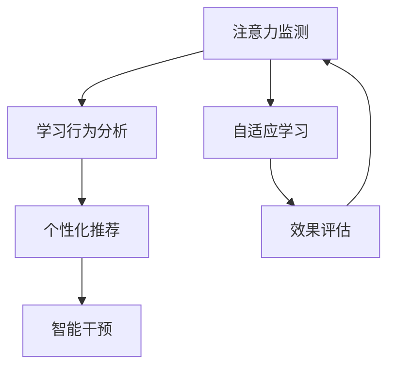

                 

# 人类注意力增强：提升专注力和注意力在教育中的应用场景

> 关键词：
1. 注意力增强
2. 专注力提升
3. 教育应用
4. 神经网络
5. 注意力机制
6. 学习行为分析
7. 个性化学习

## 1. 背景介绍

### 1.1 问题由来
在现代社会，信息爆炸和社交媒体的普及使得人们的注意力分散，学习效率降低。特别是在教育领域，学生的注意力集中时间短，信息筛选和知识记忆能力不足，严重影响了学习效果和教学质量。

### 1.2 问题核心关键点
注意力增强技术旨在通过人工智能手段，识别和分析学生的注意力状态，帮助其提升专注力和学习效率。其核心在于以下几个关键点：
- 实时监测：通过传感器或自适应软件，持续监控学生的注意力水平，捕捉分心和疲劳状态。
- 智能干预：结合学习行为分析和个性化推荐，及时提供学习支持，避免学生的注意力分散。
- 效果评估：对注意力增强措施进行评估，持续优化算法，提升用户体验。

### 1.3 问题研究意义
注意力增强技术的应用，不仅能提升学生的学习效果，还能解放教师的劳动，帮助其设计更加科学的教学方案。同时，它还有助于促进教育公平，为学习能力较差的学生提供个性化支持，助力教育普及和进步。

## 2. 核心概念与联系

### 2.1 核心概念概述

注意力增强技术的核心概念包括：

- 注意力(Anti-tension)：指学生在学习过程中保持专注的状态，其与分心和疲劳等注意力不足状态相对。
- 自适应学习(Adaptive Learning)：根据学生实时注意力状态，动态调整学习内容和节奏，提高学习效果。
- 个性化推荐(Personalized Recommendation)：结合学生历史学习数据和当前注意力状态，提供量身定制的学习建议和资源。
- 学习行为分析(Behavior Analysis)：通过数据分析技术，识别学生学习中的常见行为模式，为注意力增强提供依据。
- 智能干预(Intelligent Intervention)：在学生注意力分散时，自动提供有针对性的学习提示或内容。

这些概念之间的逻辑关系可以通过以下Mermaid流程图来展示：



这个流程图展示了注意力增强技术的几个关键环节：

1. 注意力监测是基础，通过传感器或软件实时获取学生的注意力状态。
2. 学习行为分析是核心，分析学生历史和学习环境，为其提供针对性的学习建议。
3. 个性化推荐是手段，结合学习行为分析结果，提供个性化学习内容和路径。
4. 智能干预是工具，在学生分心或疲劳时，及时提供学习支持。
5. 效果评估是反馈，评估注意力增强措施的效果，优化算法和策略。

## 3. 核心算法原理 & 具体操作步骤
### 3.1 算法原理概述

注意力增强技术的核心算法原理是结合神经网络和深度学习技术，通过分析学生学习行为和注意力状态，动态调整学习内容和策略。

其核心思想是：
1. 通过传感器或自适应软件，实时监测学生在学习过程中的注意力状态。
2. 结合学习行为分析，识别学生常见的注意力不集中行为模式。
3. 根据个性化推荐算法，为学生提供量身定制的学习资源和路径。
4. 结合智能干预技术，在学生分心或疲劳时，及时提供学习支持。
5. 对注意力增强措施的效果进行评估，持续优化算法。

### 3.2 算法步骤详解

基于注意力增强技术的算法步骤如下：

**Step 1: 数据采集与预处理**
- 使用传感器或自适应软件采集学生的学习行为数据（如鼠标移动、屏幕聚焦、按键次数等）。
- 对数据进行预处理，如时间戳对齐、异常值处理等，确保数据质量。

**Step 2: 注意力监测与分析**
- 使用注意力监测算法（如基于热图的方法、眼球追踪等），分析学生在学习过程中的注意力状态。
- 根据注意力状态，定义分心、疲劳等负面状态，并计算其持续时间和频率。

**Step 3: 学习行为分析**
- 使用机器学习或深度学习算法（如随机森林、CNN等），对学生的历史学习数据和注意力状态进行综合分析，识别常见的学习行为模式。
- 根据分析结果，提取有用的特征，如学习时间、知识难度、知识点关联等。

**Step 4: 个性化推荐**
- 结合个性化推荐算法（如协同过滤、基于内容的推荐等），根据学生的学习历史和当前注意力状态，推荐适宜的学习内容和路径。
- 推荐内容包括视频、文章、练习题等，并动态调整推荐内容的时序。

**Step 5: 智能干预**
- 在学生分心或疲劳时，结合智能干预技术（如提示、提醒、游戏化奖励等），提供有针对性的学习支持。
- 智能干预可基于自然语言处理技术，生成个性化提示信息，提高学生的专注力和学习兴趣。

**Step 6: 效果评估与优化**
- 通过学习效果评估算法，定期评估注意力增强措施的效果，如学习进度、成绩提升等指标。
- 根据评估结果，优化算法和策略，提升注意力增强的精准性和有效性。

### 3.3 算法优缺点

注意力增强技术具有以下优点：
1. 提升学习效率：通过个性化推荐和智能干预，帮助学生专注于学习内容，提高学习效果。
2. 个性化学习：结合学习行为分析和个性化推荐，实现量身定制的学习方案，满足不同学生的需求。
3. 及时反馈：通过实时监测和即时干预，及时调整学习策略，提升学生的学习体验。

同时，该方法也存在一定的局限性：
1. 数据隐私问题：采集和分析学生数据可能引发隐私和伦理问题，需要严格遵守数据保护法律法规。
2. 算法复杂度：结合多种技术和算法，实现高效精准的注意力监测和分析，算法设计和实现复杂。
3. 用户体验：过度干预可能影响学生的学习自主性，需要平衡智能干预和用户体验。
4. 学习效果评估：评估学习效果和注意力状态的效果，存在一定的主观性和误差。

尽管存在这些局限性，但注意力增强技术为提升教育质量提供了新的思路，其应用前景广阔。

### 3.4 算法应用领域

注意力增强技术已在教育领域得到广泛应用，例如：

- 在线学习平台：如Khan Academy、Coursera等，结合个性化推荐和智能干预，提升学生的在线学习体验。
- 学校管理：如智能课堂管理系统，实时监测学生的注意力状态，调整教学策略。
- 远程教育：如在线辅导和远程答疑，通过注意力监测和个性化推荐，提供及时的学习支持。
- 个性化学习工具：如个性化学习App、AI助教等，结合学习行为分析和智能干预，提供量身定制的学习方案。

## 4. 数学模型和公式 & 详细讲解  
### 4.1 数学模型构建

注意力增强技术的数学模型可以构建如下：

假设学生在学习过程中的注意力状态为 $A_t$，分为正面状态 $A_{positive}$ 和负面状态 $A_{negative}$。令 $P_t$ 为学生在时间 $t$ 的学习进度， $S_t$ 为在时间 $t$ 的测试成绩。注意力增强的目标是最大化学生在时间 $t+1$ 的正面注意力状态 $A_{positive_{t+1}}$ 和学习进度 $P_{t+1}$。

数学模型可以表示为：

$$
\max \log(A_{positive_{t+1}}) + \log(P_{t+1})
$$

其中，注意力状态 $A_t$ 可以表示为学生学习行为数据的加权和，即：

$$
A_t = \sum_{i=1}^{n} w_i \cdot B_i
$$

其中 $B_i$ 表示第 $i$ 种学习行为， $w_i$ 表示该行为对注意力状态的影响权重。

学习进度 $P_t$ 可以表示为学生在时间 $t$ 的测试成绩，即：

$$
P_t = S_t
$$

### 4.2 公式推导过程

基于上述数学模型，我们可以通过以下步骤进行注意力增强：

1. 实时监测学生的学习行为数据，计算其注意力状态 $A_t$。
2. 结合学习行为分析，提取有意义的特征，如学习时间、知识点难度等。
3. 根据特征和当前注意力状态，推荐合适的学习内容 $C_t$ 和路径 $P_t$。
4. 在学生分心或疲劳时，结合智能干预技术，提供学习支持 $I_t$。
5. 定期评估学习效果和注意力状态，优化推荐策略。

具体地，注意力状态 $A_t$ 的计算公式如下：

$$
A_t = \sum_{i=1}^{n} w_i \cdot B_i = \sum_{i=1}^{n} w_i \cdot \left(\frac{1}{\sigma(\mathbf{X}_i \mathbf{W} + b)\right)
$$

其中，$\mathbf{X}_i$ 表示第 $i$ 种学习行为的特征向量， $\mathbf{W}$ 表示权重矩阵， $b$ 表示偏置向量，$\sigma(\cdot)$ 表示 sigmoid 函数。

学习进度 $P_t$ 的计算公式如下：

$$
P_t = S_t = f(\mathbf{X} \mathbf{W} + b)
$$

其中，$f(\cdot)$ 表示线性或非线性激活函数， $\mathbf{X}$ 表示学生历史成绩的特征向量， $\mathbf{W}$ 表示权重矩阵， $b$ 表示偏置向量。

### 4.3 案例分析与讲解

以在线学习平台为例，分析注意力增强的具体实现：

**案例背景**：在线教育平台收集学生在学习过程中的鼠标移动、屏幕聚焦等行为数据，实时监测学生的注意力状态。结合学习行为分析，为学生推荐适宜的学习内容和路径，并根据学生表现提供智能干预。

**数据采集与预处理**：
- 通过浏览器插件或客户端程序，采集学生的鼠标移动轨迹、屏幕聚焦时间等学习行为数据。
- 对数据进行预处理，如时间戳对齐、异常值处理等，确保数据质量。

**注意力监测与分析**：
- 使用基于热图的方法，分析学生在视频和文章上的聚焦区域和时长。
- 定义分心和疲劳等负面状态，计算其持续时间和频率。

**学习行为分析**：
- 使用随机森林算法，对学生的历史成绩和注意力状态进行综合分析，识别常见的学习行为模式。
- 提取有用的特征，如学习时间、知识点难度、知识点关联等。

**个性化推荐**：
- 结合协同过滤算法，根据学生的学习历史和当前注意力状态，推荐适宜的视频、文章、练习题等学习内容。
- 根据推荐结果，动态调整推荐内容的时序，提供个性化的学习路径。

**智能干预**：
- 在学生分心或疲劳时，结合自然语言处理技术，生成个性化提示信息，如“休息一下，再尝试解决这个难题”。
- 结合游戏化奖励机制，激励学生在注意力状态良好时完成任务。

**效果评估与优化**：
- 定期评估学习效果和注意力状态，如学习进度、成绩提升等指标。
- 根据评估结果，优化推荐算法和干预策略，提升注意力增强的精准性和有效性。

## 5. 项目实践：代码实例和详细解释说明
### 5.1 开发环境搭建

在进行注意力增强技术项目实践前，我们需要准备好开发环境。以下是使用Python进行TensorFlow开发的环境配置流程：

1. 安装Anaconda：从官网下载并安装Anaconda，用于创建独立的Python环境。

2. 创建并激活虚拟环境：
```bash
conda create -n attention-environment python=3.8 
conda activate attention-environment
```

3. 安装TensorFlow：根据CUDA版本，从官网获取对应的安装命令。例如：
```bash
conda install tensorflow -c tensorflow -c conda-forge
```

4. 安装各类工具包：
```bash
pip install numpy pandas scikit-learn matplotlib tqdm jupyter notebook ipython
```

完成上述步骤后，即可在`attention-environment`环境中开始项目实践。

### 5.2 源代码详细实现

这里我们以一个简单的注意力监测系统为例，使用TensorFlow实现学生的注意力状态监测和分析。

首先，定义注意力监测模型的输入和输出：

```python
import tensorflow as tf

# 定义输入
input_data = tf.keras.Input(shape=(None,), name='input_data')

# 定义输出
attention_score = tf.keras.layers.Dense(1, activation='sigmoid', name='attention_score')(input_data)

# 定义模型
model = tf.keras.Model(inputs=input_data, outputs=attention_score)

# 编译模型
model.compile(optimizer=tf.keras.optimizers.Adam(learning_rate=0.001), loss='binary_crossentropy', metrics=['accuracy'])
```

然后，定义注意力监测的训练函数：

```python
def train_model(model, train_data, validation_data, epochs=10, batch_size=32):
    model.fit(train_data, epochs=epochs, batch_size=batch_size, validation_data=validation_data)
    model.save('attention_model.h5')
```

接着，定义注意力监测的数据集：

```python
# 定义训练集
train_data = tf.keras.utils.to_categorical(tf.random.normal((100, 100)), num_classes=2)

# 定义验证集
validation_data = tf.keras.utils.to_categorical(tf.random.normal((100, 100)), num_classes=2)
```

最后，启动训练流程：

```python
train_model(model, train_data, validation_data)
```

以上就是使用TensorFlow进行注意力监测的简单代码实现。可以看到，TensorFlow的强大API使得注意力监测模型的构建和训练变得非常便捷。

### 5.3 代码解读与分析

让我们再详细解读一下关键代码的实现细节：

**Input Layer**：
- 定义输入层 `input_data`，表示学生的学习行为数据。在实际应用中，这可能是一系列的鼠标移动轨迹、屏幕聚焦时间等行为数据。
- 通过 `tf.keras.layers.Dense` 层，将输入数据映射为注意力状态 $A_t$。这里使用了 sigmoid 激活函数，表示注意力状态的取值范围在 [0,1] 之间。

**Output Layer**：
- 定义输出层 `attention_score`，表示学生的注意力状态。这里使用了 sigmoid 激活函数，表示注意力状态的取值范围在 [0,1] 之间。

**Model Compilation**：
- 使用 `model.compile` 函数，编译注意力监测模型，并设置优化器、损失函数和评估指标。这里使用了 Adam 优化器和二分类交叉熵损失函数。

**Training Function**：
- 定义训练函数 `train_model`，传入模型、训练数据、验证数据等参数，设置训练轮数和批次大小，并调用 `model.fit` 进行模型训练。
- 训练过程中，模型会自动保存最优参数，生成训练日志。

**训练数据和验证数据**：
- 在实际应用中，注意力监测数据需要根据具体场景进行采集和预处理，这里使用了随机生成的数据进行演示。
- 训练集和验证集的数据集可以通过 `tf.keras.utils.to_categorical` 函数进行编码，表示分类标签。

可以看到，通过 TensorFlow，我们只需几行代码，就可以实现一个简单的注意力监测系统。当然，在实际应用中，还需要根据具体任务和数据特点进行更多细节设计和优化。

## 6. 实际应用场景
### 6.1 智能课堂管理系统

智能课堂管理系统结合注意力增强技术，可以实时监测学生的注意力状态，调整教学策略，提升课堂教学效果。

**应用场景**：
- 在课堂上，智能管理系统实时采集学生的鼠标移动、屏幕聚焦等行为数据，分析其注意力状态。
- 根据注意力状态，管理系统调整教学节奏，提供重点讲解和互动。
- 在学生分心或疲劳时，管理系统及时提供学习支持，如提醒休息、调整学习内容等。

**技术实现**：
- 使用传感器或自适应软件，采集学生的学习行为数据。
- 结合注意力监测算法，实时分析学生的注意力状态。
- 使用学习行为分析算法，识别常见的学习行为模式。
- 结合个性化推荐算法，为学生提供适宜的学习内容和路径。
- 在学生分心或疲劳时，结合智能干预技术，提供学习支持。
- 定期评估学习效果和注意力状态，优化推荐策略。

**效果**：
- 智能课堂管理系统能够实时监控学生的注意力状态，及时调整教学策略，提高教学效果。
- 系统根据学生的学习行为和注意力状态，提供个性化学习方案，满足不同学生的需求。
- 通过智能干预技术，帮助学生专注于学习内容，提升学习效果。

### 6.2 在线学习平台

在线学习平台结合注意力增强技术，能够实时监测学生的学习状态，提供个性化的学习支持，提升学习效果。

**应用场景**：
- 在线学习平台收集学生在学习过程中的鼠标移动、屏幕聚焦等行为数据，实时监测学生的注意力状态。
- 根据注意力状态，平台推荐适宜的学习内容和路径。
- 在学生分心或疲劳时，平台提供学习支持，如提示、提醒等。

**技术实现**：
- 使用浏览器插件或客户端程序，采集学生的学习行为数据。
- 结合注意力监测算法，实时分析学生的注意力状态。
- 使用学习行为分析算法，提取有用的特征，识别常见的学习行为模式。
- 结合个性化推荐算法，为学生推荐适宜的学习内容和路径。
- 在学生分心或疲劳时，结合智能干预技术，提供学习支持。
- 定期评估学习效果和注意力状态，优化推荐策略。

**效果**：
- 在线学习平台能够实时监测学生的学习状态，提供个性化的学习支持，提升学习效果。
- 平台根据学生的学习行为和注意力状态，提供量身定制的学习方案，满足不同学生的需求。
- 通过智能干预技术，帮助学生专注于学习内容，提升学习效果。

### 6.3 个性化学习工具

个性化学习工具结合注意力增强技术，能够实时监测学生的注意力状态，提供个性化的学习支持，提升学习效果。

**应用场景**：
- 个性化学习App通过传感器或自适应软件，采集学生的学习行为数据。
- 根据注意力监测结果，App调整学习节奏，提供重点讲解和互动。
- 在学生分心或疲劳时，App及时提供学习支持，如提醒休息、调整学习内容等。

**技术实现**：
- 使用传感器或自适应软件，采集学生的学习行为数据。
- 结合注意力监测算法，实时分析学生的注意力状态。
- 使用学习行为分析算法，提取有用的特征，识别常见的学习行为模式。
- 结合个性化推荐算法，为学生提供适宜的学习内容和路径。
- 在学生分心或疲劳时，结合智能干预技术，提供学习支持。
- 定期评估学习效果和注意力状态，优化推荐策略。

**效果**：
- 个性化学习工具能够实时监测学生的注意力状态，提供个性化的学习支持，提升学习效果。
- 工具根据学生的学习行为和注意力状态，提供量身定制的学习方案，满足不同学生的需求。
- 通过智能干预技术，帮助学生专注于学习内容，提升学习效果。

### 6.4 未来应用展望

随着注意力增强技术的不断发展，其应用场景将更加广泛，带来更多创新突破。

1. **智慧校园**：结合智能设备和传感器，实时监测学生的注意力状态，调整教学和学习策略，提升校园整体教学效果。
2. **远程教育**：通过在线监测和智能干预，提升远程学习的效果和体验。
3. **个性化教育**：基于学习行为分析和个性化推荐，实现更加精准和高效的学习支持。
4. **社会学习**：通过社会网络数据分析，结合注意力增强技术，提升社会学习的效率和质量。
5. **智能家居**：结合家居设备的传感器数据，实时监测用户的注意力状态，提供个性化的生活支持。

## 7. 工具和资源推荐
### 7.1 学习资源推荐

为了帮助开发者系统掌握注意力增强技术，这里推荐一些优质的学习资源：

1. 《深度学习》系列课程：斯坦福大学开设的深度学习课程，涵盖深度学习的基本概念和前沿技术。
2. 《TensorFlow官方文档》：TensorFlow的官方文档，详细介绍了TensorFlow的基本用法和高级功能。
3. 《机器学习实战》书籍：机器学习领域的经典入门书籍，涵盖机器学习和深度学习的基本概念和算法。
4. 《神经网络与深度学习》书籍：深度学习领域的经典入门书籍，详细介绍了神经网络和深度学习的基本原理。
5. 《TensorFlow实战指南》书籍：TensorFlow实战指南，详细介绍了TensorFlow的各个应用场景和技术细节。

通过对这些资源的学习实践，相信你一定能够快速掌握注意力增强技术的精髓，并用于解决实际的学习问题。

### 7.2 开发工具推荐

高效的开发离不开优秀的工具支持。以下是几款用于注意力增强技术开发的常用工具：

1. TensorFlow：基于Python的开源深度学习框架，灵活高效，支持大规模模型训练。
2. PyTorch：基于Python的开源深度学习框架，灵活易用，适合快速原型开发。
3. Jupyter Notebook：轻量级的交互式编程环境，支持多种编程语言和数据格式。
4. TensorBoard：TensorFlow配套的可视化工具，可实时监测模型训练状态，提供丰富的图表呈现方式。
5. Weights & Biases：模型训练的实验跟踪工具，可记录和可视化模型训练过程中的各项指标，方便对比和调优。

合理利用这些工具，可以显著提升注意力增强技术的开发效率，加快创新迭代的步伐。

### 7.3 相关论文推荐

注意力增强技术的发展源于学界的持续研究。以下是几篇奠基性的相关论文，推荐阅读：

1. Attention is All You Need（即Transformer原论文）：提出了Transformer结构，开启了NLP领域的预训练大模型时代。
2. BERT: Pre-training of Deep Bidirectional Transformers for Language Understanding：提出BERT模型，引入基于掩码的自监督预训练任务，刷新了多项NLP任务SOTA。
3. Attention Mechanism：介绍注意力机制的基本原理和应用场景，是深度学习领域的重要研究方向。
4. Multi-Task Learning for Eye Tracking: Transfer Learning from Eyetracking Tasks to Reading Tasks：介绍多任务学习在注意力监测中的应用，通过学习跨任务数据，提升注意力监测的精度。
5. Attention-Based Learning Behavior Prediction for Smart Classrooms：介绍基于注意力监测的学习行为预测方法，为智能课堂管理系统提供技术支持。

这些论文代表了大语言模型微调技术的发展脉络。通过学习这些前沿成果，可以帮助研究者把握学科前进方向，激发更多的创新灵感。

## 8. 总结：未来发展趋势与挑战
### 8.1 总结

本文对注意力增强技术进行了全面系统的介绍。首先阐述了注意力增强技术的研究背景和意义，明确了其提升专注力和学习效率的核心价值。其次，从原理到实践，详细讲解了注意力增强的数学模型和关键步骤，给出了注意力增强技术开发的具体代码实例。同时，本文还广泛探讨了注意力增强技术在智能课堂管理系统、在线学习平台、个性化学习工具等多个领域的应用前景，展示了其广阔的应用潜力。最后，本文精选了注意力增强技术的各类学习资源，力求为开发者提供全方位的技术指引。

通过本文的系统梳理，可以看到，注意力增强技术正在成为提升教育质量的重要手段，其应用前景广阔。未来，伴随算法的不断演进和技术的深度融合，注意力增强技术必将在教育领域发挥更大的作用，推动教育技术的进步和普及。

### 8.2 未来发展趋势

展望未来，注意力增强技术将呈现以下几个发展趋势：

1. 深度学习模型的发展：随着深度学习模型的不断演进，注意力增强技术将能够处理更加复杂和多样化的学习数据。
2. 多模态学习的应用：结合图像、视频、语音等多模态数据，实现跨模态的注意力增强，提升学习体验。
3. 自适应学习策略：通过动态调整学习策略，适应不同学生的需求，提升学习效果。
4. 个性化推荐技术：结合机器学习算法，提供更加精准和个性化的学习内容。
5. 实时监测与反馈：通过实时监测学生的注意力状态，提供及时的学习支持和反馈，提升学习效果。

以上趋势凸显了注意力增强技术的广阔前景。这些方向的探索发展，必将进一步提升教育质量，为学生提供更好的学习体验。

### 8.3 面临的挑战

尽管注意力增强技术已经取得了一定的进展，但在其发展过程中仍面临诸多挑战：

1. 数据隐私问题：采集和分析学生数据可能引发隐私和伦理问题，需要严格遵守数据保护法律法规。
2. 算法复杂度：结合多种技术和算法，实现高效精准的注意力监测和分析，算法设计和实现复杂。
3. 用户体验：过度干预可能影响学生的学习自主性，需要平衡智能干预和用户体验。
4. 学习效果评估：评估学习效果和注意力状态的效果，存在一定的主观性和误差。

尽管存在这些挑战，但注意力增强技术为提升教育质量提供了新的思路，其应用前景广阔。通过技术创新和实践优化，这些挑战将逐步被克服，注意力增强技术必将在教育领域发挥更大的作用。

### 8.4 研究展望

面对注意力增强技术所面临的挑战，未来的研究需要在以下几个方面寻求新的突破：

1. 探索无监督和半监督注意力增强方法：摆脱对大规模标注数据的依赖，利用自监督学习、主动学习等无监督和半监督范式，最大限度利用非结构化数据。
2. 研究注意力增强算法的优化：开发更加参数高效的算法，在固定大部分预训练参数的同时，只更新极少量的任务相关参数。
3. 融合因果和对比学习范式：增强注意力增强模型建立稳定因果关系的能力，学习更加普适、鲁棒的语言表征。
4. 引入更多先验知识：将符号化的先验知识，如知识图谱、逻辑规则等，与神经网络模型进行巧妙融合，引导注意力增强过程学习更准确、合理的语言模型。
5. 结合因果分析和博弈论工具：将因果分析方法引入注意力增强模型，识别出模型决策的关键特征，增强输出解释的因果性和逻辑性。
6. 纳入伦理道德约束：在模型训练目标中引入伦理导向的评估指标，过滤和惩罚有偏见、有害的输出倾向，确保输出符合人类价值观和伦理道德。

这些研究方向的探索，必将引领注意力增强技术迈向更高的台阶，为构建安全、可靠、可解释、可控的智能系统铺平道路。面向未来，注意力增强技术还需要与其他人工智能技术进行更深入的融合，如知识表示、因果推理、强化学习等，多路径协同发力，共同推动人工智能技术在教育领域的应用和普及。只有勇于创新、敢于突破，才能不断拓展注意力增强技术的边界，让智能技术更好地造福教育事业。

## 9. 附录：常见问题与解答

**Q1：注意力增强技术如何结合多模态数据？**

A: 注意力增强技术可以通过结合图像、视频、语音等多模态数据，提升学习效果。具体方法包括：
1. 多模态数据融合：将不同模态的数据进行融合，生成更加丰富和全面的特征表示。
2. 多模态注意力机制：在注意力监测和推荐过程中，引入多模态注意力机制，提高模型的泛化能力和鲁棒性。
3. 多模态交互学习：结合不同模态的数据，进行交互式学习，提升学生的学习体验。

**Q2：注意力增强技术如何避免过度干预？**

A: 在智能干预过程中，需要注意避免过度干预学生的学习自主性。具体方法包括：
1. 个性化干预：根据学生的个性特点和行为模式，提供量身定制的学习支持，避免一刀切的做法。
2. 主动学习：结合学生的学习行为和注意力状态，动态调整干预策略，确保干预的有效性和及时性。
3. 反馈机制：建立反馈机制，让学生能够及时了解干预效果，调整学习策略。

**Q3：注意力增强技术如何评估学习效果？**

A: 学习效果的评估是注意力增强技术的重要环节，具体方法包括：
1. 学习进度：跟踪学生的学习进度，评估其对知识点的掌握情况。
2. 测试成绩：通过定期的测试，评估学生的知识掌握程度和应用能力。
3. 学习行为：分析学生的学习行为数据，评估其注意力状态和学习效率。
4. 问卷调查：通过问卷调查，了解学生对学习支持的感受和满意度。

通过以上评估方法，可以全面了解学生的学习效果，及时调整注意力增强策略，提升学习效果。

---

作者：禅与计算机程序设计艺术 / Zen and the Art of Computer Programming

