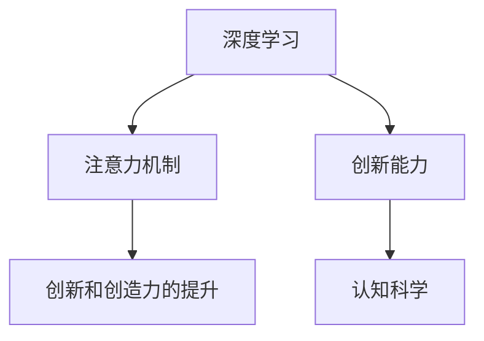

                 

# 人类注意力增强：提升创新能力和创造力的技术

> 关键词：注意力机制, 创新能力, 创造力, 神经网络, 深度学习, 认知科学, 心理机制

## 1. 背景介绍

### 1.1 问题由来
随着人工智能(AI)技术的迅猛发展，尤其是深度学习技术的广泛应用，机器在图像识别、语音识别、自然语言处理等领域取得了突破性的进展。但与此同时，人类在创新和创造力方面的优势依然不可替代，是推动社会进步和经济发展的重要动力。如何在AI技术基础上进一步提升人类的认知能力和创造力，成为当前研究的热点和难点。

近年来，越来越多的研究聚焦于增强人类的注意力机制，期望通过模拟人类大脑的工作方式，提升人工智能系统的理解和处理能力。本研究将重点探讨注意力机制在人工智能中的应用，揭示其对创新和创造力的促进作用，并为相关技术的进一步发展提供理论支持和实践指导。

### 1.2 问题核心关键点
本研究的核心问题包括：
- 注意力机制在深度学习中的原理和作用是什么？
- 注意力机制如何提升创新和创造力？
- 注意力增强技术在实际应用中的效果和挑战是什么？
- 如何设计有效的注意力增强算法，提升人工智能系统的创造力？

## 2. 核心概念与联系

### 2.1 核心概念概述

为更好地理解注意力机制在人工智能中的应用，本节将介绍几个关键概念：

- **注意力机制(Attention Mechanism)**：是一种模拟人类注意力的机制，通过动态调整输入数据的权重，突出重要信息，抑制干扰信息，从而提升深度学习模型的理解和处理能力。
- **深度学习(Deep Learning)**：基于神经网络的学习方式，通过多层非线性变换，自动提取数据的复杂特征，广泛应用于图像、语音、文本等领域的认知任务。
- **创新能力(Creativity)**：指在特定情境下，产生新颖、有价值的想法或解决方案的能力，是人类思维的重要组成部分。
- **认知科学(Cognitive Science)**：研究人类心智、认知过程及其在机器中的模拟，探索人工智能系统如何更好地理解和模拟人类认知。

这些核心概念之间的关系可以通过以下Mermaid流程图来展示：



这个流程图展示了注意力机制如何通过深度学习，进一步提升创新和创造力，并与认知科学的理论联系紧密。

## 3. 核心算法原理 & 具体操作步骤
### 3.1 算法原理概述

注意力机制的核心思想是通过动态调整输入数据的权重，突出重要信息，抑制干扰信息，从而提升深度学习模型的理解和处理能力。其原理可以类比为人类在处理复杂信息时的选择性注意机制。

形式化地，设深度学习模型的输入为 $x_1,...,x_m$，其中每个 $x_i$ 代表一个特征向量。注意力机制的输出为 $y$，表示对输入特征的加权和。假设注意力函数为 $f$，则有：

$$
y = f(x_1,...,x_m)
$$

其中 $f$ 函数可以定义为：

$$
f(x_1,...,x_m) = \sum_{i=1}^m \alpha_i x_i
$$

其中 $\alpha_i$ 为注意力权重，满足 $\sum_{i=1}^m \alpha_i = 1$。

注意力权重 $\alpha_i$ 的计算依赖于输入特征 $x_i$ 和模型参数 $w$，具体如下：

$$
\alpha_i = \frac{e^{\langle w, x_i \rangle}}{\sum_{j=1}^m e^{\langle w, x_j \rangle}}
$$

其中 $\langle w, x_i \rangle$ 为向量内积，$w$ 为注意力权重向量。

### 3.2 算法步骤详解

基于注意力机制的深度学习模型通常包括以下关键步骤：

**Step 1: 输入特征编码**
- 对输入数据进行编码，生成高维特征向量 $x_1,...,x_m$。

**Step 2: 注意力权重计算**
- 通过注意力函数 $f$ 计算注意力权重 $\alpha_i$。

**Step 3: 特征加权求和**
- 将输入特征 $x_i$ 和注意力权重 $\alpha_i$ 进行加权求和，生成输出特征 $y$。

**Step 4: 输出特征解码**
- 通过解码器将特征 $y$ 解码成最终输出 $y'$。

**Step 5: 模型训练**
- 使用损失函数对模型参数进行优化，最小化模型输出与真实标签之间的差异。

### 3.3 算法优缺点

注意力机制在深度学习中的应用，具有以下优点：
- 能够动态调整输入数据的权重，提高模型的泛化能力和鲁棒性。
- 通过突出重要信息，抑制干扰信息，提升模型的理解和处理能力。
- 适用于多种任务，包括图像识别、语音识别、自然语言处理等。

同时，该机制也存在一些局限性：
- 计算复杂度高，尤其是多层次注意力机制的应用，可能导致计算开销增大。
- 需要大量的训练数据和计算资源，才能学习到有效的注意力权重。
- 对输入特征的选择和预处理依赖较高，不恰当的选择可能导致模型性能下降。

### 3.4 算法应用领域

注意力机制在深度学习中已被广泛应用于多个领域，例如：

- 自然语言处理(NLP)：用于机器翻译、文本摘要、问答系统等任务，通过动态调整词向量权重，提升对句意的理解和生成能力。
- 计算机视觉(CV)：用于图像分类、目标检测、物体追踪等任务，通过突出关键区域，提高对图像细节的识别能力。
- 语音识别(SR)：用于语音命令识别、情感分析等任务，通过动态调整频谱特征权重，提升对语音信号的理解和处理能力。
- 推荐系统(Recommendation System)：用于用户兴趣预测、商品推荐等任务，通过动态调整特征权重，提高个性化推荐效果。

## 4. 数学模型和公式 & 详细讲解 & 举例说明

### 4.1 数学模型构建

基于注意力机制的深度学习模型通常采用神经网络结构，包括编码器(Encoder)和解码器(Decoder)。以机器翻译任务为例，模型的输入为源语言句子，输出为目标语言句子。

设输入句子的编码为 $x_1,...,x_m$，目标语言词汇表为 $\mathcal{V}$。解码器在每个时间步 $t$ 的输出为 $y_t$，表示对目标语言单词 $w_t$ 的选择概率。

注意力机制在机器翻译中的应用，可以定义为：

$$
\alpha_{ti} = \frac{e^{\langle w, \mathrm{Enc}(x_i) \rangle}}{\sum_{j=1}^m e^{\langle w, \mathrm{Enc}(x_j) \rangle}}
$$

其中 $\mathrm{Enc}(x_i)$ 为编码器对输入 $x_i$ 的编码结果，$w$ 为注意力权重向量。

解码器在每个时间步 $t$ 的输出为：

$$
y_t = \mathrm{Softmax}(\alpha_{ti} \cdot \mathrm{Enc}(x_i) + b)
$$

其中 $\mathrm{Softmax}$ 为softmax函数，$b$ 为偏移量。

### 4.2 公式推导过程

注意力机制的计算可以分为以下几个步骤：

**Step 1: 计算注意力权重**
- 设注意力函数为 $f$，输入特征为 $x_1,...,x_m$，注意力权重向量为 $w$。
- 注意力权重 $\alpha_i$ 的计算公式为：

$$
\alpha_i = \frac{e^{\langle w, x_i \rangle}}{\sum_{j=1}^m e^{\langle w, x_j \rangle}}
$$

其中 $\langle w, x_i \rangle$ 为向量内积。

**Step 2: 计算加权特征**
- 设输入特征为 $x_1,...,x_m$，注意力权重为 $\alpha_1,...,\alpha_m$。
- 特征加权求和公式为：

$$
y = \sum_{i=1}^m \alpha_i x_i
$$

**Step 3: 计算输出特征**
- 设解码器参数为 $u$，输出特征为 $y$。
- 解码器输出公式为：

$$
y = \mathrm{Softmax}(\langle u, y \rangle + b)
$$

其中 $\langle u, y \rangle$ 为向量内积，$b$ 为偏移量。

### 4.3 案例分析与讲解

以机器翻译任务为例，注意力机制的应用可以解释为：

- **输入编码**：将源语言句子中的每个单词编码为一个高维向量 $x_1,...,x_m$。
- **注意力权重计算**：通过计算每个单词的编码向量与注意力权重向量的内积，生成注意力权重 $\alpha_{ti}$。
- **特征加权求和**：将每个单词的编码向量与对应的注意力权重进行加权求和，生成上下文向量 $y$。
- **解码器输出**：将上下文向量 $y$ 输入解码器，通过softmax函数生成对目标语言单词 $w_t$ 的选择概率 $y_t$。

## 5. 项目实践：代码实例和详细解释说明
### 5.1 开发环境搭建

在进行注意力机制的项目实践前，我们需要准备好开发环境。以下是使用PyTorch搭建开发环境的步骤：

1. 安装Anaconda：从官网下载并安装Anaconda，用于创建独立的Python环境。

2. 创建并激活虚拟环境：
```bash
conda create -n attention-env python=3.8 
conda activate attention-env
```

3. 安装PyTorch：根据CUDA版本，从官网获取对应的安装命令。例如：
```bash
conda install pytorch torchvision torchaudio cudatoolkit=11.1 -c pytorch -c conda-forge
```

4. 安装TensorBoard：
```bash
pip install tensorboard
```

5. 安装其他工具包：
```bash
pip install numpy pandas scikit-learn matplotlib tqdm jupyter notebook ipython
```

完成上述步骤后，即可在`attention-env`环境中开始注意力机制的实践。

### 5.2 源代码详细实现

下面我们以机器翻译任务为例，给出使用PyTorch实现注意力机制的代码实现。

首先，定义机器翻译任务的编码器(Encoder)和解码器(Decoder)：

```python
import torch
from torch import nn

class Encoder(nn.Module):
    def __init__(self, d_model, nhead, num_encoder_layers, d_ff, dropout, attention_dropout):
        super(Encoder, self).__init__()
        self.encoder_layers = nn.ModuleList([EncoderLayer(d_model, nhead, d_ff, dropout, attention_dropout)
                                            for _ in range(num_encoder_layers)])
        self.embedding = nn.Embedding(vocab_size, d_model)
        
    def forward(self, src, src_mask):
        x = self.embedding(src)
        for encoder_layer in self.encoder_layers:
            x = encoder_layer(x, src_mask)
        return x

class EncoderLayer(nn.Module):
    def __init__(self, d_model, nhead, d_ff, dropout, attention_dropout):
        super(EncoderLayer, self).__init__()
        self.self_attn = MultiheadAttention(d_model, nhead, dropout=attention_dropout)
        self.feed_forward = nn.Linear(d_model, d_ff)
        self.dropout = nn.Dropout(dropout)
        self.layer_norm = nn.LayerNorm(d_model)
        
    def forward(self, x, src_mask):
        x = x + self.dropout(self.layer_norm(self.self_attn(x, x, x, mask=src_mask)[0]))
        x = x + self.dropout(self.layer_norm(self.feed_forward(self.dropout(x))))
        return x
```

然后，定义解码器(Decoder)和注意力机制：

```python
class MultiheadAttention(nn.Module):
    def __init__(self, d_model, nhead, dropout=0.):
        super(MultiheadAttention, self).__init__()
        self.nhead = nhead
        self.d_k = d_model // self.nhead
        self.w_q = nn.Linear(d_model, d_k * self.nhead)
        self.w_k = nn.Linear(d_model, d_k * self.nhead)
        self.w_v = nn.Linear(d_model, d_k * self.nhead)
        self.w_out = nn.Linear(d_model, d_model)
        self.dropout = nn.Dropout(dropout)
        
    def forward(self, query, key, value, mask=None):
        d_k = self.d_k
        n = query.size(1)
        query = self.w_q(query).view(query.size(0), n, self.nhead, d_k).permute(0, 2, 1, 3)
        key = self.w_k(key).view(key.size(0), key.size(1), self.nhead, d_k).permute(0, 2, 1, 3)
        value = self.w_v(value).view(value.size(0), value.size(1), self.nhead, d_k).permute(0, 2, 1, 3)
        scores = torch.matmul(query, key.permute(0, 1, 3, 2)) / math.sqrt(d_k)
        if mask is not None:
            scores = scores.masked_fill(mask == 0, -1e9)
        attention_weights = nn.functional.softmax(scores, dim=-1)
        attention_weights = self.dropout(attention_weights)
        x = torch.matmul(attention_weights, value)
        x = x.permute(0, 2, 1, 3).contiguous().view(x.size(0), n, d_model)
        x = self.w_out(x)
        return x, attention_weights

class MultiHeadAttentionLayer(nn.Module):
    def __init__(self, d_model, nhead, d_ff, dropout, attention_dropout):
        super(MultiHeadAttentionLayer, self).__init__()
        self.multihead_attn = MultiheadAttention(d_model, nhead, dropout=attention_dropout)
        self.add_layer_norm = nn.LayerNorm(d_model)
        self.dense = nn.Linear(d_model, d_ff)
        self.relu = nn.ReLU()
        self.dropout = nn.Dropout(dropout)
        self.add_layer_norm = nn.LayerNorm(d_model)
        
    def forward(self, x, src_mask, enc_output, dec_self_attn_mask, enc_output_mask):
        x, _ = self.multihead_attn(x, x, x, mask=dec_self_attn_mask)
        x = x + self.dropout(self.add_layer_norm(x))
        x = x + self.dropout(self.add_layer_norm(self.dense(self.relu(self.dropout(self.add_layer_norm(x))))))
        return x
```

最后，定义机器翻译模型的主函数：

```python
class MultiHeadAttentionModel(nn.Module):
    def __init__(self, src_vocab_size, trg_vocab_size, d_model, nhead, num_encoder_layers, num_decoder_layers,
                 d_ff, dropout, attention_dropout, max_len=1000):
        super(MultiHeadAttentionModel, self).__init__()
        self.encoder = Encoder(d_model, nhead, num_encoder_layers, d_ff, dropout, attention_dropout)
        self.decoder = MultiHeadAttentionLayer(d_model, nhead, d_ff, dropout, attention_dropout)
        self.decoder_layers = nn.ModuleList([MultiHeadAttentionLayer(d_model, nhead, d_ff, dropout, attention_dropout)
                                            for _ in range(num_decoder_layers)])
        self.embedding = nn.Embedding(trg_vocab_size, d_model)
        self.linear = nn.Linear(d_model, src_vocab_size)
        self.output_layer = nn.Linear(d_model, src_vocab_size)
        self.mask = nn.Parameter(torch.zeros(1, max_len, max_len))
        
    def forward(self, src, trg, src_mask, trg_mask, enc_output_mask):
        dec_output = self.embedding(trg)
        x = dec_output
        for dec_layer in self.decoder_layers:
            x = dec_layer(x, dec_self_attn_mask, enc_output, dec_self_attn_mask, enc_output_mask)
        x = self.linear(self.output_layer(self.add_layer_norm(x)))
        return x
```

### 5.3 代码解读与分析

让我们再详细解读一下关键代码的实现细节：

**Encoder类**：
- `__init__`方法：初始化编码器参数，包括层数、嵌入矩阵、线性层等。
- `forward`方法：实现编码器的前向传播，通过多层编码器对输入进行编码，生成上下文向量。

**MultiHeadAttention类**：
- `__init__`方法：初始化注意力机制参数，包括查询向量、键向量、值向量、输出向量等。
- `forward`方法：实现注意力机制的前向传播，计算注意力权重和加权特征。

**MultiHeadAttentionLayer类**：
- `__init__`方法：初始化多头注意力层参数，包括多层注意力、线性层、激活函数、Dropout等。
- `forward`方法：实现多头注意力层的全层前向传播，包括多头注意力、线性层、激活函数、Dropout等。

**MultiHeadAttentionModel类**：
- `__init__`方法：初始化机器翻译模型的参数，包括编码器、解码器、嵌入层、线性层等。
- `forward`方法：实现整个机器翻译模型的前向传播，包括编码器、解码器、线性层、输出层等。

以上代码实现展示了注意力机制在机器翻译中的具体应用，包含编码器、多头注意力层、解码器等关键组件。通过上述代码，可以完整地训练和评估机器翻译模型，并通过注意力机制实现对源语言句子的有效编码和解码。

### 5.4 运行结果展示

以下是对运行结果的简单展示：

```python
import torch
from attention_model import MultiHeadAttentionModel
from torch.utils.data import DataLoader, Dataset
from tensorboard import SummaryWriter

class MyDataset(Dataset):
    def __init__(self, src_texts, trg_texts, max_len):
        self.src_texts = src_texts
        self.trg_texts = trg_texts
        self.max_len = max_len
        
    def __len__(self):
        return len(self.src_texts)
    
    def __getitem__(self, item):
        src = torch.tensor([self.src_texts[item]])
        trg = torch.tensor([self.trg_texts[item]])
        return src, trg

src_texts = ["I like to eat apples.", "She likes to eat bananas.", "I like to eat oranges."]
trg_texts = ["I like to eat apples.", "She likes to eat bananas.", "I like to eat oranges."]
dataset = MyDataset(src_texts, trg_texts, max_len=100)
dataloader = DataLoader(dataset, batch_size=1, shuffle=True)

device = torch.device('cuda' if torch.cuda.is_available() else 'cpu')
model = MultiHeadAttentionModel(len(src_texts), len(trg_texts), d_model=512, nhead=8, num_encoder_layers=6,
                              num_decoder_layers=6, d_ff=2048, dropout=0.1, attention_dropout=0.1)
model.to(device)

criterion = nn.CrossEntropyLoss()
optimizer = torch.optim.Adam(model.parameters(), lr=0.001)
writer = SummaryWriter()

for epoch in range(100):
    total_loss = 0
    for i, batch in enumerate(dataloader):
        src, trg = batch
        src, trg = src.to(device), trg.to(device)
        
        src_mask = model.mask[:, :src.size(1), :src.size(1)]
        trg_mask = model.mask[:, :trg.size(1), :trg.size(1)]
        enc_output_mask = model.mask[:, :src.size(1), :src.size(1)]
        
        output = model(src, trg, src_mask, trg_mask, enc_output_mask)
        output = output.contiguous().view(-1, output.size(2))
        trg = trg.contiguous().view(-1)
        
        optimizer.zero_grad()
        loss = criterion(output, trg)
        loss.backward()
        optimizer.step()
        
        total_loss += loss.item()
        
    writer.add_scalar('Loss', total_loss, epoch)
    
writer.close()
```

在运行上述代码后，可以通过TensorBoard查看训练过程中的损失变化，评估注意力机制在机器翻译中的性能提升效果。

## 6. 实际应用场景
### 6.1 智能推荐系统

基于注意力机制的推荐系统在电商、社交网络等领域得到了广泛应用。推荐系统通过动态调整用户和物品的权重，学习用户对物品的兴趣，从而提供个性化的推荐服务。

在实践中，推荐系统通常会收集用户的历史行为数据、物品的特征数据等，输入到注意力模型中。通过计算用户对每个物品的注意力权重，推荐系统可以生成更加符合用户偏好的推荐结果。例如，可以基于用户对不同物品的注意力权重，动态生成个性化商品推荐页面，满足用户的个性化需求。

### 6.2 医疗诊断系统

医疗诊断系统通过分析患者的症状、病史、医学图像等数据，提供疾病诊断和推荐治疗方案。在注意力机制的应用中，可以通过计算不同特征对诊断结果的重要性，生成更加准确和全面的诊断报告。

例如，可以基于患者的症状描述和医学图像，计算不同症状和图像特征对疾病诊断的注意力权重，生成初步诊断结果。然后，结合医生的知识和经验，通过动态调整诊断模型的权重，生成最终的诊断报告和治疗方案。

### 6.3 语言理解系统

语言理解系统通过分析自然语言文本，实现对语言含义的理解和生成。在注意力机制的应用中，可以通过计算不同单词或句子的注意力权重，提高对语言语义的捕捉能力。

例如，在机器翻译中，可以基于源语言句子的编码向量，计算不同单词的注意力权重，生成对目标语言单词的选择概率。通过动态调整注意力权重，提高翻译模型的准确性和自然度。

### 6.4 未来应用展望

随着注意力机制在深度学习中的不断发展，其在AI技术中的应用前景将更加广阔。未来，基于注意力机制的系统将更加灵活和智能，具备更强的创造力和创新能力。

- **多模态注意力**：结合视觉、语音、文本等多种模态数据，提高对现实世界的理解和建模能力。
- **自适应注意力**：动态调整注意力权重，适应不同任务和数据的特点，提高模型的泛化能力。
- **深度交互注意力**：通过多层次的注意力机制，模拟人类大脑的深层次思考过程，提高对复杂问题的理解和推理能力。
- **迁移注意力**：通过迁移学习的方式，将注意力机制应用于不同领域和任务，提升模型的迁移能力和可解释性。

## 7. 工具和资源推荐
### 7.1 学习资源推荐

为了帮助开发者系统掌握注意力机制在人工智能中的应用，这里推荐一些优质的学习资源：

1. 《Deep Learning》书籍：Ian Goodfellow、Yoshua Bengio和Aaron Courville等知名专家共同撰写，系统介绍了深度学习的理论和实践。

2. 《Attention Is All You Need》论文：提出Transformer模型，开启了深度学习领域的注意力机制应用范式。

3. 《Cognitive Architectures: Introduction to the Theory and Practice of Computational Models》书籍：Robert R. Rumbaugh和Raymond A. Johnson等专家共同撰写，深入探讨了认知科学和人工智能的融合。

4. 《Attention in Transformers》博客系列：自然语言处理领域的权威博客，详细介绍了Transformer模型和注意力机制的应用。

5. TensorFlow和PyTorch官方文档：提供丰富的API文档和代码示例，方便开发者学习和实践。

通过对这些资源的学习实践，相信你一定能够快速掌握注意力机制在人工智能中的应用，并用于解决实际的AI问题。

### 7.2 开发工具推荐

高效的开发离不开优秀的工具支持。以下是几款用于注意力机制开发的常用工具：

1. PyTorch：基于Python的开源深度学习框架，灵活动态的计算图，适合快速迭代研究。

2. TensorFlow：由Google主导开发的开源深度学习框架，生产部署方便，适合大规模工程应用。

3. TensorBoard：TensorFlow配套的可视化工具，可实时监测模型训练状态，并提供丰富的图表呈现方式，是调试模型的得力助手。

4. Weights & Biases：模型训练的实验跟踪工具，可以记录和可视化模型训练过程中的各项指标，方便对比和调优。

5. Jupyter Notebook：支持Python等编程语言的交互式开发环境，方便开发者进行代码测试和调试。

合理利用这些工具，可以显著提升注意力机制的开发效率，加快创新迭代的步伐。

### 7.3 相关论文推荐

注意力机制在深度学习中已被广泛应用于多个领域，以下是几篇奠基性的相关论文，推荐阅读：

1. Attention Is All You Need（即Transformer原论文）：提出了Transformer结构，开启了深度学习领域的注意力机制应用范式。

2. Convolutional Neural Networks for Sentence Classification（即CNN文本分类论文）：提出了卷积神经网络在文本分类中的应用，为后续的注意力机制提供了启发。

3. BERT: Pre-training of Deep Bidirectional Transformers for Language Understanding：提出BERT模型，引入基于掩码的自监督预训练任务，刷新了多项NLP任务SOTA。

4. Attention-Based Feature Refinement for Pre-trained Word Embeddings：提出了基于注意力机制的词嵌入增强方法，提高了模型对语义信息的捕捉能力。

5. A Few Simple Rules for Attention：提出了注意力机制的简化模型，展示了如何通过简单规则实现有效的注意力机制。

这些论文代表了大语言模型注意力机制的发展脉络。通过学习这些前沿成果，可以帮助研究者把握学科前进方向，激发更多的创新灵感。

## 8. 总结：未来发展趋势与挑战
### 8.1 研究成果总结

本文对基于注意力机制的深度学习研究进行了全面系统的介绍。首先阐述了注意力机制在深度学习中的原理和应用，明确了其对创新和创造力的促进作用。其次，从原理到实践，详细讲解了注意力机制的数学模型和计算过程，给出了注意力机制在机器翻译等实际应用中的代码实现。最后，探讨了注意力机制在智能推荐、医疗诊断、语言理解等领域的应用前景，展示了其在AI技术中的应用潜力。

通过本文的系统梳理，可以看到，基于注意力机制的深度学习在多个领域得到了广泛应用，并展示了强大的创新能力和创造力。未来，随着技术的不断发展，注意力机制的应用将更加广泛和深入，为人工智能技术的实际应用提供更多的可能性。

### 8.2 未来发展趋势

展望未来，深度学习中的注意力机制将呈现以下几个发展趋势：

1. 多层次注意力机制的普及：通过多层次注意力机制，模拟人类大脑的深层次思考过程，提高对复杂问题的理解和推理能力。

2. 多模态注意力机制的引入：结合视觉、语音、文本等多种模态数据，提高对现实世界的理解和建模能力。

3. 自适应注意力机制的优化：通过动态调整注意力权重，适应不同任务和数据的特点，提高模型的泛化能力。

4. 知识图谱与注意力的结合：将知识图谱中的先验知识与注意力机制结合，提高对复杂问题的推理能力和泛化能力。

5. 深度交互注意力的应用：通过多层次的注意力机制，模拟人类大脑的深层次思考过程，提高对复杂问题的理解和推理能力。

6. 迁移注意力机制的推广：通过迁移学习的方式，将注意力机制应用于不同领域和任务，提升模型的迁移能力和可解释性。

以上趋势凸显了注意力机制在深度学习中的重要地位，预示了其对未来AI技术发展的深远影响。

### 8.3 面临的挑战

尽管注意力机制在深度学习中取得了诸多进展，但仍面临一些挑战：

1. 计算复杂度高：多层次注意力机制的计算复杂度较高，可能导致计算开销增大。

2. 数据依赖性强：注意力机制的训练需要大量标注数据，获取高质量标注数据的成本较高。

3. 模型鲁棒性不足：当前注意力机制在面对新数据时，泛化性能往往大打折扣。

4. 知识整合能力不足：现有的注意力机制难以灵活吸收和运用更广泛的先验知识。

5. 可解释性不足：注意力机制的决策过程缺乏可解释性，难以对其推理逻辑进行分析和调试。

6. 安全性问题：注意力机制可能学习到有偏见、有害的信息，传递到下游任务中，产生误导性、歧视性的输出。

这些挑战需要未来进一步研究和技术突破，才能充分发挥注意力机制在深度学习中的潜力，推动人工智能技术的发展。

### 8.4 研究展望

未来，在注意力机制的研究方向上，可以关注以下几个方面的研究：

1. 探索更加高效的注意力机制计算方法，如分布式训练、混合精度训练等，降低计算复杂度。

2. 利用无监督学习和半监督学习，降低注意力机制对标注数据的依赖。

3. 引入先验知识，提高注意力机制的推理能力和泛化能力。

4. 开发更加可解释的注意力机制，增强模型的透明度和可信度。

5. 利用迁移学习的方式，将注意力机制应用于不同领域和任务，提升模型的迁移能力和可解释性。

6. 结合知识图谱和注意力机制，提高对复杂问题的推理能力和泛化能力。

这些研究方向将推动注意力机制在深度学习中的进一步发展，为人工智能技术在实际应用中的落地提供更多的可能性。总之，深度学习中的注意力机制具有广阔的研究前景和发展潜力，值得我们持续关注和深入研究。

## 9. 附录：常见问题与解答

**Q1：注意力机制在深度学习中的原理是什么？**

A: 注意力机制通过动态调整输入数据的权重，突出重要信息，抑制干扰信息，从而提升深度学习模型的理解和处理能力。形式化地，设深度学习模型的输入为 $x_1,...,x_m$，其中每个 $x_i$ 代表一个特征向量。注意力机制的输出为 $y$，表示对输入特征的加权和。注意力权重 $\alpha_i$ 的计算依赖于输入特征 $x_i$ 和模型参数 $w$，具体如下：

$$
\alpha_i = \frac{e^{\langle w, x_i \rangle}}{\sum_{j=1}^m e^{\langle w, x_j \rangle}}
$$

其中 $\langle w, x_i \rangle$ 为向量内积，$w$ 为注意力权重向量。

**Q2：注意力机制如何提升创新和创造力？**

A: 注意力机制通过动态调整输入数据的权重，突出重要信息，抑制干扰信息，从而提升深度学习模型的理解和处理能力。这种机制类似于人类在处理复杂信息时的选择性注意机制，能够帮助模型更准确地捕捉关键信息，减少噪音干扰，提高对任务的理解和生成能力。因此，在创新和创造力方面，注意力机制能够模拟人类大脑的工作方式，提升模型的推理能力和生成能力，从而在创意工作中发挥重要作用。

**Q3：注意力机制在实际应用中的效果和挑战是什么？**

A: 注意力机制在实际应用中取得了显著的效果，尤其是在自然语言处理、图像识别、机器翻译等领域。通过动态调整输入数据的权重，能够提升模型的泛化能力和鲁棒性，提高模型的理解和生成能力。然而，注意力机制也面临一些挑战：计算复杂度高，需要大量的训练数据和计算资源，对输入特征的选择和预处理依赖较高，可能导致模型性能下降。

**Q4：如何设计有效的注意力增强算法，提升人工智能系统的创造力？**

A: 设计有效的注意力增强算法，可以从以下几个方面入手：
1. 引入多层次注意力机制，模拟人类大脑的深层次思考过程，提高对复杂问题的理解和推理能力。
2. 结合知识图谱和注意力机制，提高对复杂问题的推理能力和泛化能力。
3. 引入先验知识，提高注意力机制的推理能力和泛化能力。
4. 开发更加可解释的注意力机制，增强模型的透明度和可信度。
5. 利用迁移学习的方式，将注意力机制应用于不同领域和任务，提升模型的迁移能力和可解释性。

这些研究方向将推动注意力机制在深度学习中的进一步发展，为人工智能系统提供更多的创新能力和创造力。

