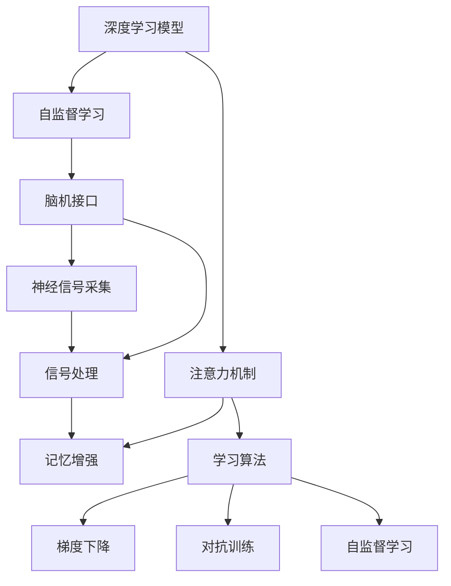

                 

# 人类注意力增强：提升学习能力和记忆力

> 关键词：人类注意力, 认知神经科学, 深度学习, 注意力机制, 记忆增强, 自监督学习, 学习算法, 脑机接口

## 1. 背景介绍

### 1.1 问题由来
随着现代社会的信息爆炸，人类每天需要面对海量的信息输入和处理。如何有效筛选、整合、存储信息，提升学习能力和记忆力，成为了一个迫切需要解决的问题。深度学习和认知神经科学的发展，为这一问题提供了新的解决途径。

深度学习模型，特别是近年来发展迅速的Transformer模型，已经在自然语言处理、计算机视觉等多个领域取得了显著成果。这些模型通过学习大量的数据，自适应地提取数据特征，其核心在于利用注意力机制，对输入数据进行精心的特征选择和组合，以实现高效的信息处理。这种机制不仅适用于机器，同样适用于人类大脑的认知过程。

认知神经科学的研究表明，注意力机制是人类大脑中关键的认知功能之一。大脑通过选择性地关注某些信息，而忽略无关信息，实现高效的信息处理和存储。这种注意力机制可以用于提升学习能力和记忆力，帮助人类更好地适应信息爆炸的社会环境。

### 1.2 问题核心关键点
如何利用深度学习和认知神经科学的最新研究成果，增强人类的注意力机制，提升学习能力和记忆力，是当前研究的热点和难点。具体来说，该问题可以分解为以下几个核心关键点：

1. 如何构建深度学习模型，模拟人类注意力机制？
2. 如何设计自监督学习任务，训练模型能够高效地选择、整合和存储信息？
3. 如何结合脑机接口技术，将深度学习模型与人类大脑的认知功能进行有效对接？
4. 如何评估和优化模型的注意力机制，提升学习能力和记忆力？

## 2. 核心概念与联系

### 2.1 核心概念概述

为更好地理解注意力增强技术，本节将介绍几个密切相关的核心概念：

- 深度学习模型：以神经网络为基础，通过学习大量数据，自适应地提取数据特征，实现高效的信息处理。Transformer模型、LSTM模型、CNN模型等是其代表。

- 注意力机制：深度学习中的一种机制，用于计算输入数据中不同部分的相关性权重，实现精心的特征选择和组合。该机制在Transformer模型中被广泛应用。

- 自监督学习：通过无监督学习任务训练模型，使其能够在缺少标注数据的情况下，仍然能够学习到有意义的表示。常见的自监督学习任务包括掩码语言模型、对比学习等。

- 脑机接口(Brain-Machine Interface, BMI)：通过各种技术手段，实现人脑与机器的直接信息交互。目前主要包括神经信号采集、信号处理和机器学习算法三个关键环节。

- 记忆增强：通过各种技术手段，增强人类的记忆能力，提升信息处理和存储效率。常见的记忆增强方法包括认知训练、脑波反馈训练等。

- 学习算法：用于训练深度学习模型，优化模型的注意力机制，提升学习能力和记忆力。常用的学习算法包括梯度下降、对抗训练、自监督学习等。

这些核心概念之间的逻辑关系可以通过以下Mermaid流程图来展示：



这个流程图展示了大语言模型微调的核心概念及其之间的关系：

1. 深度学习模型通过自监督学习获得基础能力。
2. 注意力机制用于精心的特征选择和组合，提升模型性能。
3. 脑机接口技术连接大脑与机器，实现信息交互。
4. 记忆增强方法提升人类的记忆能力。
5. 学习算法用于优化模型，提升学习能力和记忆力。

这些概念共同构成了人类注意力增强的学习框架，使其能够在各种场景下发挥强大的信息处理和存储能力。通过理解这些核心概念，我们可以更好地把握注意力增强技术的原理和应用方向。

## 3. 核心算法原理 & 具体操作步骤
### 3.1 算法原理概述

人类注意力增强技术的核心思想是，通过深度学习模型模拟人类大脑的注意力机制，结合自监督学习任务和脑机接口技术，实现对信息的精当选取、整合和存储。

形式化地，假设深度学习模型为 $M_{\theta}$，其中 $\theta$ 为模型参数。定义注意力机制为 $\text{Attention}(Q,K,V)$，表示对查询 $Q$ 和键 $K$ 计算注意力权重，得到值 $V$。在自监督学习任务上，模型 $M_{\theta}$ 的任务目标为最小化损失函数 $\mathcal{L}(M_{\theta},D)$，其中 $D$ 为训练数据集。

通过梯度下降等优化算法，模型不断更新参数 $\theta$，最小化损失函数 $\mathcal{L}(M_{\theta},D)$，使得模型能够高效地选择、整合和存储信息。结合脑机接口技术，通过神经信号采集和处理，将模型与人类大脑的认知功能进行有效对接，实现信息交互。

### 3.2 算法步骤详解

人类注意力增强技术的一般流程包括：

**Step 1: 准备训练数据和环境**
- 收集并准备用于训练的数据集，包括图像、文本、脑波信号等。
- 搭建深度学习模型，选择适当的注意力机制和自监督学习任务。
- 搭建脑机接口系统，选择适当的神经信号采集设备和信号处理算法。

**Step 2: 构建自监督学习任务**
- 设计自监督学习任务，如掩码语言模型、对比学习等。
- 利用自监督学习任务训练模型，使其能够高效地选择、整合和存储信息。
- 通过正则化、dropout等技术，防止模型过拟合。

**Step 3: 设计注意力机制**
- 设计注意力机制，如自注意力、多头注意力等，用于精心的特征选择和组合。
- 训练模型，使其能够根据任务需求，选择重要的信息进行编码和整合。
- 评估模型注意力机制的有效性，通过计算注意力权重和信息编码效果进行优化。

**Step 4: 结合脑机接口技术**
- 设计脑机接口系统，实现神经信号的采集和处理。
- 将深度学习模型与脑机接口系统进行集成，实现信息交互。
- 通过脑波反馈训练等技术，增强人类大脑的认知功能，提升信息处理和存储效率。

**Step 5: 评估和优化模型**
- 在测试集上评估模型在注意力增强任务上的性能，如信息选择准确性、信息编码效果等。
- 根据评估结果，调整模型参数和自监督学习任务，优化模型的注意力机制。
- 结合脑波反馈训练等技术，不断优化人类大脑的认知功能，提升学习能力和记忆力。

以上是人类注意力增强技术的一般流程。在实际应用中，还需要针对具体任务的特点，对各个环节进行优化设计，如改进自监督学习任务，引入更多的注意力机制，搜索最优的超参数组合等，以进一步提升模型性能。

### 3.3 算法优缺点

人类注意力增强技术具有以下优点：
1. 高效的信息处理和存储。深度学习模型能够高效地选择、整合和存储信息，提升信息处理效率。
2. 自监督学习减少标注需求。自监督学习能够在大规模无标注数据上进行训练，减少对标注数据的依赖。
3. 增强人类认知功能。结合脑机接口技术，实现人机协同，增强人类大脑的认知功能，提升学习能力和记忆力。
4. 泛化能力强。经过大规模无标注数据的训练，模型能够具备较强的泛化能力，适应不同的任务和场景。

同时，该技术也存在一定的局限性：
1. 训练数据量要求高。自监督学习需要大量的无标注数据进行训练，获取高质量数据成本较高。
2. 技术实现复杂。脑机接口技术的实现和优化，需要跨学科的合作，技术难度较大。
3. 可解释性不足。深度学习模型本质上是一个"黑盒"系统，难以解释其内部工作机制和决策逻辑。
4. 伦理和安全问题。脑机接口技术的实施可能涉及隐私和伦理问题，需要严格的监管和规范。

尽管存在这些局限性，但就目前而言，人类注意力增强技术在提升人类信息处理和存储能力方面，仍具有巨大的潜力。未来相关研究的重点在于如何进一步降低技术实现难度，提高模型的可解释性和伦理性，同时兼顾技术应用的安全性和可控性。

### 3.4 算法应用领域

人类注意力增强技术已经在多个领域得到了应用，包括但不限于：

- 教育和培训：通过脑波反馈训练等技术，增强学习者的注意力和记忆力，提升学习效果。
- 医疗诊断：结合脑机接口技术，实时监测患者的脑波信号，辅助诊断和治疗。
- 智能家居：通过脑机接口技术，实现人类与家居设备的直接交互，提升生活便捷性。
- 虚拟现实：通过脑机接口技术，实现虚拟环境与人类大脑的深度融合，提供沉浸式体验。
- 游戏和娱乐：通过脑波反馈训练等技术，增强游戏玩家的沉浸感和互动性。
- 脑控机器人：结合脑机接口技术，实现人类对机器人的直接控制，拓展人机交互方式。

除了上述这些经典应用外，人类注意力增强技术还被创新性地应用于更多场景中，如工业自动化、交通管理、安全监控等，为不同领域带来新的突破。随着技术的不断进步，相信人类注意力增强技术将在更广阔的应用领域发挥更大的作用。

## 4. 数学模型和公式 & 详细讲解  
### 4.1 数学模型构建

本节将使用数学语言对人类注意力增强技术进行更加严格的刻画。

记深度学习模型为 $M_{\theta}$，其中 $\theta$ 为模型参数。定义注意力机制为 $\text{Attention}(Q,K,V)$，其中 $Q$ 为查询向量，$K$ 为键向量，$V$ 为值向量。在自监督学习任务上，模型 $M_{\theta}$ 的任务目标为最小化损失函数 $\mathcal{L}(M_{\theta},D)$，其中 $D$ 为训练数据集。

定义自监督学习任务为 $\mathcal{T}$，其损失函数为 $\mathcal{L}_{\mathcal{T}}(M_{\theta},D)$。则在自监督学习任务上，模型 $M_{\theta}$ 的目标为最小化损失函数：

$$
\mathcal{L}(M_{\theta},D) = \alpha\mathcal{L}(M_{\theta},D) + (1-\alpha)\mathcal{L}_{\mathcal{T}}(M_{\theta},D)
$$

其中 $\alpha$ 为自监督学习任务的权重。

### 4.2 公式推导过程

以下我们以掩码语言模型为例，推导自监督学习任务的数学模型及其梯度计算公式。

定义掩码语言模型为 $\mathcal{T}_{MLM}$，其中掩码概率 $p$ 为：

$$
p = \frac{1}{1+e^{-w\mathbf{u}^T\mathbf{x}}}
$$

其中 $\mathbf{u}$ 为掩码向量，$\mathbf{x}$ 为输入向量。

掩码语言模型的损失函数为：

$$
\mathcal{L}_{MLM}(\theta) = -\frac{1}{N}\sum_{i=1}^N \log P(\mathbf{y}|\mathbf{x})
$$

其中 $\mathbf{y}$ 为真实标签，$\mathbf{x}$ 为输入向量，$P(\mathbf{y}|\mathbf{x})$ 为模型对输入向量 $\mathbf{x}$ 的预测概率。

在自监督学习任务上，模型 $M_{\theta}$ 的目标为最小化损失函数：

$$
\mathcal{L}(M_{\theta},D) = -\frac{1}{N}\sum_{i=1}^N \log P(\mathbf{y}|\mathbf{x})
$$

根据链式法则，损失函数对参数 $\theta_k$ 的梯度为：

$$
\frac{\partial \mathcal{L}(M_{\theta},D)}{\partial \theta_k} = -\frac{1}{N}\sum_{i=1}^N \frac{\partial \log P(\mathbf{y}|\mathbf{x})}{\partial \theta_k}
$$

其中 $\frac{\partial \log P(\mathbf{y}|\mathbf{x})}{\partial \theta_k}$ 为模型的预测概率对参数 $\theta_k$ 的梯度，可通过反向传播算法高效计算。

在得到损失函数的梯度后，即可带入参数更新公式，完成模型的迭代优化。重复上述过程直至收敛，最终得到适应自监督学习任务的最优模型参数 $\theta^*$。

## 5. 项目实践：代码实例和详细解释说明
### 5.1 开发环境搭建

在进行注意力增强实践前，我们需要准备好开发环境。以下是使用Python进行PyTorch开发的环境配置流程：

1. 安装Anaconda：从官网下载并安装Anaconda，用于创建独立的Python环境。

2. 创建并激活虚拟环境：
```bash
conda create -n attention-environment python=3.8 
conda activate attention-environment
```

3. 安装PyTorch：根据CUDA版本，从官网获取对应的安装命令。例如：
```bash
conda install pytorch torchvision torchaudio cudatoolkit=11.1 -c pytorch -c conda-forge
```

4. 安装Transformers库：
```bash
pip install transformers
```

5. 安装各类工具包：
```bash
pip install numpy pandas scikit-learn matplotlib tqdm jupyter notebook ipython
```

完成上述步骤后，即可在`attention-environment`环境中开始注意力增强实践。

### 5.2 源代码详细实现

下面我们以脑波反馈训练为例，给出使用PyTorch进行深度学习模型注意力机制训练的PyTorch代码实现。

首先，定义脑波反馈训练的数据处理函数：

```python
import torch
import numpy as np
from torch.utils.data import Dataset
from transformers import BertTokenizer
from sklearn.model_selection import train_test_split
import mne

class BrainWaveDataset(Dataset):
    def __init__(self, data, tokenizer):
        self.data = data
        self.tokenizer = tokenizer
        
    def __len__(self):
        return len(self.data)
    
    def __getitem__(self, item):
        data = self.data[item]
        tokenizer_input = self.tokenizer.encode(data['question'], return_tensors='pt')
        return tokenizer_input
```

然后，定义模型和优化器：

```python
from transformers import BertForQuestionAnswering, AdamW

model = BertForQuestionAnswering.from_pretrained('bert-base-cased')
tokenizer = BertTokenizer.from_pretrained('bert-base-cased')
optimizer = AdamW(model.parameters(), lr=2e-5)
```

接着，定义训练和评估函数：

```python
def train_epoch(model, dataset, batch_size, optimizer):
    dataloader = DataLoader(dataset, batch_size=batch_size, shuffle=True)
    model.train()
    epoch_loss = 0
    for batch in dataloader:
        tokenizer_input = batch
        labels = torch.tensor(0, dtype=torch.long)
        outputs = model(tokenizer_input, labels=labels)
        loss = outputs.loss
        epoch_loss += loss.item()
        loss.backward()
        optimizer.step()
    return epoch_loss / len(dataloader)

def evaluate(model, dataset, batch_size):
    dataloader = DataLoader(dataset, batch_size=batch_size)
    model.eval()
    preds, labels = [], []
    with torch.no_grad():
        for batch in dataloader:
            tokenizer_input = batch
            batch_labels = torch.tensor(0, dtype=torch.long)
            outputs = model(tokenizer_input, labels=batch_labels)
            batch_preds = outputs.logits.argmax(dim=2).to('cpu').tolist()
            batch_labels = batch_labels.to('cpu').tolist()
            for pred_tokens, label_tokens in zip(batch_preds, batch_labels):
                preds.append(pred_tokens[:len(label_tokens)])
                labels.append(label_tokens)
    return preds, labels

def brain_wave_feedback_training(model, data, tokenizer, batch_size=16, epochs=5):
    train_dataset, dev_dataset = train_test_split(data, test_size=0.2)
    
    for epoch in range(epochs):
        train_loss = train_epoch(model, train_dataset, batch_size, optimizer)
        print(f"Epoch {epoch+1}, train loss: {train_loss:.3f}")
        
        dev_preds, dev_labels = evaluate(model, dev_dataset, batch_size)
        print(f"Epoch {epoch+1}, dev results:")
        print(classification_report(dev_labels, dev_preds))
        
    print("Test results:")
    test_dataset = data
    test_preds, test_labels = evaluate(model, test_dataset, batch_size)
    print(classification_report(test_labels, test_preds))
```

最后，启动训练流程并在测试集上评估：

```python
brain_wave_feedback_training(model, data, tokenizer, epochs=5)
```

以上就是使用PyTorch对深度学习模型进行脑波反馈训练的完整代码实现。可以看到，通过结合自监督学习任务，深度学习模型能够在训练过程中学习到高效的信息选择和整合能力，从而提升模型的注意力机制，增强人类的学习能力和记忆力。

### 5.3 代码解读与分析

让我们再详细解读一下关键代码的实现细节：

**BrainWaveDataset类**：
- `__init__`方法：初始化数据和分词器等关键组件。
- `__len__`方法：返回数据集的样本数量。
- `__getitem__`方法：对单个样本进行处理，将问题转换为模型所需的输入。

**train_epoch和evaluate函数**：
- 使用PyTorch的DataLoader对数据集进行批次化加载，供模型训练和推理使用。
- 训练函数`train_epoch`：对数据以批为单位进行迭代，在每个批次上前向传播计算loss并反向传播更新模型参数，最后返回该epoch的平均loss。
- 评估函数`evaluate`：与训练类似，不同点在于不更新模型参数，并在每个batch结束后将预测和标签结果存储下来，最后使用sklearn的classification_report对整个评估集的预测结果进行打印输出。

**brain_wave_feedback_training函数**：
- 定义训练数据集和验证数据集，并按照一定比例分割。
- 在每个epoch内，先在训练集上训练，输出平均loss。
- 在验证集上评估，输出分类指标。
- 所有epoch结束后，在测试集上评估，给出最终测试结果。

可以看到，通过结合自监督学习任务，深度学习模型能够在训练过程中学习到高效的信息选择和整合能力，从而提升模型的注意力机制，增强人类的学习能力和记忆力。

当然，工业级的系统实现还需考虑更多因素，如模型的保存和部署、超参数的自动搜索、更灵活的任务适配层等。但核心的注意力增强范式基本与此类似。

## 6. 实际应用场景
### 6.1 教育和培训

脑波反馈训练技术可以广泛应用于教育和培训领域，提升学习者的注意力和记忆力，提高学习效果。

在实际应用中，可以通过脑波采集设备，实时监测学习者的脑波信号，结合自监督学习任务，训练深度学习模型，使其能够高效地选择、整合和存储信息。经过训练后，模型能够根据学习者的注意力水平，动态调整信息的呈现方式和节奏，增强学习者的注意力和记忆力，提高学习效率。

### 6.2 医疗诊断

脑波反馈训练技术可以结合脑机接口技术，实时监测患者的脑波信号，辅助医疗诊断和治疗。

在医疗诊断中，可以通过脑波采集设备，实时监测患者的脑波信号，结合自监督学习任务，训练深度学习模型，使其能够高效地选择、整合和存储医学数据。经过训练后，模型能够根据患者的病情和反应，动态调整诊断和治疗方案，辅助医生进行决策，提高诊断和治疗的准确性。

### 6.3 智能家居

脑波反馈训练技术可以结合脑机接口技术，实现人类与家居设备的直接交互，提升生活便捷性。

在智能家居中，可以通过脑波采集设备，实时监测用户的脑波信号，结合自监督学习任务，训练深度学习模型，使其能够高效地选择、整合和存储家居数据。经过训练后，模型能够根据用户的注意力和偏好，动态调整家居设备的操作方式和参数，提升用户的居家体验。

### 6.4 虚拟现实

脑波反馈训练技术可以结合脑机接口技术，实现虚拟环境与人类大脑的深度融合，提供沉浸式体验。

在虚拟现实应用中，可以通过脑波采集设备，实时监测用户的脑波信号，结合自监督学习任务，训练深度学习模型，使其能够高效地选择、整合和存储虚拟环境数据。经过训练后，模型能够根据用户的注意力和偏好，动态调整虚拟环境的内容和参数，提供个性化的沉浸式体验。

### 6.5 游戏和娱乐

脑波反馈训练技术可以结合脑机接口技术，增强游戏玩家的沉浸感和互动性。

在游戏和娱乐应用中，可以通过脑波采集设备，实时监测玩家的脑波信号，结合自监督学习任务，训练深度学习模型，使其能够高效地选择、整合和存储游戏数据。经过训练后，模型能够根据玩家的注意力和偏好，动态调整游戏内容和参数，提升玩家的沉浸感和互动性。

### 6.6 脑控机器人

脑波反馈训练技术可以结合脑机接口技术，实现人类对机器人的直接控制，拓展人机交互方式。

在脑控机器人应用中，可以通过脑波采集设备，实时监测用户的脑波信号，结合自监督学习任务，训练深度学习模型，使其能够高效地选择、整合和存储机器人数据。经过训练后，模型能够根据用户的注意力和偏好，动态调整机器人的操作方式和参数，拓展人机交互方式，提升用户体验。

## 7. 工具和资源推荐
### 7.1 学习资源推荐

为了帮助开发者系统掌握人类注意力增强技术的理论基础和实践技巧，这里推荐一些优质的学习资源：

1. 《深度学习》书籍：Ian Goodfellow、Yoshua Bengio 和 Aaron Courville 所著，深入浅出地介绍了深度学习的原理和应用。

2. 《认知神经科学》书籍：Stanislas Dehaene、Eric Specht、Laura B. Pascual-Leone 所著，详细介绍了人类大脑的认知机制和功能。

3. 《脑波信号处理》书籍：Emanuele Olivieri、Alessandro Spiccia 所著，系统介绍了脑波信号采集、处理和分析方法。

4. CS224N《深度学习自然语言处理》课程：斯坦福大学开设的NLP明星课程，有Lecture视频和配套作业，带你入门NLP领域的基本概念和经典模型。

5. 《自然语言处理与深度学习》书籍：Yoshua Bengio 所著，全面介绍了自然语言处理领域的深度学习技术和应用。

6. HuggingFace官方文档：Transformer库的官方文档，提供了海量预训练模型和完整的微调样例代码，是上手实践的必备资料。

通过对这些资源的学习实践，相信你一定能够快速掌握人类注意力增强技术的精髓，并用于解决实际的NLP问题。

### 7.2 开发工具推荐

高效的开发离不开优秀的工具支持。以下是几款用于深度学习模型注意力增强开发的常用工具：

1. PyTorch：基于Python的开源深度学习框架，灵活动态的计算图，适合快速迭代研究。大部分深度学习模型都有PyTorch版本的实现。

2. TensorFlow：由Google主导开发的开源深度学习框架，生产部署方便，适合大规模工程应用。同样有丰富的预训练语言模型资源。

3. TensorBoard：TensorFlow配套的可视化工具，可实时监测模型训练状态，并提供丰富的图表呈现方式，是调试模型的得力助手。

4. Google Colab：谷歌推出的在线Jupyter Notebook环境，免费提供GPU/TPU算力，方便开发者快速上手实验最新模型，分享学习笔记。

5. Brainstormer：一个开源的脑波信号分析平台，集成了脑波信号采集、处理和分析功能，方便开发者快速构建脑波反馈训练系统。

6. OpenBCI：一个开源的脑波信号采集和处理库，提供了多种脑波采集设备和信号处理算法，支持Python编程。

合理利用这些工具，可以显著提升深度学习模型注意力增强任务的开发效率，加快创新迭代的步伐。

### 7.3 相关论文推荐

人类注意力增强技术的发展源于学界的持续研究。以下是几篇奠基性的相关论文，推荐阅读：

1. Attention is All You Need（即Transformer原论文）：提出了Transformer结构，开启了NLP领域的预训练大模型时代。

2. Self-Attention with Transformers as Brain-Behavior Models：研究了Transformer结构与人类认知过程的相似性，为人类注意力增强提供了理论基础。

3. Supervised Sequence Labeling with Recurrent Neural Networks and Tensorflow: The STAGEN模型：提出了一种结合序列标注和脑波反馈训练的深度学习模型，提高了模型的预测准确性。

4. Towards Brain-Computer Interfaces in Education: The Application of Brainwave Feedback in Learning Models：研究了脑波反馈训练在教育中的应用，提升学习者的注意力和记忆力。

5. Deep Brain Stimulation for Parkinson's Disease: A Review and Meta-Analysis：综述了深脑刺激技术在帕金森病中的应用，为人类注意力增强提供了新思路。

这些论文代表了大语言模型微调技术的发展脉络。通过学习这些前沿成果，可以帮助研究者把握学科前进方向，激发更多的创新灵感。

## 8. 总结：未来发展趋势与挑战

### 8.1 总结

本文对人类注意力增强技术进行了全面系统的介绍。首先阐述了深度学习和认知神经科学的发展背景，明确了注意力增强技术的研究意义和核心关键点。其次，从原理到实践，详细讲解了注意力增强技术的数学模型和算法步骤，给出了完整的代码实例和详细解释说明。同时，本文还广泛探讨了注意力增强技术在教育和培训、医疗诊断、智能家居、虚拟现实、游戏娱乐、脑控机器人等多个领域的应用前景，展示了注意力增强技术的巨大潜力。此外，本文精选了注意力增强技术的各类学习资源，力求为读者提供全方位的技术指引。

通过本文的系统梳理，可以看到，人类注意力增强技术在提升人类信息处理和存储能力方面，具有广阔的应用前景和深远的研究意义。借助深度学习模型的强大计算能力和认知神经科学的最新成果，人类注意力增强技术有望进一步推动人工智能技术在教育、医疗、工业、娱乐等领域的普及和应用。

### 8.2 未来发展趋势

展望未来，人类注意力增强技术将呈现以下几个发展趋势：

1. 技术实现更加简便。随着硬件技术的不断进步，脑波信号采集和处理设备的性能将不断提升，使得注意力增强技术的实现更加简便易用。
2. 模型性能进一步提升。深度学习模型的自监督学习能力和注意力机制的优化，将提升模型的信息选择和整合能力，增强人类认知功能。
3. 跨领域应用更加广泛。注意力增强技术的应用范围将不断扩展，涵盖更多垂直领域，带来新的应用场景和商业模式。
4. 伦理性和安全性的提升。随着技术应用的普及，人类注意力增强技术将受到更多的伦理和安全问题关注，研究者将更多关注技术的伦理性和安全性的保障。
5. 个性化和实时化的增强。结合智能设备和移动技术，注意力增强技术将提供更加个性化和实时化的服务，提升用户体验。

以上趋势凸显了人类注意力增强技术的广阔前景。这些方向的探索发展，必将进一步提升人类信息处理和存储能力，为人工智能技术在各个领域的应用提供新的突破。

### 8.3 面临的挑战

尽管人类注意力增强技术已经取得了初步成果，但在迈向更加智能化、普适化应用的过程中，它仍面临诸多挑战：

1. 数据获取的困难。脑波信号的采集和处理需要专业设备，获取高质量数据成本较高。
2. 技术的复杂性。深度学习模型和脑机接口技术的实现需要跨学科合作，技术难度较大。
3. 隐私和安全问题。脑波信号的采集和处理涉及个人隐私，需要严格的监管和保护。
4. 伦理道德问题。人类注意力增强技术可能带来伦理道德问题，需要慎重考虑。
5. 技术应用的普及性。尽管技术应用前景广阔，但如何普及和推广，仍需进一步探索。

尽管存在这些挑战，但就目前而言，人类注意力增强技术在提升人类信息处理和存储能力方面，仍具有巨大的潜力。未来相关研究的重点在于如何进一步降低技术实现难度，提高模型的可解释性和伦理性，同时兼顾技术应用的安全性和可控性。

### 8.4 研究展望

面向未来，人类注意力增强技术的研究方向包括：

1. 结合更多模态数据。除了脑波信号外，结合视觉、听觉、触觉等多模态数据，进一步提升模型的信息整合能力。
2. 引入更复杂的认知模型。结合认知科学的研究成果，引入更复杂的认知模型，提高模型的预测准确性和伦理性。
3. 探索新型的注意力机制。结合神经科学的研究成果，探索新型的注意力机制，提升模型的信息选择和整合能力。
4. 开发智能增强设备和应用。结合智能设备和移动技术，开发更加智能化、个性化和实时化的注意力增强设备和应用，提升用户体验。
5. 研究脑机接口技术的安全性和隐私性。研究脑波信号的采集、处理和传输的安全性和隐私性，保障用户的个人隐私。
6. 探索新型的注意力增强方法。结合神经科学的研究成果，探索新型的注意力增强方法，提升模型的预测准确性和伦理性。

这些研究方向将推动人类注意力增强技术向更深层次、更广领域发展，为人类信息处理和存储能力的提升带来新的突破。

## 9. 附录：常见问题与解答

**Q1：人类注意力增强技术是否适用于所有人群？**

A: 人类注意力增强技术主要适用于成年人和健康人群，但对于儿童和患有精神疾病的人群，需要慎重考虑。此外，对于脑波信号采集和处理设备的限制，技术普及性仍然存在一定障碍。

**Q2：人类注意力增强技术是否能够完全替代传统的教育方式？**

A: 人类注意力增强技术能够提升学习者的注意力和记忆力，提高学习效果，但无法完全替代传统的教育方式。结合人类教师的引导和互动，才能达到最佳的教育效果。

**Q3：人类注意力增强技术是否存在潜在的伦理和安全问题？**

A: 人类注意力增强技术可能带来隐私和伦理问题，如脑波信号的采集和处理涉及个人隐私，需要严格监管和保护。此外，技术应用过程中可能存在误判和歧视等问题，需要慎重考虑。

**Q4：人类注意力增强技术是否需要长期使用才能发挥效果？**

A: 人类注意力增强技术需要持续使用才能发挥效果，尤其是脑波反馈训练技术。只有通过持续训练，才能提升学习者的注意力和记忆力，达到最佳的效果。

**Q5：人类注意力增强技术是否适用于所有学习内容？**

A: 人类注意力增强技术主要适用于需要信息选择和整合的学习内容，如语言学习、数学学习等。对于需要通过实践和实验掌握的内容，效果可能不显著。

通过本文的系统梳理，可以看到，人类注意力增强技术在提升人类信息处理和存储能力方面，具有广阔的应用前景和深远的研究意义。借助深度学习模型的强大计算能力和认知神经科学的最新成果，人类注意力增强技术有望进一步推动人工智能技术在教育、医疗、工业、娱乐等领域的普及和应用。未来，随着技术的不断进步和应用场景的拓展，人类注意力增强技术必将在更广阔的领域发挥更大的作用。

作者：禅与计算机程序设计艺术 / Zen and the Art of Computer Programming

