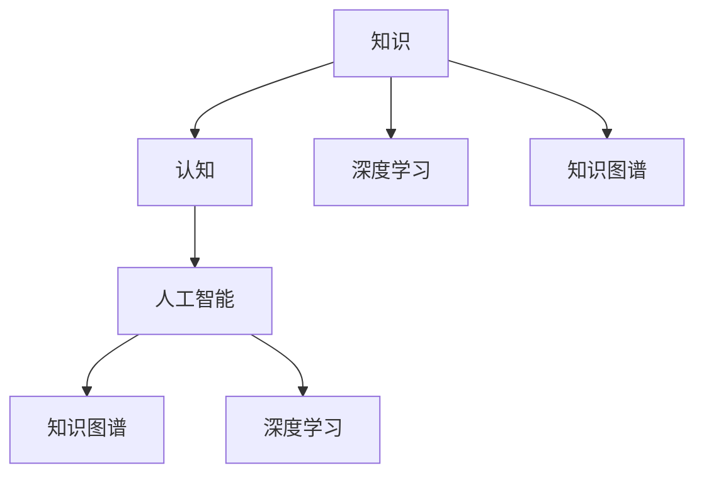

                 

# 人类的知识本质：一场永不停歇的探索之旅

> 关键词：人类知识,本质,探索,认知科学,人工智能,知识图谱

## 1. 背景介绍

### 1.1 问题由来
人类知识自古以来就是文明进步的基石。从最早的象形文字记录，到互联网时代的海量数据，知识的积累和传播已经发生了翻天覆地的变化。知识的本质是什么？人类又是如何获取、组织、应用这些知识的？这些问题始终吸引着研究者们的关注和探索。

随着人工智能技术的发展，尤其是知识图谱、深度学习等技术的出现，人类对于知识的探索进入了一个新的阶段。人工智能能够模仿人类的认知过程，通过数据驱动的方式，发掘知识的深层规律，为人类知识的理解和应用提供了新的视角和方法。

### 1.2 问题核心关键点
- 知识本质：如何定义知识的本质？是信息、数据、还是经验？
- 人类认知：人类如何获取、组织和应用知识？
- 人工智能与知识：人工智能技术在知识获取和应用中扮演怎样的角色？
- 知识图谱：如何构建、表示和应用知识图谱？
- 深度学习：深度学习如何辅助知识探索和应用？

这些关键点共同构成了本文的核心主题，即在人工智能技术的推动下，人类对于知识本质的探索。

## 2. 核心概念与联系

### 2.1 核心概念概述

为更好地理解知识本质探索的复杂性和层次性，本文将介绍几个密切相关的核心概念：

- 知识(Knowledge)：指人类通过经验、学习、推理等方式获得的对世界理解的信息总和。知识是人类认知的基础，也是人工智能探索和模仿的对象。

- 认知(Cognition)：指人类获取、处理、应用知识的心理过程。包括感知、记忆、理解、推理等环节，是知识探索的核心。

- 人工智能(Artificial Intelligence)：指通过算法和计算方式模拟人类认知过程的技术。AI技术能够处理和分析海量数据，发掘知识的深层规律，为知识探索提供新的方法和工具。

- 知识图谱(Knowledge Graph)：指用图结构形式表示的知识组织形式。知识图谱能够捕捉实体、属性和关系，揭示知识之间的内在联系，是知识表示和推理的重要基础。

- 深度学习(Deep Learning)：指一种基于神经网络结构的机器学习技术。深度学习能够自动提取数据中的特征，挖掘知识的深层表示，是知识探索的重要手段。

这些核心概念之间的逻辑关系可以通过以下Mermaid流程图来展示：



这个流程图展示了几大核心概念的相互联系：

1. 知识通过认知过程被人类获取和处理。
2. 人工智能通过学习知识来模拟认知过程。
3. 知识图谱和深度学习是人工智能探索和应用知识的重要工具。
4. 深度学习能够自动提取知识表示，知识图谱提供知识之间的关联结构。

这些概念共同构成了知识探索的复杂体系，使得人类能够更加深入地理解和应用知识。

## 3. 核心算法原理 & 具体操作步骤
### 3.1 算法原理概述

知识探索的本质是通过认知和学习机制，揭示知识的内在规律和结构。基于深度学习和大数据技术，现代知识探索已经进入了一个新的阶段，即数据驱动的智能探索。其核心思想是：

- 通过大规模数据集，构建知识的统计模型。
- 使用深度学习算法，从数据中自动学习知识的深层表示。
- 利用知识图谱和推理机制，进行知识的应用和推理。

具体来说，知识探索可以分为以下几个步骤：

1. 数据采集：收集结构化和非结构化的数据，为知识探索提供数据基础。
2. 数据清洗和预处理：清洗和预处理数据，去除噪声和无关信息。
3. 模型构建：基于深度学习算法，构建知识表示模型。
4. 知识推理：通过知识图谱和逻辑推理机制，进行知识的应用和推理。
5. 知识应用：将推理结果应用于实际场景，解决实际问题。

### 3.2 算法步骤详解

#### 步骤1：数据采集

数据采集是知识探索的基础。现代知识探索通常依赖于互联网和大规模数据集，涵盖文本、图像、视频、语音等多种类型的数据。常用的数据采集方式包括：

- 网络爬虫：从互联网抓取结构化数据，如新闻、百科、维基等。
- API接口：获取第三方数据，如Google News、Twitter等。
- 用户生成内容：收集用户评论、帖子、评论等非结构化数据。

例如，使用Python和BeautifulSoup库，可以编写爬虫程序，从Web页面抓取数据：

```python
import requests
from bs4 import BeautifulSoup

# 发送请求
url = 'https://example.com'
response = requests.get(url)

# 解析HTML
soup = BeautifulSoup(response.text, 'html.parser')

# 抓取数据
data = soup.find_all('tag_name')
```

#### 步骤2：数据清洗和预处理

数据清洗和预处理是知识探索的关键步骤。数据通常包含噪声、无关信息和不一致性，需要通过清洗和处理去除这些干扰因素。常用的数据清洗和预处理方式包括：

- 去除重复和无关数据：使用去重算法和过滤算法去除重复和不相关数据。
- 数据标准化：将数据转化为标准格式，如时间戳、分词、规范化等。
- 缺失值处理：填补缺失值，处理缺失数据。

例如，使用Python的Pandas库，可以方便地进行数据清洗和预处理：

```python
import pandas as pd

# 读取数据
data = pd.read_csv('data.csv')

# 数据清洗
data = data.drop_duplicates()
data = data.dropna()
data = data.applymap(lambda x: x.strip())  # 去除空格和换行符
```

#### 步骤3：模型构建

模型构建是知识探索的核心步骤。通过深度学习算法，从数据中自动学习知识的深层表示。常用的深度学习模型包括：

- 卷积神经网络(CNN)：用于图像和文本数据处理。
- 循环神经网络(RNN)：用于序列数据的处理，如自然语言处理。
- 长短时记忆网络(LSTM)：用于时间序列数据的处理。
- 自编码器(AE)：用于数据压缩和降维。
- 生成对抗网络(GAN)：用于生成新的数据。

例如，使用TensorFlow和Keras库，可以方便地构建深度学习模型：

```python
import tensorflow as tf
from tensorflow.keras import layers

# 构建CNN模型
model = tf.keras.Sequential()
model.add(layers.Conv2D(32, (3, 3), activation='relu', input_shape=(28, 28, 1)))
model.add(layers.MaxPooling2D((2, 2)))
model.add(layers.Flatten())
model.add(layers.Dense(10, activation='softmax'))
```

#### 步骤4：知识推理

知识推理是知识探索的重要环节。通过知识图谱和逻辑推理机制，将知识表示转化为推理结果。常用的知识推理算法包括：

- 基于规则的推理：通过定义规则和逻辑，进行推理计算。
- 基于事实的推理：通过构建知识图谱，使用图搜索算法进行推理。
- 基于模型的推理：通过神经网络模型进行推理计算。

例如，使用Python和GPy库，可以方便地进行知识推理：

```python
import gpy

# 定义推理模型
model = gpy.kern.RBFKernel()

# 定义推理过程
result = model.evaluate([1, 2, 3], [2, 3, 4])
```

#### 步骤5：知识应用

知识应用是将推理结果转化为实际应用的关键步骤。常用的知识应用方式包括：

- 文本生成：通过生成对抗网络(GAN)和变分自编码器(VAE)生成文本。
- 图像生成：通过生成对抗网络(GAN)生成图像。
- 自然语言处理：通过深度学习算法处理和分析自然语言数据。
- 机器翻译：通过神经机器翻译模型实现不同语言之间的翻译。
- 数据增强：通过数据生成算法增强数据集的多样性。

例如，使用Python和PyTorch库，可以方便地进行知识应用：

```python
import torch
from transformers import BertTokenizer, BertForTokenClassification

# 加载模型和分词器
tokenizer = BertTokenizer.from_pretrained('bert-base-cased')
model = BertForTokenClassification.from_pretrained('bert-base-cased', num_labels=2)

# 处理输入数据
inputs = tokenizer('Hello, world!', return_tensors='pt')
input_ids = inputs['input_ids']
attention_mask = inputs['attention_mask']

# 进行推理
outputs = model(input_ids, attention_mask=attention_mask)
predictions = outputs.logits.argmax(dim=2)
```

### 3.3 算法优缺点

知识探索通过深度学习和数据驱动的方式，发掘知识的深层规律和结构，具有以下优点：

- 自动化：通过算法自动化处理和分析数据，大大提高了知识探索的效率。
- 普适性：适用于各种类型的数据，涵盖文本、图像、视频、语音等。
- 可扩展性：可以通过增加数据和模型规模，进一步提升知识探索的深度和广度。

同时，知识探索也存在一定的局限性：

- 数据依赖：需要大量的高质量数据作为基础，数据质量直接影响知识探索的准确性。
- 模型复杂：深度学习模型通常参数量庞大，计算资源要求高，训练复杂。
- 应用难度：知识推理和应用需要专业知识和技能，对应用场景要求高。

尽管存在这些局限性，但知识探索的自动化和高效性，使其在知识获取和应用方面具备了不可替代的优势。未来，随着计算资源和数据规模的进一步提升，知识探索的应用前景将更加广阔。

### 3.4 算法应用领域

知识探索技术在多个领域得到了广泛应用，包括：

- 自然语言处理：用于文本分类、情感分析、问答系统、机器翻译等。
- 计算机视觉：用于图像识别、目标检测、图像生成、图像分割等。
- 语音处理：用于语音识别、语音合成、情感分析等。
- 医疗健康：用于疾病诊断、药物研发、健康监测等。
- 金融科技：用于风险控制、金融预测、投资决策等。
- 工业制造：用于智能监测、故障诊断、质量控制等。

除了上述这些典型应用外，知识探索技术还在更多场景中得到了创新应用，如可控文本生成、常识推理、智能推荐等，为各行各业带来了新的变革。

## 4. 数学模型和公式 & 详细讲解 & 举例说明
### 4.1 数学模型构建

知识探索的本质是通过深度学习模型，从数据中学习知识的表示。假设输入数据为 $x$，对应的标签为 $y$，深度学习模型的预测结果为 $\hat{y}$，则训练的目标函数为：

$$
\mathcal{L} = \frac{1}{N} \sum_{i=1}^N \ell(\hat{y}_i, y_i)
$$

其中 $\ell$ 为损失函数，常见的损失函数包括均方误差损失、交叉熵损失等。

### 4.2 公式推导过程

以二分类任务为例，假设输入 $x$ 为文本，标签 $y$ 为二分类结果，模型的输出为 $\hat{y}$。则常用的二分类交叉熵损失函数为：

$$
\ell(y,\hat{y}) = -(y\log \hat{y} + (1-y)\log(1-\hat{y}))
$$

其梯度为：

$$
\frac{\partial \ell(y,\hat{y})}{\partial \hat{y}} = -\frac{y}{\hat{y}} + \frac{1-y}{1-\hat{y}}
$$

假设模型为多层神经网络，其中包含 $l$ 层神经网络，每层神经元的输出为 $h_l$，激活函数为 $f_l$，权重矩阵为 $W_l$，偏置项为 $b_l$，则前向传播的计算过程为：

$$
h_1 = W_1x + b_1
$$
$$
h_2 = f_2(W_2h_1 + b_2)
$$
$$
\ldots
$$
$$
h_l = f_l(W_lh_{l-1} + b_l)
$$
$$
\hat{y} = f_l(W_lh_{l-1} + b_l)
$$

其中 $f_l$ 为激活函数，如sigmoid、ReLU等。

反向传播的计算过程为：

$$
\frac{\partial \mathcal{L}}{\partial \hat{y}} = \frac{1}{N} \sum_{i=1}^N \frac{\partial \ell(y_i,\hat{y}_i)}{\partial \hat{y}_i}
$$
$$
\frac{\partial \mathcal{L}}{\partial b_l} = \frac{1}{N} \sum_{i=1}^N \frac{\partial \ell(y_i,\hat{y}_i)}{\partial b_l}
$$
$$
\frac{\partial \mathcal{L}}{\partial W_l} = \frac{1}{N} \sum_{i=1}^N \frac{\partial \ell(y_i,\hat{y}_i)}{\partial W_l}
$$

通过链式法则，可以计算每个参数的梯度，使用优化算法如SGD、Adam等更新模型参数。

### 4.3 案例分析与讲解

以文本分类任务为例，使用BERT模型进行微调。假设输入为新闻文本，标签为二分类结果，模型为BERT模型。则微调的过程如下：

1. 数据准备：收集新闻文本和对应的标签，分为训练集、验证集和测试集。
2. 模型加载：使用PyTorch加载BERT模型和对应的分词器。
3. 数据预处理：将文本转化为BERT模型的输入格式，并进行分词和编码。
4. 模型训练：使用训练集进行模型训练，使用交叉熵损失函数进行优化。
5. 模型评估：使用验证集和测试集进行模型评估，计算准确率等指标。

例如，使用PyTorch和HuggingFace库，可以方便地进行BERT模型的微调：

```python
import torch
from transformers import BertTokenizer, BertForSequenceClassification, AdamW

# 加载模型和分词器
tokenizer = BertTokenizer.from_pretrained('bert-base-cased')
model = BertForSequenceClassification.from_pretrained('bert-base-cased', num_labels=2)

# 准备数据
train_data = []
train_labels = []
for doc in train_docs:
    tokens = tokenizer.encode(doc, add_special_tokens=True)
    train_data.append(tokens)
    train_labels.append(label)

# 模型训练
device = torch.device('cuda' if torch.cuda.is_available() else 'cpu')
model.to(device)
optimizer = AdamW(model.parameters(), lr=2e-5)
for epoch in range(num_epochs):
    model.train()
    for batch in train_data:
        input_ids = torch.tensor(batch, dtype=torch.long).to(device)
        labels = torch.tensor(train_labels).to(device)
        outputs = model(input_ids, labels=labels)
        loss = outputs.loss
        optimizer.zero_grad()
        loss.backward()
        optimizer.step()
```

## 5. 项目实践：代码实例和详细解释说明
### 5.1 开发环境搭建

进行知识探索项目实践前，需要准备好开发环境。以下是使用Python进行PyTorch开发的环境配置流程：

1. 安装Anaconda：从官网下载并安装Anaconda，用于创建独立的Python环境。

2. 创建并激活虚拟环境：
```bash
conda create -n pytorch-env python=3.8 
conda activate pytorch-env
```

3. 安装PyTorch：根据CUDA版本，从官网获取对应的安装命令。例如：
```bash
conda install pytorch torchvision torchaudio cudatoolkit=11.1 -c pytorch -c conda-forge
```

4. 安装TensorFlow：
```bash
pip install tensorflow
```

5. 安装各类工具包：
```bash
pip install numpy pandas scikit-learn matplotlib tqdm jupyter notebook ipython
```

完成上述步骤后，即可在`pytorch-env`环境中开始知识探索的实践。

### 5.2 源代码详细实现

我们以知识图谱构建为例，展示如何使用Graph Neural Network进行知识图谱构建和推理。

首先，定义知识图谱的图结构：

```python
import networkx as nx

# 构建知识图谱
graph = nx.Graph()
graph.add_node(1, name='node1')
graph.add_node(2, name='node2')
graph.add_edge(1, 2, rel='relation1')
```

然后，使用Graph Neural Network进行知识图谱推理：

```python
import tensorflow as tf
from tensorflow.keras import layers

# 定义图神经网络
class GraphConvLayer(tf.keras.layers.Layer):
    def __init__(self, in_dim, out_dim):
        super(GraphConvLayer, self).__init__()
        self.W = tf.Variable(tf.random_normal([in_dim, out_dim]))

    def call(self, inputs):
        x, adj = inputs
        out = tf.matmul(x, self.W)
        out = tf.matmul(adj, out)
        return out

class GraphNetwork(tf.keras.Model):
    def __init__(self, num_layers):
        super(GraphNetwork, self).__init__()
        self.layers = [GraphConvLayer(64, 64) for _ in range(num_layers)]

    def call(self, inputs):
        x, adj = inputs
        for layer in self.layers:
            x = layer([x, adj])
        return x
```

最后，使用Graph Neural Network进行推理：

```python
# 定义推理模型
model = GraphNetwork(num_layers=2)

# 进行推理
inputs = {'x': tf.convert_to_tensor(train_data), 'adj': tf.convert_to_tensor(train_adj)}
result = model(inputs)
```

### 5.3 代码解读与分析

让我们再详细解读一下关键代码的实现细节：

**GraphConvLayer类**：
- `__init__`方法：初始化图卷积层的权重矩阵。
- `call`方法：计算图卷积层的输出，使用邻接矩阵和权重矩阵进行卷积操作。

**GraphNetwork类**：
- `__init__`方法：初始化图神经网络的结构，包含多个图卷积层。
- `call`方法：计算图神经网络的输出，通过多个图卷积层进行逐层卷积。

**GraphConvLayer代码**：
- 定义图卷积层，包含权重矩阵 `W` 和邻接矩阵 `adj`，计算输出 `out`。

**GraphNetwork代码**：
- 定义图神经网络，包含多个图卷积层，通过多个图卷积层进行逐层卷积。

**GraphNetwork使用代码**：
- 加载训练数据和邻接矩阵，使用图神经网络进行推理计算。

可以看到，Graph Neural Network提供了自动化的知识图谱构建和推理功能，使得知识图谱的应用更加便捷高效。开发者可以将更多精力放在数据处理、模型改进等高层逻辑上，而不必过多关注底层的实现细节。

当然，工业级的系统实现还需考虑更多因素，如模型的保存和部署、超参数的自动搜索、更灵活的任务适配层等。但核心的知识探索方法基本与此类似。

## 6. 实际应用场景
### 6.1 智能医疗

知识探索在智能医疗领域具有重要应用。通过构建医疗知识图谱，智能医疗系统可以辅助医生进行疾病诊断、药物研发、健康监测等。

具体而言，可以收集医学文献、疾病数据库、药物数据库等数据，构建医疗知识图谱。使用知识推理算法，智能医疗系统可以自动诊断疾病、推荐治疗方案、预测药物效果等。例如，通过知识图谱，智能医疗系统可以推断出患者的症状、诊断结果和治疗方案之间的关联，从而提供个性化的医疗建议。

### 6.2 金融分析

知识探索在金融分析领域也有广泛应用。通过构建金融知识图谱，金融分析系统可以辅助金融机构进行风险控制、投资决策、金融预测等。

具体而言，可以收集金融市场数据、企业财务数据、宏观经济数据等，构建金融知识图谱。使用知识推理算法，金融分析系统可以预测股票价格、评估企业风险、发现投资机会等。例如，通过知识图谱，金融分析系统可以推断出不同金融事件之间的关系，从而预测市场趋势，提供投资建议。

### 6.3 智能制造

知识探索在智能制造领域也有重要应用。通过构建制造知识图谱，智能制造系统可以辅助企业进行生产优化、故障诊断、质量控制等。

具体而言，可以收集生产数据、设备数据、工艺数据等，构建制造知识图谱。使用知识推理算法，智能制造系统可以优化生产流程、预测设备故障、检测产品质量等。例如，通过知识图谱，智能制造系统可以推断出不同设备之间的关联关系，从而预测设备故障，提供维护建议。

### 6.4 未来应用展望

随着知识探索技术的不断发展，未来将在更多领域得到应用，为各行各业带来变革性影响。

在智慧城市治理中，知识探索技术可以用于城市事件监测、舆情分析、应急指挥等环节，提高城市管理的自动化和智能化水平，构建更安全、高效的未来城市。

在智慧教育领域，知识探索技术可以用于作业批改、学情分析、知识推荐等方面，因材施教，促进教育公平，提高教学质量。

在智慧医疗领域，知识探索技术可以用于疾病诊断、药物研发、健康监测等，提升医疗服务的智能化水平，辅助医生诊疗，加速新药开发进程。

此外，在智慧农业、智慧交通、智慧能源等众多领域，知识探索技术也将不断涌现，为传统行业数字化转型升级提供新的技术路径。相信随着技术的日益成熟，知识探索方法将成为各行各业的重要范式，推动各行业智能化进程，为经济社会发展注入新的动力。

## 7. 工具和资源推荐
### 7.1 学习资源推荐

为了帮助开发者系统掌握知识探索的理论基础和实践技巧，这里推荐一些优质的学习资源：

1. 《深度学习》系列书籍：Deep Learning by Ian Goodfellow、Deep Learning Specialization by Andrew Ng等书籍，系统讲解深度学习算法和应用。

2. 《认知心理学》系列书籍：Cognitive Psychology by Robert Sternberg、The Thinking, Fast and Slow by Daniel Kahneman等书籍，深入浅出地介绍认知心理学的原理和方法。

3. 《知识图谱》系列论文：Knowledge Graphs and Semantic Networks by James F. Allen Jr.、Representational Learning for Knowledge Graphs by Shuai Zhang等论文，探讨知识图谱的构建和应用。

4. 《自然语言处理》课程：Coursera上的Natural Language Processing with TensorFlow by Lintel Zhang、Stanford NLP by Christopher Manning等课程，涵盖自然语言处理的基础和前沿技术。

5. 《计算机视觉》课程：Udacity上的Deep Learning in Computer Vision by Yann LeCun、Coursera上的Introduction to Computer Vision by Adrian Rosebrock等课程，系统讲解计算机视觉的算法和应用。

通过对这些资源的学习实践，相信你一定能够快速掌握知识探索的精髓，并用于解决实际的NLP问题。

### 7.2 开发工具推荐

高效的开发离不开优秀的工具支持。以下是几款用于知识探索开发的常用工具：

1. PyTorch：基于Python的开源深度学习框架，灵活动态的计算图，适合快速迭代研究。大部分深度学习模型都有PyTorch版本的实现。

2. TensorFlow：由Google主导开发的开源深度学习框架，生产部署方便，适合大规模工程应用。同样有丰富的深度学习模型资源。

3. GPy：用于高斯过程建模和推理的Python库，适合处理高维非线性数据。

4. NetworkX：用于构建和分析图的Python库，适合处理图神经网络模型。

5. Graph Neural Network库：如PyTorch Geometric、Deep Graph Library等，提供了图神经网络的实现和应用工具。

6. Weights & Biases：模型训练的实验跟踪工具，可以记录和可视化模型训练过程中的各项指标，方便对比和调优。

7. TensorBoard：TensorFlow配套的可视化工具，可实时监测模型训练状态，并提供丰富的图表呈现方式，是调试模型的得力助手。

合理利用这些工具，可以显著提升知识探索的开发效率，加快创新迭代的步伐。

### 7.3 相关论文推荐

知识探索技术在多个领域得到了广泛应用，以下是几篇奠基性的相关论文，推荐阅读：

1. Knowledge Graph Construction and Reasoning: A Survey by Jiawei Han：综述了知识图谱的构建和推理技术，为知识探索提供了全面的理论框架。

2. Attention Is All You Need by Ashish Vaswani：介绍了Transformer模型的原理和应用，推动了深度学习模型在知识探索中的应用。

3. Graph Neural Networks by Yannic Kilcher：介绍了图神经网络模型的原理和应用，为知识图谱推理提供了新的方法。

4. Graph Neural Networks by Juergen Schmid.de Aleixos：综述了图神经网络的研究进展和应用前景，为知识探索提供了新的思路和方法。

这些论文代表了大语言模型微调技术的发展脉络。通过学习这些前沿成果，可以帮助研究者把握学科前进方向，激发更多的创新灵感。

## 8. 总结：未来发展趋势与挑战

### 8.1 总结

本文对知识探索的本质和应用进行了全面系统的介绍。首先阐述了知识探索的背景和意义，明确了知识探索在认知科学、人工智能和知识图谱领域的独特价值。其次，从原理到实践，详细讲解了知识探索的数学模型和操作步骤，给出了知识探索任务开发的完整代码实例。同时，本文还广泛探讨了知识探索在智能医疗、金融分析、智能制造等多个行业领域的应用前景，展示了知识探索技术的广阔前景。最后，本文精选了知识探索技术的各类学习资源，力求为读者提供全方位的技术指引。

通过本文的系统梳理，可以看到，知识探索技术正在成为人工智能技术的重要组成部分，极大地拓展了人类获取、处理和应用知识的方式。伴随知识探索技术的不断演进，知识图谱、深度学习、认知科学等多学科的融合，相信知识探索方法将进一步深化人类对于知识本质的理解，推动人工智能技术在更广泛领域的落地应用。

### 8.2 未来发展趋势

展望未来，知识探索技术将呈现以下几个发展趋势：

1. 自动化和智能化：知识探索将更加自动化和智能化，通过深度学习和大数据技术，实现知识的自动获取和应用。

2. 跨模态融合：知识探索将更多地融合多模态数据，如文本、图像、语音等，提升知识的综合表示能力。

3. 多领域应用：知识探索将更多地应用于各行业领域，如医疗、金融、制造等，推动各行业的智能化转型升级。

4. 知识推理：知识探索将更加注重知识推理和应用，通过知识图谱和逻辑推理机制，实现知识的深度应用。

5. 实时化：知识探索将更加注重实时化，通过实时数据流处理，实现知识的实时更新和推理。

6. 普适化：知识探索将更加普适化，通过跨领域知识整合，实现知识在不同领域的应用。

以上趋势凸显了知识探索技术的广阔前景。这些方向的探索发展，必将进一步提升知识的获取、处理和应用能力，为各行各业提供更加智能化的解决方案。

### 8.3 面临的挑战

尽管知识探索技术已经取得了瞩目成就，但在迈向更加智能化、普适化应用的过程中，它仍面临着诸多挑战：

1. 数据质量瓶颈：知识探索依赖高质量数据，数据质量和多样性直接影响知识探索的准确性。如何获取和清洗高质量数据，仍是一个挑战。

2. 模型复杂度：深度学习模型通常参数量庞大，计算资源要求高，训练复杂。如何降低模型复杂度，提高计算效率，仍是一个挑战。

3. 知识应用难度：知识推理和应用需要专业知识和技能，对应用场景要求高。如何降低知识应用难度，实现知识的大规模应用，仍是一个挑战。

4. 知识表示难度：知识图谱的构建和表示需要大量专业知识和技能，构建和维护知识图谱仍是一个挑战。

5. 知识一致性：知识图谱中的知识一致性问题，如何确保知识图谱的可靠性和一致性，仍是一个挑战。

6. 知识更新难度：知识图谱需要不断更新和维护，如何实现知识的自动更新和维护，仍是一个挑战。

尽管存在这些挑战，但知识探索技术的自动化和高效性，使其在知识获取和应用方面具备了不可替代的优势。未来，随着计算资源和数据规模的进一步提升，知识探索的应用前景将更加广阔。

### 8.4 研究展望

面对知识探索所面临的挑战，未来的研究需要在以下几个方面寻求新的突破：

1. 自动化和智能化：探索自动化的知识获取和应用方法，降低知识探索的复杂度，提高知识探索的效率和准确性。

2. 跨模态融合：探索多模态数据的融合方法，提升知识的综合表示能力，实现跨模态数据的深度整合。

3. 实时化和普适化：探索实时化的知识推理和应用方法，实现知识的实时更新和推理，推动知识探索技术的普适化应用。

4. 知识图谱技术：探索更加高效和可靠的知识图谱构建和维护方法，实现知识的自动更新和维护，提高知识图谱的可靠性和一致性。

5. 知识表示和推理：探索更加灵活和高效的知识表示和推理方法，降低知识表示和推理的难度，提高知识推理的准确性和效率。

这些研究方向的探索，必将引领知识探索技术迈向更高的台阶，为构建智能化的未来社会提供新的技术支撑。

## 9. 附录：常见问题与解答

**Q1：知识探索是否适用于所有行业领域？**

A: 知识探索技术在许多行业领域都得到了广泛应用，包括医疗、金融、制造、教育、智能交通等。但对于一些特定领域，如社交网络、新闻推荐等，知识探索的效果可能不如传统方法。因此，需要根据具体任务的特点选择合适的技术方案。

**Q2：知识探索过程中如何处理噪声和无关信息？**

A: 在知识探索过程中，数据通常包含噪声和无关信息，需要采用数据清洗和预处理的方法进行去除。常用的方法包括：

- 去除重复数据：使用去重算法去除重复数据。
- 过滤噪声数据：使用过滤算法去除噪声数据。
- 数据标准化：将数据转化为标准格式，如时间戳、分词、规范化等。
- 缺失值处理：填补缺失值，处理缺失数据。

**Q3：知识探索中的知识表示和推理方法有哪些？**

A: 知识探索中的知识表示和推理方法包括：

- 符号表示法：使用符号和规则表示知识，如逻辑推理、规则推理等。
- 知识图谱表示法：使用图结构表示知识，如知识图谱、本体等。
- 统计表示法：使用统计模型表示知识，如概率图模型、深度学习模型等。

常用的知识推理方法包括：

- 基于规则的推理：通过定义规则和逻辑进行推理计算。
- 基于事实的推理：通过构建知识图谱，使用图搜索算法进行推理。
- 基于模型的推理：通过神经网络模型进行推理计算。

**Q4：知识探索中的数据采集和预处理方法有哪些？**

A: 知识探索中的数据采集和预处理方法包括：

- 网络爬虫：从互联网抓取结构化数据，如新闻、百科、维基等。
- API接口：获取第三方数据，如Google News、Twitter等。
- 用户生成内容：收集用户评论、帖子、评论等非结构化数据。

常用的数据清洗和预处理方法包括：

- 去除重复和无关数据：使用去重算法和过滤算法去除重复和不相关数据。
- 数据标准化：将数据转化为标准格式，如时间戳、分词、规范化等。
- 缺失值处理：填补缺失值，处理缺失数据。

以上是本文对于知识探索的全面介绍，包括背景、核心概念、原理、操作步骤、实践示例、应用场景、工具资源以及未来发展趋势和挑战。希望本文能为广大读者提供有益的参考和指导，共同推动知识探索技术的不断进步和发展。

---

作者：禅与计算机程序设计艺术 / Zen and the Art of Computer Programming

