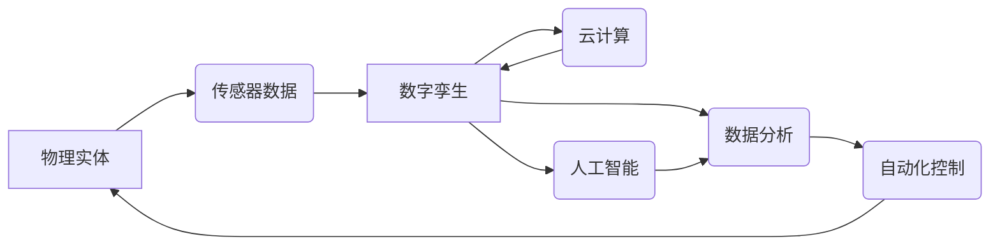
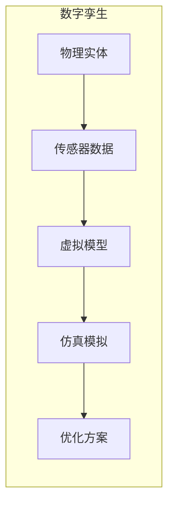

> 数字孪生、物理实体、自动化、机器学习、深度学习、传感器网络、云计算

## 1. 背景介绍

随着物联网、人工智能和云计算技术的快速发展，数字实体与物理实体的融合正在深刻地改变着我们的世界。数字实体，即基于数字模型的虚拟表示，能够实时反映物理实体的状态、行为和环境。数字孪生技术作为数字实体与物理实体之间桥梁，使得我们可以对物理世界进行更深入的理解和控制。

传统工业生产模式面临着效率低下、成本高昂、可持续性差等问题。而数字孪生技术可以帮助我们构建虚拟的生产环境，进行模拟和优化，从而提高生产效率、降低成本、提升产品质量和可持续性。

## 2. 核心概念与联系

**2.1 数字孪生**

数字孪生是指基于物理实体的虚拟模型，它能够实时反映物理实体的状态、行为和环境。数字孪生包含了物理实体的几何形状、物理属性、传感器数据、运行状态等信息。

**2.2 物理实体**

物理实体是指真实存在的物质对象，例如机器设备、车辆、建筑物、人员等。

**2.3 自动化**

自动化是指利用计算机和机器人等技术，使生产过程或其他任务能够自动完成，无需人工干预。

**2.4 连接性**

连接性是指物理实体和数字实体之间的数据交换和通信能力。

**2.5 数据分析**

数据分析是指对收集到的数据进行处理和分析，以从中提取有价值的信息。

**2.6 人工智能**

人工智能是指模拟人类智能的计算机系统，例如机器学习、深度学习等。

**2.7 云计算**

云计算是指利用互联网提供计算资源、存储资源和软件服务的模式。

**2.8 核心概念关系图**



## 3. 核心算法原理 & 具体操作步骤

**3.1 算法原理概述**

数字孪生技术的核心算法包括数据采集、数据处理、模型构建、仿真模拟和控制决策等环节。

* **数据采集:** 利用传感器网络收集物理实体的状态、行为和环境数据。
* **数据处理:** 对采集到的数据进行清洗、预处理和特征提取。
* **模型构建:** 基于数据分析，构建物理实体的数字孪生模型。
* **仿真模拟:** 利用数字孪生模型进行仿真模拟，预测物理实体的未来状态和行为。
* **控制决策:** 根据仿真模拟结果，制定控制策略，对物理实体进行自动化控制。

**3.2 算法步骤详解**

1. **部署传感器网络:** 在物理实体周围部署传感器网络，收集物理实体的状态、行为和环境数据。
2. **数据采集和传输:** 传感器采集到的数据通过网络传输到云平台。
3. **数据预处理:** 对采集到的数据进行清洗、格式转换和缺失值处理。
4. **特征提取:** 利用机器学习算法，从数据中提取有价值的特征。
5. **模型构建:** 基于提取的特征，构建物理实体的数字孪生模型。
6. **仿真模拟:** 利用数字孪生模型进行仿真模拟，预测物理实体的未来状态和行为。
7. **控制决策:** 根据仿真模拟结果，制定控制策略，对物理实体进行自动化控制。

**3.3 算法优缺点**

**优点:**

* 提高生产效率和降低成本
* 提升产品质量和可持续性
* 增强对物理实体的理解和控制
* 促进创新和发展

**缺点:**

* 建立数字孪生模型需要大量数据和计算资源
* 模型精度受数据质量和算法复杂度影响
* 需要专业的技术人员进行开发和维护

**3.4 算法应用领域**

数字孪生技术应用领域广泛，包括：

* 制造业: 生产过程优化、设备维护、产品设计
* 能源行业: 电网管理、能源效率提升、风力发电优化
* 交通运输: 交通流量管理、车辆调度、道路安全
* 建筑行业: 建筑设计、施工管理、建筑运营
* 医疗保健: 虚拟手术模拟、疾病诊断、个性化医疗

## 4. 数学模型和公式 & 详细讲解 & 举例说明

**4.1 数学模型构建**

数字孪生模型通常采用基于物理学的模型、数据驱动模型或混合模型。

* **基于物理学的模型:** 基于物理定律和方程，建立物理实体的数学模型。例如，机械系统的运动模型可以采用牛顿第二定律。
* **数据驱动模型:** 利用机器学习算法，从数据中学习物理实体的特征和行为模式。例如，可以使用神经网络预测机器设备的故障概率。
* **混合模型:** 将基于物理学的模型和数据驱动模型结合起来，提高模型的精度和鲁棒性。

**4.2 公式推导过程**

例如，考虑一个简单的机械系统，其运动方程可以表示为：

$$m\ddot{x} + c\dot{x} + kx = F(t)$$

其中：

* $m$ 是质量
* $c$ 是阻尼系数
* $k$ 是弹簧系数
* $x$ 是位移
* $\dot{x}$ 是速度
* $\ddot{x}$ 是加速度
* $F(t)$ 是外力

**4.3 案例分析与讲解**

例如，可以利用数字孪生技术对风力发电机组进行仿真模拟，预测其发电量和故障概率。通过分析风力发电机组的运行数据，建立其数字孪生模型，并利用仿真模拟预测其在不同风速条件下的发电量和故障概率。

## 5. 项目实践：代码实例和详细解释说明

**5.1 开发环境搭建**

* 操作系统: Ubuntu 20.04
* 编程语言: Python 3.8
* 软件包: TensorFlow, PyTorch, NumPy, Pandas, Matplotlib

**5.2 源代码详细实现**

```python
import tensorflow as tf

# 定义神经网络模型
model = tf.keras.models.Sequential([
    tf.keras.layers.Dense(128, activation='relu', input_shape=(10,)),
    tf.keras.layers.Dense(64, activation='relu'),
    tf.keras.layers.Dense(1)
])

# 编译模型
model.compile(optimizer='adam', loss='mse')

# 训练模型
model.fit(X_train, y_train, epochs=100)

# 评估模型
loss = model.evaluate(X_test, y_test)
print('Loss:', loss)
```

**5.3 代码解读与分析**

这段代码实现了基于深度学习的数字孪生模型。

* 首先定义了一个神经网络模型，包含三个全连接层。
* 然后编译模型，使用 Adam 优化器和均方误差损失函数。
* 接着训练模型，使用训练数据进行训练。
* 最后评估模型，使用测试数据计算模型的损失值。

**5.4 运行结果展示**

训练完成后，可以将模型应用于预测物理实体的状态和行为。例如，可以利用训练好的模型预测风力发电机组的未来发电量。

## 6. 实际应用场景

**6.1 制造业**

* **生产过程优化:** 利用数字孪生技术模拟生产过程，优化生产流程和参数，提高生产效率和产品质量。
* **设备维护:** 通过监测设备运行数据，预测设备故障，提前进行维护，降低设备停机时间和维修成本。
* **产品设计:** 利用数字孪生技术进行虚拟产品测试，优化产品设计，缩短产品开发周期。

**6.2 能源行业**

* **电网管理:** 利用数字孪生技术模拟电网运行状态，预测电力需求，优化电力调度，提高电网稳定性和可靠性。
* **能源效率提升:** 通过监测能源消耗数据，识别能源浪费环节，优化能源使用方式，提高能源效率。
* **风力发电优化:** 利用数字孪生技术预测风力发电量，优化风力发电机组运行策略，提高发电效率。

**6.3 交通运输**

* **交通流量管理:** 利用数字孪生技术模拟交通流量，预测交通拥堵情况，优化交通信号灯控制，缓解交通拥堵。
* **车辆调度:** 利用数字孪生技术优化车辆调度方案，提高车辆利用率，降低运输成本。
* **道路安全:** 利用数字孪生技术模拟道路交通场景，预测交通事故风险，提高道路安全。

**6.4 未来应用展望**

数字孪生技术在未来将得到更广泛的应用，例如：

* **智慧城市:** 利用数字孪生技术构建城市虚拟模型，优化城市规划和管理，提高城市生活质量。
* **个性化医疗:** 利用数字孪生技术构建患者虚拟模型，进行个性化疾病诊断和治疗方案制定。
* **虚拟现实和增强现实:** 利用数字孪生技术增强虚拟现实和增强现实体验，创造更逼真的虚拟世界。

## 7. 工具和资源推荐

**7.1 学习资源推荐**

* **书籍:**
    * 《数字孪生：从概念到实践》
    * 《工业互联网》
* **在线课程:**
    * Coursera: 数字孪生
    * edX: 物联网和数字孪生
* **网站:**
    * 数字孪生联盟 (Digital Twin Consortium)
    * 物联网论坛 (IoT Forum)

**7.2 开发工具推荐**

* **云平台:**
    * AWS
    * Azure
    * Google Cloud
* **数据分析工具:**
    * Python (Pandas, NumPy, Scikit-learn)
    * R
* **仿真模拟工具:**
    * ANSYS
    * COMSOL

**7.3 相关论文推荐**

* **数字孪生的定义和分类:**
    * Tao, Y., et al. (2019). Digital twin: A comprehensive review. IEEE Access, 7, 10417-10436.
* **数字孪生技术在制造业中的应用:**
    * Grieves, M., et al. (2014). Digital twins. In Proceedings of the 2014 IEEE International Conference on Industrial Technology (ICIT) (pp. 1-6). IEEE.
* **数字孪生技术在能源行业的应用:**
    * Lee, J., et al. (2018). Digital twin for smart grid: A review. IEEE Access, 6, 39437-39450.


## 8. 总结：未来发展趋势与挑战

**8.1 研究成果总结**

数字孪生技术已经取得了显著的成果，在制造业、能源行业、交通运输等领域得到了广泛应用。例如，在制造业中，数字孪生可以用于产品设计、生产过程优化、设备故障预测等方面；在能源行业，数字孪生可以用于电力系统仿真、风力发电预测、油气管道监测等方面；在交通运输领域，数字孪生可以用于交通流量预测、自动驾驶仿真、智慧城市建设等方面。

**8.2 未来发展趋势**

* **模型精度提升:**  未来，数字孪生技术将更加注重模型的精度和可靠性。利用更先进的机器学习算法和数据分析技术，可以从海量数据中提取更精准的信息，构建更精细的模型，从而提高数字孪生的预测和决策能力。例如，可以利用深度学习算法分析传感器数据，识别设备故障的早期征兆，提前进行维护，避免重大损失。
* **多物理场耦合:**  现实世界中的系统往往涉及多个物理场的相互作用，例如力学、热力学、电磁学等。未来的数字孪生技术将更加注重多物理场耦合，构建更全面的模型，更准确地模拟现实世界的复杂现象。例如，在航空航天领域，可以构建包含空气动力学、结构力学、热力学等多个物理场的飞机数字孪生模型，用于飞机设计、飞行仿真、故障诊断等方面。
* **边缘计算:**  随着物联网技术的快速发展，越来越多的数据将在边缘设备上产生。将数字孪生模型部署到边缘设备上，可以实现实时数据处理和决策，降低网络延迟，提高系统的响应速度和效率。例如，在自动驾驶领域，可以将车辆数字孪生模型部署到车载计算平台上，实时感知周围环境，做出驾驶决策。
* **人工智能集成:**  人工智能技术可以赋予数字孪生模型更强大的分析和决策能力。未来，数字孪生技术将更加注重与人工智能技术的结合，实现智能化控制和预测。例如，可以利用机器学习算法分析数字孪生模型的历史数据，预测设备故障的发生时间和原因，并自动生成维修方案。

**8.3 面临的挑战**

* **数据质量:**  数字孪生模型的精度依赖于数据的质量。在实际应用中，需要解决数据采集、清洗、预处理等问题，才能保证数据的准确性和可靠性。例如，传感器数据可能存在噪声、缺失、异常等问题，需要进行数据清洗和预处理，才能用于构建数字孪生模型。
* **模型复杂度:**  数字孪生模型的复杂度较高，需要强大的计算资源和算法优化技术。例如，大型复杂系统的数字孪生模型可能包含数百万甚至数亿个参数，需要高性能计算平台和高效的仿真算法才能运行。
* **安全性和隐私:**  数字孪生模型涉及到大量敏感数据，例如设备运行参数、生产工艺数据、个人位置信息等。需要采取有效的安全措施，保障数据安全和隐私。例如，可以采用数据加密、访问控制、身份认证等技术，防止数据泄露和滥用。

**8.4 研究展望**

未来，数字孪生技术将继续发展，在更多领域得到应用，为我们创造更美好的未来。以下是一些值得关注的研究方向：

* **数字孪生城市:**  构建城市的数字孪生模型，用于城市规划、交通管理、环境监测、灾害预警等方面。
* **数字孪生医疗:**  构建人体器官的数字孪生模型，用于疾病诊断、治疗方案制定、药物研发等方面。
* **数字孪生农业:**  构建农作物、养殖场的数字孪生模型，用于农业生产管理、病虫害防治、农产品溯源等方面。

## 9. 附录：常见问题与解答

**9.1 数字孪生与仿真有什么区别？**

数字孪生和仿真相似，但又有所区别。仿真通常是指利用计算机模型模拟现实世界的过程，而数字孪生则是指在虚拟世界中创建物理实体的数字副本，并通过数据连接实现虚实交互。

**9.2 数字孪生需要哪些技术？**

数字孪生技术涉及多个学科领域，包括物联网、大数据、云计算、人工智能、仿真技术等。

**9.3 数字孪生有哪些应用场景？**

数字孪生技术可以应用于制造业、能源行业、交通运输、医疗健康、智慧城市等多个领域。

**9.4 数字孪生的未来发展趋势是什么？**

未来，数字孪生技术将更加注重模型精度、多物理场耦合、边缘计算、人工智能集成等方面的发展。


### 作者：禅与计算机程序设计艺术 / Zen and the Art of Computer Programming 


-----


# 数字孪生技术：从概念到实践2

> 关键词：数字孪生，模型，仿真，数据，物联网，人工智能，工业4.0

## 1. 背景介绍

数字孪生 (Digital Twin) 是一种将物理实体的虚拟模型与现实世界中的传感器数据连接在一起的技术。数字孪生模型能够实时地模拟物理实体的行为，并根据实际数据进行更新和调整，从而为决策和优化提供支持。

### 1.1 问题的由来

随着物联网、大数据、人工智能等技术的快速发展，人们对物理世界和虚拟世界之间的交互需求日益增长。传统的物理模型和仿真系统往往无法满足实时性、精准性和可交互性的要求。因此，数字孪生技术应运而生，旨在构建一个能够实时反映物理实体状态，并进行预测和控制的虚拟模型。

### 1.2 研究现状

数字孪生技术近年来得到了快速发展，在多个领域展现出巨大的应用潜力。目前，数字孪生技术已在以下领域得到应用：

- **制造业：** 用于产品设计、生产过程优化、设备维护预测等。
- **能源行业：** 用于电网运行管理、能源消耗预测、设备故障诊断等。
- **交通运输：** 用于交通流量预测、车辆调度优化、道路安全管理等。
- **医疗健康：** 用于患者治疗方案制定、手术模拟、远程医疗等。

### 1.3 研究意义

数字孪生技术具有重要的研究意义：

- **提高效率:** 通过实时监控和预测，可以优化生产流程、降低成本、提高效率。
- **增强安全性:** 通过模拟潜在风险，可以提前预警并采取措施，保证系统安全。
- **促进创新:** 通过虚拟模型的实验和测试，可以加速产品研发和创新。

### 1.4 本文结构

本文将深入探讨数字孪生技术，从概念到实践，涵盖以下内容：

- **第二部分:** 介绍数字孪生的核心概念和联系。
- **第三部分:** 详细阐述数字孪生模型构建的算法原理和步骤。
- **第四部分:** 使用数学模型和公式对数字孪生模型进行刻画。
- **第五部分:** 提供数字孪生模型的代码实现示例。
- **第六部分:** 探讨数字孪生技术在实际应用场景中的应用。
- **第七部分:** 推荐数字孪生技术的学习资源和开发工具。
- **第八部分:** 总结数字孪生技术的发展趋势和挑战。
- **第九部分:** 附录，解答常见问题。

## 2. 核心概念与联系

数字孪生技术的核心是构建一个能够实时反映物理实体状态的虚拟模型。该模型需要与现实世界中的传感器数据进行连接，并根据数据进行实时更新和调整。数字孪生模型可以进行仿真模拟，预测未来状态，并提供优化方案。

### 2.1 关键概念

* **物理实体:** 数字孪生模型所模拟的实际存在的物理对象，例如机器、设备、建筑物等。
* **虚拟模型:** 基于物理实体的数字化模型，包含了物理实体的结构、功能和行为信息。
* **传感器数据:** 来自物理实体的实时数据，例如温度、压力、速度等。
* **仿真模拟:** 使用虚拟模型模拟物理实体的行为，预测其未来状态。
* **优化方案:** 基于仿真模拟结果，制定优化策略，例如提高效率、降低成本、增强安全性等。

### 2.2 概念联系

数字孪生的概念联系如下图所示：



可以看出，数字孪生技术将物理实体、传感器数据、虚拟模型、仿真模拟和优化方案紧密地联系在一起，形成了一个完整的闭环系统。

## 3. 核心算法原理 & 具体操作步骤

数字孪生模型构建的核心是利用机器学习算法对传感器数据进行分析和建模，并根据模型进行仿真模拟和优化。

### 3.1 算法原理概述

数字孪生模型构建的常用算法包括：

* **线性回归:** 用于建立传感器数据与物理实体状态之间的线性关系。
* **支持向量机:** 用于对传感器数据进行分类和回归。
* **神经网络:** 用于建立更复杂的非线性模型，模拟物理实体的复杂行为。
* **贝叶斯网络:** 用于对传感器数据进行概率推断和预测。

### 3.2 算法步骤详解

数字孪生模型构建的步骤如下：

1. **数据采集:** 从物理实体的传感器收集实时数据。
2. **数据清洗和预处理:** 对数据进行噪声去除、缺失值填充等预处理。
3. **模型训练:** 使用机器学习算法对数据进行建模，训练数字孪生模型。
4. **模型验证:** 使用验证集评估模型的精度和泛化能力。
5. **模型部署:** 将训练好的模型部署到云端或边缘设备上。
6. **实时数据更新:** 使用传感器数据实时更新数字孪生模型。
7. **仿真模拟:** 使用模型进行仿真模拟，预测物理实体的未来状态。
8. **优化方案:** 根据仿真结果制定优化策略。

### 3.3 算法优缺点

数字孪生模型构建的算法各有优缺点：

* **线性回归:** 简单易懂，但适用范围有限。
* **支持向量机:** 泛化能力强，但对数据质量要求较高。
* **神经网络:** 表达能力强，但训练成本较高。
* **贝叶斯网络:** 可处理不确定性，但模型结构复杂。

### 3.4 算法应用领域

不同的算法适用于不同的应用场景：

* **线性回归:** 适合用于模拟线性关系，例如温度、压力等物理量之间的关系。
* **支持向量机:** 适合用于分类和回归问题，例如设备故障诊断、运行状态分类等。
* **神经网络:** 适合用于模拟非线性关系，例如复杂控制系统、机器学习预测等。
* **贝叶斯网络:** 适合用于处理不确定性信息，例如天气预测、故障诊断等。

## 4. 数学模型和公式 & 详细讲解 & 举例说明

### 4.1 数学模型构建

假设物理实体的状态可以用向量 $x \in R^n$ 表示，传感器数据可以用向量 $y \in R^m$ 表示。数字孪生模型的目标是建立 $x$ 和 $y$ 之间的映射关系，即：

$$
x = f(y)
$$

其中 $f$ 是一个非线性函数，可以是线性回归模型、支持向量机、神经网络等。

### 4.2 公式推导过程

以线性回归模型为例，模型的表达式为：

$$
x = Wy + b
$$

其中 $W \in R^{n \times m}$ 是权重矩阵，$b \in R^n$ 是偏置向量。

模型训练的目标是找到最优的 $W$ 和 $b$，使得模型的预测误差最小。常用的损失函数是平方误差损失函数：

$$
L = \frac{1}{N} \sum_{i=1}^N ||x_i - Wy_i - b||^2
$$

其中 $N$ 是样本数量。

### 4.3 案例分析与讲解

以一个简单的电机温度预测为例，假设我们有一个电机，其温度可以用传感器测量，并用向量 $y$ 表示。我们希望建立一个数字孪生模型，根据电机运行状态预测其温度。

我们可以使用线性回归模型进行训练，模型的输入是电机运行状态，输出是电机温度。训练完成后，可以使用该模型对电机温度进行预测。

## 5. 项目实践：代码实例和详细解释说明

### 5.1 开发环境搭建

为了构建数字孪生模型，需要使用机器学习库和数据处理库，例如：

* **Python:** 一种常用的编程语言，拥有丰富的机器学习库。
* **Scikit-learn:** Python的机器学习库，包含多种算法和工具。
* **TensorFlow:** Google开发的机器学习库，适用于大型模型训练。
* **PyTorch:** Facebook开发的机器学习库，灵活易用。
* **Pandas:** Python的数据处理库，用于数据读取、清洗和分析。

### 5.2 源代码详细实现

```python
import pandas as pd
from sklearn.model_selection import train_test_split
from sklearn.linear_model import LinearRegression
from sklearn.metrics import mean_squared_error

# 读取数据
data = pd.read_csv("motor_data.csv")

# 分割数据
X = data[["speed", "load"]]
y = data["temperature"]
X_train, X_test, y_train, y_test = train_test_split(X, y, test_size=0.2)

# 训练模型
model = LinearRegression()
model.fit(X_train, y_train)

# 评估模型
y_pred = model.predict(X_test)
mse = mean_squared_error(y_test, y_pred)
print("均方误差:", mse)

# 预测
new_data = [[1000, 50]]
temperature = model.predict(new_data)
print("预测温度:", temperature)
```

### 5.3 代码解读与分析

代码首先读取电机运行状态和温度数据，并将其分割为训练集和测试集。然后使用线性回归模型对训练集进行训练，并使用测试集评估模型的精度。最后，使用训练好的模型对新的电机运行状态进行预测。

### 5.4 运行结果展示

运行代码后，可以得到模型的均方误差和对新数据的预测结果。

## 6. 实际应用场景

数字孪生技术在各个领域都有广泛的应用，例如：

### 6.1 制造业

* **产品设计:** 使用数字孪生模型模拟产品在不同场景下的性能，优化产品设计。
* **生产过程优化:** 通过模拟生产过程，优化生产参数，提高生产效率。
* **设备维护预测:** 通过监控设备运行状态，预测设备故障，提前进行维护，避免停机损失。

### 6.2 能源行业

* **电网运行管理:** 使用数字孪生模型模拟电网运行状态，优化电网调度，提高供电效率。
* **能源消耗预测:** 通过分析历史数据和天气信息，预测能源消耗，优化能源管理。
* **设备故障诊断:** 通过监控设备运行数据，快速诊断设备故障，及时处理，避免重大安全事故。

### 6.3 交通运输

* **交通流量预测:** 通过分析历史交通数据，预测交通流量，优化交通信号灯控制，缓解交通拥堵。
* **车辆调度优化:** 使用数字孪生模型模拟车辆运行状态，优化车辆调度，提高运输效率。
* **道路安全管理:** 通过监控道路状况，及时发现安全隐患，并采取措施，提高道路安全性。

### 6.4 未来应用展望

未来，数字孪生技术将继续发展，在更多领域得到应用，例如：

* **智慧城市:** 用于城市规划、交通管理、环境监测等。
* **智慧农业:** 用于农业生产管理、病虫害预测、精准施肥等。
* **智慧医疗:** 用于患者健康管理、手术模拟、远程医疗等。

## 7. 工具和资源推荐

### 7.1 学习资源推荐

* **数字孪生技术白皮书:** 由相关机构发布的白皮书，对数字孪生技术进行详细介绍。
* **数字孪生技术书籍:** 涵盖数字孪生技术原理、应用和案例的书籍。
* **数字孪生技术课程:** 由高校或机构开设的数字孪生技术课程。

### 7.2 开发工具推荐

* **MATLAB:** 一款功能强大的科学计算软件，拥有丰富的数字孪生模型构建工具。
* **Siemens PLM:** 一款工业软件，提供了数字孪生模型开发和仿真平台。
* **ANSYS:** 一款仿真软件，用于模拟物理现象和进行数字孪生模型开发。

### 7.3 相关论文推荐

* **Digital Twin: A Framework for the Future of Healthcare:** 讨论数字孪生技术在医疗健康领域的应用。
* **Digital Twin for Smart Manufacturing: A Comprehensive Review:** 概述了数字孪生技术在制造业中的应用。

## 8. 总结：未来发展趋势与挑战

**8.1 研究成果总结**

数字孪生技术已经取得了显著的成果，在制造业、能源行业、交通运输等领域得到了广泛应用。

**8.2 未来发展趋势**

* **模型精度提升:** 利用更先进的机器学习算法和数据分析技术，提高数字孪生模型的精度和可靠性。
* **多物理场耦合:** 将多个物理场（例如力学、热力学、电磁学）耦合到数字孪生模型中，模拟更复杂的物理现象。
* **边缘计算:** 将数字孪生模型部署到边缘设备上，实现实时数据处理和决策，降低网络延迟。
* **人工智能集成:** 将人工智能技术与数字孪生技术结合，实现智能化控制和预测。

**8.3 面临的挑战**

* **数据质量:** 数字孪生模型的精度依赖于数据质量，需要解决数据采集、清洗和预处理等问题。
* **模型复杂度:** 数字孪生模型的复杂度较高，需要强大的计算资源和算法优化技术。
* **安全性和隐私:** 数字孪生模型涉及到大量敏感数据，需要保障数据安全和隐私。

**8.4 研究展望**

未来，数字孪生技术将继续发展，在更多领域得到应用，为我们创造更美好的未来。


## 9. 附录：常见问题与解答

**9.1 数字孪生技术的应用场景有哪些？**

数字孪生技术在多个领域都有广泛的应用，例如制造业、能源行业、交通运输、医疗健康等。

**9.2 如何构建数字孪生模型？**

数字孪生模型的构建需要多个步骤，包括数据采集、数据清洗和预处理、模型训练、模型验证、模型部署、实时数据更新、仿真模拟和优化方案。

**9.3 数字孪生技术面临哪些挑战？**

数字孪生技术面临的主要挑战包括数据质量、模型复杂度、安全性和隐私。

**9.4 数字孪生技术的未来发展趋势是什么？**

未来，数字孪生技术将继续发展，在更多领域得到应用，例如智慧城市、智慧农业、智慧医疗等。

---

作者：禅与计算机程序设计艺术 / Zen and the Art of Computer Programming