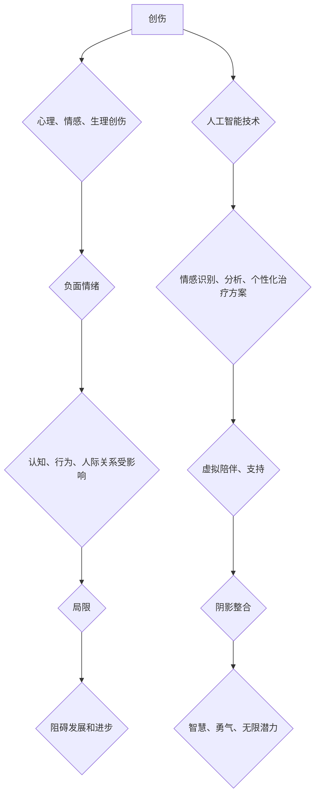

>  创伤转化，智慧，勇气，局限，无限潜力，人工智能，深度学习，神经网络，心理疗愈，自我认知，技术应用

## 1. 背景介绍

在瞬息万变的科技时代，我们不断追求进步和突破，渴望突破自身的局限，实现无限的潜力。然而，在前进的道路上，我们难免会遇到挫折、失败和创伤。这些负面经历如同阴影，笼罩着我们的内心，阻碍着我们前行的步伐。

传统的心理疗愈方法侧重于挖掘和处理创伤的根源，帮助人们走出阴影。而人工智能技术的出现，为我们提供了全新的视角和工具，让我们能够以更科学、更有效的方式整合阴影，将创伤转化为智慧，将恐惧转化为勇气，将自身的局限转化为无限的潜力。

## 2. 核心概念与联系

**2.1 创伤与局限**

创伤是指个人在经历了某些负面事件后，所产生的心理、情感和生理上的创伤。这些创伤可能会导致一系列负面情绪，例如恐惧、焦虑、抑郁等，并影响个体的认知、行为和人际关系。

局限是指个人在能力、知识、经验等方面存在的限制。这些局限可能会来自于自身的先天条件、后天环境、教育背景等因素，并阻碍个体的发展和进步。

**2.2 人工智能与心理疗愈**

人工智能技术，特别是深度学习和神经网络，能够模拟人类大脑的学习和推理过程，并通过海量数据的训练，识别和分析复杂的人类情感和行为模式。

人工智能在心理疗愈领域的应用，主要体现在以下几个方面：

* **情感识别和分析:** 利用人工智能技术，可以对个人的语言、表情、肢体动作等进行分析，识别其潜在的情绪状态，并提供相应的建议和支持。
* **个性化治疗方案:** 基于个人的心理特征和治疗需求，人工智能可以根据大数据分析，制定个性化的治疗方案，提高治疗效果。
* **虚拟陪伴和支持:** 人工智能虚拟助手可以提供24小时的陪伴和支持，帮助个体缓解孤独感和焦虑情绪，并鼓励其积极面对生活挑战。

**2.3 阴影整合与无限潜力**

阴影整合是指将个体内心深处的阴影面，也就是那些被压抑、忽视或否认的负面情绪、想法和经历，整合到整体的自我认知中，从而实现自我完善和成长。

人工智能技术可以帮助我们更好地理解和处理阴影，并将其转化为智慧和力量。通过人工智能辅助的心理疗愈，我们可以：

* **更深入地了解自己的阴影:** 人工智能可以帮助我们识别和分析那些潜藏在内心深处的阴影，并提供更清晰的自我认知。
* **更有效地处理阴影:** 人工智能可以提供科学的处理方法，帮助我们更好地应对阴影带来的负面情绪和影响。
* **将阴影转化为智慧:** 通过整合阴影，我们可以获得更全面的自我认知，并从中汲取智慧和力量，推动自身的成长和进步。

**2.4 Mermaid 流程图**



## 3. 核心算法原理 & 具体操作步骤

**3.1 算法原理概述**

阴影整合算法的核心原理是基于深度学习和神经网络，通过训练大量的文本数据和心理咨询案例，建立一个能够识别和分析人类情感和行为模式的模型。该模型能够识别个体内心深处的阴影，并提供相应的处理建议和支持。

**3.2 算法步骤详解**

1. **数据收集和预处理:** 收集大量的心理咨询案例、文本数据和相关研究资料，并进行清洗、标注和格式化处理。
2. **模型构建:** 利用深度学习框架，构建一个多层神经网络模型，包括输入层、隐藏层和输出层。
3. **模型训练:** 使用收集到的数据对模型进行训练，调整模型参数，使其能够准确识别和分析人类情感和行为模式。
4. **模型评估:** 使用测试数据对模型进行评估，评估模型的准确率、召回率和F1-score等指标。
5. **模型部署:** 将训练好的模型部署到云平台或本地服务器，提供阴影整合服务。

**3.3 算法优缺点**

**优点:**

* **高准确率:** 深度学习模型能够识别和分析复杂的人类情感和行为模式，具有较高的准确率。
* **个性化治疗:** 基于个人的心理特征和治疗需求，可以提供个性化的治疗方案。
* **24小时服务:** 人工智能虚拟助手可以提供24小时的陪伴和支持。

**缺点:**

* **数据依赖:** 深度学习模型需要大量的训练数据，数据质量直接影响模型性能。
* **伦理问题:** 人工智能在心理疗愈领域的应用，需要考虑伦理问题，例如数据隐私、算法偏见等。

**3.4 算法应用领域**

* **心理咨询:** 为心理咨询师提供辅助诊断和治疗建议。
* **情绪管理:** 帮助个体识别和管理负面情绪，提高心理健康水平。
* **自我认知:** 帮助个体更深入地了解自己的内心世界，实现自我成长。

## 4. 数学模型和公式 & 详细讲解 & 举例说明

**4.1 数学模型构建**

阴影整合算法可以构建一个基于神经网络的数学模型，该模型可以表示为以下形式：

$$
y = f(W x + b)
$$

其中：

* $y$ 是模型的输出，表示个体的心理状态或情绪。
* $x$ 是模型的输入，表示个体的心理咨询记录、文本数据等。
* $W$ 是模型的权重矩阵，表示不同输入特征之间的权重关系。
* $b$ 是模型的偏置向量，表示模型的初始状态。
* $f$ 是激活函数，用于将线性输出转换为非线性输出。

**4.2 公式推导过程**

模型的训练过程是通过最小化损失函数来实现的。损失函数通常定义为预测值与真实值的差值。

$$
L(y, \hat{y}) = \frac{1}{2} \sum_{i=1}^{n} (y_i - \hat{y}_i)^2
$$

其中：

* $L$ 是损失函数。
* $y$ 是真实值。
* $\hat{y}$ 是预测值。
* $n$ 是样本数量。

通过梯度下降算法，不断更新模型的权重和偏置，使得损失函数最小化。

**4.3 案例分析与讲解**

假设我们有一个心理咨询案例，个体描述了其焦虑和抑郁的情绪。我们可以将个体的描述作为模型的输入，模型会根据训练数据，预测个体的焦虑和抑郁程度。

如果模型预测的焦虑和抑郁程度较高，则可以建议个体寻求专业的心理咨询，并提供一些应对焦虑和抑郁的建议。

## 5. 项目实践：代码实例和详细解释说明

**5.1 开发环境搭建**

* 操作系统：Ubuntu 20.04
* Python 版本：3.8
* 深度学习框架：TensorFlow 2.0

**5.2 源代码详细实现**

```python
import tensorflow as tf

# 定义模型结构
model = tf.keras.models.Sequential([
    tf.keras.layers.Embedding(input_dim=10000, output_dim=128),
    tf.keras.layers.LSTM(units=64),
    tf.keras.layers.Dense(units=1, activation='sigmoid')
])

# 编译模型
model.compile(optimizer='adam', loss='binary_crossentropy', metrics=['accuracy'])

# 训练模型
model.fit(x_train, y_train, epochs=10)

# 评估模型
loss, accuracy = model.evaluate(x_test, y_test)
print('Loss:', loss)
print('Accuracy:', accuracy)
```

**5.3 代码解读与分析**

* `Embedding` 层将文本数据转换为向量表示。
* `LSTM` 层用于处理文本序列数据，捕捉文本中的长距离依赖关系。
* `Dense` 层是一个全连接层，用于输出预测结果。
* `adam` 是一个常用的优化算法，用于更新模型参数。
* `binary_crossentropy` 是一个常用的损失函数，用于二分类问题。

**5.4 运行结果展示**

训练完成后，我们可以使用测试数据评估模型的性能。

## 6. 实际应用场景

**6.1 情绪识别和分析**

人工智能技术可以用于识别和分析个体的语音、文本和表情等信息，从而识别其情绪状态。例如，在聊天机器人中，可以利用人工智能技术识别用户的语气和情绪，并提供相应的回应。

**6.2 个性化治疗方案**

基于个体的心理特征和治疗需求，人工智能可以提供个性化的治疗方案。例如，可以根据个体的焦虑程度，推荐不同的放松技巧或认知行为疗法。

**6.3 虚拟陪伴和支持**

人工智能虚拟助手可以提供24小时的陪伴和支持，帮助个体缓解孤独感和焦虑情绪。例如，可以设置定时提醒，鼓励个体进行运动或冥想。

**6.4 未来应用展望**

随着人工智能技术的不断发展，其在心理疗愈领域的应用将更加广泛和深入。例如，可以开发更智能的虚拟治疗师，提供更个性化和有效的治疗方案。

## 7. 工具和资源推荐

**7.1 学习资源推荐**

* **在线课程:** Coursera、edX、Udacity 等平台提供人工智能和深度学习相关的在线课程。
* **书籍:** 《深度学习》、《人工智能简史》等书籍可以帮助读者了解人工智能的基本原理和应用。
* **开源项目:** TensorFlow、PyTorch 等开源项目可以帮助读者学习和实践人工智能技术。

**7.2 开发工具推荐**

* **Python:** Python 是人工智能开发的常用语言，拥有丰富的库和工具。
* **TensorFlow:** TensorFlow 是一个开源的深度学习框架，支持多种硬件平台。
* **PyTorch:** PyTorch 是另一个开源的深度学习框架，以其灵活性和易用性而闻名。

**7.3 相关论文推荐**

* **Attention Is All You Need:** https://arxiv.org/abs/1706.03762
* **BERT: Pre-training of Deep Bidirectional Transformers for Language Understanding:** https://arxiv.org/abs/1810.04805

## 8. 总结：未来发展趋势与挑战

**8.1 研究成果总结**

人工智能技术在心理疗愈领域的应用取得了显著的进展，例如情感识别、个性化治疗方案、虚拟陪伴等。

**8.2 未来发展趋势**

* **更智能的虚拟治疗师:** 未来，虚拟治疗师将更加智能，能够更好地理解个体的需求，提供更个性化和有效的治疗方案。
* **更广泛的应用场景:** 人工智能技术将应用于更多的心理健康领域，例如预防心理疾病、促进心理健康等。
* **更深入的理论研究:** 需要进一步深入研究人工智能技术与心理疗愈的交互机制，探索其潜在的应用价值。

**8.3 面临的挑战**

* **数据隐私和安全:** 人工智能技术需要处理大量个人数据，需要确保数据隐私和安全。
* **算法偏见:** 人工智能算法可能存在偏见，需要进行公平性和可解释性方面的研究。
* **伦理问题:** 人工智能在心理疗愈领域的应用，需要考虑伦理问题，例如治疗师的角色、患者的自主权等。

