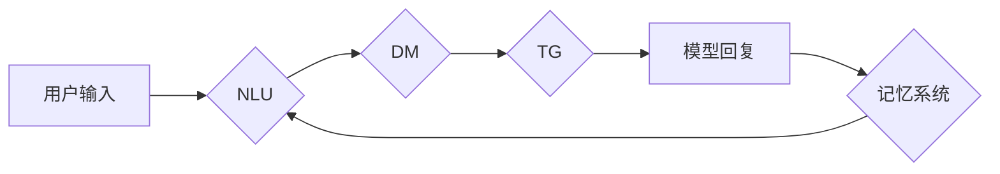

> 聊天机器人，对话系统，记忆系统，知识图谱，自然语言处理，深度学习

## 1. 背景介绍

在当今人工智能蓬勃发展的时代，聊天机器人已经成为人们生活中不可或缺的一部分。从智能客服到陪伴型机器人，聊天机器人以其便捷、高效的交互方式，在各个领域展现出巨大的应用潜力。然而，传统的聊天机器人往往缺乏记忆能力，无法记住之前的对话内容，导致交互体验单调乏味，难以满足用户对更智能、更自然的交互需求。

为了解决这一问题，研究人员提出了各种各样的记忆系统，旨在赋予聊天机器人记忆能力，使其能够更好地理解和响应用户的请求。这些记忆系统可以基于不同的技术实现，例如：

* **基于规则的记忆系统：** 这种系统通过预先定义的规则和知识库来存储和检索对话信息。
* **基于统计的记忆系统：** 这种系统利用统计模型来分析对话历史，并根据概率预测用户的下一个请求。
* **基于深度学习的记忆系统：** 这种系统利用深度神经网络来学习对话模式和用户偏好，并生成更准确、更自然的回复。

## 2. 核心概念与联系

### 2.1 聊天对话的本质

聊天对话本质上是一种交互式文本生成任务，它涉及到以下几个关键要素：

* **用户输入：** 用户通过文本形式表达自己的意图和需求。
* **模型生成：** 聊天机器人模型根据用户输入和对话历史，生成相应的文本回复。
* **对话上下文：** 聊天对话的上下文包含了之前的所有交互信息，它对于理解用户意图和生成合适的回复至关重要。

### 2.2 记忆系统的核心功能

记忆系统是赋予聊天机器人记忆能力的关键组件，其核心功能包括：

* **存储对话历史：** 将聊天对话中的所有信息，包括用户输入、模型回复和时间戳等，存储在内存或持久存储中。
* **检索对话信息：** 根据用户输入或其他条件，从存储的对话历史中检索相关信息。
* **理解对话上下文：** 分析对话历史，理解用户意图和对话主题，为模型生成更准确的回复提供上下文信息。

### 2.3 记忆系统与其他组件的交互

记忆系统与其他聊天机器人组件紧密交互，共同完成对话任务：

* **自然语言理解 (NLU)：** NLU组件负责分析用户输入，识别用户意图和实体信息。记忆系统可以提供对话上下文信息，帮助NLU组件更准确地理解用户意图。
* **对话管理 (DM)：** DM组件负责控制对话流程，根据用户意图和对话状态，选择合适的回复策略。记忆系统可以提供对话历史信息，帮助DM组件更好地管理对话流程。
* **文本生成 (TG)：** TG组件负责根据用户意图和对话上下文，生成自然流畅的文本回复。记忆系统可以提供对话历史信息，帮助TG组件生成更相关的和更有针对性的回复。

**Mermaid 流程图**



## 3. 核心算法原理 & 具体操作步骤

### 3.1 算法原理概述

为了实现聊天机器人的记忆功能，我们选择了一种基于深度学习的记忆系统，其核心算法是**循环神经网络 (RNN)**。RNN是一种能够处理序列数据的深度神经网络，其内部结构包含循环连接，能够捕捉序列数据中的长期依赖关系。

在聊天机器人应用中，RNN可以用来存储和检索对话历史信息。每个用户输入都被编码成一个向量，然后输入到RNN网络中。RNN网络会根据对话历史信息，生成一个表示当前对话状态的隐藏状态。当用户发出新的请求时，RNN网络会根据隐藏状态和新的输入，生成相应的回复。

### 3.2 算法步骤详解

1. **数据预处理：** 将聊天对话数据进行预处理，例如：分词、词向量化等。
2. **模型构建：** 使用深度学习框架，例如TensorFlow或PyTorch，构建RNN模型。
3. **模型训练：** 使用训练数据训练RNN模型，使其能够学习对话模式和用户偏好。
4. **模型评估：** 使用测试数据评估模型性能，例如：准确率、BLEU分数等。
5. **模型部署：** 将训练好的模型部署到聊天机器人系统中，使其能够实时处理用户请求。

### 3.3 算法优缺点

**优点：**

* 能够捕捉对话历史中的长期依赖关系，提高对话理解和回复质量。
* 可以学习用户偏好和对话风格，生成更个性化的回复。

**缺点：**

* 训练数据量大，训练时间长。
* 容易出现梯度消失或爆炸问题，难以训练长序列对话。

### 3.4 算法应用领域

* **聊天机器人：** 为聊天机器人赋予记忆能力，使其能够更好地理解和响应用户的请求。
* **虚拟助手：** 帮助虚拟助手记住用户的喜好和需求，提供更个性化的服务。
* **对话系统：** 用于构建更智能、更自然的对话系统，例如：问答系统、客服系统等。

## 4. 数学模型和公式 & 详细讲解 & 举例说明

### 4.1 数学模型构建

循环神经网络 (RNN) 的核心数学模型是**循环单元**。循环单元通过循环连接，将当前输入和之前隐藏状态的信息融合在一起，生成新的隐藏状态。

**隐藏状态更新公式：**

$$h_t = f(W_{hh}h_{t-1} + W_{xh}x_t + b_h)$$

其中：

* $h_t$ 是当前时间步的隐藏状态。
* $h_{t-1}$ 是上一个时间步的隐藏状态。
* $x_t$ 是当前时间步的输入。
* $W_{hh}$ 和 $W_{xh}$ 是权重矩阵。
* $b_h$ 是偏置项。
* $f$ 是激活函数，例如：ReLU、tanh等。

### 4.2 公式推导过程

循环单元的隐藏状态更新公式可以理解为：

* 将上一个时间步的隐藏状态 $h_{t-1}$ 作为记忆信息，传递到当前时间步。
* 将当前时间步的输入 $x_t$ 作为新的信息，与记忆信息融合。
* 通过激活函数 $f$ 将融合后的信息转换为新的隐藏状态 $h_t$。

### 4.3 案例分析与讲解

假设我们有一个简单的聊天对话：

* 用户输入：你好
* 模型回复：你好，请问有什么可以帮您？
* 用户输入：我想问一下天气

在这个例子中，RNN模型会将每个用户输入和模型回复都编码成向量，并存储在隐藏状态中。当用户输入“我想问一下天气”时，RNN模型会根据之前存储的对话历史信息，例如“你好”和“你好，请问有什么可以帮您？”，理解用户的意图是询问天气。

## 5. 项目实践：代码实例和详细解释说明

### 5.1 开发环境搭建

* Python 3.6+
* TensorFlow 或 PyTorch
* Jupyter Notebook

### 5.2 源代码详细实现

```python
import tensorflow as tf

# 定义循环神经网络模型
model = tf.keras.Sequential([
    tf.keras.layers.Embedding(input_dim=vocab_size, output_dim=embedding_dim),
    tf.keras.layers.LSTM(units=hidden_units),
    tf.keras.layers.Dense(units=vocab_size, activation='softmax')
])

# 编译模型
model.compile(optimizer='adam', loss='sparse_categorical_crossentropy', metrics=['accuracy'])

# 训练模型
model.fit(x_train, y_train, epochs=epochs)

# 保存模型
model.save('chatbot_model.h5')
```

### 5.3 代码解读与分析

* **Embedding 层：** 将单词转换为稠密的向量表示。
* **LSTM 层：** 捕捉对话历史中的长期依赖关系。
* **Dense 层：** 将隐藏状态映射到输出词汇表。
* **编译模型：** 选择优化器、损失函数和评价指标。
* **训练模型：** 使用训练数据训练模型。
* **保存模型：** 将训练好的模型保存为文件。

### 5.4 运行结果展示

训练好的模型可以用于生成聊天回复。

```python
# 加载模型
model = tf.keras.models.load_model('chatbot_model.h5')

# 生成回复
user_input = "你好"
input_tensor = tf.keras.preprocessing.sequence.pad_sequences([vocab_to_index[word] for word in user_input.split()], maxlen=max_length)
output_probs = model.predict(input_tensor)
predicted_word = tf.math.argmax(output_probs[0]).numpy()
predicted_word = index_to_vocab[predicted_word]
print(f"模型回复：{predicted_word}")
```

## 6. 实际应用场景

### 6.1 智能客服

聊天机器人可以作为智能客服，自动回答用户常见问题，例如：订单查询、退换货流程等，提高客服效率，降低人工成本。

### 6.2 陪伴型机器人

聊天机器人可以作为陪伴型机器人，与用户进行自然对话，提供情感支持和陪伴，例如：聊天、游戏、阅读等。

### 6.3 教育辅助

聊天机器人可以作为教育辅助工具，帮助学生学习知识，例如：回答问题、提供练习题、讲解概念等。

### 6.4 未来应用展望

随着人工智能技术的不断发展，聊天机器人的应用场景将会更加广泛，例如：

* **个性化推荐：** 根据用户的兴趣和偏好，提供个性化的商品、服务和内容推荐。
* **远程医疗：** 提供远程医疗咨询服务，帮助用户解决一些简单的健康问题。
* **智能家居：** 控制智能家居设备，例如：灯光、空调、电视等。

## 7. 工具和资源推荐

### 7.1 学习资源推荐

* **书籍：**
    * 《深度学习》
    * 《自然语言处理》
* **在线课程：**
    * Coursera
    * edX
    * Udacity

### 7.2 开发工具推荐

* **深度学习框架：** TensorFlow、PyTorch
* **自然语言处理库：** NLTK、spaCy
* **聊天机器人平台：** Rasa、Dialogflow

### 7.3 相关论文推荐

* **Attention Is All You Need**
* **BERT: Pre-training of Deep Bidirectional Transformers for Language Understanding**
* **GPT-3: Language Models are Few-Shot Learners**

## 8. 总结：未来发展趋势与挑战

### 8.1 研究成果总结

近年来，在深度学习和自然语言处理领域的快速发展下，聊天机器人的记忆系统取得了显著进展。基于RNN的记忆系统能够有效地捕捉对话历史信息，提高对话理解和回复质量。

### 8.2 未来发展趋势

* **更强大的记忆模型：** 研究更强大的记忆模型，例如：Transformer、T5等，提高对话理解和记忆能力。
* **多模态记忆：** 将文本、图像、音频等多模态信息融合到记忆系统中，构建更全面的对话理解模型。
* **个性化记忆：** 研究个性化记忆系统，根据用户的偏好和需求，定制化的记忆策略。

### 8.3 面临的挑战

* **数据稀缺：** 高质量的对话数据仍然稀缺，难以满足模型训练的需求。
* **安全性和隐私性：** 聊天机器人的记忆系统可能会存储用户的敏感信息，需要保证数据的安全性和隐私性。
* **可解释性：** 聊天机器人的决策过程难以解释，需要提高模型的可解释性。

### 8.4 研究展望

未来，聊天机器人的记忆系统将朝着更智能、更安全、更可解释的方向发展，为人们的生活带来更多便利和乐趣。

## 9. 附录：常见问题与解答

* **Q：如何选择合适的记忆系统？**

A：选择合适的记忆系统需要根据具体的应用场景和需求进行考虑