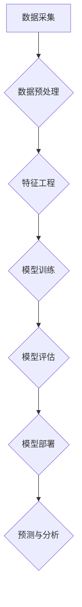

> 人工智能，AI，机器学习，深度学习，自然语言处理，计算机视觉，数据科学，云计算，大数据，编程，软件工程，算法设计，数据结构，软件架构，敏捷开发，项目管理，沟通能力，团队合作，持续学习

## 1. 背景介绍

人工智能（AI）正在迅速改变着世界，它正在渗透到各个行业，从医疗保健到金融，从制造业到娱乐。随着AI技术的不断发展，对AI人才的需求也越来越高。想要在AI领域取得成功，需要掌握一系列的核心技能。

## 2. 核心概念与联系

**2.1 AI的核心概念**

人工智能（AI）是指模拟人类智能行为的计算机系统。AI的目标是让机器能够像人类一样学习、推理、解决问题和做出决策。

**2.2 AI与相关技术的联系**

AI是一个跨学科领域，它与许多其他技术领域密切相关，例如：

* **机器学习（ML）：** 是一种AI技术，它允许计算机从数据中学习，无需明确编程。
* **深度学习（DL）：** 是一种更高级的机器学习技术，它使用多层神经网络来模拟人类大脑的结构和功能。
* **自然语言处理（NLP）：** 是一种AI技术，它使计算机能够理解和处理人类语言。
* **计算机视觉（CV）：** 是一种AI技术，它使计算机能够“看到”和理解图像和视频。
* **数据科学：** 是一种跨学科领域，它涉及到收集、分析和解释数据。

**2.3 AI技术架构**



## 3. 核心算法原理 & 具体操作步骤

**3.1 算法原理概述**

机器学习算法是AI的核心，它们允许计算机从数据中学习。常见的机器学习算法包括：

* **监督学习：** 使用标记数据训练模型，预测新的数据标签。
* **无监督学习：** 使用未标记数据发现数据中的模式和结构。
* **强化学习：** 通过试错学习，最大化奖励。

**3.2 算法步骤详解**

以监督学习为例，其步骤如下：

1. **数据收集和预处理：** 收集相关数据并进行清洗、转换和特征工程。
2. **模型选择：** 根据任务选择合适的机器学习模型，例如线性回归、逻辑回归、决策树等。
3. **模型训练：** 使用标记数据训练模型，调整模型参数以最小化预测误差。
4. **模型评估：** 使用测试数据评估模型性能，例如准确率、召回率、F1-score等。
5. **模型部署：** 将训练好的模型部署到生产环境中，用于预测新的数据。

**3.3 算法优缺点**

不同的机器学习算法具有不同的优缺点，需要根据具体任务选择合适的算法。

**3.4 算法应用领域**

机器学习算法广泛应用于各个领域，例如：

* **图像识别：** 自动识别图像中的物体、场景和人脸。
* **自然语言处理：** 机器翻译、文本摘要、情感分析等。
* **推荐系统：** 根据用户历史行为推荐商品、电影、音乐等。
* **欺诈检测：** 识别和预防欺诈行为。

## 4. 数学模型和公式 & 详细讲解 & 举例说明

**4.1 数学模型构建**

机器学习模型通常可以用数学公式来表示。例如，线性回归模型的预测公式如下：

$$
y = \theta_0 + \theta_1 x_1 + \theta_2 x_2 + ... + \theta_n x_n
$$

其中：

* $y$ 是预测值
* $\theta_0, \theta_1, ..., \theta_n$ 是模型参数
* $x_1, x_2, ..., x_n$ 是输入特征

**4.2 公式推导过程**

机器学习模型的参数可以通过优化算法来调整。常用的优化算法包括梯度下降法。梯度下降法的目标是找到使预测误差最小化的参数值。

**4.3 案例分析与讲解**

假设我们有一个线性回归模型，用于预测房价。输入特征包括房屋面积、房间数量、地理位置等。我们可以使用梯度下降法训练模型，找到最佳的模型参数，从而预测新的房价。

## 5. 项目实践：代码实例和详细解释说明

**5.1 开发环境搭建**

可以使用Python语言和相关的机器学习库，例如Scikit-learn，TensorFlow，PyTorch等，来开发AI项目。

**5.2 源代码详细实现**

```python
from sklearn.linear_model import LinearRegression
from sklearn.model_selection import train_test_split
from sklearn.metrics import mean_squared_error

# 加载数据
data = ...

# 将数据分为训练集和测试集
X_train, X_test, y_train, y_test = train_test_split(data.drop('price', axis=1), data['price'], test_size=0.2)

# 创建线性回归模型
model = LinearRegression()

# 训练模型
model.fit(X_train, y_train)

# 预测测试集数据
y_pred = model.predict(X_test)

# 计算模型性能
mse = mean_squared_error(y_test, y_pred)
print(f'Mean Squared Error: {mse}')
```

**5.3 代码解读与分析**

这段代码演示了如何使用Scikit-learn库训练一个线性回归模型来预测房价。

**5.4 运行结果展示**

运行代码后，会输出模型的平均平方误差（MSE）值，该值可以用来评估模型的性能。

## 6. 实际应用场景

**6.1 医疗保健**

* **疾病诊断：** 使用AI算法分析患者的医疗影像和病历数据，辅助医生诊断疾病。
* **药物研发：** 使用AI算法加速药物研发过程，例如预测药物的有效性和安全性。

**6.2 金融**

* **欺诈检测：** 使用AI算法识别和预防金融欺诈行为。
* **风险管理：** 使用AI算法评估投资风险和制定风险管理策略。

**6.3 制造业**

* **预测性维护：** 使用AI算法分析设备运行数据，预测设备故障并进行预防性维护。
* **质量控制：** 使用AI算法识别产品缺陷，提高产品质量。

**6.4 未来应用展望**

AI技术还在不断发展，未来将有更多新的应用场景出现，例如：

* **个性化教育：** 使用AI算法提供个性化的学习方案，提高学习效率。
* **自动驾驶：** 使用AI算法控制车辆，实现自动驾驶。
* **机器人技术：** 使用AI算法赋予机器人更强的智能和自主性。

## 7. 工具和资源推荐

**7.1 学习资源推荐**

* **在线课程：** Coursera, edX, Udacity 等平台提供丰富的AI课程。
* **书籍：** 《深度学习》、《机器学习实战》等书籍是AI学习的经典教材。
* **开源项目：** TensorFlow, PyTorch 等开源项目可以帮助你深入了解AI算法和应用。

**7.2 开发工具推荐**

* **Python：** 作为AI开发的主要语言，Python拥有丰富的机器学习库和工具。
* **Jupyter Notebook：** 用于编写和运行Python代码，并可视化数据和模型结果。
* **云计算平台：** AWS, Azure, GCP 等云计算平台提供强大的计算资源和AI服务。

**7.3 相关论文推荐**

* **《ImageNet Classification with Deep Convolutional Neural Networks》**
* **《Attention Is All You Need》**
* **《BERT: Pre-training of Deep Bidirectional Transformers for Language Understanding》**

## 8. 总结：未来发展趋势与挑战

**8.1 研究成果总结**

近年来，AI技术取得了长足的进步，在各个领域都取得了显著的应用成果。

**8.2 未来发展趋势**

* **更强大的计算能力：** 随着计算能力的提升，AI模型将变得更加复杂和强大。
* **更丰富的算法：** 研究人员将继续开发新的AI算法，提高AI模型的性能和效率。
* **更广泛的应用场景：** AI技术将应用到更多新的领域，例如医疗保健、教育、金融等。

**8.3 面临的挑战**

* **数据隐私和安全：** AI模型的训练需要大量数据，如何保护数据隐私和安全是一个重要的挑战。
* **算法偏见：** AI模型可能存在算法偏见，导致不公平的结果。
* **伦理问题：** AI技术的应用引发了一些伦理问题，例如人工智能的责任和义务。

**8.4 研究展望**

未来，AI研究将继续朝着更安全、更可靠、更公平的方向发展。


## 9. 附录：常见问题与解答

**9.1 什么是机器学习？**

机器学习是一种人工智能技术，它允许计算机从数据中学习，无需明确编程。

**9.2 什么是深度学习？**

深度学习是一种更高级的机器学习技术，它使用多层神经网络来模拟人类大脑的结构和功能。

**9.3 如何学习AI？**

可以通过在线课程、书籍、开源项目等方式学习AI。

**9.4 AI技术有哪些应用场景？**

AI技术广泛应用于各个领域，例如医疗保健、金融、制造业等。

**9.5 AI技术有哪些挑战？**

AI技术面临着数据隐私和安全、算法偏见、伦理问题等挑战。


作者：禅与计算机程序设计艺术 / Zen and the Art of Computer Programming 
<end_of_turn>