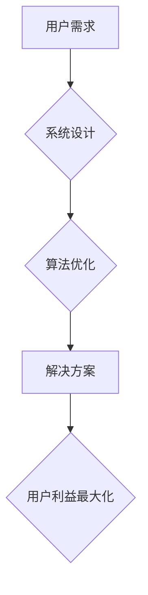

>  人工智能、利益驱动、系统设计、算法优化、用户体验、商业模式、技术创新

## 1. 背景介绍

在瞬息万变的科技时代，技术创新日新月异，新兴技术层出不穷。作为一名技术专家，我们不仅需要掌握前沿技术，更需要具备解决问题的能力，并将其转化为实际价值。而解决问题的关键，往往在于站在他人的角度出发，理解他们的需求和利益，从而设计出真正能够满足用户需求的解决方案。

杜月笙，这位上海滩叱咤风云的传奇人物，以其独特的“利益驱动”理念闻名。他善于洞察人心，了解不同阶层的需求，并通过巧妙的利益分配，构建起庞大的势力网络。他的成功经验，也为我们提供了一份宝贵的智慧，即解决问题要从别人的利益出发。

## 2. 核心概念与联系

### 2.1 利益驱动

利益驱动是指以满足用户的利益为核心，设计和开发技术解决方案。它强调用户需求至上，将用户的利益最大化作为最终目标。

### 2.2 系统设计

系统设计是指从整体角度，规划和构建技术系统，使其能够高效、可靠地完成预定的功能。

### 2.3 算法优化

算法优化是指通过改进算法的结构和实现方式，提高算法的效率和性能。

**Mermaid 流程图**



## 3. 核心算法原理 & 具体操作步骤

### 3.1 算法原理概述

在人工智能领域，算法优化是至关重要的环节。通过优化算法，我们可以提高模型的准确率、效率和鲁棒性。常见的算法优化方法包括：

* **梯度下降法:** 通过不断调整模型参数，使损失函数最小化。
* **随机梯度下降法:** 对梯度下降法的改进，通过随机选择样本进行梯度更新，提高训练速度。
* **动量法:** 在梯度下降法中加入动量项，加速收敛速度。
* **Adam优化器:** 结合了动量法和自适应学习率的优化器，具有较好的收敛性能。

### 3.2 算法步骤详解

以梯度下降法为例，其具体步骤如下：

1. **初始化模型参数:** 随机初始化模型参数。
2. **计算损失函数:** 使用训练数据计算模型预测结果与真实值的差异，即损失函数值。
3. **计算梯度:** 计算损失函数对模型参数的偏导数，即梯度。
4. **更新模型参数:** 根据梯度方向和学习率，更新模型参数。
5. **重复步骤2-4:** 直到损失函数收敛或达到最大迭代次数。

### 3.3 算法优缺点

**优点:**

* 理论基础扎实，收敛速度较快。
* 适用于多种机器学习模型。

**缺点:**

* 容易陷入局部最优解。
* 需要手动设置学习率，选择合适的学习率较为困难。

### 3.4 算法应用领域

梯度下降法广泛应用于机器学习领域，例如：

* **图像识别:** 训练卷积神经网络，识别图像中的物体。
* **自然语言处理:** 训练语言模型，进行文本分类、机器翻译等任务。
* **推荐系统:** 训练协同过滤模型，推荐用户感兴趣的内容。

## 4. 数学模型和公式 & 详细讲解 & 举例说明

### 4.1 数学模型构建

梯度下降法的核心思想是通过不断调整模型参数，使损失函数最小化。损失函数可以表示为：

$$
L(\theta) = \frac{1}{N} \sum_{i=1}^{N} loss(y_i, \hat{y}_i)
$$

其中：

* $L(\theta)$ 表示损失函数。
* $\theta$ 表示模型参数。
* $N$ 表示训练样本数量。
* $loss(y_i, \hat{y}_i)$ 表示第 $i$ 个样本的损失值，$y_i$ 为真实值，$\hat{y}_i$ 为模型预测值。

### 4.2 公式推导过程

梯度下降法的更新规则为：

$$
\theta = \theta - \eta \nabla L(\theta)
$$

其中：

* $\eta$ 表示学习率，控制参数更新的步长。
* $\nabla L(\theta)$ 表示损失函数对模型参数的梯度。

### 4.3 案例分析与讲解

假设我们有一个线性回归模型，其预测公式为：

$$
\hat{y} = \theta_0 + \theta_1 x
$$

其中：

* $\hat{y}$ 为模型预测值。
* $\theta_0$ 和 $\theta_1$ 为模型参数。
* $x$ 为输入特征。

损失函数为均方误差：

$$
loss(y, \hat{y}) = (y - \hat{y})^2
$$

梯度下降法更新规则为：

$$
\theta_0 = \theta_0 - \eta \frac{1}{N} \sum_{i=1}^{N} (y_i - \theta_0 - \theta_1 x_i)
$$

$$
\theta_1 = \theta_1 - \eta \frac{1}{N} \sum_{i=1}^{N} x_i (y_i - \theta_0 - \theta_1 x_i)
$$

## 5. 项目实践：代码实例和详细解释说明

### 5.1 开发环境搭建

* Python 3.x
* TensorFlow 或 PyTorch

### 5.2 源代码详细实现

```python
import tensorflow as tf

# 定义模型
model = tf.keras.models.Sequential([
    tf.keras.layers.Dense(units=1, input_shape=[1])
])

# 定义损失函数和优化器
model.compile(loss='mse', optimizer=tf.keras.optimizers.Adam(learning_rate=0.01))

# 训练模型
model.fit(x_train, y_train, epochs=100)

# 预测结果
predictions = model.predict(x_test)
```

### 5.3 代码解读与分析

* 首先，我们定义了一个简单的线性回归模型，包含一个全连接层。
* 然后，我们使用均方误差作为损失函数，并选择Adam优化器进行训练。
* 训练过程中，模型会不断调整参数，以最小化损失函数值。
* 最后，我们使用训练好的模型对测试数据进行预测。

### 5.4 运行结果展示

训练完成后，我们可以查看模型的损失函数值和预测结果，评估模型的性能。

## 6. 实际应用场景

### 6.1 预测房价

利用历史房价数据，训练一个线性回归模型，预测新房的房价。

### 6.2 股票价格预测

利用股票历史价格数据，训练一个深度学习模型，预测股票未来价格走势。

### 6.3 医疗诊断辅助

利用患者病历数据，训练一个机器学习模型，辅助医生进行疾病诊断。

### 6.4 未来应用展望

随着人工智能技术的不断发展，梯度下降法将在更多领域得到应用，例如：

* 自动驾驶
* 人机交互
* 个性化推荐

## 7. 工具和资源推荐

### 7.1 学习资源推荐

* **书籍:**
    * 《深度学习》
    * 《机器学习》
* **在线课程:**
    * Coursera
    * edX

### 7.2 开发工具推荐

* **Python:** 
* **TensorFlow:** 
* **PyTorch:**

### 7.3 相关论文推荐

* **《Gradient Descent Optimization Algorithms》**
* **《Adam: A Method for Stochastic Optimization》**

## 8. 总结：未来发展趋势与挑战

### 8.1 研究成果总结

梯度下降法是一种高效的算法优化方法，在机器学习领域取得了广泛应用。

### 8.2 未来发展趋势

* **自适应学习率:** 
* **分布式梯度下降:** 
* **强化学习:**

### 8.3 面临的挑战

* **局部最优解:** 
* **高维数据:** 
* **计算资源:**

### 8.4 研究展望

未来，我们将继续探索新的算法优化方法，提高模型的性能和效率，并将其应用于更广泛的领域。

## 9. 附录：常见问题与解答

### 9.1 学习资源推荐

* **书籍:**
    * 《深度学习》
    * 《机器学习》
* **在线课程:**
    * Coursera
    * edX

### 9.2 开发工具推荐

* **Python:** 
* **TensorFlow:** 
* **PyTorch:**

### 9.3 相关论文推荐

* **《Gradient Descent Optimization Algorithms》**
* **《Adam: A Method for Stochastic Optimization》**


作者：禅与计算机程序设计艺术 / Zen and the Art of Computer Programming 
<end_of_turn>