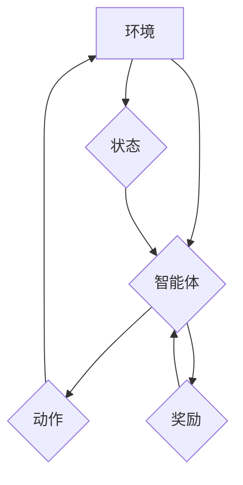

> 深度 Q-learning，强化学习，电子游戏，人工智能，游戏 AI，策略学习

## 1. 背景介绍

电子游戏作为一种娱乐和休闲方式，近年来发展迅速，其复杂性和交互性也越来越高。为了提升游戏体验，开发更智能、更具挑战性的游戏，游戏人工智能 (Game AI) 成为一个重要的研究领域。

强化学习 (Reinforcement Learning，RL) 作为一种机器学习方法，能够通过与环境交互，学习最优策略，从而在游戏中实现智能行为。深度 Q-learning 作为一种基于深度神经网络的强化学习算法，在游戏 AI 领域取得了显著的成果。

## 2. 核心概念与联系

**2.1 强化学习 (Reinforcement Learning)**

强化学习是一种基于交互学习的机器学习方法。在强化学习中，一个智能体 (Agent) 与一个环境 (Environment) 相互作用。智能体通过与环境交互，获得奖励 (Reward) 或惩罚 (Penalty)。智能体的目标是学习一个策略 (Policy)，使得在与环境交互的过程中，获得最大的总奖励。

**2.2 Q-learning**

Q-learning 是一种经典的强化学习算法，它通过学习一个 Q-表 (Q-table) 来表示每个状态 (State) 和每个动作 (Action) 的价值。Q-表中的每个元素 Q(s, a) 表示在状态 s 下执行动作 a 的期望回报。

**2.3 深度 Q-learning**

深度 Q-learning 将深度神经网络 (Deep Neural Network) 应用于 Q-learning 算法。深度神经网络能够学习更复杂的特征表示，从而提高 Q-learning 算法的性能。

**2.4 流程图**



## 3. 核心算法原理 & 具体操作步骤

### 3.1 算法原理概述

深度 Q-learning 算法的核心思想是利用深度神经网络来估计每个状态-动作对的价值函数，并通过 Q-learning 的迭代更新规则来不断优化价值函数。

### 3.2 算法步骤详解

1. **初始化:** 初始化深度神经网络，并设置学习率、折扣因子等超参数。
2. **环境交互:** 智能体与环境交互，获得当前状态和奖励。
3. **动作选择:** 根据当前状态和深度神经网络的输出，选择一个动作。
4. **状态转移:** 执行动作后，智能体进入新的状态。
5. **价值更新:** 使用 Q-learning 的更新规则来更新深度神经网络的权重，使得价值函数朝着最大化总奖励的方向更新。
6. **重复步骤 2-5:** 重复以上步骤，直到智能体学习到一个满足要求的策略。

### 3.3 算法优缺点

**优点:**

* 可以学习复杂的游戏策略。
* 不需要事先定义奖励函数，可以自动学习奖励函数。
* 可以应用于各种类型的游戏。

**缺点:**

* 训练时间较长。
* 需要大量的训练数据。
* 容易陷入局部最优解。

### 3.4 算法应用领域

深度 Q-learning 算法在游戏 AI 领域有广泛的应用，例如：

* 游戏角色的智能行为控制
* 游戏策略的学习和优化
* 游戏难度调节

## 4. 数学模型和公式 & 详细讲解 & 举例说明

### 4.1 数学模型构建

深度 Q-learning 的数学模型可以表示为一个马尔可夫决策过程 (MDP)，其中：

* **状态空间 (S):** 所有可能的遊戲狀態的集合。
* **动作空间 (A):** 在每个状态下可以执行的动作的集合。
* **状态转移概率 (P):** 从状态 s 到状态 s' 执行动作 a 的概率。
* **奖励函数 (R):** 在状态 s 执行动作 a 后获得的奖励。
* **折扣因子 (γ):** 用于权衡未来奖励和当前奖励的因子。

### 4.2 公式推导过程

深度 Q-learning 的目标是学习一个价值函数 Q(s, a)，该函数表示在状态 s 下执行动作 a 的期望回报。

Q-learning 的更新规则如下：

$$Q(s, a) \leftarrow Q(s, a) + \alpha [r + \gamma \max_{a'} Q(s', a') - Q(s, a)]$$

其中：

* α 是学习率。
* r 是在状态 s 执行动作 a 后获得的奖励。
* s' 是执行动作 a 后进入的状态。
* a' 是在状态 s' 中选择执行的动作。

### 4.3 案例分析与讲解

假设一个简单的游戏，智能体可以选择向上、向下、向左、向右四个动作。在每个状态下，智能体可以获得 1 点奖励，到达终点可以获得 10 点奖励。

使用深度 Q-learning 算法，智能体可以学习到一个策略，使得它能够在游戏中到达终点并获得最大奖励。

## 5. 项目实践：代码实例和详细解释说明

### 5.1 开发环境搭建

* Python 3.x
* TensorFlow 或 PyTorch
* OpenAI Gym

### 5.2 源代码详细实现

```python
import tensorflow as tf

# 定义深度神经网络模型
model = tf.keras.models.Sequential([
    tf.keras.layers.Dense(64, activation='relu', input_shape=(state_size,)),
    tf.keras.layers.Dense(64, activation='relu'),
    tf.keras.layers.Dense(action_size)
])

# 定义损失函数和优化器
optimizer = tf.keras.optimizers.Adam(learning_rate=0.001)
loss_fn = tf.keras.losses.MeanSquaredError()

# 训练循环
for episode in range(num_episodes):
    state = env.reset()
    done = False
    total_reward = 0

    while not done:
        # 选择动作
        action = tf.argmax(model(tf.expand_dims(state, axis=0))).numpy()[0]

        # 执行动作
        next_state, reward, done, _ = env.step(action)

        # 更新 Q-值
        with tf.GradientTape() as tape:
            q_values = model(tf.expand_dims(state, axis=0))
            target_q_value = reward + gamma * tf.reduce_max(model(tf.expand_dims(next_state, axis=0)))
            loss = loss_fn(target_q_value, q_values[0, action])

        # 反向传播
        gradients = tape.gradient(loss, model.trainable_variables)
        optimizer.apply_gradients(zip(gradients, model.trainable_variables))

        # 更新状态
        state = next_state
        total_reward += reward

    print(f"Episode {episode+1}, Total Reward: {total_reward}")

```

### 5.3 代码解读与分析

* 代码首先定义了深度神经网络模型，该模型包含多个全连接层和激活函数。
* 然后定义了损失函数和优化器，用于训练深度神经网络。
* 训练循环中，智能体与环境交互，根据当前状态选择动作，执行动作后获得奖励和下一个状态。
* 使用 Q-learning 的更新规则来更新深度神经网络的权重，使得价值函数朝着最大化总奖励的方向更新。

### 5.4 运行结果展示

训练完成后，智能体能够学习到一个策略，使得它能够在游戏中获得更高的奖励。

## 6. 实际应用场景

深度 Q-learning 算法在游戏 AI 领域有广泛的应用，例如：

* **游戏角色的智能行为控制:** 例如，在 RPG 游戏中，可以使用深度 Q-learning 算法让角色学习如何战斗、探索和与其他角色互动。
* **游戏策略的学习和优化:** 例如，在策略游戏 (如围棋、象棋) 中，可以使用深度 Q-learning 算法让 AI 玩家学习最优策略。
* **游戏难度调节:** 例如，可以使用深度 Q-learning 算法根据玩家的水平动态调整游戏难度。

### 6.4 未来应用展望

随着深度学习技术的不断发展，深度 Q-learning 算法在游戏 AI 领域将有更广泛的应用，例如：

* **生成更具创意和多样性的游戏内容:** 例如，可以使用深度 Q-learning 算法让 AI 生成新的游戏关卡、游戏角色和游戏故事。
* **开发更具沉浸感的交互体验:** 例如，可以使用深度 Q-learning 算法让 AI 玩家更像人类玩家，从而提供更具沉浸感的交互体验。
* **推动游戏 AI 的可解释性:** 例如，可以使用深度 Q-learning 算法来解释 AI 玩家的行为，从而帮助开发者更好地理解和改进 AI 算法。

## 7. 工具和资源推荐

### 7.1 学习资源推荐

* **书籍:**
    * Reinforcement Learning: An Introduction by Richard S. Sutton and Andrew G. Barto
    * Deep Reinforcement Learning Hands-On by Maxim Lapan
* **在线课程:**
    * Deep Reinforcement Learning Specialization by DeepLearning.AI
    * Reinforcement Learning by David Silver (University of DeepMind)

### 7.2 开发工具推荐

* **OpenAI Gym:** 一个用于强化学习研究的开源库，提供各种环境和工具。
* **TensorFlow:** 一个开源的机器学习框架，支持深度 Q-learning 的实现。
* **PyTorch:** 另一个开源的机器学习框架，也支持深度 Q-learning 的实现。

### 7.3 相关论文推荐

* **Playing Atari with Deep Reinforcement Learning** by Mnih et al. (2013)
* **Human-level control through deep reinforcement learning** by Mnih et al. (2015)
* **Deep Q-Network** by Mnih et al. (2015)

## 8. 总结：未来发展趋势与挑战

### 8.1 研究成果总结

深度 Q-learning 算法取得了显著的成果，在游戏 AI 领域取得了突破性的进展。

### 8.2 未来发展趋势

* **更强大的模型架构:** 研究更强大的深度神经网络架构，例如 Transformer 和 Graph Neural Networks，以提高算法的性能。
* **更有效的训练方法:** 研究更有效的训练方法，例如分布式训练和强化学习算法的组合，以加速算法的训练速度。
* **更广泛的应用场景:** 将深度 Q-learning 算法应用于更多领域的 AI 任务，例如机器人控制、自动驾驶和医疗诊断。

### 8.3 面临的挑战

* **数据效率:** 深度 Q-learning 算法需要大量的训练数据，这在某些情况下可能难以获得。
* **样本复杂性:** 深度 Q-learning 算法容易陷入局部最优解，需要探索更有效的探索策略。
* **可解释性:** 深度 Q-learning 算法的决策过程难以解释，这可能会阻碍其在某些领域 (例如医疗诊断) 的应用。

### 8.4 研究展望

未来，深度 Q-learning 算法将继续朝着更强大、更有效、更可解释的方向发展，并在更多领域发挥重要作用。

## 9. 附录：常见问题与解答

**Q1: 深度 Q-learning 和 Q-learning 的区别是什么？**

**A1:** 深度 Q-learning 使用深度神经网络来估计价值函数，而传统的 Q-learning 使用 Q-表来存储价值函数。深度 Q-learning 可以处理更复杂的特征表示，从而提高算法的性能。

**Q2: 深度 Q-learning 的训练时间很长，有什么方法可以加速训练速度？**

**A2:** 可以使用一些方法加速训练速度，例如：

* 使用分布式训练
* 使用经验回放 (Experience Replay)
* 使用目标网络 (Target Network)

**Q3: 深度 Q-learning 的可解释性较差，如何提高其可解释性？**

**A3:** 可以使用一些方法提高其可解释性，例如：

* 使用可解释的深度学习模型，例如 LIME 和 SHAP