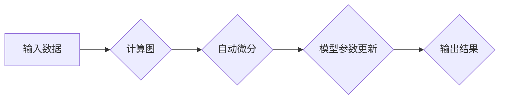

> 深度学习框架，TensorFlow，PyTorch，Keras，模型训练，神经网络，机器学习

## 1. 背景介绍

深度学习作为机器学习领域的重要分支，近年来取得了令人瞩目的成就，在图像识别、自然语言处理、语音识别等领域展现出强大的应用潜力。深度学习框架作为深度学习模型开发和训练的工具，为研究人员和开发者提供了高效便捷的平台。

本文将深入探讨深度学习框架的原理和架构，并以TensorFlow和PyTorch为例，详细讲解其核心算法、数学模型、代码实现以及实际应用场景。

## 2. 核心概念与联系

深度学习框架的核心概念包括：

* **计算图:**  深度学习模型的计算过程可以表示为一个计算图，其中节点代表操作，边代表数据流。
* **张量:**  张量是深度学习框架中数据的基本单位，可以理解为多维数组。
* **自动微分:**  自动微分是深度学习框架的核心技术之一，它可以自动计算张量的梯度，从而实现模型参数的更新。
* **会话:**  会话是深度学习框架中执行计算图的执行环境。

**深度学习框架架构**

## 3. 核心算法原理 & 具体操作步骤

### 3.1  算法原理概述

深度学习框架的核心算法是反向传播算法，它用于计算模型参数的梯度，并根据梯度更新模型参数。反向传播算法的基本步骤如下：

1. 将输入数据输入到模型中，得到输出结果。
2. 计算输出结果与真实值的误差。
3. 根据误差反向传播，计算各层参数的梯度。
4. 使用梯度下降算法更新模型参数。

### 3.2  算法步骤详解

1. **前向传播:** 将输入数据逐层传递到模型中，计算各层的输出值。
2. **损失函数:** 计算模型输出值与真实值的误差，使用损失函数衡量误差的大小。
3. **反向传播:** 计算损失函数对各层参数的梯度。
4. **梯度下降:** 使用梯度下降算法更新模型参数，减小模型误差。

### 3.3  算法优缺点

**优点:**

* 能够学习复杂的非线性关系。
* 训练效率高，能够处理海量数据。

**缺点:**

* 训练过程需要大量计算资源。
* 模型参数数量庞大，容易过拟合。

### 3.4  算法应用领域

反向传播算法广泛应用于图像识别、自然语言处理、语音识别等领域。

## 4. 数学模型和公式 & 详细讲解 & 举例说明

### 4.1  数学模型构建

深度学习模型通常由多个神经网络层组成，每层神经元之间通过权重连接。神经网络的数学模型可以表示为：

$$
y = f(W x + b)
$$

其中：

* $y$ 是输出值。
* $x$ 是输入值。
* $W$ 是权重矩阵。
* $b$ 是偏置向量。
* $f$ 是激活函数。

### 4.2  公式推导过程

反向传播算法的核心是计算损失函数对各层参数的梯度。梯度计算过程涉及链式法则和微积分。

### 4.3  案例分析与讲解

以一个简单的单层神经网络为例，分析反向传播算法的计算过程。

## 5. 项目实践：代码实例和详细解释说明

### 5.1  开发环境搭建

使用Python语言开发深度学习模型，需要安装必要的库，例如TensorFlow、PyTorch、NumPy等。

### 5.2  源代码详细实现

使用TensorFlow或PyTorch框架，实现一个简单的图像分类模型。

### 5.3  代码解读与分析

详细解释代码中的关键部分，例如模型结构、数据加载、训练过程、评估指标等。

### 5.4  运行结果展示

展示模型训练过程中的损失曲线和准确率曲线，以及模型在测试集上的准确率。

## 6. 实际应用场景

### 6.1  图像识别

深度学习框架在图像识别领域有广泛的应用，例如人脸识别、物体检测、图像分类等。

### 6.2  自然语言处理

深度学习框架在自然语言处理领域也有着重要的应用，例如文本分类、机器翻译、情感分析等。

### 6.3  语音识别

深度学习框架可以用于语音识别，例如语音转文本、语音助手等。

### 6.4  未来应用展望

深度学习框架的应用前景广阔，未来将应用于更多领域，例如医疗诊断、金融风险控制、自动驾驶等。

## 7. 工具和资源推荐

### 7.1  学习资源推荐

* TensorFlow官方文档：https://www.tensorflow.org/
* PyTorch官方文档：https://pytorch.org/
* 深度学习书籍：

### 7.2  开发工具推荐

* Jupyter Notebook
* VS Code

### 7.3  相关论文推荐

* AlexNet: ImageNet Classification with Deep Convolutional Neural Networks
* VGGNet: Very Deep Convolutional Networks for Large-Scale Image Recognition
* ResNet: Deep Residual Learning for Image Recognition

## 8. 总结：未来发展趋势与挑战

### 8.1  研究成果总结

深度学习框架的发展取得了显著成果，模型性能不断提升，应用场景不断拓展。

### 8.2  未来发展趋势

* 模型效率提升
* 模型可解释性增强
* 模型安全性和鲁棒性提高

### 8.3  面临的挑战

* 计算资源需求
* 数据标注成本
* 模型可解释性

### 8.4  研究展望

未来将继续研究更有效的深度学习算法、更强大的计算平台和更完善的应用场景。

## 9. 附录：常见问题与解答

* 如何选择合适的深度学习框架？
* 如何搭建深度学习开发环境？
* 如何训练深度学习模型？
* 如何评估深度学习模型的性能？

作者：禅与计算机程序设计艺术 / Zen and the Art of Computer Programming 
<end_of_turn>