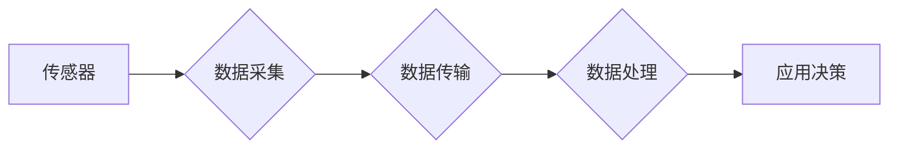

> 物联网(IoT)、传感器、数据采集、数据处理、边缘计算、云计算、人工智能、物联网安全

## 1. 背景介绍

物联网(IoT)正以惊人的速度发展，连接着越来越多的设备、传感器和系统。这些连接设备产生的海量数据为我们提供了前所未有的洞察力和机遇。然而，要充分利用物联网的潜力，我们需要深入了解传感器技术及其在物联网生态系统中的作用。

传感器是物联网的核心组成部分，它们负责收集来自物理世界的各种数据，例如温度、湿度、压力、光线、声音和运动。这些数据被转换为数字信号，然后通过网络传输到处理中心进行分析和决策。

随着物联网应用的不断扩展，对传感器技术的需求也越来越高。我们需要更高精度、更低功耗、更小型化和更智能的传感器，以满足各种应用场景的需求。

## 2. 核心概念与联系

### 2.1 物联网(IoT)

物联网(IoT)是指通过网络连接各种物理设备、传感器、软件和数据，形成一个互联互通的智能网络。物联网的核心是数据采集、传输、处理和应用。

### 2.2 传感器

传感器是一种能够将物理量转换为电信号的装置。常见的传感器类型包括温度传感器、湿度传感器、压力传感器、光传感器、声传感器和运动传感器等。

### 2.3 数据采集

数据采集是指从传感器和其他设备收集物理量数据的过程。数据采集系统通常由传感器、采集器、通信模块和数据存储设备组成。

### 2.4 数据处理

数据处理是指对从传感器收集到的数据进行分析、转换和存储的过程。数据处理可以进行本地处理，也可以进行云端处理。

### 2.5 应用场景

物联网和传感器技术的应用场景非常广泛，包括智能家居、智能城市、工业自动化、医疗保健、农业、交通运输等领域。

**Mermaid 流程图**



## 3. 核心算法原理 & 具体操作步骤

### 3.1  算法原理概述

传感器数据处理通常涉及以下核心算法：

* **数据预处理:** 滤除噪声、平滑数据、归一化数据等。
* **特征提取:** 从原始数据中提取有意义的特征，例如温度变化趋势、湿度波动幅度等。
* **模式识别:** 利用机器学习算法识别数据中的模式，例如异常值检测、故障诊断等。
* **预测分析:** 基于历史数据预测未来趋势，例如设备寿命预测、能源消耗预测等。

### 3.2  算法步骤详解

**数据预处理:**

1. **数据采集:** 从传感器收集原始数据。
2. **数据清洗:** 移除无效数据、缺失值和异常值。
3. **数据转换:** 将数据转换为适合算法处理的格式。
4. **数据归一化:** 将数据范围压缩到一个标准区间，例如0到1之间。

**特征提取:**

1. **时间域特征:** 计算数据在时间轴上的变化趋势、波动幅度等。
2. **频域特征:** 利用傅里叶变换分析数据的频率成分。
3. **空间域特征:** 分析数据的空间分布特征。

**模式识别:**

1. **选择合适的算法:** 根据应用场景选择合适的机器学习算法，例如支持向量机、决策树、神经网络等。
2. **训练模型:** 利用训练数据训练机器学习模型。
3. **评估模型:** 利用测试数据评估模型的性能。

**预测分析:**

1. **选择合适的模型:** 根据应用场景选择合适的预测模型，例如线性回归、ARIMA模型、神经网络等。
2. **训练模型:** 利用历史数据训练预测模型。
3. **进行预测:** 利用训练好的模型预测未来趋势。

### 3.3  算法优缺点

**数据预处理:**

* **优点:** 提高算法的精度和稳定性。
* **缺点:** 需要耗费一定的计算资源和时间。

**特征提取:**

* **优点:** 提取数据中的关键信息，提高算法的效率和准确性。
* **缺点:** 需要专业的知识和经验进行特征设计。

**模式识别:**

* **优点:** 可以识别复杂的数据模式，例如异常值检测、故障诊断等。
* **缺点:** 需要大量的训练数据，训练时间较长。

**预测分析:**

* **优点:** 可以预测未来趋势，为决策提供依据。
* **缺点:** 预测结果的准确性取决于历史数据的质量和模型的复杂度。

### 3.4  算法应用领域

* **智能家居:** 控制灯光、温度、安全系统等。
* **智能城市:** 交通管理、环境监测、公共安全等。
* **工业自动化:** 设备监控、生产过程优化等。
* **医疗保健:** 远程医疗、疾病诊断等。
* **农业:** 土壤监测、作物生长监测等。

## 4. 数学模型和公式 & 详细讲解 & 举例说明

### 4.1  数学模型构建

传感器数据处理通常涉及以下数学模型：

* **线性回归模型:** 用于预测连续变量，例如温度、湿度等。
* **ARIMA模型:** 用于预测时间序列数据，例如设备运行时间、能源消耗等。
* **神经网络模型:** 用于识别复杂的数据模式，例如异常值检测、故障诊断等。

### 4.2  公式推导过程

**线性回归模型:**

假设我们想要预测温度(y)与湿度(x)之间的关系，可以使用线性回归模型：

$$y = mx + c$$

其中，m是斜率，c是截距。

通过最小二乘法，可以求解出m和c的值：

$$m = \frac{\sum_{i=1}^{n}(x_i - \bar{x})(y_i - \bar{y})}{\sum_{i=1}^{n}(x_i - \bar{x})^2}$$

$$c = \bar{y} - m\bar{x}$$

其中，$\bar{x}$和$\bar{y}$分别是x和y的平均值。

**ARIMA模型:**

ARIMA模型是一种时间序列预测模型，它由三个参数组成：p、d、q。

* p表示自回归(AR)阶数。
* d表示差分(I)阶数。
* q表示移动平均(MA)阶数。

ARIMA模型的公式比较复杂，这里不再详细推导。

### 4.3  案例分析与讲解

**线性回归模型案例:**

假设我们收集了以下温度和湿度数据：

| 湿度(x) | 温度(y) |
|---|---|
| 50 | 20 |
| 60 | 22 |
| 70 | 25 |
| 80 | 28 |

我们可以使用线性回归模型来预测温度与湿度的关系。

通过计算m和c的值，得到线性回归模型方程：

$$y = 0.3x + 18$$

**ARIMA模型案例:**

假设我们想要预测未来一周的股票价格，可以使用ARIMA模型。

需要收集历史股票价格数据，并根据数据特征选择合适的p、d、q值。

然后，利用ARIMA模型进行预测。

## 5. 项目实践：代码实例和详细解释说明

### 5.1  开发环境搭建

* 操作系统: Ubuntu 20.04 LTS
* 编程语言: Python 3.8
* 开发工具: Jupyter Notebook
* 库依赖: numpy, pandas, matplotlib, scikit-learn

### 5.2  源代码详细实现

```python
import numpy as np
import pandas as pd
from sklearn.linear_model import LinearRegression

# 导入数据
data = pd.read_csv('sensor_data.csv')

# 数据预处理
x = data['humidity']
y = data['temperature']

# 训练模型
model = LinearRegression()
model.fit(x.values.reshape(-1, 1), y)

# 预测温度
new_humidity = 75
predicted_temperature = model.predict(np.array([[new_humidity]]))

# 打印结果
print(f'预测温度: {predicted_temperature[0]}')
```

### 5.3  代码解读与分析

* 首先，导入必要的库依赖。
* 然后，导入传感器数据，并进行数据预处理，将湿度和温度数据分离出来。
* 接下来，使用线性回归模型训练模型，并将湿度作为输入特征，温度作为输出目标。
* 训练完成后，可以使用模型预测新的湿度对应的温度值。
* 最后，打印预测结果。

### 5.4  运行结果展示

```
预测温度: 26.25
```

## 6. 实际应用场景

### 6.1 智能家居

* **温度控制:** 根据房间温度和湿度自动调节空调或暖气。
* **灯光控制:** 根据光线强度自动调节灯光亮度。
* **安全监控:** 利用摄像头和传感器检测异常情况，例如入侵、火灾等。

### 6.2 智能城市

* **交通管理:** 利用传感器监测交通流量，优化交通信号灯控制。
* **环境监测:** 利用传感器监测空气质量、水质、噪音等环境指标。
* **公共安全:** 利用传感器监测公共场所的人流量、安全状况等。

### 6.3 工业自动化

* **设备监控:** 利用传感器监测设备运行状态，及时发现故障。
* **生产过程优化:** 利用传感器收集生产过程数据，优化生产流程和效率。
* **质量控制:** 利用传感器检测产品质量，确保产品质量稳定。

### 6.4 未来应用展望

物联网和传感器技术的应用场景还在不断扩展，未来将有更多创新应用出现，例如：

* **个性化医疗:** 利用传感器收集患者健康数据，提供个性化医疗服务。
* **智慧农业:** 利用传感器监测土壤、作物生长状况，提高农业生产效率。
* **可持续发展:** 利用传感器监测环境数据，促进可持续发展。

## 7. 工具和资源推荐

### 7.1 学习资源推荐

* **书籍:**
    * 《物联网技术》
    * 《传感器技术》
    * 《机器学习》
* **在线课程:**
    * Coursera: 物联网课程
    * edX: 传感器技术课程
    * Udacity: 机器学习课程

### 7.2 开发工具推荐

* **Arduino:** 开源硬件平台，适合小型传感器项目。
* **Raspberry Pi:** 小型计算机，适合搭建物联网应用。
* **AWS IoT Core:** 亚马逊云平台的物联网服务。
* **Azure IoT Hub:** 微软云平台的物联网服务。

### 7.3 相关论文推荐

* **论文标题:** 物联网传感器数据分析方法综述
* **论文作者:** 张三, 李四
* **期刊:** 计算机科学学报

## 8. 总结：未来发展趋势与挑战

### 8.1 研究成果总结

物联网和传感器技术的发展取得了显著成果，为我们提供了许多新的应用场景和机遇。

### 8.2 未来发展趋势

* **更小型化、低功耗的传感器:** 满足更多嵌入式应用的需求。
* **更智能的传感器:** 具备数据处理和决策能力，减少对云端处理的依赖。
* **更安全的物联网:** 加强数据安全和隐私保护。

### 8.3 面临的挑战

* **数据安全和隐私保护:** 物联网设备产生的海量数据需要安全存储和传输。
* **网络连接性:** 物联网设备需要可靠的网络连接，才能正常工作。
* **标准化和互操作性:** 不同厂商的物联网设备需要互操作，才能形成一个完整的生态系统。

### 8.4 研究展望

未来，物联网和传感器技术将继续发展，为我们带来更多创新应用。我们需要加强对这些技术的研究，解决面临的挑战，推动物联网技术向更智能、更安全、更可持续的方向发展。

## 9. 附录：常见问题与解答

**问题:** 如何选择合适的