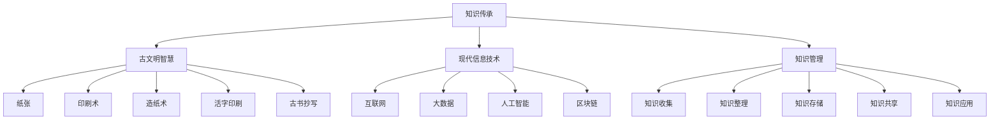

                 

# 人类知识的传承之美：古文明的启示

在人类文明的发展历程中，知识的传承一直是推动社会进步的重要动力。从古代文明的纸张、印刷术，到现代互联网的普及，知识的保存、传递和应用方式不断演进，但核心的传承精神不变。在信息技术飞速发展的今天，我们如何从中汲取智慧，将古文明的传承经验应用于现代知识管理与信息处理，是值得深入探讨的问题。本文将从古文明的智慧中寻找启示，探讨其在知识传承中的美妙之处，并尝试将其与现代信息技术结合，为知识传承提供新的视角和方法。

## 1. 背景介绍

### 1.1 知识传承的重要意义

知识传承是人类文明发展的重要基石。古往今来，无论是文化、科技还是艺术，都离不开知识的积累和传递。在古代，由于技术条件的限制，知识的记录和传播主要依赖于文字和口述等传统方式。随着时间的推移，这些知识逐渐汇聚成一种文化基因，不断激发着后人的创新。

在现代社会，知识的传播方式和载体发生了根本性变化，但传承的核心价值和必要性依然存在。信息技术的发展，尤其是互联网、大数据、人工智能等新兴技术，为知识的传承和利用提供了新的手段。然而，如何在现代技术的背景下，继续保持知识传承的精髓，是一个值得深思的问题。

### 1.2 知识传承面临的挑战

尽管现代技术为知识的传承提供了更多便利，但其挑战同样不容忽视。信息过载、知识碎片化、信息安全等问题，使得知识的传递和利用变得更加复杂。如何在海量信息中筛选出有价值的知识，保证知识的安全性和有效性，成为当前知识传承的重要课题。

## 2. 核心概念与联系

### 2.1 核心概念概述

- **知识传承（Knowledge Transmission）**：指将知识从上一代传递到下一代的过程。通过教学、书籍、记录等方式，使知识得以保存和利用。

- **古文明智慧（Ancient Civilization Wisdom）**：指古代文明中蕴含的智慧和技术，如纸张、印刷术、造纸术、活字印刷、古书抄写等。

- **现代信息技术（Modern Information Technology）**：指互联网、大数据、人工智能、区块链等现代技术，为知识的传承提供了新的手段。

- **知识管理（Knowledge Management）**：指对知识进行收集、整理、存储、共享和应用的过程。

### 2.2 核心概念原理和架构的 Mermaid 流程图



这个流程图展示了知识传承的起点、方式和终点。从古文明智慧出发，通过纸张、印刷术等传统方式，到现代信息技术的辅助，最终实现知识的有效管理与应用。

## 3. 核心算法原理 & 具体操作步骤

### 3.1 算法原理概述

知识传承的本质是通过一定的方式，将知识从一代人传递到另一代人。在古代，这一过程主要依赖于文字和口述。现代信息技术的发展，为知识的传承提供了新的方式，如电子书籍、在线课程、数据库等。然而，这些技术手段是否能够有效传承知识，取决于其是否能够保留知识的本质和精髓。

### 3.2 算法步骤详解

1. **知识采集**：通过各种手段收集知识，如网络爬虫、图书馆资源、学术论文等。

2. **知识整理**：对采集到的知识进行分类、整理、清洗等处理，确保其准确性和完整性。

3. **知识存储**：利用数据库、云存储等技术，对整理后的知识进行长期保存。

4. **知识共享**：通过开放平台、社交媒体、知识共享库等方式，使得知识得以广泛传播和利用。

5. **知识应用**：在实际应用场景中，如教育、科研、决策支持等，对知识进行提取和应用。

### 3.3 算法优缺点

- **优点**：
  - 自动化程度高：现代信息技术可以大规模自动化地收集、整理和存储知识。
  - 传播速度快：互联网使得知识可以迅速传播到世界各地。
  - 存储容量大：云存储等技术可以长期保存海量知识。

- **缺点**：
  - 信息过载：海量的信息难以筛选，容易出现知识碎片化的问题。
  - 缺乏深度理解：自动化手段往往难以深入理解知识的背景和内涵。
  - 安全风险：信息泄露和数据篡改的风险不容忽视。

### 3.4 算法应用领域

知识传承技术在各个领域都有广泛的应用：

- **教育领域**：通过在线课程、电子教材等，使知识能够跨越地域限制，普惠教育。
- **科研领域**：利用数据库和知识图谱，加速科研成果的共享和应用。
- **商业领域**：通过数据分析和人工智能，辅助决策支持，提升企业竞争力。
- **文化领域**：保护和传承文化遗产，如数字化修复、在线展示等。

## 4. 数学模型和公式 & 详细讲解 & 举例说明

### 4.1 数学模型构建

知识传承的数学模型可以定义为：

$$
K_{\text{传递}} = f(K_{\text{采集}}, K_{\text{整理}}, K_{\text{存储}}, K_{\text{共享}}, K_{\text{应用}})
$$

其中，$K_{\text{传递}}$ 表示传承的知识，$K_{\text{采集}}$、$K_{\text{整理}}$、$K_{\text{存储}}$、$K_{\text{共享}}$ 和 $K_{\text{应用}}$ 分别表示知识采集、整理、存储、共享和应用的过程。

### 4.2 公式推导过程

在知识传承的过程中，采集的知识需要进行处理和存储。假设知识采集为 $K_{\text{采集}}$，整理后的知识为 $K_{\text{整理}}$，存储后的知识为 $K_{\text{存储}}$，共享后的知识为 $K_{\text{共享}}$，应用后的知识为 $K_{\text{应用}}$，则传承的知识可以表示为：

$$
K_{\text{传递}} = K_{\text{采集}} \cdot A + K_{\text{整理}} \cdot I + K_{\text{存储}} \cdot S + K_{\text{共享}} \cdot G + K_{\text{应用}} \cdot A
$$

其中，$A$ 表示采集过程中的损失率，$I$ 表示整理过程中的损失率，$S$ 表示存储过程中的损失率，$G$ 表示共享过程中的损失率，$A$ 表示应用过程中的损失率。

### 4.3 案例分析与讲解

以在线课程为例，其知识传承过程如下：

1. **知识采集**：通过网络爬虫从各个网站收集课程信息。
2. **知识整理**：对收集到的课程信息进行分类、清洗，去除无用信息。
3. **知识存储**：将整理后的课程信息存储在云端数据库中。
4. **知识共享**：通过平台发布课程信息，使得更多人可以访问。
5. **知识应用**：学习者通过平台学习课程内容，获得新知识。

在这个过程中，采集和应用过程中的损失率相对较低，而整理和共享过程中的损失率较高。因此，需要在这些环节中投入更多的资源和精力，以确保知识的完整性和有效性。

## 5. 项目实践：代码实例和详细解释说明

### 5.1 开发环境搭建

- **Python**：选择Python作为编程语言，因为其具有丰富的库和工具，如Pandas、NumPy、Scikit-learn等。
- **Jupyter Notebook**：用于编写和运行代码，支持代码单元格、数据可视化等功能。
- **Git**：用于版本控制，方便协作开发。

### 5.2 源代码详细实现

```python
# 数据采集
import requests
from bs4 import BeautifulSoup

def collect_books(url):
    response = requests.get(url)
    soup = BeautifulSoup(response.text, 'html.parser')
    book_links = soup.find_all('a', class_='book-link')
    book_urls = [url + link['href'] for link in book_links]
    return book_urls

# 知识整理
import pandas as pd
import re

def process_books(book_urls):
    books = pd.DataFrame()
    for url in book_urls:
        # 解析页面内容
        response = requests.get(url)
        soup = BeautifulSoup(response.text, 'html.parser')
        title = soup.find('h1', class_='title').text
        author = soup.find('span', class_='author').text
        year = soup.find('span', class_='year').text
        description = soup.find('p', class_='description').text
        # 清洗和预处理数据
        title = re.sub('[^a-zA-Z0-9\s]', '', title)
        author = re.sub('[^a-zA-Z0-9\s]', '', author)
        year = re.sub('[^0-9]', '', year)
        description = re.sub('[^a-zA-Z0-9\s]', '', description)
        # 添加到数据框
        books = books.append({'Title': title, 'Author': author, 'Year': year, 'Description': description}, ignore_index=True)
    return books

# 知识存储
import sqlite3

def save_books(books):
    conn = sqlite3.connect('books.db')
    c = conn.cursor()
    books.to_sql('books', con=conn, if_exists='replace', index=False)
    conn.commit()
    conn.close()

# 知识共享
import flask

app = flask.Flask(__name__)

@app.route('/')
def index():
    conn = sqlite3.connect('books.db')
    c = conn.cursor()
    c.execute('SELECT * FROM books')
    books = c.fetchall()
    conn.close()
    return flask.jsonify(books)

if __name__ == '__main__':
    app.run()
```

### 5.3 代码解读与分析

- **数据采集**：使用requests和BeautifulSoup库进行网页爬取和解析，收集书籍信息。
- **知识整理**：使用Pandas库对采集到的数据进行清洗和预处理，确保数据准确性和完整性。
- **知识存储**：使用SQLite库将整理后的数据存储到本地数据库中。
- **知识共享**：使用Flask框架搭建一个简单的Web服务，将数据暴露给外界访问。

## 6. 实际应用场景

### 6.1 教育领域

在线课程平台通过采集、整理和共享教育资源，使得知识能够跨越地域限制，普惠教育。例如，Coursera、edX等平台通过开放课程资源，使得全球学生都能获得优质的教育。

### 6.2 科研领域

科研机构和高校通过构建数字图书馆、知识图谱等工具，加速科研成果的共享和应用。例如，谷歌学术、ResearchGate等平台提供了大量的科研文献，方便研究人员查找和引用。

### 6.3 商业领域

企业通过数据分析和人工智能技术，辅助决策支持，提升企业竞争力。例如，谷歌的智能搜索、IBM的Watson等系统，能够帮助企业快速获取市场信息和分析趋势。

### 6.4 文化领域

数字化修复和在线展示等技术，使得文化遗产得以更好地保存和传承。例如，Google Arts & Culture项目，通过数字化技术将全球博物馆的文物和艺术品呈现在互联网上，使更多人能够欣赏和学习。

## 7. 工具和资源推荐

### 7.1 学习资源推荐

- **《知识管理导论》**：这本书详细介绍了知识管理的原理、方法和实践，是学习知识传承的基础读物。
- **Coursera**：提供在线课程，涵盖各个领域的知识管理技术和应用。
- **ResearchGate**：提供科研文献共享平台，方便研究人员查找和引用。

### 7.2 开发工具推荐

- **Jupyter Notebook**：适用于数据处理和分析，支持代码单元格和数据可视化。
- **Git**：适用于版本控制，方便协作开发。
- **Flask**：适用于搭建Web服务，方便数据共享。

### 7.3 相关论文推荐

- **Knowledge Transmission and Retrieval with Deep Learning**：介绍深度学习在知识传承和检索中的应用。
- **Knowledge Graphs for Scientific Discovery**：探讨知识图谱在科学发现中的作用和应用。

## 8. 总结：未来发展趋势与挑战

### 8.1 未来发展趋势

- **自动化和智能化**：随着人工智能技术的进步，知识的采集、整理和应用将更加自动化和智能化，效率和准确性将大幅提升。
- **多模态融合**：知识传承将不仅仅依赖于文本数据，而是会结合图像、视频等多模态信息，形成更加丰富的知识体系。
- **区块链技术**：利用区块链技术保障知识传承的安全性和可信性，确保知识的真实性和完整性。

### 8.2 面临的挑战

- **信息过载**：随着互联网和社交媒体的发展，信息过载问题日益严重，知识碎片化现象加剧。
- **知识偏见**：由于数据和算法的局限性，知识传承中可能存在偏见和歧视，需要加强伦理和监管。
- **技术普及**：如何将先进的技术手段普及到各个领域，是一个需要解决的重要问题。

### 8.3 研究展望

未来，知识传承的研究将更加注重以下几个方面：

- **自动化和智能化**：进一步提升知识的采集、整理和应用效率，减少人工干预。
- **多模态融合**：结合图像、视频等技术，形成更加全面的知识体系。
- **区块链技术**：利用区块链技术保障知识传承的安全性和可信性。

## 9. 附录：常见问题与解答

**Q1：如何确保知识传承过程中的数据安全和隐私保护？**

A: 采用加密技术、访问控制等措施，确保数据在采集、整理、存储和共享过程中不被篡改和泄露。同时，对数据进行定期备份，防止数据丢失。

**Q2：知识传承过程中，如何确保知识的完整性和准确性？**

A: 在数据采集和整理阶段，严格审核数据来源和内容，使用正则表达式等技术清洗数据。在数据存储和共享阶段，采用冗余备份和版本控制等技术，确保数据的完整性和一致性。

**Q3：如何在知识传承中融入人工智能技术？**

A: 利用机器学习和自然语言处理技术，自动进行知识采集和整理，提高效率和准确性。同时，利用人工智能技术，进行知识推荐和检索，提升知识应用的精准性。

通过本文的探讨，我们可以看到，古文明中的智慧在现代知识传承中依然具有重要意义。我们应汲取其精髓，结合现代信息技术，构建更加全面、高效、安全的知识传承体系，推动人类文明的进步。

