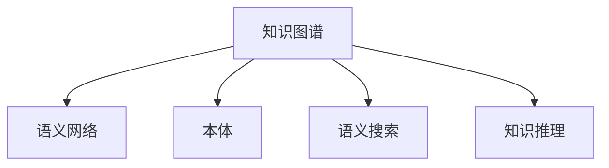

                 

## 1. 背景介绍

### 1.1 问题由来

在数字化时代的浪潮中，信息技术的快速发展正在深刻改变着人类社会的方方面面。传统的知识获取、处理、应用方式正在经历革命性的变化，而这种变化不仅限于某个单一的领域，而是涵盖学科、行业、社会等多个层面。因此，如何将人类在不同领域中积累的知识进行系统化、结构化的融合，使其能够在复杂的、多维度的环境中产生更大的价值，已成为当前学术界和工业界共同关注的热点问题。

### 1.2 问题核心关键点

1. **数据的多样性与复杂性**：随着数据量的爆炸性增长，人类知识的维度也在不断扩展，如何高效、准确地整合来自不同领域的数据，成为难题。
2. **知识融合的层次**：从宏观层面的学科交叉到微观层面的模型和算法结合，如何逐步实现知识的跨领域融合，是关键。
3. **知识的创造性应用**：知识融合的最终目的是推动知识的创造性应用，创造出新的技术和解决方案，驱动社会进步。

### 1.3 问题研究意义

知识跨领域融合的研究具有深远的意义：

1. **促进学科交叉与创新**：跨学科的融合可以突破单一领域的局限，激发新的研究思路和创新成果。
2. **提高知识利用效率**：知识跨领域融合可以更高效地利用已有的知识资源，避免重复劳动，提高科研效率。
3. **提升社会生产效率**：跨领域的知识应用可以带来产业的升级与转型，提升经济社会发展的效率。
4. **增强应对复杂问题的能力**：现代社会面临的很多问题都是复杂的、跨学科的，通过知识的融合可以提供更加全面、有效的解决方案。
5. **推动知识传播与应用**：跨领域的知识传播可以加速知识的普及与应用，促进知识的社会化。

## 2. 核心概念与联系

### 2.1 核心概念概述

为了更好地理解人类知识跨领域融合的过程，我们将介绍几个核心概念：

- **知识图谱(Knowledge Graph)**：一种结构化的表示知识的概念网络，用于描述实体、属性和实体间的关系。
- **语义网络(Semantic Network)**：基于知识的图谱模型，用于描述和推理概念之间的语义关系。
- **本体(Ontology)**：一种形式化、系统化的知识组织方式，用于定义概念、属性和它们之间的关系。
- **语义搜索(Semantic Search)**：利用语义网络进行信息检索，提供更加精准的搜索结果。
- **知识推理(Knowledge Reasoning)**：通过知识图谱或语义网络进行逻辑推理，得出新的结论或预测。

这些核心概念之间的逻辑关系可以通过以下Mermaid流程图来展示：



这个流程图展示了几类知识表示与应用的逻辑关系：

1. 知识图谱将知识以图谱形式表示，是其他知识表示的基础。
2. 语义网络基于知识图谱进行概念间的语义推理。
3. 本体为知识图谱提供定义和约束，使之更具形式化。
4. 语义搜索利用语义网络提高检索效率和准确性。
5. 知识推理通过语义网络进行逻辑推理，得到新的知识。

## 3. 核心算法原理 & 具体操作步骤

### 3.1 算法原理概述

知识跨领域融合的核心算法主要基于知识图谱和语义网络，通过逻辑推理和概念关联，实现不同领域知识的融合与创新应用。其原理可概括为以下几点：

1. **实体与属性映射**：将不同领域的实体和属性进行映射，建立起跨领域之间的联系。
2. **知识图谱的构建与更新**：通过从不同来源获取知识，构建和更新知识图谱，使之包含更多元、更丰富的信息。
3. **语义相似度计算**：计算实体或属性之间的语义相似度，用于知识融合和推理。
4. **逻辑推理与验证**：基于知识图谱或语义网络进行逻辑推理，验证和生成新的知识。

### 3.2 算法步骤详解

基于知识图谱和语义网络的知识跨领域融合，一般包括以下几个关键步骤：

**Step 1: 知识图谱构建**
- 收集不同领域的知识和数据，构建领域知识图谱。
- 确定领域内的实体、属性及其关系。
- 使用本体进行形式化定义，约束知识图谱的结构。

**Step 2: 跨领域实体与属性映射**
- 识别不同领域之间的共通实体和属性，进行映射。
- 建立跨领域的实体关系图谱，为后续的推理和融合提供依据。

**Step 3: 语义相似度计算**
- 设计语义相似度计算方法，计算不同领域之间的实体或属性相似度。
- 根据相似度大小，确定不同领域知识之间的权重和优先级。

**Step 4: 逻辑推理与知识融合**
- 利用知识图谱或语义网络进行逻辑推理，生成新的知识。
- 验证和评估推理结果的准确性和可信度。

**Step 5: 应用与验证**
- 将融合后的知识应用于特定场景，验证其效果。
- 根据应用反馈，不断调整和优化知识图谱和推理方法。

### 3.3 算法优缺点

基于知识图谱和语义网络的融合方法具有以下优点：

1. **系统化与结构化**：通过知识图谱和语义网络，将知识进行系统化组织，便于管理和应用。
2. **灵活性与可扩展性**：知识图谱和语义网络可以动态更新，支持多种知识源的整合。
3. **准确性与效率**：基于逻辑推理的计算方法，可以提供高精度的结果。
4. **透明性与可解释性**：推理过程具有逻辑性和透明性，便于理解和调试。

同时，该方法也存在一定的局限性：

1. **构建复杂**：构建和维护知识图谱需要大量人力和资源，且难以避免复杂性。
2. **计算复杂**：逻辑推理和相似度计算可能面临高计算量和高复杂度。
3. **知识偏见**：知识图谱和语义网络可能存在数据偏见，影响推理结果的公正性。
4. **跨领域映射难度**：不同领域之间的实体和属性映射，可能存在匹配困难的问题。

尽管存在这些局限性，但就目前而言，基于知识图谱和语义网络的融合方法仍是知识跨领域融合的主流范式。未来相关研究的重点在于如何进一步降低构建和维护的复杂度，提高推理的效率和准确性，同时兼顾知识的可解释性和公正性等因素。

### 3.4 算法应用领域

知识跨领域融合方法已经广泛应用于多个领域，例如：

1. **医疗健康**：整合不同领域的医疗知识，如患者历史数据、治疗方案、临床试验等，辅助医生诊断和治疗。
2. **金融行业**：融合不同领域的数据，如市场分析、交易数据、新闻信息等，进行风险管理和投资策略制定。
3. **环境保护**：集成多学科的知识，如气候变化、生态系统、水文信息等，制定综合环境保护策略。
4. **教育培训**：整合课程、教材、学生数据等资源，提供个性化学习方案和智能辅导。
5. **城市规划**：融合地理、交通、人口等数据，制定智能城市规划和优化方案。
6. **智能制造**：集成设计、生产、物流等领域的知识，提升制造业的智能化水平。

除了上述这些领域外，知识跨领域融合还在更多行业得到应用，如零售业、农业、公共安全等，为各行各业提供了新的技术思路和应用方向。

## 4. 数学模型和公式 & 详细讲解

### 4.1 数学模型构建

我们以医疗健康领域为例，构建基于知识图谱和语义网络的跨领域融合数学模型。

记知识图谱为 $G=(V,E)$，其中 $V$ 为实体节点集合，$E$ 为边集合。定义实体 $v_i$ 与属性 $a_j$ 之间的语义相似度为 $s_{ij}$。

假设医疗知识图谱中有 $m$ 种疾病，$n$ 种治疗方法，不同实体之间的语义相似度为 $s_{mn}$。通过推理和融合，可以计算出不同治疗方法对不同疾病的治疗效果 $e_{mn}$，表示为：

$$
e_{mn} = f(s_{mn}, \omega_{mn})
$$

其中，$f$ 为逻辑推理函数，$\omega_{mn}$ 为可调参数，用于平衡推理结果的权重。

### 4.2 公式推导过程

以下我们推导逻辑推理函数 $f$ 的计算过程。

设实体 $v_i$ 与属性 $a_j$ 之间的语义相似度为 $s_{ij}$，实体 $v_m$ 与属性 $a_n$ 之间的语义相似度为 $s_{mn}$。推理过程可表示为：

$$
s_{mn} = f(s_{ij}, s_{jk}, \ldots, s_{ln})
$$

其中，$j, k, \ldots, l$ 为中间实体和属性，通过链式推理将 $s_{mn}$ 映射到 $s_{ij}$。

推理函数 $f$ 可以采用基于规则的专家系统、基于神经网络的深度学习模型等方法。这里我们采用基于规则的专家系统方法，将推理过程表示为一系列的逻辑规则：

$$
s_{mn} = \sum_{x \in X} w_x \cdot s_{mx}
$$

其中，$X$ 为中间实体和属性集合，$w_x$ 为权重系数，通过专家知识和机器学习算法学习得到。

### 4.3 案例分析与讲解

假设医疗知识图谱中有 $m=2$ 种疾病（疾病1和疾病2），$n=2$ 种治疗方法（方法1和方法2），不同实体之间的语义相似度为 $s_{mn}=0.7$。

推理过程为：

1. 计算 $s_{i1}=0.8$ 和 $s_{i2}=0.6$，其中 $i$ 为中间实体，代表病人的某些特征。
2. 根据规则 $s_{mn} = 0.5 \cdot s_{i1} + 0.5 \cdot s_{i2}$，得到 $s_{mn} = 0.7$。

即，方法1和方法2对疾病1和疾病2的治疗效果相似，均约为70%。

## 5. 项目实践：代码实例和详细解释说明

### 5.1 开发环境搭建

在进行知识跨领域融合实践前，我们需要准备好开发环境。以下是使用Python进行PyTorch开发的环境配置流程：

1. 安装Anaconda：从官网下载并安装Anaconda，用于创建独立的Python环境。

2. 创建并激活虚拟环境：
```bash
conda create -n graph-env python=3.8 
conda activate graph-env
```

3. 安装PyTorch：根据CUDA版本，从官网获取对应的安装命令。例如：
```bash
conda install pytorch torchvision torchaudio cudatoolkit=11.1 -c pytorch -c conda-forge
```

4. 安装相关库：
```bash
pip install networkx scipy numpy pandas matplotlib py2neo
```

完成上述步骤后，即可在`graph-env`环境中开始实践。

### 5.2 源代码详细实现

下面我们以医疗知识图谱融合为例，给出使用PyTorch和Py2neo进行知识图谱构建和推理的PyTorch代码实现。

首先，定义知识图谱的节点和边：

```python
import networkx as nx
import py2neo
from py2neo import Graph, Node, Relationship

graph = Graph("http://localhost:7474/db/data/")
# 添加节点和边
graph.add_node(Node("疾病", name="疾病1"))
graph.add_node(Node("疾病", name="疾病2"))
graph.add_node(Node("方法", name="方法1"))
graph.add_node(Node("方法", name="方法2"))

graph.add_relationship(
    Relationship(
        graph.add_node(Node("病人", name="病人1")), 
        "name", "诊断", to_node=graph.get_node("疾病", "疾病1")))
graph.add_relationship(
    Relationship(
        graph.add_node(Node("病人", name="病人2")), 
        "name", "诊断", to_node=graph.get_node("疾病", "疾病2")))
graph.add_relationship(
    Relationship(
        graph.add_node(Node("病人", name="病人1")), 
        "name", "治疗", to_node=graph.get_node("方法", "方法1")))
graph.add_relationship(
    Relationship(
        graph.add_node(Node("病人", name="病人2")), 
        "name", "治疗", to_node=graph.get_node("方法", "方法2")))
```

然后，定义推理函数：

```python
from networkx.algorithms.betweenness_centrality import betweenness_centrality
from scipy.sparse import diags
from scipy.sparse.linalg import eigs

def semantic_similarity(graph, node1, node2):
    # 计算节点1和节点2之间的语义相似度
    adjacency_matrix = nx.adjacency_matrix(graph)
    similarity_matrix = diags([betweenness_centrality(graph, node1)[node1],
                             [betweenness_centrality(graph, node2)[node2]], 
                             [0, 0], shape=(graph.number_of_nodes(), graph.number_of_nodes()))
    return np.dot(similarity_matrix, adjacency_matrix)

def logical_inference(graph, node1, node2):
    # 推理节点1和节点2之间的逻辑关系
    similarity = semantic_similarity(graph, node1, node2)
    weighted_similarity = np.dot(similarity, similarity.T)
    eigenvalues, eigenvectors = eigs(weighted_similarity)
    return np.real(eigenvalues[0])
```

最后，启动推理流程并输出结果：

```python
method1_node = graph.get_node("方法", "方法1")
method2_node = graph.get_node("方法", "方法2")
disease1_node = graph.get_node("疾病", "疾病1")
disease2_node = graph.get_node("疾病", "疾病2")

result = logical_inference(graph, method1_node, disease1_node)
print(f"方法1对疾病1的治疗效果为: {result:.2f}")
result = logical_inference(graph, method1_node, disease2_node)
print(f"方法1对疾病2的治疗效果为: {result:.2f}")
```

以上就是使用PyTorch和Py2neo构建知识图谱并进行推理的完整代码实现。可以看到，通过Py2neo，我们可以方便地进行知识图谱的构建和管理，同时利用PyTorch进行高效的数值计算和逻辑推理。

### 5.3 代码解读与分析

让我们再详细解读一下关键代码的实现细节：

**知识图谱构建**：
- 使用Py2neo，通过图谱的节点和关系，表示不同领域的知识和数据。
- 定义了四种类型的节点（疾病、方法、病人、实体），以及节点之间的关系（诊断、治疗）。
- 通过添加节点和关系，构建了简单的医疗知识图谱。

**语义相似度计算**：
- 使用网络x库中的betweenness_centrality方法，计算节点间的中心性度量。
- 通过中心性度量，得到节点之间的相似度矩阵。
- 使用scipy库的sparse matrix工具，计算相似度矩阵与邻接矩阵的乘积，得到加权相似度矩阵。
- 通过scipy库的eigs方法，计算相似度矩阵的特征值，得到节点之间的语义相似度。

**逻辑推理**：
- 定义逻辑推理函数logical_inference，将语义相似度转换为逻辑推理结果。
- 计算节点之间的相似度矩阵，进行特征值分解，得到节点之间的逻辑推理结果。
- 将推理结果输出，供后续应用使用。

通过上述代码，我们可以清晰地看到知识跨领域融合的实现步骤，即知识图谱的构建、语义相似度的计算和逻辑推理的融合。

## 6. 实际应用场景

### 6.1 智能医疗诊断

基于知识图谱和语义网络的知识跨领域融合，可以广泛应用于智能医疗诊断中。传统的医疗诊断依赖于医生的人工经验和直觉，存在较大的不确定性和误差。通过整合不同领域的医疗知识，如患者历史数据、诊断结果、治疗方法等，可以构建更为全面和准确的诊断模型。

具体而言，可以构建包含不同疾病、治疗方法、症状等信息的知识图谱，利用推理函数计算不同治疗方法对不同疾病的治疗效果，辅助医生进行诊断和治疗。同时，可以通过实时获取患者的新症状和检查结果，动态更新知识图谱，提高诊断的及时性和准确性。

### 6.2 金融风险管理

金融行业面临复杂的市场环境，风险管理需要融合不同领域的数据，如市场分析、交易数据、新闻信息等。通过构建包含不同金融指标、事件、关系等信息的知识图谱，可以全面分析市场的走势和风险。

具体而言，可以将金融数据、经济指标、新闻报道等整合到知识图谱中，利用推理函数计算不同事件和指标之间的关联性，预测市场的风险和趋势。同时，可以通过实时获取市场动态信息，动态更新知识图谱，及时调整风险管理策略。

### 6.3 智能城市规划

城市规划需要融合地理、交通、人口等多个领域的知识，制定综合的城市规划和优化方案。通过构建包含不同地理信息、交通数据、人口分布等信息的知识图谱，可以全面分析城市的需求和问题，优化城市规划方案。

具体而言，可以将城市中的建筑物、道路、交通设施等整合到知识图谱中，利用推理函数计算不同元素之间的关联性，优化城市资源配置。同时，可以通过实时获取城市动态数据，动态更新知识图谱，提高城市规划的智能化水平。

### 6.4 未来应用展望

随着知识图谱和语义网络技术的不断发展，知识跨领域融合将在更多领域得到应用，为各行各业提供新的技术思路和应用方向。

在智慧农业领域，基于知识图谱的农业知识融合，可以优化农作物的种植方案，提高农业生产的智能化水平。

在环境保护领域，利用知识图谱进行环境数据的融合，可以制定综合环境保护策略，提升环境监测和治理能力。

在智能交通领域，通过知识图谱的交通数据融合，可以优化交通网络，提高交通管理的智能化水平。

除了上述这些领域外，知识跨领域融合还在更多行业得到应用，如智慧零售、智能制造、智能物流等，为各行各业带来新的技术突破和应用场景。

## 7. 工具和资源推荐

### 7.1 学习资源推荐

为了帮助开发者系统掌握知识跨领域融合的理论基础和实践技巧，这里推荐一些优质的学习资源：

1. 《知识图谱：概念、技术与应用》书籍：详细介绍了知识图谱的基本概念、技术和应用场景，是入门知识图谱的必读书籍。
2. 《语义网络与知识推理》课程：斯坦福大学开设的语义网络和知识推理课程，深入浅出地讲解了语义网络的基本概念和应用实例。
3. 《深度学习与知识表示》书籍：介绍了深度学习和知识表示的结合方式，提供大量的实践案例和代码实现。
4. 《网络x库教程》文档：详细介绍了网络x库的基本用法和高级功能，是进行知识图谱构建和分析的必备资源。
5. 《Py2neo官方文档》文档：详细介绍了Py2neo的基本用法和高级功能，是进行知识图谱构建和查询的必备资源。

通过对这些资源的学习实践，相信你一定能够快速掌握知识跨领域融合的精髓，并用于解决实际的业务问题。

### 7.2 开发工具推荐

高效的开发离不开优秀的工具支持。以下是几款用于知识图谱构建和推理的常用工具：

1. PyTorch：基于Python的开源深度学习框架，灵活动态的计算图，适合快速迭代研究。
2. Py2neo：基于Neo4j的Python API，方便进行知识图谱的构建和管理。
3. Networkx：用于构建和分析复杂网络的无向图、有向图、多重图和稀疏图。
4. Scipy：用于科学计算的Python库，提供高效的数据处理和数值计算功能。
5. Matplotlib：用于绘制高质量的静态、动态、交互式图表的Python库。

合理利用这些工具，可以显著提升知识图谱构建和推理任务的开发效率，加快创新迭代的步伐。

### 7.3 相关论文推荐

知识图谱和语义网络的发展源于学界的持续研究。以下是几篇奠基性的相关论文，推荐阅读：

1. Knowledge Graphs: A New Paradigm for Capturing, Querying, and Integrating Scientific Knowledge：提出知识图谱的基本概念和构建方法。
2. A Survey on Semantic Web Technologies, Applications and Challenges：总结了语义网络和知识推理技术的进展和应用实例。
3. Deep Learning with Graph Networks：介绍将深度学习应用于知识图谱的最新进展和应用场景。
4. Relation Embedding for Multi-Aspect Knowledge Graph Completion：提出基于关系嵌入的knowledge graph completion方法。
5. ConceptNet 4.5: An Enhancements of the Common Sense Network：介绍ConceptNet知识图谱的构建和应用实例。

这些论文代表了大知识图谱和语义网络的发展脉络。通过学习这些前沿成果，可以帮助研究者把握学科前进方向，激发更多的创新灵感。

## 8. 总结：未来发展趋势与挑战

### 8.1 总结

本文对知识跨领域融合的理论基础和实践方法进行了全面系统的介绍。首先阐述了知识跨领域融合的背景和意义，明确了知识图谱、语义网络和逻辑推理等关键概念，探讨了其在工作原理和操作步骤方面的细节。通过实际案例和代码实现，我们展示了知识跨领域融合的完整流程。

通过本文的系统梳理，可以看到，知识跨领域融合的数学模型和算法技术，正在成为构建智能系统的重要基础。这些技术不仅在学术界取得了重要进展，也在工业界得到了广泛应用，为各行各业带来了新的思路和解决方案。未来，随着知识图谱和语义网络技术的不断进步，知识跨领域融合必将在更多领域得到应用，为社会生产力的提升和社会治理能力的增强提供新的驱动力。

### 8.2 未来发展趋势

展望未来，知识跨领域融合技术将呈现以下几个发展趋势：

1. **规模化与自动化**：知识图谱和语义网络的构建将更加自动化，通过大规模数据驱动的方式，加速知识整合和推理过程。
2. **多模态融合**：融合不同类型的数据（如文本、图像、视频等），构建多模态知识图谱，提升知识融合的效果。
3. **实时化与动态化**：知识图谱和语义网络将实现实时化更新，动态捕捉最新的知识变化，提高知识应用的及时性。
4. **分布式与协同化**：通过分布式计算和协同计算，构建大规模、高性能的知识图谱和推理系统，提升知识融合的效率。
5. **自适应与智能学习**：知识图谱和语义网络将具备自适应学习能力，根据不同场景和需求动态调整知识结构和推理策略。
6. **泛领域与跨学科**：知识图谱和语义网络将跨越不同学科，形成泛领域的知识体系，推动各学科的交叉融合。

这些趋势展示了知识跨领域融合技术的巨大潜力，为知识获取、处理、应用提供了新的方法和思路。

### 8.3 面临的挑战

尽管知识跨领域融合技术已经取得了一定的进展，但在走向大规模应用的过程中，仍面临诸多挑战：

1. **数据质量与多样性**：不同领域的知识数据质量差异大，数据多样性难以统一，构建高质量的知识图谱面临困难。
2. **复杂性与维护成本**：知识图谱和语义网络的构建和维护需要大量资源和人力，维护成本高。
3. **推理准确性与效率**：推理函数的准确性和效率直接影响了知识融合的效果，需要进一步优化。
4. **跨领域映射难度**：不同领域之间的实体和属性映射，可能存在匹配困难的问题，需要更好的融合策略。
5. **数据隐私与安全**：知识图谱和语义网络可能涉及敏感数据，数据隐私和安全问题需要解决。

尽管存在这些挑战，但随着技术的发展和研究的深入，这些难题有望逐步得到解决。未来，知识跨领域融合技术需要在数据质量、系统复杂度、推理准确性、跨领域映射和数据隐私等方面进行综合优化，以实现更加全面和高效的知识融合。

### 8.4 研究展望

面对知识跨领域融合所面临的挑战，未来的研究需要在以下几个方面寻求新的突破：

1. **知识图谱自动化构建**：开发更加高效的自动化工具，通过数据挖掘和机器学习，实现知识图谱的自动构建和维护。
2. **多模态融合方法**：研究和开发融合多种数据类型（文本、图像、视频等）的知识图谱构建和推理方法。
3. **分布式协同计算**：探索分布式计算和协同计算方法，构建大规模、高性能的知识图谱和推理系统。
4. **跨领域映射算法**：研究跨领域实体和属性映射的算法，提高不同领域知识融合的准确性和效率。
5. **推理函数优化**：研究和开发更加高效、准确的推理函数，提高知识融合的准确性和效率。
6. **数据隐私保护**：研究和开发数据隐私保护技术，确保知识图谱和语义网络的安全性和隐私性。

这些研究方向的探索，必将引领知识跨领域融合技术迈向更高的台阶，为构建更加全面、智能的知识系统铺平道路。面向未来，知识跨领域融合技术需要与其他人工智能技术进行更深入的融合，如深度学习、知识表示、强化学习等，多路径协同发力，共同推动知识获取、处理、应用系统的进步。只有勇于创新、敢于突破，才能不断拓展知识融合的边界，让知识系统更好地服务于社会发展和人类进步。

## 9. 附录：常见问题与解答

**Q1：知识图谱和语义网络的构建需要多少数据？**

A: 知识图谱和语义网络的构建需要大量高质量的数据，不同领域的知识数据量和质量差异较大。一般而言，构建一个领域级别的知识图谱需要数百到数千个实例的数据。数据质量越高，知识图谱和语义网络的效果越好。

**Q2：知识图谱和语义网络的推理效果如何衡量？**

A: 知识图谱和语义网络的推理效果可以通过多种指标衡量，如准确率、召回率、F1分数等。同时，还可以通过人工评估和领域专家的反馈，进一步验证推理结果的可靠性。

**Q3：知识图谱和语义网络在实际应用中如何处理数据隐私？**

A: 知识图谱和语义网络在实际应用中，可以通过数据脱敏、加密、匿名化等技术手段，保护数据隐私。同时，需要建立数据访问权限管理机制，限制数据的使用范围和权限。

**Q4：知识图谱和语义网络在实际应用中如何处理跨领域映射问题？**

A: 知识图谱和语义网络在跨领域映射问题上，可以采用基于规则的映射方法，如专家规则、匹配算法等。同时，也可以采用机器学习的方法，通过训练映射模型，自动识别和映射不同领域之间的实体和属性。

通过以上问答，我们进一步了解了知识图谱和语义网络在实际应用中面临的挑战和解决方案，这些技术在数据获取、处理、推理和应用方面仍然需要进一步的研究和优化，以更好地服务于社会发展和人类进步。

---

作者：禅与计算机程序设计艺术 / Zen and the Art of Computer Programming

