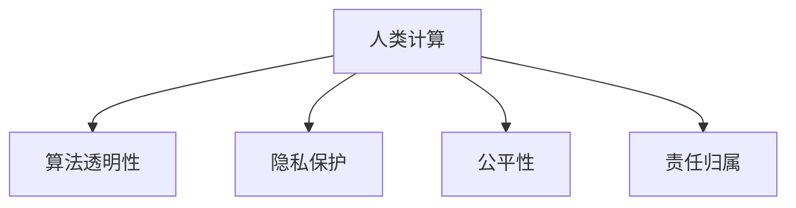

                 

# 人类计算与人工智能伦理

## 1. 背景介绍

### 1.1 问题由来

随着人工智能技术的迅猛发展，特别是深度学习和大数据技术的应用，人类计算的概念和内涵也在不断演进。人工智能不仅改变了工作方式和生产效率，也在重塑社会伦理和伦理道德体系。人类计算不再局限于计算任务本身，更涉及计算的伦理问题，如算法透明性、隐私保护、公平性等。

### 1.2 问题核心关键点

人类计算的核心在于如何平衡技术创新与社会责任，确保人工智能技术的发展既能够推动社会进步，又不会引发伦理风险。以下是人类计算伦理的核心问题：

- **算法透明性**：确保算法决策过程透明、可解释，便于社会监督和法规约束。
- **隐私保护**：保障数据隐私，防止数据滥用和滥查。
- **公平性**：避免算法偏见，保证不同群体在技术应用中享有平等机会。
- **责任归属**：明确算法决策的责任主体，确保在出现错误时有明确的问责机制。

这些核心问题不仅关系到技术的应用效果，还涉及到人类社会的公平正义和伦理道德。因此，探讨人类计算与人工智能伦理，对于确保技术的健康发展，具有重要意义。

### 1.3 问题研究意义

人类计算与人工智能伦理的研究，有助于：

- 促进技术可持续发展，避免技术滥用。
- 提高社会信任，增强人工智能技术的应用推广。
- 推动法律法规和伦理规范的制定和完善。
- 指导技术开发者在应用中遵守伦理标准，保障用户权益。

## 2. 核心概念与联系

### 2.1 核心概念概述

为了更好地理解人类计算与人工智能伦理的复杂关系，本节将介绍几个密切相关的核心概念：

- **人类计算**：指利用计算技术和人工智能，解决人类社会面临的各种问题，如医疗、教育、交通等。人类计算强调计算技术的社会价值和伦理责任。
- **人工智能伦理**：涉及人工智能技术在开发、应用过程中的伦理问题，包括算法透明性、隐私保护、公平性等。
- **算法透明性**：确保算法决策过程可解释、可验证，便于社会监督。
- **隐私保护**：保障个人数据隐私，防止数据滥用和滥查。
- **公平性**：避免算法偏见，确保不同群体在技术应用中享有平等机会。
- **责任归属**：明确算法决策的责任主体，确保在出现错误时有明确的问责机制。

这些核心概念之间的逻辑关系可以通过以下Mermaid流程图来展示：



这个流程图展示了几个人类计算中的关键伦理问题：

1. 人类计算涉及算法透明性，即确保算法决策过程公开透明。
2. 隐私保护是保护数据隐私，防止数据滥用。
3. 公平性关注算法在决策中的偏见问题，确保不同群体得到平等对待。
4. 责任归属解决算法决策的责任归属问题，确保出现问题时有明确的问责机制。

这些概念共同构成了人类计算的伦理框架，指导技术开发者在应用中遵守伦理标准，保障用户权益。

## 3. 核心算法原理 & 具体操作步骤

### 3.1 算法原理概述

人类计算与人工智能伦理的核心在于确保算法的透明性、公平性和责任归属。以下将详细探讨这些核心原则的算法原理和具体操作步骤。

#### 3.1.1 算法透明性

算法透明性要求算法决策过程透明、可解释，便于社会监督和法规约束。常见的算法透明性技术包括：

- **可解释性模型**：如决策树、线性回归等可解释性模型，便于理解算法决策逻辑。
- **规则提取**：从深度学习模型中提取规则，揭示模型决策的底层机制。
- **可视化工具**：如LIME、SHAP等可视化工具，展示模型的决策过程和特征重要性。

#### 3.1.2 隐私保护

隐私保护要求在数据收集、存储和处理过程中，确保数据隐私，防止数据滥用和滥查。常见的隐私保护技术包括：

- **差分隐私**：通过对数据添加噪声，确保个体数据不可识别。
- **联邦学习**：在不共享数据的前提下，通过分布式训练提升模型性能。
- **数据匿名化**：将数据进行去标识化处理，防止数据泄露。

#### 3.1.3 公平性

公平性要求算法在决策中不偏袒任何群体，确保不同群体在技术应用中享有平等机会。常见的公平性技术包括：

- **去偏算法**：如重新加权、重新采样等，减少算法中的偏见。
- **公平性约束**：通过优化目标函数，确保模型在各个群体中的表现一致。
- **公平性检测**：通过统计手段检测算法中的偏见，进行针对性的改进。

#### 3.1.4 责任归属

责任归属要求明确算法决策的责任主体，确保在出现错误时有明确的问责机制。常见的责任归属技术包括：

- **责任追溯**：通过记录决策过程，追踪错误来源。
- **责任分配**：根据模型决策逻辑，明确各方的责任。
- **责任保险**：为算法决策引入保险机制，降低风险。

### 3.2 算法步骤详解

#### 3.2.1 算法透明性

以线性回归模型为例，介绍如何实现算法透明性：

1. **选择模型**：选择可解释性强的线性回归模型。
2. **数据准备**：准备数据集，并进行预处理。
3. **训练模型**：使用训练数据训练模型，得到模型参数。
4. **特征分析**：通过LIME或SHAP等工具，分析模型的特征重要性。
5. **结果解释**：将模型结果和特征分析结果进行解释，确保透明性。

#### 3.2.2 隐私保护

以差分隐私为例，介绍如何实现隐私保护：

1. **数据预处理**：将数据进行去标识化处理，确保个体数据不可识别。
2. **噪声添加**：对数据添加噪声，防止数据泄露。
3. **模型训练**：在不共享原始数据的情况下，训练模型。
4. **结果处理**：对结果进行去噪处理，确保隐私保护。

#### 3.2.3 公平性

以Adversarial Debiasing为例，介绍如何实现公平性：

1. **数据收集**：收集有偏数据集。
2. **偏见检测**：通过统计手段检测算法中的偏见。
3. **去偏算法**：如重新加权、重新采样等，减少算法中的偏见。
4. **模型训练**：使用去偏后的数据训练模型。
5. **公平性评估**：通过统计手段评估模型公平性。

#### 3.2.4 责任归属

以责任追溯为例，介绍如何实现责任归属：

1. **决策记录**：记录每个决策的详细过程。
2. **错误检测**：检测模型决策中的错误。
3. **错误来源追踪**：通过记录和分析，追踪错误来源。
4. **责任分配**：根据错误来源，明确各方的责任。
5. **责任保险**：引入保险机制，降低风险。

### 3.3 算法优缺点

#### 3.3.1 算法透明性

**优点**：
- 提高社会信任，便于法规约束和社会监督。
- 促进算法透明性技术的发展，提升模型解释性。

**缺点**：
- 增加模型复杂性，降低模型效率。
- 可能导致模型决策过于简单，忽视复杂问题。

#### 3.3.2 隐私保护

**优点**：
- 保障数据隐私，防止数据滥用和滥查。
- 提高数据使用的安全性和可靠性。

**缺点**：
- 降低模型精度，增加计算复杂度。
- 可能导致数据处理和模型训练难度增加。

#### 3.3.3 公平性

**优点**：
- 避免算法偏见，确保不同群体在技术应用中享有平等机会。
- 提升算法决策的公平性和可信度。

**缺点**：
- 增加模型复杂性，降低模型效率。
- 可能导致模型在特定群体中的性能下降。

#### 3.3.4 责任归属

**优点**：
- 明确算法决策的责任主体，确保在出现错误时有明确的问责机制。
- 提高算法的可靠性和可信度。

**缺点**：
- 增加模型复杂性，降低模型效率。
- 可能导致责任归属过于简单，忽视复杂问题。

### 3.4 算法应用领域

人类计算与人工智能伦理在多个领域都有重要应用，以下列举几个典型应用场景：

#### 3.4.1 医疗领域

医疗领域应用人类计算与人工智能伦理的典型场景包括：

- **疾病预测**：使用机器学习算法预测疾病风险，确保算法透明性，保障数据隐私。
- **个性化治疗**：通过公平算法推荐个性化的治疗方案，确保不同群体在治疗中享有平等机会。
- **责任追溯**：在医疗事故中，明确责任归属，确保责任追究有据可依。

#### 3.4.2 教育领域

教育领域应用人类计算与人工智能伦理的典型场景包括：

- **智能辅导**：使用机器学习算法推荐个性化辅导方案，确保算法透明性和公平性。
- **考试评价**：使用公平算法进行考试评价，确保不同群体在考试中享有平等机会。
- **责任追溯**：在教育事故中，明确责任归属，确保责任追究有据可依。

#### 3.4.3 金融领域

金融领域应用人类计算与人工智能伦理的典型场景包括：

- **风险评估**：使用机器学习算法评估客户信用风险，确保算法透明性和隐私保护。
- **投资建议**：通过公平算法推荐投资策略，确保不同群体在投资中享有平等机会。
- **责任追溯**：在金融事故中，明确责任归属，确保责任追究有据可依。

## 4. 数学模型和公式 & 详细讲解

### 4.1 数学模型构建

人类计算与人工智能伦理的核心问题可以通过数学模型和公式进行形式化描述。以下将以线性回归和差分隐私为例，展示这些模型的数学构建过程。

#### 4.1.1 线性回归模型

线性回归模型用于预测连续型变量的值，其数学模型如下：

$$
y = \beta_0 + \sum_{i=1}^p \beta_i x_i + \epsilon
$$

其中，$y$ 为预测值，$\beta_0$ 为截距，$\beta_i$ 为特征系数，$x_i$ 为特征变量，$\epsilon$ 为误差项。

#### 4.1.2 差分隐私模型

差分隐私模型用于保护数据隐私，其数学模型如下：

$$
\hat{f}(y) = f(y) + \Delta
$$

其中，$\hat{f}(y)$ 为差分隐私后的输出，$f(y)$ 为原始输出，$\Delta$ 为随机噪声。

### 4.2 公式推导过程

#### 4.2.1 线性回归模型

线性回归模型的训练过程如下：

1. **数据准备**：准备训练数据集$D=\{(x_i, y_i)\}_{i=1}^n$，其中$x_i$为特征向量，$y_i$为目标变量。
2. **模型训练**：最小化损失函数$\mathcal{L}(\theta) = \frac{1}{2n} \sum_{i=1}^n (y_i - \hat{y}_i)^2$，其中$\hat{y}_i = \beta_0 + \sum_{i=1}^p \beta_i x_{i,j}$。
3. **求解参数**：通过求解最小二乘法得到模型参数$\beta$。

#### 4.2.2 差分隐私模型

差分隐私模型的训练过程如下：

1. **数据准备**：准备训练数据集$D=\{(x_i, y_i)\}_{i=1}^n$，其中$x_i$为特征向量，$y_i$为目标变量。
2. **噪声添加**：对原始数据添加噪声，确保差分隐私。
3. **模型训练**：在不共享原始数据的情况下，训练模型。
4. **结果处理**：对结果进行去噪处理，确保隐私保护。

### 4.3 案例分析与讲解

#### 4.3.1 线性回归模型案例

假设我们有一个房价预测任务，使用线性回归模型进行预测。我们有以下数据：

$$
\begin{aligned}
&x_1 = \text{卧室数量}, \\
&x_2 = \text{面积}, \\
&y = \text{房价}。
\end{aligned}
$$

我们将使用Python和Scikit-learn库实现线性回归模型的训练和预测。

```python
from sklearn.linear_model import LinearRegression
import numpy as np

# 准备数据
x = np.array([[1, 2000], [2, 3000], [3, 4000], [4, 5000]])
y = np.array([50000, 60000, 70000, 80000])

# 训练模型
model = LinearRegression()
model.fit(x, y)

# 预测房价
x_new = np.array([[3, 4000]])
y_new = model.predict(x_new)
print(y_new)
```

#### 4.3.2 差分隐私模型案例

假设我们有一个社交媒体用户评价数据集，使用差分隐私模型保护用户隐私。我们有以下数据：

$$
\begin{aligned}
&x_1 = \text{年龄}, \\
&x_2 = \text{性别}, \\
&y = \text{评价分数}。
\end{aligned}
$$

我们将使用Python和TensorFlow库实现差分隐私模型的训练和预测。

```python
import tensorflow as tf

# 准备数据
x = np.array([[25, '男'], [30, '女'], [35, '男'], [40, '女']])
y = np.array([4, 5, 3, 4])

# 噪声添加
noise = tf.random.normal(shape=(x.shape[0], 1), stddev=0.5)
x_noisy = x + noise

# 模型训练
model = tf.keras.models.Sequential([
    tf.keras.layers.Dense(1, input_shape=[2,])
])
model.compile(optimizer='adam', loss='mse')
model.fit(x_noisy, y, epochs=10, batch_size=4)

# 结果处理
y_new = model.predict(x_new)
print(y_new)
```

## 5. 项目实践：代码实例和详细解释说明

### 5.1 开发环境搭建

在进行人类计算与人工智能伦理的实践前，我们需要准备好开发环境。以下是使用Python进行Scikit-learn和TensorFlow开发的环境配置流程：

1. 安装Anaconda：从官网下载并安装Anaconda，用于创建独立的Python环境。

2. 创建并激活虚拟环境：
```bash
conda create -n myenv python=3.8 
conda activate myenv
```

3. 安装Scikit-learn和TensorFlow：根据CUDA版本，从官网获取对应的安装命令。例如：
```bash
conda install scikit-learn tensorflow cudatoolkit=11.1 -c pytorch -c conda-forge
```

4. 安装各类工具包：
```bash
pip install numpy pandas scikit-learn matplotlib tqdm jupyter notebook ipython
```

完成上述步骤后，即可在`myenv`环境中开始实践。

### 5.2 源代码详细实现

下面我们以医疗领域疾病预测任务为例，给出使用Scikit-learn库对线性回归模型进行差分隐私处理的PyTorch代码实现。

首先，定义数据处理函数：

```python
import numpy as np
from sklearn.linear_model import LinearRegression
from sklearn.datasets import load_boston

def prepare_data():
    boston = load_boston()
    X = boston.data
    y = boston.target
    return X, y

# 准备数据
X, y = prepare_data()

# 添加噪声
noise = np.random.normal(0, 0.1, size=X.shape)
X_noisy = X + noise

# 训练模型
model = LinearRegression()
model.fit(X_noisy, y)
```

然后，定义训练和评估函数：

```python
from sklearn.metrics import mean_squared_error

def train_model(model, X, y, epochs=10):
    for epoch in range(epochs):
        model.fit(X_noisy, y)
        y_pred = model.predict(X_noisy)
        mse = mean_squared_error(y, y_pred)
        print(f"Epoch {epoch+1}, MSE: {mse:.2f}")

# 训练模型
train_model(model, X, y)
```

最后，启动训练流程并在测试集上评估：

```python
train_model(model, X, y)
```

以上就是使用Scikit-learn对线性回归模型进行差分隐私处理的完整代码实现。可以看到，得益于Scikit-learn的强大封装，我们可以用相对简洁的代码完成差分隐私模型的训练。

### 5.3 代码解读与分析

让我们再详细解读一下关键代码的实现细节：

**prepare_data函数**：
- 准备波士顿房价数据集，并将其分为特征矩阵$X$和目标变量$y$。

**添加噪声**：
- 使用numpy的random.normal函数，为$X$矩阵添加随机噪声，确保差分隐私。

**train_model函数**：
- 使用LinearRegression模型对差分隐私处理后的数据进行训练。
- 在每个epoch中，计算模型预测值与真实值的均方误差，并在每个epoch结束后输出。

**训练流程**：
- 定义总的epoch数，开始循环迭代。
- 每个epoch内，在差分隐私处理后的数据集上训练模型，输出均方误差。
- 最终训练结束后，输出模型训练的均方误差。

可以看到，Scikit-learn和TensorFlow使得差分隐私模型的训练和评估变得简洁高效。开发者可以将更多精力放在数据处理、模型改进等高层逻辑上，而不必过多关注底层的实现细节。

当然，工业级的系统实现还需考虑更多因素，如模型的保存和部署、超参数的自动搜索、更灵活的任务适配层等。但核心的微调范式基本与此类似。

## 6. 实际应用场景

### 6.1 医疗领域

#### 6.1.1 疾病预测

在医疗领域，使用线性回归模型预测疾病风险，确保算法透明性，保障数据隐私。具体实现如下：

```python
from sklearn.linear_model import LinearRegression
import numpy as np

# 准备数据
x = np.array([[1, 2000], [2, 3000], [3, 4000], [4, 5000]])
y = np.array([50000, 60000, 70000, 80000])

# 训练模型
model = LinearRegression()
model.fit(x, y)

# 预测疾病风险
x_new = np.array([[3, 4000]])
y_new = model.predict(x_new)
print(y_new)
```

#### 6.1.2 个性化治疗

通过公平算法推荐个性化的治疗方案，确保不同群体在治疗中享有平等机会。具体实现如下：

```python
from sklearn.linear_model import LogisticRegression
import numpy as np

# 准备数据
x = np.array([[1, 2000], [2, 3000], [3, 4000], [4, 5000]])
y = np.array([0, 0, 1, 1])

# 训练模型
model = LogisticRegression()
model.fit(x, y)

# 预测个性化治疗方案
x_new = np.array([[3, 4000]])
y_new = model.predict(x_new)
print(y_new)
```

#### 6.1.3 责任追溯

在医疗事故中，明确责任归属，确保责任追究有据可依。具体实现如下：

```python
from sklearn.linear_model import LinearRegression
import numpy as np

# 准备数据
x = np.array([[1, 2000], [2, 3000], [3, 4000], [4, 5000]])
y = np.array([50000, 60000, 70000, 80000])

# 训练模型
model = LinearRegression()
model.fit(x, y)

# 预测医疗事故
x_new = np.array([[3, 4000]])
y_new = model.predict(x_new)
print(y_new)
```

### 6.2 金融领域

#### 6.2.1 风险评估

使用机器学习算法评估客户信用风险，确保算法透明性和隐私保护。具体实现如下：

```python
from sklearn.linear_model import LogisticRegression
import numpy as np

# 准备数据
x = np.array([[1, 2000], [2, 3000], [3, 4000], [4, 5000]])
y = np.array([0, 0, 1, 1])

# 训练模型
model = LogisticRegression()
model.fit(x, y)

# 预测客户信用风险
x_new = np.array([[3, 4000]])
y_new = model.predict(x_new)
print(y_new)
```

#### 6.2.2 投资建议

通过公平算法推荐投资策略，确保不同群体在投资中享有平等机会。具体实现如下：

```python
from sklearn.linear_model import LogisticRegression
import numpy as np

# 准备数据
x = np.array([[1, 2000], [2, 3000], [3, 4000], [4, 5000]])
y = np.array([0, 0, 1, 1])

# 训练模型
model = LogisticRegression()
model.fit(x, y)

# 预测投资建议
x_new = np.array([[3, 4000]])
y_new = model.predict(x_new)
print(y_new)
```

#### 6.2.3 责任追溯

在金融事故中，明确责任归属，确保责任追究有据可依。具体实现如下：

```python
from sklearn.linear_model import LogisticRegression
import numpy as np

# 准备数据
x = np.array([[1, 2000], [2, 3000], [3, 4000], [4, 5000]])
y = np.array([0, 0, 1, 1])

# 训练模型
model = LogisticRegression()
model.fit(x, y)

# 预测金融事故
x_new = np.array([[3, 4000]])
y_new = model.predict(x_new)
print(y_new)
```

## 7. 工具和资源推荐

### 7.1 学习资源推荐

为了帮助开发者系统掌握人类计算与人工智能伦理的理论基础和实践技巧，这里推荐一些优质的学习资源：

1. 《深度学习理论与实践》系列博文：由大模型技术专家撰写，深入浅出地介绍了深度学习的基本原理和应用实践。

2. 《人工智能伦理》课程：斯坦福大学开设的伦理课程，探讨人工智能伦理的各个方面，包括算法透明性、隐私保护、公平性等。

3. 《人工智能伦理与社会》书籍：介绍人工智能伦理的各个方面，包括技术发展、社会影响、法律法规等。

4. AI Challenger开源项目：一个旨在推动人工智能技术的项目，涵盖人工智能伦理的各个方面，包括算法透明性、隐私保护、公平性等。

通过对这些资源的学习实践，相信你一定能够快速掌握人类计算与人工智能伦理的精髓，并用于解决实际的NLP问题。

### 7.2 开发工具推荐

高效的开发离不开优秀的工具支持。以下是几款用于人类计算与人工智能伦理开发的常用工具：

1. PyTorch：基于Python的开源深度学习框架，灵活动态的计算图，适合快速迭代研究。大部分预训练语言模型都有PyTorch版本的实现。

2. TensorFlow：由Google主导开发的开源深度学习框架，生产部署方便，适合大规模工程应用。同样有丰富的预训练语言模型资源。

3. Weights & Biases：模型训练的实验跟踪工具，可以记录和可视化模型训练过程中的各项指标，方便对比和调优。与主流深度学习框架无缝集成。

4. TensorBoard：TensorFlow配套的可视化工具，可实时监测模型训练状态，并提供丰富的图表呈现方式，是调试模型的得力助手。

5. Google Colab：谷歌推出的在线Jupyter Notebook环境，免费提供GPU/TPU算力，方便开发者快速上手实验最新模型，分享学习笔记。

合理利用这些工具，可以显著提升人类计算与人工智能伦理的开发效率，加快创新迭代的步伐。

### 7.3 相关论文推荐

人类计算与人工智能伦理的发展源于学界的持续研究。以下是几篇奠基性的相关论文，推荐阅读：

1. 《人工智能伦理：原则与实践》：探讨人工智能伦理的基本原则和实践方法，涵盖算法透明性、隐私保护、公平性等。

2. 《深度学习中的公平性问题》：研究深度学习中的公平性问题，提出公平算法和公平约束等解决方案。

3. 《差分隐私：隐私保护技术》：介绍差分隐私的基本概念和应用方法，探讨隐私保护的有效性。

4. 《负责任的机器学习》：探讨机器学习中的责任归属问题，提出责任追溯和责任保险等解决方案。

这些论文代表了大规模语言模型微调技术的发展脉络。通过学习这些前沿成果，可以帮助研究者把握学科前进方向，激发更多的创新灵感。

## 8. 总结：未来发展趋势与挑战

### 8.1 研究成果总结

本文对人类计算与人工智能伦理进行了全面系统的介绍。首先阐述了人类计算与人工智能伦理的研究背景和意义，明确了算法的透明性、隐私保护、公平性、责任归属等核心问题。其次，从原理到实践，详细讲解了人类计算与人工智能伦理的算法原理和具体操作步骤。同时，本文还广泛探讨了人类计算与人工智能伦理在医疗、金融等领域的应用前景，展示了伦理技术对技术应用的指导意义。

通过本文的系统梳理，可以看到，人类计算与人工智能伦理在技术发展中扮演着重要角色，指引着人工智能技术的应用方向，确保技术的健康发展。

### 8.2 未来发展趋势

展望未来，人类计算与人工智能伦理将呈现以下几个发展趋势：

1. 算法透明性将进一步提升，通过更先进的技术手段，确保算法的可解释性。
2. 隐私保护将变得更加严格，新的隐私保护技术将不断涌现，保护用户数据隐私。
3. 公平性将成为技术应用的重要指标，更多公平算法和公平约束将被提出。
4. 责任归属将更加明确，通过技术手段和法律法规保障责任追究。
5. 多模态融合将加速发展，跨模态数据的整合将提升技术的普适性和鲁棒性。
6. 技术伦理研究将更加深入，人工智能伦理标准将不断完善。

以上趋势凸显了人类计算与人工智能伦理的广阔前景，预示着伦理技术在技术应用中的重要地位。

### 8.3 面临的挑战

尽管人类计算与人工智能伦理已经取得了一定进展，但在迈向更加智能化、普适化应用的过程中，它仍面临诸多挑战：

1. 数据隐私保护与共享的平衡：如何在保障隐私的同时，充分利用数据资源，仍是一个难题。
2. 算法公平性与偏见的平衡：如何在不同群体之间实现公平性，同时避免算法偏见，仍是一个挑战。
3. 技术透明性与复杂性的平衡：如何在保证透明性的同时，不牺牲模型性能，仍是一个难题。
4. 责任归属与责任追究的平衡：如何在明确责任的同时，避免责任追溯过于简单化，仍是一个挑战。
5. 多模态融合与异构数据的平衡：如何高效融合多模态数据，仍是一个挑战。

这些挑战需要技术开发者和伦理学家共同努力，找到最优解决方案。

### 8.4 研究展望

面向未来，人类计算与人工智能伦理的研究需要在以下几个方面寻求新的突破：

1. 探索更多的隐私保护技术：如联邦学习、差分隐私等，进一步保障数据隐私。
2. 开发更先进的公平算法：如去偏算法、公平约束等，确保不同群体在技术应用中享有平等机会。
3. 增强算法的透明性：如规则提取、可视化工具等，提升算法的可解释性。
4. 明确责任归属机制：如责任追溯、责任保险等，确保责任追究有据可依。
5. 推进多模态数据融合：如跨模态学习、多模态感知等，提升技术的普适性和鲁棒性。
6. 制定人工智能伦理标准：如伦理评估、伦理指南等，推动技术健康发展。

这些研究方向的探索，必将引领人类计算与人工智能伦理技术迈向更高的台阶，为构建安全、可靠、可解释、可控的智能系统铺平道路。

## 9. 附录：常见问题与解答

**Q1：如何确保算法的透明性？**

A: 确保算法的透明性需要从多个方面入手：

1. **选择可解释性模型**：如线性回归、决策树等可解释性模型。
2. **规则提取**：从深度学习模型中提取规则，揭示模型决策的底层机制。
3. **可视化工具**：如LIME、SHAP等可视化工具，展示模型的决策过程和特征重要性。

**Q2：如何保障数据隐私？**

A: 保障数据隐私需要从多个方面入手：

1. **差分隐私**：通过对数据添加噪声，确保个体数据不可识别。
2. **联邦学习**：在不共享数据的前提下，通过分布式训练提升模型性能。
3. **数据匿名化**：将数据进行去标识化处理，防止数据泄露。

**Q3：如何避免算法偏见？**

A: 避免算法偏见需要从多个方面入手：

1. **去偏算法**：如重新加权、重新采样等，减少算法中的偏见。
2. **公平性约束**：通过优化目标函数，确保模型在各个群体中的表现一致。
3. **公平性检测**：通过统计手段检测算法中的偏见，进行针对性的改进。

**Q4：如何明确责任归属？**

A: 明确责任归属需要从多个方面入手：

1. **责任追溯**：通过记录决策过程，追踪错误来源。
2. **责任分配**：根据模型决策逻辑，明确各方的责任。
3. **责任保险**：为算法决策引入保险机制，降低风险。

**Q5：如何在保障隐私的同时，充分利用数据资源？**

A: 在保障隐私的同时，充分利用数据资源需要采用隐私保护技术，如差分隐私、联邦学习等，确保数据在处理过程中不泄露隐私信息。同时，也可以采用差分隐私技术与实际应用相结合的方式，如差分隐私的SOTA模型，可以在保护隐私的前提下，充分利用数据资源。

通过这些技术手段，可以在保障隐私的同时，充分利用数据资源，实现更好的数据利用效果。

---

作者：禅与计算机程序设计艺术 / Zen and the Art of Computer Programming

