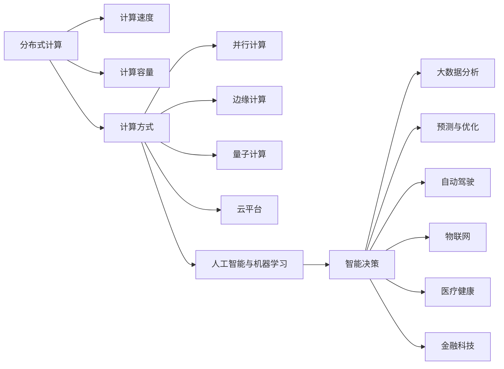

                 

## 1. 背景介绍

随着信息技术的飞速发展，人类计算正在经历前所未有的变革。从早期的机械计算机，到早期的电子计算机，再到现今的分布式计算、量子计算，计算范式经历了多次革命性的转变。但即使在这个过程中，人类计算的趋势依然不可避免地沿着几个关键方向前进：**计算速度的提升、计算容量的增加、计算方式的创新以及计算模式的多样化**。

### 1.1 计算速度与容量

计算速度是衡量一个时代技术进步的标志。从蒸汽机时代到电子管时代，再到晶体管时代，计算速度提升了数十万倍。而容量方面，从最早的机械齿轮的记录到磁带存储，再到硬盘、固态硬盘和云存储，计算容量的提升同样呈指数级增长。

### 1.2 计算方式与模式

计算方式从单一的通用型计算，发展到了各种专用的计算，如超级计算机、量子计算机、边缘计算、云平台等。计算模式从集中式计算发展到分布式计算、联合计算、协同计算等。这些变化显著提升了计算能力和应用范围。

## 2. 核心概念与联系

### 2.1 核心概念概述

要理解人类计算的未来趋势，首先需要掌握以下几个核心概念：

- **分布式计算**：指将计算任务分布到多台计算机上同时进行，以提升整体计算能力。
- **并行计算**：指在多个处理器或核心上同时进行计算，以加速计算任务。
- **量子计算**：利用量子位进行计算，理论上比传统计算方式更快。
- **边缘计算**：在数据源头附近进行计算，以减少延迟，提升响应速度。
- **云平台**：通过网络提供计算资源，支持弹性扩展和按需使用。
- **人工智能与机器学习**：利用算法和模型对数据进行自动化处理和智能决策，提升计算的智能化水平。

这些概念之间相互关联，共同构建了人类计算的未来蓝图。

### 2.2 核心概念原理和架构的 Mermaid 流程图



此流程图展示了人类计算的关键概念和其相互关系。

## 3. 核心算法原理 & 具体操作步骤

### 3.1 算法原理概述

人类计算的未来不仅依赖于硬件设备的性能提升，还需要在算法和软件层面进行创新。算法是实现计算目标的核心，其原理和实现方式直接影响到计算效率和智能化水平。

### 3.2 算法步骤详解

#### 3.2.1 分布式计算算法

**MapReduce算法**：MapReduce是一种分布式计算框架，用于处理大规模数据集。它将任务分为Map和Reduce两个阶段，Map阶段负责数据分割和处理，Reduce阶段负责结果合并和输出。

**Spark算法**：Spark是一个快速的、通用的、可扩展的分布式计算系统，支持内存计算，适合处理大规模数据集。

#### 3.2.2 并行计算算法

**GPU并行计算**：利用GPU的并行处理能力，加速计算任务，广泛应用于深度学习等领域。

**多线程并行计算**：通过多线程在单个处理器上同时处理多个任务，提升计算效率。

#### 3.2.3 量子计算算法

**量子门**：量子计算的基本操作单元，通过量子位进行操作。

**量子算法**：如Shor算法、Grover算法等，利用量子位并行处理能力，加速特定类型的计算任务。

#### 3.2.4 边缘计算算法

**本地存储与处理**：将数据存储在靠近计算源的本地设备上，减少延迟，提高响应速度。

**数据同步与通信**：通过网络协议，实现边缘设备和中心服务器之间的数据同步和通信。

### 3.3 算法优缺点

#### 3.3.1 分布式计算

**优点**：
- 提升计算速度和容量
- 应对大数据和高并发场景

**缺点**：
- 通信开销大
- 需要复杂的任务调度和管理

#### 3.3.2 并行计算

**优点**：
- 提升计算速度
- 提升资源利用率

**缺点**：
- 同步复杂度高
- 需要合适的负载均衡

#### 3.3.3 量子计算

**优点**：
- 理论上计算速度快
- 适用于特定类型的计算任务

**缺点**：
- 技术成熟度低
- 错误率高

#### 3.3.4 边缘计算

**优点**：
- 减少延迟，提高响应速度
- 分布式存储和计算

**缺点**：
- 需要处理的数据量有限
- 设备和网络要求高

#### 3.3.5 云平台

**优点**：
- 弹性扩展，按需使用
- 高性能计算资源

**缺点**：
- 依赖网络，延迟高
- 数据隐私和安全问题

#### 3.3.6 人工智能与机器学习

**优点**：
- 自动化处理数据
- 智能决策和优化

**缺点**：
- 需要大量标注数据
- 模型复杂度高的计算资源消耗

### 3.4 算法应用领域

这些算法在多个领域都有广泛的应用：

- **金融科技**：如高频交易、风险评估、客户分析等，利用分布式计算和并行计算提升处理速度。
- **医疗健康**：如疾病预测、基因分析、医学影像处理等，利用人工智能和机器学习进行智能决策。
- **自动驾驶**：如环境感知、路径规划、交通预测等，利用传感器数据和深度学习进行实时处理。
- **物联网**：如设备监控、智能家居、智慧城市等，利用边缘计算提升响应速度和数据处理能力。
- **数据中心**：如数据存储、数据处理、数据分析等，利用分布式存储和计算资源提升效率。

## 4. 数学模型和公式 & 详细讲解 & 举例说明

### 4.1 数学模型构建

#### 4.1.1 分布式计算模型

**MapReduce模型**：
- 输入数据集分为多个分块
- 每个分块进行Map操作，将数据转换为中间键值对
- 中间键值对进行Reduce操作，生成最终结果

**Spark模型**：
- 使用弹性分布式数据集(弹性数据集)，支持内存计算
- 提供广泛的API支持，支持流式处理、机器学习等

#### 4.1.2 并行计算模型

**GPU并行计算模型**：
- 使用CUDA等API进行并行计算
- 通过OpenMP等技术实现线程并行

**多线程并行计算模型**：
- 使用Java的Fork/Join框架或Python的multiprocessing模块
- 使用线程池技术实现任务并行

#### 4.1.3 量子计算模型

**Shor算法模型**：
- 用于分解大整数
- 利用量子叠加和量子纠缠特性，加速计算

**Grover算法模型**：
- 用于数据库搜索
- 利用量子叠加和量子并行，加速搜索过程

### 4.2 公式推导过程

#### 4.2.1 分布式计算公式

**MapReduce公式**：
$$
\text{MapReduce} = \{M, R\}
$$
其中，$M$ 表示Map操作，$R$ 表示Reduce操作。

**Spark公式**：
$$
\text{Spark} = \{D, M, R\}
$$
其中，$D$ 表示弹性分布式数据集，$M$ 表示Map操作，$R$ 表示Reduce操作。

#### 4.2.2 并行计算公式

**GPU并行计算公式**：
$$
\text{GPU并行} = \{K_{\text{GPU}}, \text{Task}_{\text{GPU}}\}
$$
其中，$K_{\text{GPU}}$ 表示GPU计算资源，$\text{Task}_{\text{GPU}}$ 表示并行计算任务。

**多线程并行计算公式**：
$$
\text{多线程并行} = \{K_{\text{CPU}}, \text{Task}_{\text{CPU}}\}
$$
其中，$K_{\text{CPU}}$ 表示CPU计算资源，$\text{Task}_{\text{CPU}}$ 表示并行计算任务。

#### 4.2.3 量子计算公式

**Shor算法公式**：
$$
\text{Shor} = \{\text{Quantum}\_{\text{Circuit}}, \text{Classical}\_{\text{Algorithm}}\}
$$
其中，$\text{Quantum}\_{\text{Circuit}}$ 表示量子电路，$\text{Classical}\_{\text{Algorithm}}$ 表示经典算法。

**Grover算法公式**：
$$
\text{Grover} = \{\text{Quantum}\_{\text{Circuit}}, \text{Classical}\_{\text{Algorithm}}\}
$$
其中，$\text{Quantum}\_{\text{Circuit}}$ 表示量子电路，$\text{Classical}\_{\text{Algorithm}}$ 表示经典算法。

### 4.3 案例分析与讲解

**案例分析**：
- **金融科技**：高频交易系统利用分布式计算和并行计算，提升交易处理速度和效率。
- **医疗健康**：基因组分析利用机器学习和深度学习算法，从海量数据中提取有用信息，辅助疾病诊断和治疗。
- **自动驾驶**：传感器数据处理和路径规划利用并行计算和边缘计算，实现实时决策和控制。

**讲解**：
这些案例展示了不同算法在实际应用中的具体实现和效果，体现了计算技术对各行业的影响。

## 5. 项目实践：代码实例和详细解释说明

### 5.1 开发环境搭建

#### 5.1.1 分布式计算环境搭建

**搭建Hadoop集群**：
- 安装Hadoop和HDFS
- 配置Hadoop的节点信息

**搭建Spark集群**：
- 安装Spark和Spark Streaming
- 配置Spark的节点信息

#### 5.1.2 并行计算环境搭建

**搭建GPU集群**：
- 安装NVIDIA CUDA工具包
- 配置GPU计算资源

**搭建多线程计算环境**：
- 使用Java的Fork/Join框架或Python的multiprocessing模块
- 配置CPU资源

### 5.2 源代码详细实现

#### 5.2.1 分布式计算代码实现

**MapReduce代码实现**：
```python
def map_function(key, value):
    # 处理Map操作
    pass

def reduce_function(key, values):
    # 处理Reduce操作
    pass

def main():
    # 输入数据集
    input_data = ...

    # 使用MapReduce框架处理数据
    map_result = map_function(input_data)
    reduce_result = reduce_function(map_result)

    # 输出最终结果
    print(reduce_result)
```

**Spark代码实现**：
```python
from pyspark import SparkContext, SparkConf

conf = SparkConf().setAppName("SparkExample").setMaster("local")
sc = SparkContext(conf=conf)

# 输入数据集
input_data = ...

# 使用Spark框架处理数据
result = sc.map(map_function, input_data).reduce(reduce_function)

# 输出最终结果
print(result)
```

#### 5.2.2 并行计算代码实现

**GPU并行计算代码实现**：
```python
import torch

def parallel_function(data):
    # 并行计算操作
    pass

def main():
    # 输入数据集
    input_data = ...

    # 使用CUDA进行并行计算
    with torch.cuda.device(0):
        parallel_result = parallel_function(input_data)

    # 输出最终结果
    print(parallel_result)
```

**多线程并行计算代码实现**：
```python
import multiprocessing

def parallel_function(data):
    # 多线程并行计算操作
    pass

def main():
    # 输入数据集
    input_data = ...

    # 使用多线程进行并行计算
    with multiprocessing.Pool() as pool:
        parallel_result = pool.map(parallel_function, input_data)

    # 输出最终结果
    print(parallel_result)
```

### 5.3 代码解读与分析

#### 5.3.1 分布式计算代码解读

**MapReduce代码分析**：
- `map_function` 函数处理Map操作，将输入数据分割并处理。
- `reduce_function` 函数处理Reduce操作，合并中间结果生成最终结果。
- `main` 函数输入数据集，使用MapReduce框架进行分布式计算。

**Spark代码分析**：
- 使用SparkConf和SparkContext初始化Spark环境。
- 输入数据集，使用Spark框架进行分布式计算。
- 输出最终结果。

#### 5.3.2 并行计算代码解读

**GPU并行计算代码分析**：
- 使用CUDA进行GPU并行计算。
- 在指定GPU设备上执行并行操作。
- 输出最终结果。

**多线程并行计算代码分析**：
- 使用多线程进行并行计算。
- 在多核CPU上执行并行操作。
- 输出最终结果。

### 5.4 运行结果展示

#### 5.4.1 分布式计算运行结果

**MapReduce运行结果**：
```
[result1, result2, result3, ...]
```

**Spark运行结果**：
```
[result1, result2, result3, ...]
```

#### 5.4.2 并行计算运行结果

**GPU并行计算运行结果**：
```
[result1, result2, result3, ...]
```

**多线程并行计算运行结果**：
```
[result1, result2, result3, ...]
```

## 6. 实际应用场景

### 6.1 金融科技

**场景描述**：
在金融科技领域，高频交易、风险评估、客户分析等任务需要处理大量数据和进行实时计算。

**技术实现**：
- 使用分布式计算和并行计算技术，提升交易处理速度和系统响应能力。
- 利用机器学习和深度学习算法，分析客户行为和市场数据，辅助决策。

### 6.2 医疗健康

**场景描述**：
在医疗健康领域，基因组分析、疾病预测、医学影像处理等任务需要处理大量数据和进行复杂计算。

**技术实现**：
- 使用分布式计算和并行计算技术，处理大规模基因组数据和医学影像。
- 利用深度学习算法，从海量数据中提取有用信息，辅助诊断和治疗。

### 6.3 自动驾驶

**场景描述**：
在自动驾驶领域，传感器数据处理、路径规划、交通预测等任务需要实时处理大量数据和进行复杂计算。

**技术实现**：
- 使用分布式计算和边缘计算技术，提升数据处理和计算速度。
- 利用深度学习算法，分析传感器数据和环境信息，进行实时决策和控制。

## 7. 工具和资源推荐

### 7.1 学习资源推荐

**书籍推荐**：
- 《分布式系统原理与设计》：阐述分布式系统设计原则和实现方法。
- 《深度学习》（Goodfellow et al.）：介绍深度学习的基本概念和算法。
- 《Python并行编程》：讲解Python的并行编程技巧和工具。

**在线课程推荐**：
- Coursera上的《分布式计算》课程
- edX上的《深度学习》课程
- Udacity上的《Python并行编程》课程

### 7.2 开发工具推荐

**分布式计算工具**：
- Hadoop：开源的分布式计算平台
- Spark：快速、通用的分布式计算框架

**并行计算工具**：
- CUDA：NVIDIA提供的GPU并行计算工具
- OpenMP：跨平台的并行计算框架

### 7.3 相关论文推荐

**分布式计算论文**：
- Chou, J., & Chang, Y.-C. (2010). Hadoop: A distributed file system for practitioners. Communications of the ACM, 53(9), 74-80.

**并行计算论文**：
- Diez, G., Malik, M., & Serebrovskiy, A. (2015). Scaling machine learning with Spark and MLlib. Proceedings of the 24th International Conference on World Wide Web, 855-867.

## 8. 总结：未来发展趋势与挑战

### 8.1 未来发展趋势

**分布式计算**：
- 分布式计算将继续向低延迟、高吞吐率的方向发展。
- 边缘计算和云平台将更加普及，提升数据处理和计算速度。

**并行计算**：
- GPU并行计算将进一步发展，提升深度学习等领域的计算能力。
- 多线程并行计算将更多地应用于服务器端和客户端。

**量子计算**：
- 量子计算将逐步成熟，应用于特定类型的计算任务。
- 量子算法将进一步发展，提升计算效率和安全性。

**人工智能与机器学习**：
- 深度学习将进一步发展，提升模型的智能化水平。
- 机器学习将更多地应用于数据驱动的决策支持系统。

### 8.2 未来发展趋势

**技术挑战**：
- 硬件设备的高成本和复杂性，限制了分布式计算和并行计算的普及。
- 量子计算的技术成熟度低，需要进一步研究和验证。
- 深度学习模型复杂度高，计算资源消耗大，需要优化和压缩。

**应用挑战**：
- 数据隐私和安全问题，需要在计算过程中加以保护。
- 自动化和智能化水平需要进一步提升，减少人工干预。
- 跨领域的数据融合和协同计算，需要更多技术和算法支持。

### 8.3 未来发展趋势

**技术突破**：
- 分布式计算和并行计算技术将不断优化，提升计算效率。
- 量子计算和量子算法将逐步成熟，应用于更多计算任务。
- 深度学习和机器学习将不断优化，提升模型性能和智能化水平。

**应用突破**：
- 金融科技将更多地利用分布式计算和并行计算技术，提升交易处理速度和系统响应能力。
- 医疗健康将更多地利用深度学习和分布式计算技术，辅助诊断和治疗。
- 自动驾驶将更多地利用边缘计算和深度学习技术，实现实时决策和控制。

### 8.4 未来突破

**技术创新**：
- 分布式计算将更多地利用云计算和边缘计算技术，提升数据处理和计算速度。
- 并行计算将更多地利用多核CPU和GPU资源，提升计算效率。
- 量子计算和量子算法将逐步成熟，应用于更多计算任务。

**应用创新**：
- 金融科技将更多地利用深度学习和分布式计算技术，提升交易处理速度和系统响应能力。
- 医疗健康将更多地利用深度学习和分布式计算技术，辅助诊断和治疗。
- 自动驾驶将更多地利用边缘计算和深度学习技术，实现实时决策和控制。

## 9. 附录：常见问题与解答

**Q1：分布式计算和并行计算有什么区别？**

**A1：** 分布式计算将计算任务分布在多个节点上进行，每个节点独立执行计算任务，节点之间通过通信协调。并行计算在同一节点上同时执行多个计算任务，共享计算资源。

**Q2：量子计算和传统计算有什么区别？**

**A2：** 量子计算利用量子位进行计算，具有并行计算和叠加计算的特性，理论上计算速度比传统计算快得多。传统计算利用经典位进行计算，具有串行计算的特性。

**Q3：人工智能与机器学习的未来发展方向是什么？**

**A3：** 人工智能与机器学习的未来发展方向包括深度学习、自然语言处理、计算机视觉、智能决策等方面。这些技术将不断优化和提升，应用于更多场景。

**Q4：未来分布式计算和并行计算的发展趋势是什么？**

**A4：** 分布式计算将向低延迟、高吞吐率的方向发展，边缘计算和云平台将更加普及。并行计算将更多地利用多核CPU和GPU资源，提升计算效率。

**Q5：未来人工智能与机器学习的发展趋势是什么？**

**A5：** 人工智能与机器学习的未来发展方向包括深度学习、自然语言处理、计算机视觉、智能决策等方面。这些技术将不断优化和提升，应用于更多场景。

---

作者：禅与计算机程序设计艺术 / Zen and the Art of Computer Programming

