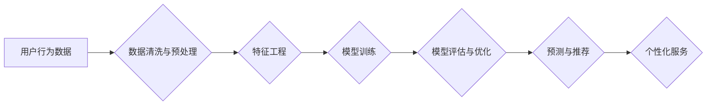

> 用户行为数据分析，电商平台，数据挖掘，机器学习，推荐系统，个性化服务

## 1. 背景介绍

在当今数据爆炸的时代，电商平台积累了海量用户行为数据，这些数据蕴含着丰富的商业价值。通过对用户行为数据的分析，电商平台可以深入了解用户的需求和偏好，从而实现精准营销、个性化推荐、优化用户体验等目标。

用户行为数据分析功能是电商平台的核心竞争力之一，它可以帮助电商平台：

* **精准营销:** 通过分析用户购买历史、浏览记录、搜索关键词等数据，精准定位目标用户群体，进行个性化营销推广。
* **个性化推荐:** 根据用户的兴趣爱好、购买习惯等数据，推荐个性化的商品和服务，提升用户购物体验和转化率。
* **优化用户体验:** 分析用户在平台上的行为路径、停留时间、点击率等数据，发现用户体验痛点，及时优化平台设计和功能，提升用户满意度。
* **预测用户行为:** 通过机器学习算法，预测用户的购买意愿、浏览趋势等，帮助电商平台制定更有效的运营策略。

## 2. 核心概念与联系

用户行为数据分析的核心概念包括：

* **用户行为数据:** 指用户在电商平台上进行的所有操作记录，例如浏览商品、添加购物车、下单购买、评价商品等。
* **数据挖掘:** 指从海量数据中发现隐藏的模式、规律和知识的过程。
* **机器学习:** 指通过算法训练，使计算机能够从数据中学习，并对新数据进行预测或分类的过程。
* **推荐系统:** 指根据用户的兴趣爱好和行为数据，推荐相关商品或服务的系统。

这些概念相互关联，共同构成了电商平台用户行为数据分析的完整体系。

**Mermaid 流程图**



## 3. 核心算法原理 & 具体操作步骤

### 3.1  算法原理概述

用户行为数据分析常用的算法包括：

* **协同过滤:** 基于用户的相似性或商品的相似性，推荐用户可能感兴趣的商品。
* **内容过滤:** 基于商品的特征和用户过去的偏好，推荐用户可能感兴趣的商品。
* **基于规则的推荐:** 基于事先定义的规则，推荐商品。
* **深度学习:** 利用深度神经网络，从用户行为数据中学习更复杂的模式，进行更精准的推荐。

### 3.2  算法步骤详解

以协同过滤算法为例，其具体操作步骤如下：

1. **数据收集:** 收集用户行为数据，例如用户对商品的评分、购买记录等。
2. **数据预处理:** 对数据进行清洗、去噪、缺失值处理等操作，确保数据质量。
3. **用户相似度计算:** 计算用户之间的相似度，例如使用余弦相似度或皮尔逊相关系数。
4. **商品相似度计算:** 计算商品之间的相似度，例如使用余弦相似度或Jaccard系数。
5. **推荐算法:** 根据用户相似度或商品相似度，推荐用户可能感兴趣的商品。

### 3.3  算法优缺点

**协同过滤算法:**

* **优点:** 可以发现用户之间的隐性关系，推荐个性化商品。
* **缺点:** 数据稀疏性问题，冷启动问题。

**内容过滤算法:**

* **优点:** 不需要用户行为数据，可以推荐基于商品特征的商品。
* **缺点:** 容易陷入“同质化推荐”问题，缺乏个性化。

### 3.4  算法应用领域

用户行为数据分析算法广泛应用于电商平台、社交媒体、金融机构等领域，例如：

* **电商平台:** 商品推荐、用户画像、精准营销。
* **社交媒体:** 内容推荐、用户兴趣分析、广告投放。
* **金融机构:** 风险评估、欺诈检测、个性化金融服务。

## 4. 数学模型和公式 & 详细讲解 & 举例说明

### 4.1  数学模型构建

协同过滤算法的数学模型可以表示为：

$$
r_{ui} = \sum_{j=1}^{N} w_{ij} \cdot r_{uj}
$$

其中：

* $r_{ui}$ 表示用户 $u$ 对商品 $i$ 的评分。
* $r_{uj}$ 表示用户 $u$ 对商品 $j$ 的评分。
* $w_{ij}$ 表示商品 $i$ 和商品 $j$ 之间的相似度。
* $N$ 表示所有商品的数量。

### 4.2  公式推导过程

协同过滤算法的目的是预测用户对商品的评分。

根据用户的评分历史数据，我们可以计算出用户与其他用户的相似度，以及商品与其他商品的相似度。

然后，我们可以利用这些相似度信息，预测用户对某个商品的评分。

例如，如果用户 $u$ 对商品 $i$ 的评分未知，我们可以根据用户 $u$ 与其他用户的相似度，以及商品 $i$ 与其他商品的相似度，预测用户 $u$ 对商品 $i$ 的评分。

### 4.3  案例分析与讲解

假设用户 $A$ 和用户 $B$ 都对商品 $X$ 和商品 $Y$ 进行了评分，并且用户 $A$ 和用户 $B$ 的评分相似度为 $0.8$。

如果用户 $A$ 对商品 $X$ 的评分为 $5$，而用户 $B$ 对商品 $X$ 的评分为 $4$，那么我们可以预测用户 $A$ 对商品 $X$ 的评分为 $4.8$。

## 5. 项目实践：代码实例和详细解释说明

### 5.1  开发环境搭建

* 操作系统：Linux
* Python 版本：3.7+
* 依赖库：pandas, numpy, scikit-learn, matplotlib

### 5.2  源代码详细实现

```python
import pandas as pd
from sklearn.metrics.pairwise import cosine_similarity

# 加载用户行为数据
data = pd.read_csv('user_behavior_data.csv')

# 计算用户之间的相似度
user_similarity = cosine_similarity(data.pivot_table(index='user_id', columns='product_id', values='rating').fillna(0))

# 预测用户对商品的评分
def predict_rating(user_id, product_id):
    # 获取用户与其他用户的相似度
    user_similarity_vector = user_similarity[user_id]
    # 获取用户评分过的商品
    rated_products = data[data['user_id'] == user_id]['product_id'].tolist()
    # 计算预测评分
    predicted_rating = sum([user_similarity_vector[i] * data[data['user_id'] == i]['rating'][data['product_id'] == product_id].values[0] for i in range(len(user_similarity)) if i != user_id and data['product_id'] == product_id]) / sum([user_similarity_vector[i] for i in range(len(user_similarity)) if i != user_id])
    return predicted_rating

# 预测用户对商品的评分
predicted_rating = predict_rating(user_id=1, product_id=5)
print(f'用户 1 对商品 5 的预测评分为: {predicted_rating}')
```

### 5.3  代码解读与分析

* 代码首先加载用户行为数据，并使用 `cosine_similarity` 函数计算用户之间的相似度。
* `predict_rating` 函数用于预测用户对商品的评分。
* 该函数首先获取用户与其他用户的相似度，然后获取用户评分过的商品，最后计算预测评分。

### 5.4  运行结果展示

运行代码后，会输出用户 1 对商品 5 的预测评分。

## 6. 实际应用场景

### 6.1  电商平台商品推荐

电商平台可以利用用户行为数据分析功能，为用户推荐个性化的商品。例如，根据用户的浏览记录、购买历史、购物车内容等数据，推荐用户可能感兴趣的商品。

### 6.2  精准营销

电商平台可以利用用户行为数据分析功能，进行精准营销推广。例如，根据用户的兴趣爱好、购买习惯等数据，精准定位目标用户群体，进行个性化广告投放。

### 6.3  用户画像分析

电商平台可以利用用户行为数据分析功能，构建用户画像，了解用户的兴趣爱好、消费习惯等信息。

### 6.4  未来应用展望

随着数据量的不断增长和算法的不断发展，用户行为数据分析功能将在未来发挥更重要的作用。例如，可以利用深度学习算法，进行更精准的推荐和预测；可以利用自然语言处理技术，分析用户的评论和反馈，更好地了解用户的需求。

## 7. 工具和资源推荐

### 7.1  学习资源推荐

* **书籍:**
    * 《数据挖掘: 概念与技术》
    * 《机器学习》
    * 《推荐系统》
* **在线课程:**
    * Coursera: 数据挖掘与机器学习
    * edX: 机器学习
    * Udemy: 推荐系统

### 7.2  开发工具推荐

* **Python:** 数据分析和机器学习的常用语言。
* **pandas:** 数据处理和分析库。
* **scikit-learn:** 机器学习库。
* **TensorFlow:** 深度学习框架。

### 7.3  相关论文推荐

* **Collaborative Filtering for Implicit Feedback Datasets**
* **Matrix Factorization Techniques for Recommender Systems**
* **Deep Learning for Recommender Systems**

## 8. 总结：未来发展趋势与挑战

### 8.1  研究成果总结

用户行为数据分析功能已经取得了显著的成果，例如，提高了电商平台的商品推荐准确率、精准营销效果、用户体验等。

### 8.2  未来发展趋势

未来，用户行为数据分析功能将朝着以下方向发展：

* **更精准的推荐:** 利用深度学习算法，进行更精准的推荐。
* **更个性化的服务:** 利用用户画像分析，提供更个性化的服务。
* **更智能的交互:** 利用自然语言处理技术，实现更智能的交互。

### 8.3  面临的挑战

用户行为数据分析功能也面临着一些挑战，例如：

* **数据隐私保护:** 如何保护用户的隐私数据，是需要认真考虑的问题。
* **算法可解释性:** 深度学习算法的决策过程难以解释，如何提高算法的可解释性，也是一个重要的研究方向。
* **数据质量:** 数据质量直接影响到分析结果的准确性，如何保证数据质量，也是一个需要重视的问题。

### 8.4  研究展望

未来，用户行为数据分析功能将继续是一个重要的研究方向，需要不断探索新的算法、新的技术，以更好地服务于用户。

## 9. 附录：常见问题与解答

### 9.1  常见问题

* **协同过滤算法的冷启动问题如何解决？**

* **如何评估用户行为数据分析模型的性能？**

* **如何处理用户行为数据中的缺失值？**

### 9.2  解答

* **协同过滤算法的冷启动问题:** 可以使用内容过滤算法或基于规则的推荐算法来解决冷启动问题。

* **评估用户行为数据分析模型的性能:** 可以使用准确率、召回率、F1-score等指标来评估模型的性能。

* **处理用户行为数据中的缺失值:** 可以使用均值、中位数或其他填充方法来处理缺失值。


作者：禅与计算机程序设计艺术 / Zen and the Art of Computer Programming 
<end_of_turn>