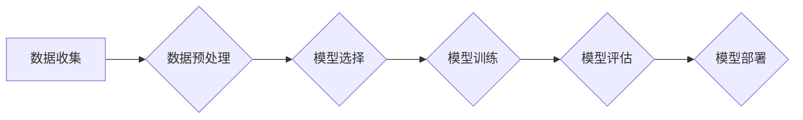

> 监督学习、机器学习、分类、回归、算法原理、代码实例、Python

## 1. 背景介绍

在机器学习领域，监督学习作为一种基础且重要的学习方式，在众多应用场景中发挥着关键作用。它通过利用标记数据，学习数据的内在规律，从而实现对新数据的预测或分类。

监督学习的应用范围广泛，例如：

* **图像识别:**  识别图像中的物体、场景或人物。
* **自然语言处理:**  文本分类、情感分析、机器翻译等。
* **预测分析:**  预测股票价格、客户流失率、销售额等。
* **医疗诊断:**  辅助医生诊断疾病、预测患者病情。

## 2. 核心概念与联系

**2.1 监督学习的核心概念**

监督学习的核心概念是**标记数据**。标记数据是指每个数据样本都带有对应的标签或输出值。这些标签是已知的，是模型学习的依据。

**2.2 监督学习的类型**

根据任务类型，监督学习可以分为两大类：

* **分类:**  预测离散型输出值，例如图像分类（猫、狗、鸟）、文本分类（正负面评论）。
* **回归:**  预测连续型输出值，例如房价预测、股票价格预测。

**2.3 监督学习的流程**

监督学习的流程通常包括以下步骤：

1. **数据收集和预处理:**  收集相关数据，并进行清洗、转换、特征工程等预处理操作。
2. **模型选择:**  根据任务类型和数据特点选择合适的模型。
3. **模型训练:**  利用标记数据训练模型，学习数据的内在规律。
4. **模型评估:**  使用测试数据评估模型的性能，例如准确率、召回率、F1-score等。
5. **模型部署:**  将训练好的模型部署到实际应用场景中。

**2.4 监督学习的流程图**



## 3. 核心算法原理 & 具体操作步骤

### 3.1  算法原理概述

本节将介绍两种常见的监督学习算法：**线性回归**和**逻辑回归**。

**3.1.1 线性回归**

线性回归是一种用于预测连续型输出值的算法。它假设数据之间存在线性关系，并通过最小化预测值与真实值的误差来学习模型参数。

**3.1.2 逻辑回归**

逻辑回归是一种用于预测离散型输出值的算法。它将线性回归的结果映射到0到1之间的概率值，从而实现二分类任务。

### 3.2  算法步骤详解

**3.2.1 线性回归步骤**

1. **数据预处理:**  对数据进行清洗、转换、特征工程等操作。
2. **模型构建:**  定义线性回归模型，即y = wx + b，其中y是预测值，x是输入特征，w是权重参数，b是偏置参数。
3. **参数估计:**  使用最小二乘法或梯度下降法等算法估计模型参数w和b。
4. **模型评估:**  使用测试数据评估模型的性能，例如均方误差（MSE）或R-squared。

**3.2.2 逻辑回归步骤**

1. **数据预处理:**  对数据进行清洗、转换、特征工程等操作。
2. **模型构建:**  定义逻辑回归模型，即P(y=1|x) = 1/(1 + exp(-(wx + b)))，其中P(y=1|x)是预测y=1的概率，x是输入特征，w是权重参数，b是偏置参数。
3. **参数估计:**  使用最大似然估计法或梯度下降法等算法估计模型参数w和b。
4. **模型评估:**  使用测试数据评估模型的性能，例如准确率、召回率、F1-score等。

### 3.3  算法优缺点

**3.3.1 线性回归**

* **优点:**  易于理解和实现，计算效率高。
* **缺点:**  假设数据之间存在线性关系，对非线性关系的拟合能力较差。

**3.3.2 逻辑回归**

* **优点:**  适用于二分类任务，输出结果易于解释。
* **缺点:**  对多分类任务的处理能力有限，对非线性关系的拟合能力较差。

### 3.4  算法应用领域

**3.4.1 线性回归**

* 房价预测
* 股票价格预测
* 销售额预测

**3.4.2 逻辑回归**

* 欺诈检测
* 邮件分类
* 客户流失预测

## 4. 数学模型和公式 & 详细讲解 & 举例说明

### 4.1  数学模型构建

**4.1.1 线性回归模型**

线性回归模型的数学表达式为：

$$y = wx + b$$

其中：

* y 是预测值
* x 是输入特征
* w 是权重参数
* b 是偏置参数

**4.1.2 逻辑回归模型**

逻辑回归模型的数学表达式为：

$$P(y=1|x) = \frac{1}{1 + exp(-(wx + b))}$$

其中：

* P(y=1|x) 是预测y=1的概率
* x 是输入特征
* w 是权重参数
* b 是偏置参数

### 4.2  公式推导过程

**4.2.1 线性回归参数估计**

线性回归模型的参数估计可以使用最小二乘法。最小二乘法的目标是找到使得预测值与真实值误差平方和最小的参数值。

**4.2.2 逻辑回归参数估计**

逻辑回归模型的参数估计可以使用最大似然估计法。最大似然估计法的目标是找到使得模型输出与真实标签概率最大化的参数值。

### 4.3  案例分析与讲解

**4.3.1 线性回归案例**

假设我们想要预测房屋价格，已知房屋面积和房屋所在城市的特征。我们可以使用线性回归模型来建立房屋价格与面积之间的关系。

**4.3.2 逻辑回归案例**

假设我们想要判断邮件是否为垃圾邮件，已知邮件内容和发送者的特征。我们可以使用逻辑回归模型来建立邮件是否为垃圾邮件与特征之间的关系。

## 5. 项目实践：代码实例和详细解释说明

### 5.1  开发环境搭建

本项目使用Python语言进行开发，需要安装以下库：

* NumPy
* Pandas
* Scikit-learn

可以使用pip命令安装这些库：

```bash
pip install numpy pandas scikit-learn
```

### 5.2  源代码详细实现

**5.2.1 线性回归代码示例**

```python
import numpy as np
from sklearn.linear_model import LinearRegression
from sklearn.model_selection import train_test_split

# 生成示例数据
X = np.array([[1], [2], [3], [4], [5]])
y = np.array([2, 4, 5, 4, 5])

# 将数据划分为训练集和测试集
X_train, X_test, y_train, y_test = train_test_split(X, y, test_size=0.2, random_state=42)

# 创建线性回归模型
model = LinearRegression()

# 训练模型
model.fit(X_train, y_train)

# 预测测试集数据
y_pred = model.predict(X_test)

# 打印预测结果
print(y_pred)
```

**5.2.2 逻辑回归代码示例**

```python
import numpy as np
from sklearn.linear_model import LogisticRegression
from sklearn.model_selection import train_test_split

# 生成示例数据
X = np.array([[1, 2], [3, 4], [5, 6], [7, 8], [9, 10]])
y = np.array([0, 1, 0, 1, 0])

# 将数据划分为训练集和测试集
X_train, X_test, y_train, y_test = train_test_split(X, y, test_size=0.2, random_state=42)

# 创建逻辑回归模型
model = LogisticRegression()

# 训练模型
model.fit(X_train, y_train)

# 预测测试集数据
y_pred = model.predict(X_test)

# 打印预测结果
print(y_pred)
```

### 5.3  代码解读与分析

以上代码示例分别演示了线性回归和逻辑回归的实现过程。

* **数据准备:**  首先需要准备训练数据和测试数据。
* **模型选择:**  根据任务类型选择合适的模型，例如线性回归或逻辑回归。
* **模型训练:**  使用训练数据训练模型，学习模型参数。
* **模型预测:**  使用训练好的模型预测测试数据。
* **结果评估:**  使用测试数据评估模型的性能，例如准确率、召回率、F1-score等。

### 5.4  运行结果展示

运行以上代码示例，会输出模型预测的结果。

## 6. 实际应用场景

### 6.1  图像识别

* **人脸识别:**  用于解锁手机、验证身份、监控安全等。
* **物体检测:**  用于自动驾驶、安防监控、医疗影像分析等。

### 6.2  自然语言处理

* **文本分类:**  用于垃圾邮件过滤、情感分析、新闻主题分类等。
* **机器翻译:**  用于将文本从一种语言翻译成另一种语言。
* **聊天机器人:**  用于与用户进行自然语言对话。

### 6.3  预测分析

* **股票价格预测:**  用于帮助投资者做出投资决策。
* **客户流失预测:**  用于帮助企业识别潜在流失客户，并采取措施挽留。
* **销售额预测:**  用于帮助企业制定销售策略。

### 6.4  未来应用展望

随着人工智能技术的不断发展，监督学习将在更多领域得到应用，例如：

* **个性化推荐:**  根据用户的行为和偏好，推荐个性化的商品、服务或内容。
* **医疗诊断辅助:**  辅助医生诊断疾病，提高诊断准确率。
* **自动驾驶:**  用于训练自动驾驶汽车，使其能够识别道路环境并做出安全决策。

## 7. 工具和资源推荐

### 7.1  学习资源推荐

* **书籍:**
    * 《机器学习》 - 周志华
    * 《深入理解机器学习》 -  李航
* **在线课程:**
    * Coursera:  Machine Learning by Andrew Ng
    * edX:  Artificial Intelligence by Columbia University

### 7.2  开发工具推荐

* **Python:**  Python是一种流行的编程语言，广泛用于机器学习开发。
* **Scikit-learn:**  Scikit-learn是一个用于机器学习的Python库，提供了丰富的算法和工具。
* **TensorFlow:**  TensorFlow是一个开源的机器学习框架，支持深度学习。

### 7.3  相关论文推荐

* **《Support Vector Machines》** - Vapnik, V. N. (1995)
* **《A Probabilistic Approach to Automatic Document Understanding》** - Manning, C. D., & Schütze, H. (1999)
* **《Deep Learning》** - Goodfellow, I., Bengio, Y., & Courville, A. (2016)

## 8. 总结：未来发展趋势与挑战

### 8.1  研究成果总结

监督学习在过去几十年取得了显著的进展，在众多应用领域取得