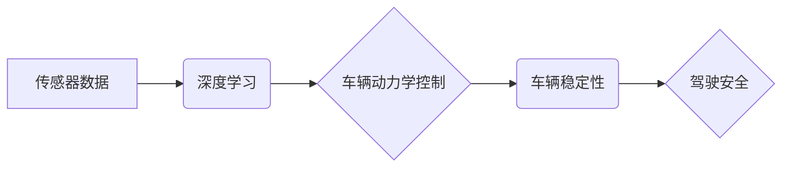

> 自动驾驶，车辆动力学，控制系统，稳定性，深度学习，强化学习

## 1. 背景介绍

自动驾驶技术作为未来交通运输的重要发展方向，近年来取得了显著进展。从早期基于规则的控制系统到如今的深度学习和强化学习驱动的端到端系统，自动驾驶技术不断朝着更智能、更安全的方向发展。车辆动力学控制是自动驾驶系统中至关重要的环节，它直接影响车辆的操控性和安全性。

传统的车辆动力学控制系统通常采用基于模型的控制策略，需要事先建立精确的车辆动力学模型，并根据模型进行控制参数的调整。然而，真实世界的车辆动力学特性复杂多变，受到路面状况、天气条件、载荷等因素的影响，传统的模型往往难以准确描述车辆的动态行为。

端到端自动驾驶系统则采用深度学习和强化学习等机器学习技术，直接从传感器数据中学习车辆的动力学特性和控制策略，无需事先建立精确的车辆动力学模型。这种方法能够更好地适应复杂多变的驾驶环境，并实现更灵活、更精准的车辆控制。

## 2. 核心概念与联系

端到端自动驾驶的车辆动力学控制与稳定性主要涉及以下核心概念：

* **车辆动力学模型:** 描述车辆运动状态和控制输入之间的关系的数学模型。
* **传感器数据:**  包括摄像头、雷达、激光雷达等传感器获取的车辆周围环境信息。
* **深度学习:** 利用多层神经网络学习车辆动力学特性和控制策略。
* **强化学习:** 通过奖励机制训练车辆控制策略，使其在不同驾驶场景下表现最佳。
* **车辆稳定性:** 指车辆在行驶过程中保持平衡和控制的能力。

**核心概念关系流程图:**



## 3. 核心算法原理 & 具体操作步骤

### 3.1  算法原理概述

端到端自动驾驶的车辆动力学控制主要采用深度学习和强化学习算法。

* **深度学习:** 利用多层神经网络从传感器数据中学习车辆动力学特性和控制策略。常见的深度学习架构包括卷积神经网络 (CNN) 和循环神经网络 (RNN)。CNN 用于提取图像特征，RNN 用于处理时间序列数据，例如车辆速度、转向角等。
* **强化学习:** 通过奖励机制训练车辆控制策略，使其在不同驾驶场景下表现最佳。强化学习算法的核心是“代理” (agent) 与环境的交互过程。代理根据当前状态选择动作，环境根据动作反馈奖励信号。代理的目标是最大化累积奖励。

### 3.2  算法步骤详解

1. **数据收集:** 收集大量车辆行驶数据，包括传感器数据、驾驶员操作和车辆状态信息。
2. **数据预处理:** 对收集到的数据进行清洗、格式化和特征提取。
3. **模型训练:** 利用深度学习和强化学习算法训练车辆动力学控制模型。
4. **模型评估:** 在测试数据集上评估模型的性能，例如控制精度、稳定性、安全性等。
5. **模型部署:** 将训练好的模型部署到自动驾驶系统中，用于车辆动力学控制。

### 3.3  算法优缺点

**优点:**

* 能够适应复杂多变的驾驶环境。
* 不需要事先建立精确的车辆动力学模型。
* 能够实现更灵活、更精准的车辆控制。

**缺点:**

* 训练数据量大，需要大量的计算资源。
* 模型训练过程复杂，需要专业的技术人员。
* 模型的安全性需要进一步验证。

### 3.4  算法应用领域

端到端自动驾驶的车辆动力学控制算法广泛应用于以下领域:

* 自动驾驶汽车
* 无人驾驶飞机
* 无人驾驶船舶
* 自动化工业机器人

## 4. 数学模型和公式 & 详细讲解 & 举例说明

### 4.1  数学模型构建

车辆动力学模型通常采用非线性微分方程来描述车辆的运动状态和控制输入之间的关系。常见的车辆动力学模型包括：

* **自行车模型:** 简化模型，将车辆视为一个点质量和两个轮子组成的系统。
* **卡尔曼滤波模型:** 利用卡尔曼滤波算法估计车辆状态，并进行状态预测。
* **神经网络模型:** 利用深度学习算法学习车辆动力学特性，构建更复杂的车辆动力学模型。

### 4.2  公式推导过程

车辆动力学模型的公式推导过程通常涉及以下步骤:

1. **建立车辆运动方程:** 根据牛顿第二定律和车辆几何结构，建立车辆运动方程。
2. **引入控制输入:** 将车辆控制输入，例如油门、刹车、转向角等，引入到运动方程中。
3. **线性化模型:** 对非线性运动方程进行线性化处理，以便于分析和控制。
4. **求解控制策略:** 根据线性化模型和控制目标，求解车辆控制策略。

### 4.3  案例分析与讲解

例如，自行车模型的运动方程可以表示为:

$$
\begin{aligned}
m \dot{v} &= F_x - F_r \\
I \dot{\psi} &= L F_y
\end{aligned}
$$

其中:

* $m$ 为车辆质量
* $v$ 为车辆速度
* $F_x$ 为车辆前进方向的力
* $F_r$ 为车辆阻力
* $I$ 为车辆转动惯量
* $\psi$ 为车辆转向角
* $L$ 为车辆轴距
* $F_y$ 为车辆侧向力

通过分析上述方程，可以了解车辆速度、转向角和控制输入之间的关系。

## 5. 项目实践：代码实例和详细解释说明

### 5.1  开发环境搭建

* 操作系统: Ubuntu 20.04
* 编程语言: Python 3.8
* 深度学习框架: TensorFlow 2.0
* 工具: Jupyter Notebook

### 5.2  源代码详细实现

```python
import tensorflow as tf

# 定义车辆动力学模型
class VehicleDynamicsModel(tf.keras.Model):
    def __init__(self):
        super(VehicleDynamicsModel, self).__init__()
        # 定义模型层
        self.dense1 = tf.keras.layers.Dense(64, activation='relu')
        self.dense2 = tf.keras.layers.Dense(32, activation='relu')
        self.output = tf.keras.layers.Dense(4)

    def call(self, inputs):
        x = self.dense1(inputs)
        x = self.dense2(x)
        outputs = self.output(x)
        return outputs

# 实例化模型
model = VehicleDynamicsModel()

# 编译模型
model.compile(optimizer='adam', loss='mse')

# 训练模型
model.fit(x_train, y_train, epochs=10)

# 评估模型
loss = model.evaluate(x_test, y_test)
print('Loss:', loss)
```

### 5.3  代码解读与分析

* 代码首先定义了一个名为 `VehicleDynamicsModel` 的深度学习模型类。
* 模型包含两层全连接层和一层输出层，用于学习车辆动力学特性。
* `call` 方法定义了模型的计算过程。
* `fit` 方法用于训练模型，`evaluate` 方法用于评估模型性能。

### 5.4  运行结果展示

训练完成后，可以将模型应用于实际场景，例如预测车辆的未来运动状态。

## 6. 实际应用场景

端到端自动驾驶的车辆动力学控制技术已在以下实际应用场景中得到应用:

* **自动驾驶汽车:** 控制车辆的加速、减速、转向和制动，实现自动驾驶功能。
* **无人驾驶飞机:** 控制飞机的姿态、速度和航迹，实现无人驾驶飞行。
* **无人驾驶船舶:** 控制船舶的航向、速度和操纵，实现无人驾驶航行。
* **自动化工业机器人:** 控制机器人的运动轨迹和姿态，实现自动化生产。

### 6.4  未来应用展望

未来，端到端自动驾驶的车辆动力学控制技术将进一步发展，应用于更多领域，例如:

* **智能交通系统:** 优化交通流量，提高道路通行效率。
* **智能物流:** 实现无人驾驶物流配送，降低物流成本。
* **智能农业:** 实现无人驾驶农业机械，提高农业生产效率。

## 7. 工具和资源推荐

### 7.1  学习资源推荐

* **书籍:**
    * "Reinforcement Learning: An Introduction" by Sutton and Barto
    * "Deep Learning" by Goodfellow, Bengio, and Courville
* **在线课程:**
    * Coursera: Reinforcement Learning Specialization
    * Udacity: Deep Learning Nanodegree

### 7.2  开发工具推荐

* **Python:** 广泛用于机器学习和深度学习开发。
* **TensorFlow:** 开源深度学习框架，提供丰富的工具和资源。
* **PyTorch:** 开源深度学习框架，以其灵活性和易用性而闻名。

### 7.3  相关论文推荐

* "End-to-End Learning for Autonomous Driving" by Bojarski et al.
* "Learning to Drive with Deep Reinforcement Learning" by Schulman et al.

## 8. 总结：未来发展趋势与挑战

### 8.1  研究成果总结

端到端自动驾驶的车辆动力学控制技术取得了显著进展，能够实现更灵活、更精准的车辆控制，并适应复杂多变的驾驶环境。

### 8.2  未来发展趋势

* **模型复杂度提升:** 利用更复杂的深度学习架构和强化学习算法，构建更精确、更鲁棒的车辆动力学模型。
* **数据量增长:** 收集更多、更丰富的数据，例如高精度地图、传感器融合数据等，提高模型训练质量。
* **安全性和可靠性增强:** 加强模型的安全性和可靠性测试，确保自动驾驶系统的安全性。

### 8.3  面临的挑战

* **数据标注成本高:** 训练端到端自动驾驶模型需要大量标注数据，标注成本较高。
* **模型解释性差:** 深度学习模型的决策过程难以解释，这对于自动驾驶系统的安全性和可信度构成挑战。
* **安全性和伦理问题:** 自动驾驶系统面临着安全性和伦理等挑战，需要进一步研究和解决。

### 8.4  研究展望

未来，端到端自动驾驶的车辆动力学控制技术将继续发展，并应用于更多领域，为人类社会带来更多便利和福祉。


## 9. 附录：常见问题与解答

**常见问题:**

* **端到端自动驾驶和传统自动驾驶有什么区别？**

**解答:**

端到端自动驾驶系统直接从传感器数据中学习控制策略，无需事先建立精确的车辆动力学模型，而传统自动驾驶系统则需要事先建立模型并进行控制参数的调整。

* **端到端自动驾驶的车辆动力学控制算法有哪些？**

**解答:**

常见的算法包括深度学习算法和强化学习算法。

* **端到端自动驾驶的车辆动力学控制技术有哪些应用场景？**

**解答:**

应用场景包括自动驾驶汽车、无人驾驶飞机、无人驾驶船舶和自动化工业机器人等。


作者：禅与计算机程序设计艺术 / Zen and the Art of Computer Programming 
<end_of_turn>