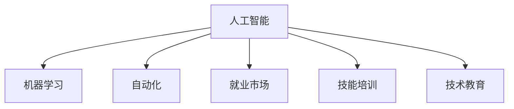

                 

# 人类计算：AI时代的未来就业市场与技能培训发展

> 关键词：人工智能, 机器学习, 自动化, 就业市场, 技能培训, 技术教育, 未来职场

## 1. 背景介绍

### 1.1 问题由来

随着人工智能(AI)和机器学习(ML)技术的飞速发展，自动化和智能化的浪潮正席卷全球各个行业。各行各业都在经历着前所未有的变革，AI驱动的自动化解决方案已经开始改变工作方式、流程和市场格局。在这个变革的大背景下，劳动力市场将经历巨大的变化。一方面，AI将替代某些重复性、低技能的工作，另一方面，它也将创造出新的工作岗位和就业机会，需要全新的技能和能力。

### 1.2 问题核心关键点

当前，全球正面临严峻的就业市场挑战。一方面，自动化和智能化的浪潮正在淘汰一些传统岗位，例如制造业的机器人操作员、数据录入员等；另一方面，AI技术的渗透和应用也带来了新的就业机会，例如数据科学家、AI工程师、自动化系统维护师等。这一趋势要求劳动力市场和教育机构必须快速调整，以应对即将到来的就业市场变化。

## 2. 核心概念与联系

### 2.1 核心概念概述

为更好地理解AI时代就业市场和技能培训的未来发展，本节将介绍几个密切相关的核心概念：

- **人工智能(AI)**：利用计算机系统模拟人类智能过程的技术，包括机器学习、自然语言处理、计算机视觉等。
- **机器学习(ML)**：AI的一个分支，通过数据训练模型，使其能够自动学习和改进，从而实现预测、分类等任务。
- **自动化(Automation)**：使用AI和ML技术，自动执行原本需要人工操作的任务。
- **就业市场**：劳动力供需关系的表现形式，受技术进步、经济环境等多种因素影响。
- **技能培训**：通过教育和培训，提升劳动者在特定领域的技能，以适应新兴行业的需求。
- **技术教育**：专门针对新兴技术和未来职业进行的教育和培训，涵盖从基础到高级的各种内容。

这些概念之间的逻辑关系可以通过以下Mermaid流程图来展示：



这个流程图展示了AI和ML技术如何通过自动化推动就业市场的变革，同时技能培训和技术教育在这一变革中扮演了重要角色。

## 3. 核心算法原理 & 具体操作步骤
### 3.1 算法原理概述

AI和ML技术对就业市场的影响可以通过一个简化的算法来理解：

1. **输入**：当前就业市场状况、技术进步速度、现有工作岗位技能要求等。
2. **处理**：AI和ML模型分析输入数据，预测未来就业市场变化。
3. **输出**：基于预测结果，制定技能培训和技术教育计划，以适应即将到来的就业市场。

这个算法的基本原理是利用历史数据和模型，预测未来就业市场的发展趋势，并据此制定相应的教育和培训策略。

### 3.2 算法步骤详解

基于上述算法原理，AI时代就业市场和技能培训的未来发展可以按照以下步骤进行：

1. **数据收集**：收集有关当前就业市场状况、技术进步速度、现有工作岗位技能要求等数据。
2. **模型构建**：使用机器学习模型，如时间序列预测模型、回归模型等，对收集到的数据进行分析。
3. **趋势预测**：根据模型分析结果，预测未来就业市场的变化趋势。
4. **计划制定**：基于预测结果，制定相应的技能培训和技术教育计划。
5. **实施评估**：实施技能培训和技术教育计划，并定期评估其效果。

### 3.3 算法优缺点

AI时代就业市场和技能培训的未来发展，具有以下优点：

- **预测准确性**：利用机器学习模型，能够较为准确地预测就业市场的变化趋势。
- **实时性**：可以实时监控就业市场的变化，及时调整技能培训计划。
- **灵活性**：能够根据市场需求变化，灵活调整培训内容和方法。

然而，该算法也存在一些缺点：

- **数据质量依赖**：模型的预测结果依赖于数据的质量和全面性。
- **模型复杂性**：构建和维护机器学习模型需要较高的技术门槛。
- **社会影响**：技能培训和技术教育的计划可能面临社会、经济等多重因素的制约。

### 3.4 算法应用领域

基于AI和ML的就业市场和技能培训算法，可以在多个领域中得到应用，例如：

- **教育培训**：帮助教育机构设计课程内容，以适应未来的就业市场需求。
- **人力资源管理**：帮助企业制定员工培训计划，提升员工技能。
- **政府决策**：为政策制定者提供就业市场预测和技能培训建议。
- **职业指导**：为求职者提供职业发展建议，指导其进行技能提升。

## 4. 数学模型和公式 & 详细讲解 & 举例说明
### 4.1 数学模型构建

本节将使用数学语言对AI时代就业市场和技能培训的未来发展进行更严格的刻画。

设当前就业市场状况为 $X_0$，技术进步速度为 $Y_0$，现有工作岗位技能要求为 $Z_0$。AI和ML模型通过对这些输入数据的处理，得到未来 $n$ 时间步的就业市场预测 $X_1, X_2, ..., X_n$，并据此制定技能培训计划 $P$。

### 4.2 公式推导过程

设 $F$ 为机器学习模型，$D$ 为数据集。则未来就业市场预测和技能培训计划的制定过程可以表示为：

$$
X_t = F(X_{t-1}, Y_{t-1}, Z_{t-1}, D), \quad t=1,2,...,n
$$

$$
P = \arg\min_{P} \sum_{i=1}^n \text{cost}(X_i, P)
$$

其中 $\text{cost}(X_i, P)$ 为预测结果 $X_i$ 与计划 $P$ 之间的成本函数，可以表示为预测误差、资源消耗等。

### 4.3 案例分析与讲解

考虑一个简单的例子：一家企业希望预测未来5年内对数据科学家的需求。企业可以收集历史就业数据、技术发展趋势和现有数据科学家岗位的技能要求等数据。利用机器学习模型，如时间序列预测模型，对数据进行分析，得到未来5年的就业市场预测。然后，企业根据预测结果，制定相应的技能培训计划，提升现有员工的AI技能，以满足未来需求。

## 5. 项目实践：代码实例和详细解释说明
### 5.1 开发环境搭建

在进行AI和ML模型的开发和应用之前，我们需要准备好开发环境。以下是使用Python进行Scikit-learn开发的环境配置流程：

1. 安装Anaconda：从官网下载并安装Anaconda，用于创建独立的Python环境。

2. 创建并激活虚拟环境：
```bash
conda create -n ml-env python=3.7 
conda activate ml-env
```

3. 安装Scikit-learn：
```bash
pip install scikit-learn
```

4. 安装其他必要的工具包：
```bash
pip install pandas numpy matplotlib seaborn scikit-learn
```

完成上述步骤后，即可在`ml-env`环境中开始AI和ML模型的开发和应用。

### 5.2 源代码详细实现

下面以时间序列预测为例，给出使用Scikit-learn进行就业市场预测的Python代码实现。

首先，导入必要的库和数据：

```python
import pandas as pd
import numpy as np
from sklearn.linear_model import LinearRegression
from sklearn.metrics import mean_squared_error

# 读取数据集
data = pd.read_csv('employment_data.csv', index_col='Year', parse_dates=True)
```

然后，进行数据预处理：

```python
# 将数据集按时间顺序排列
data = data.sort_index()

# 将数据集划分为训练集和测试集
train_data = data[:2010]
test_data = data[2010:]
```

接着，构建和训练模型：

```python
# 构建线性回归模型
model = LinearRegression()

# 使用训练集拟合模型
model.fit(train_data[['GDP', 'Tech_Growth']], train_data['Employment'])
```

最后，进行预测和评估：

```python
# 使用模型进行未来5年的预测
future_data = pd.DataFrame({'Year': np.arange(2011, 2021), 'GDP': np.arange(2011, 2021), 'Tech_Growth': np.arange(2011, 2021)})
predictions = model.predict(future_data[['GDP', 'Tech_Growth']])

# 计算预测误差
mse = mean_squared_error(test_data['Employment'], predictions)
print(f"Mean Squared Error: {mse}")
```

以上就是使用Scikit-learn进行就业市场预测的完整代码实现。可以看到，利用Scikit-learn库，我们可以在相对简单的代码中实现线性回归模型的构建和预测。

### 5.3 代码解读与分析

让我们再详细解读一下关键代码的实现细节：

**就业市场预测代码**：
- 导入必要的库和数据。
- 将数据集按时间顺序排列。
- 划分训练集和测试集。
- 构建线性回归模型。
- 使用训练集拟合模型。
- 使用模型进行未来5年的预测。
- 计算预测误差。

这些步骤展示了如何使用Scikit-learn库构建简单的就业市场预测模型。在实际应用中，为了提高模型的预测准确性，可能需要使用更复杂的模型，如随机森林、神经网络等，并进行模型调优和超参数搜索。

## 6. 实际应用场景
### 6.1 教育培训

在教育培训领域，AI和ML技术可以用于制定更加科学合理的课程内容和培训计划，帮助学生和在职人员快速掌握未来就业市场的关键技能。例如：

- **课程设计**：利用机器学习模型，分析未来就业市场的技能需求，设计针对性课程。
- **个性化学习**：根据学生的学习进度和表现，动态调整学习计划，提升学习效率。
- **技能评估**：通过智能评估系统，实时监测学生的学习效果，提供个性化反馈。

### 6.2 人力资源管理

在人力资源管理中，AI和ML技术可以帮助企业优化招聘流程，提高员工培训效果。例如：

- **招聘推荐**：利用机器学习模型，分析候选人的技能和经验，推荐最适合的岗位。
- **员工培训**：根据员工的职业发展路径和岗位需求，定制个性化培训计划。
- **绩效评估**：通过AI分析员工的工作表现，提供客观、公正的绩效评估。

### 6.3 政府决策

在政府决策中，AI和ML技术可以帮助政策制定者更好地理解就业市场的变化趋势，制定更有针对性的政策和法规。例如：

- **就业预测**：利用机器学习模型，预测未来就业市场变化，制定就业政策。
- **技能需求分析**：分析不同行业的技能需求，指导职业教育和技能培训。
- **政策评估**：通过AI模型，评估政策效果，优化政策制定过程。

## 7. 工具和资源推荐
### 7.1 学习资源推荐

为了帮助开发者系统掌握AI和ML技术的应用，这里推荐一些优质的学习资源：

1. **《机器学习实战》**：一本经典书籍，详细介绍了机器学习的基本概念和常用算法。
2. **Coursera的《机器学习》课程**：由斯坦福大学教授Andrew Ng主讲，是机器学习领域的经典课程。
3. **Kaggle竞赛平台**：一个数据科学竞赛平台，提供了丰富的数据集和算法挑战，适合练习和提升技能。
4. **GitHub上的开源项目**：GitHub上有很多优秀的AI和ML项目，可以作为学习参考和实践平台。
5. **Google的AI博客**：Google AI团队定期发布博客，分享最新的AI技术进展和应用案例。

通过对这些资源的学习实践，相信你一定能够快速掌握AI和ML技术的应用。

### 7.2 开发工具推荐

高效的开发离不开优秀的工具支持。以下是几款用于AI和ML开发的常用工具：

1. **Python**：最流行的AI和ML开发语言，具备丰富的第三方库和框架。
2. **Jupyter Notebook**：一个交互式的开发环境，适合快速迭代和可视化。
3. **TensorFlow**：由Google开发的深度学习框架，适用于复杂模型的训练和部署。
4. **PyTorch**：Facebook开发的深度学习框架，以其灵活性和易用性著称。
5. **Scikit-learn**：一个广泛使用的机器学习库，提供丰富的算法和工具。

合理利用这些工具，可以显著提升AI和ML应用的开发效率，加快创新迭代的步伐。

### 7.3 相关论文推荐

AI和ML技术的发展源于学界的持续研究。以下是几篇奠基性的相关论文，推荐阅读：

1. **《深度学习》**：Yoshua Bengio等著，详细介绍了深度学习的基本概念和常用算法。
2. **《统计学习方法》**：李航著，介绍了机器学习的基本理论和常用算法。
3. **《神经网络与深度学习》**：Michael Nielsen著，介绍了神经网络和深度学习的基础知识。
4. **《机器学习实战》**：Peter Harrington著，介绍了机器学习的基本概念和实用算法。
5. **《Python机器学习》**：Sebastian Raschka著，介绍了使用Python进行机器学习的常用技术和工具。

这些论文代表了大数据和机器学习技术的发展脉络。通过学习这些前沿成果，可以帮助研究者把握学科前进方向，激发更多的创新灵感。

## 8. 总结：未来发展趋势与挑战
### 8.1 总结

本文对AI和ML技术在就业市场和技能培训中的应用进行了全面系统的介绍。首先阐述了AI和ML技术对就业市场的影响和技能培训的重要性，明确了技能培训在AI时代的重要价值。其次，从原理到实践，详细讲解了机器学习模型的构建和应用，给出了就业市场预测的完整代码实现。同时，本文还广泛探讨了AI和ML技术在教育培训、人力资源管理、政府决策等领域的实际应用，展示了AI技术在各行业中的广阔前景。此外，本文精选了AI和ML技术的学习资源，力求为读者提供全方位的技术指引。

通过本文的系统梳理，可以看到，AI和ML技术在就业市场和技能培训中的应用前景广阔。这些技术能够帮助企业和政府更准确地预测就业市场变化，制定合理的政策和计划，从而推动社会经济的可持续发展。然而，AI和ML技术的应用也面临着诸多挑战，如数据质量、模型复杂性、社会影响等。未来，随着技术的发展和政策的完善，这些挑战有望逐步克服，AI和ML技术必将在各个领域中发挥更大的作用。

### 8.2 未来发展趋势

展望未来，AI和ML技术在就业市场和技能培训中的应用将呈现以下几个发展趋势：

1. **自动化和智能化**：自动化和智能化将成为AI技术的主要发展方向，进一步替代重复性、低技能的工作，提升工作效率。
2. **个性化学习**：利用AI和ML技术，提供个性化的学习方案，帮助学生和在职人员快速掌握关键技能。
3. **实时监控和评估**：通过AI和ML技术，实时监测和评估员工绩效，提升人力资源管理效率。
4. **跨学科融合**：AI和ML技术将与其他学科，如心理学、经济学等，进行更深入的融合，形成更加全面、系统的解决方案。
5. **伦理和社会责任**：随着AI技术的普及，其伦理和社会责任问题也将得到更多的关注和研究，确保AI技术的安全和公正。

以上趋势凸显了AI和ML技术在就业市场和技能培训中的巨大潜力。这些方向的探索发展，必将进一步推动AI技术在各行业的落地应用，为社会经济的可持续发展提供新的动力。

### 8.3 面临的挑战

尽管AI和ML技术在就业市场和技能培训中有着广阔的应用前景，但在迈向更加智能化、普适化应用的过程中，它仍面临着诸多挑战：

1. **数据质量瓶颈**：AI和ML模型的预测准确性依赖于高质量的数据，数据质量和全面性是制约模型性能的主要因素。
2. **模型复杂性**：构建和维护复杂的机器学习模型需要较高的技术门槛，模型的解释性和可维护性也存在一定的挑战。
3. **社会影响**：AI和ML技术的应用可能带来就业市场的结构性变化，需要政策制定者和社会各界的共同努力。
4. **伦理和隐私问题**：AI和ML技术的应用可能涉及伦理和隐私问题，如算法偏见、数据隐私等，需要制定相应的法律法规和规范。
5. **公平性和可访问性**：AI和ML技术的普及可能加剧社会不平等，需要确保技术的公平性和可访问性。

这些挑战需要技术界、政策制定者和社会的共同努力，才能确保AI和ML技术在就业市场和技能培训中的应用能够造福全社会。

### 8.4 研究展望

面对AI和ML技术在就业市场和技能培训中面临的挑战，未来的研究需要在以下几个方面寻求新的突破：

1. **数据增强和清洗**：通过数据增强和清洗技术，提高数据的质量和全面性，提升模型的预测准确性。
2. **模型解释性**：开发更加可解释的AI和ML模型，增强模型的透明性和可解释性。
3. **跨学科研究**：加强与其他学科的交叉融合，形成更加全面、系统的解决方案。
4. **伦理和法律研究**：制定相应的伦理和法律规范，确保AI和ML技术的安全和公正应用。
5. **教育普及**：推广AI和ML技术的教育普及，提升全社会的技术素养。

这些研究方向的探索，必将引领AI和ML技术在就业市场和技能培训中的应用走向更加成熟和规范。只有勇于创新、敢于突破，才能不断拓展AI技术的应用边界，为社会经济的可持续发展提供新的动力。

## 9. 附录：常见问题与解答

**Q1：AI和ML技术在就业市场和技能培训中的应用有哪些？**

A: AI和ML技术在就业市场和技能培训中的应用主要包括以下几个方面：

1. **就业市场预测**：利用机器学习模型，预测未来就业市场的变化趋势，帮助政策制定者和企业制定合理的政策和计划。
2. **技能培训**：通过个性化的学习方案，帮助学生和在职人员快速掌握未来就业市场的关键技能。
3. **人力资源管理**：优化招聘流程，提高员工培训效果，提升人力资源管理效率。
4. **教育培训**：制定更加科学合理的课程内容，提高教育培训的效果。

**Q2：如何提高AI和ML模型的预测准确性？**

A: 提高AI和ML模型的预测准确性主要可以通过以下方法：

1. **数据增强**：通过数据增强技术，扩充训练集，提高数据的质量和全面性。
2. **模型优化**：使用更复杂的模型和优化算法，提高模型的泛化能力。
3. **超参数调优**：通过超参数调优，找到最佳的模型参数组合，提升模型性能。
4. **正则化**：使用正则化技术，如L2正则、Dropout等，避免过拟合。
5. **集成学习**：通过集成多个模型的预测结果，提升模型的稳定性和准确性。

**Q3：AI和ML技术在应用中面临哪些伦理和社会责任问题？**

A: AI和ML技术在应用中面临的伦理和社会责任问题主要包括以下几个方面：

1. **算法偏见**：AI和ML模型可能学习到数据中的偏见，导致不公平的决策。
2. **数据隐私**：AI和ML模型需要大量的数据进行训练，数据隐私问题需要得到充分考虑。
3. **技术滥用**：AI和ML技术可能被滥用，导致社会不公和安全问题。
4. **伦理规范**：需要制定相应的伦理规范，确保AI和ML技术的安全和公正应用。

这些伦理和社会责任问题需要技术界、政策制定者和社会的共同努力，才能确保AI和ML技术在就业市场和技能培训中的应用能够造福全社会。

**Q4：如何在AI和ML应用中平衡技术进步和社会责任？**

A: 在AI和ML应用中平衡技术进步和社会责任，主要可以通过以下方法：

1. **多学科交叉**：加强与其他学科的交叉融合，形成更加全面、系统的解决方案。
2. **伦理和社会责任研究**：制定相应的伦理和社会责任规范，确保AI和ML技术的安全和公正应用。
3. **社会参与**：在AI和ML技术的开发和应用过程中，广泛听取社会各界的意见和建议，确保技术的普适性和可接受性。
4. **透明性和可解释性**：开发更加可解释的AI和ML模型，增强模型的透明性和可解释性。

只有平衡好技术进步和社会责任，才能确保AI和ML技术在就业市场和技能培训中的应用能够真正造福全社会。

**Q5：未来AI和ML技术的发展趋势是什么？**

A: 未来AI和ML技术的发展趋势主要包括以下几个方面：

1. **自动化和智能化**：自动化和智能化将成为AI技术的主要发展方向，进一步替代重复性、低技能的工作，提升工作效率。
2. **个性化学习**：利用AI和ML技术，提供个性化的学习方案，帮助学生和在职人员快速掌握关键技能。
3. **实时监控和评估**：通过AI和ML技术，实时监测和评估员工绩效，提升人力资源管理效率。
4. **跨学科融合**：AI和ML技术将与其他学科，如心理学、经济学等，进行更深入的融合，形成更加全面、系统的解决方案。
5. **伦理和法律研究**：制定相应的伦理和法律规范，确保AI和ML技术的安全和公正应用。

这些趋势凸显了AI和ML技术在就业市场和技能培训中的巨大潜力。这些方向的探索发展，必将进一步推动AI技术在各行业的落地应用，为社会经济的可持续发展提供新的动力。

---

作者：禅与计算机程序设计艺术 / Zen and the Art of Computer Programming

