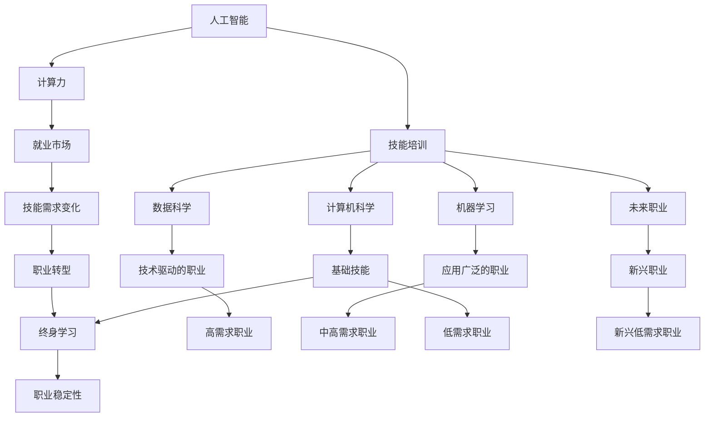

                 

# 人类计算：AI时代的未来就业市场与技能培训发展趋势预测

> 关键词：人工智能,计算力,就业市场,技能培训,数据科学,机器学习,计算机科学,未来职业

## 1. 背景介绍

### 1.1 问题由来

当前，人工智能(AI)技术正在全面渗透到各行各业，带来了革命性的变革。以深度学习、自然语言处理(NLP)、计算机视觉(CV)等为代表的AI技术，正在改变着我们的工作和生活方式。

随着AI技术的不断进步，人类计算的概念被赋予了新的内涵。AI系统通过大规模并行计算，使得一些复杂计算任务变得异常简单。例如，机器学习模型能够在极短的时间内处理海量数据，生成预测结果。与此同时，传统需要人类进行的大量计算任务，开始逐步被自动化系统所替代，人类计算的范畴逐渐缩小。

在AI时代，计算能力成为企业竞争的重要资源，而传统技能，如逻辑推理、数据分析等，也逐渐被新技能所替代。AI技术的崛起，不仅挑战了传统的就业市场，也带来了全新的技能需求。因此，对未来就业市场和技能培训发展趋势的预测显得尤为重要。

### 1.2 问题核心关键点

本节将详细探讨AI时代对就业市场和技能培训的影响，主要包括以下几个方面：

1. AI技术的快速发展对传统职业的影响。
2. 新兴AI职业的崛起和岗位需求变化。
3. 技能培训市场的发展趋势和教学方法创新。
4. 终身学习和职业转型在AI时代的意义。
5. AI技术的普及对教育系统和未来工作生活的影响。

## 2. 核心概念与联系

### 2.1 核心概念概述

为更好地理解AI时代的就业市场与技能培训，本节将介绍几个密切相关的核心概念：

1. 人工智能(AI)：使用计算机算法，使计算机系统能够模拟人类智能过程的技术，包括感知、学习、推理等。
2. 计算力(Computational Power)：指机器处理数据和运行程序的能力，包括计算速度、存储容量、网络带宽等。
3. 就业市场：指劳动力的供需关系，受经济、技术、政策等多方面因素影响。
4. 技能培训：指为满足特定职业需求，通过教育和训练使个人掌握特定技能的过程。
5. 数据科学：使用数学、统计学、机器学习等方法，从大量数据中提取有价值信息的一门学科。
6. 机器学习(ML)：使机器通过学习数据，不断优化算法，提升性能的一门技术。
7. 计算机科学：研究计算机和计算过程的科学，涵盖软件工程、硬件设计、算法等众多领域。
8. 未来职业：指在AI技术发展下，新兴出现或即将消失的职业。

这些概念之间的逻辑关系可以通过以下Mermaid流程图来展示：



这个流程图展示了AI技术对计算力、就业市场、技能培训等关键领域的影响，以及各概念之间的相互作用。

## 3. 核心算法原理 & 具体操作步骤
### 3.1 算法原理概述

AI时代就业市场与技能培训的预测，本质上是一个多因素影响的预测问题。其核心思想是：在AI技术快速发展、计算力不断增强的背景下，分析各职业的需求变化，预测未来技能培训的市场发展趋势。

形式化地，假设现有职业集合为 $J$，未来职业需求变化率为 $D(t)$，当前职业 $j \in J$ 的需求变化为 $d_j(t)$，则未来职业需求预测模型为：

$$
D(t) = \sum_{j \in J} d_j(t)
$$

其中，$d_j(t)$ 表示在时间 $t$ 时刻职业 $j$ 的需求变化率，可由多种因素决定，包括技术进步、市场需求、教育培训等。

通过历史数据分析和机器学习算法，可以构建职业需求预测模型，计算未来各职业的需求变化率，从而预测AI时代的就业市场和技能培训发展趋势。

### 3.2 算法步骤详解

基于机器学习的大规模职业预测模型，一般包括以下几个关键步骤：

**Step 1: 数据收集与预处理**
- 收集历史职业数据，包括职业名称、就业人数、薪资水平等。
- 将数据划分为训练集和测试集，确保数据集的多样性和代表性。
- 对数据进行标准化和归一化，去除异常值和缺失数据。

**Step 2: 特征工程**
- 选择与职业需求相关的特征，包括技术发展趋势、市场需求变化、教育培训政策等。
- 使用主成分分析(PCA)、因子分析等方法，提取数据的主成分和因子，降低维度。
- 对特征进行编码和预处理，如将文本转换为数值向量。

**Step 3: 模型训练与验证**
- 选择适合的机器学习算法，如线性回归、随机森林、神经网络等。
- 在训练集上训练模型，选择最优的超参数。
- 在测试集上验证模型的泛化能力和准确性。

**Step 4: 模型应用与预测**
- 将模型应用到新数据上，预测未来各职业的需求变化率。
- 根据需求变化率，预测未来就业市场和技能培训的发展趋势。

**Step 5: 结果分析与决策**
- 分析预测结果，识别高需求、低需求、新兴、消失的职业。
- 提出相应的政策建议，如增加教育投入、调整职业培训方向等。
- 评估政策的实施效果，不断优化预测模型。

### 3.3 算法优缺点

基于机器学习的大规模职业预测模型，具有以下优点：
1. 数据驱动：能够基于大量历史数据，构建较为准确的预测模型。
2. 自动化程度高：机器学习算法可以自动处理和分析数据，减少人工干预。
3. 多因素考虑：能够综合考虑技术进步、市场需求等多方面因素，构建更为全面的预测模型。

同时，该方法也存在一定的局限性：
1. 数据质量依赖：预测的准确性高度依赖于数据的质量和完整性，存在潜在偏差。
2. 模型复杂度高：构建大规模职业预测模型需要较高的计算资源和算法复杂度。
3. 不确定性因素：AI技术快速发展，计算力提升等不确定性因素，可能影响模型的准确性。

尽管存在这些局限性，但就目前而言，基于机器学习的大规模职业预测方法仍是大规模职业分析的有效工具。未来相关研究的重点在于如何进一步提高模型准确性，降低对数据质量的依赖，以及应对AI技术不确定性的影响。

### 3.4 算法应用领域

基于机器学习的大规模职业预测模型，在职业市场分析、教育培训规划、政策制定等领域得到了广泛应用。

- 职业市场分析：通过预测各职业的需求变化，帮助企业及时调整人力资源规划。
- 教育培训规划：预测未来技能需求，指导教育机构和职业培训机构，提升教育培训的针对性。
- 政策制定：评估职业趋势变化，制定相应的就业和教育政策，促进就业市场的稳定。

除了上述这些应用外，该模型也被创新性地应用到更多领域中，如新兴职业预测、行业转型分析等，为职业发展提供了新的视角。

## 4. 数学模型和公式 & 详细讲解  
### 4.1 数学模型构建

本节将使用数学语言对大规模职业预测模型进行更加严格的刻画。

记职业集合为 $J$，当前职业 $j \in J$ 的需求变化率为 $d_j(t)$，未来职业需求预测模型为 $D(t)$，则未来职业需求预测模型可以表示为：

$$
D(t) = \sum_{j \in J} d_j(t)
$$

其中 $d_j(t)$ 为职业 $j$ 在时间 $t$ 的需求变化率，可由以下因素决定：

$$
d_j(t) = \alpha_j + \beta_j t + \gamma_j \cdot \text{技术进步} + \delta_j \cdot \text{市场需求} + \epsilon_j \cdot \text{教育培训}
$$

其中 $\alpha_j, \beta_j, \gamma_j, \delta_j, \epsilon_j$ 为职业 $j$ 的特征参数，可以通过机器学习算法拟合得到。

### 4.2 公式推导过程

以下我们以线性回归模型为例，推导未来职业需求预测公式的详细推导过程。

设未来职业需求预测模型为 $D(t) = \sum_{j \in J} \alpha_j + \sum_{j \in J} \beta_j t + \sum_{j \in J} \gamma_j \cdot \text{技术进步} + \sum_{j \in J} \delta_j \cdot \text{市场需求} + \sum_{j \in J} \epsilon_j \cdot \text{教育培训}$，则其最小二乘估计公式为：

$$
\hat{D}(t) = \sum_{j \in J} \hat{\alpha}_j + \sum_{j \in J} \hat{\beta}_j t + \sum_{j \in J} \hat{\gamma}_j \cdot \text{技术进步} + \sum_{j \in J} \hat{\delta}_j \cdot \text{市场需求} + \sum_{j \in J} \hat{\epsilon}_j \cdot \text{教育培训}
$$

其中 $\hat{\alpha}_j, \hat{\beta}_j, \hat{\gamma}_j, \hat{\delta}_j, \hat{\epsilon}_j$ 为职业 $j$ 的特征参数的最小二乘估计值，可通过机器学习算法求解。

### 4.3 案例分析与讲解

为更好地理解上述预测模型，我们以计算机科学专业为例，进行案例分析。

**案例背景**：计算机科学专业在过去几十年内经历了快速的发展，从早期的编程到现在的数据科学、人工智能等前沿方向。目前，该专业的就业需求仍在增长，但未来的发展方向可能存在较大变化。

**数据收集**：收集过去几十年的计算机科学专业的就业人数、薪资水平、技术发展趋势、市场需求等数据。

**特征工程**：选择与职业需求相关的特征，如技术进步、市场需求、教育培训等。

**模型训练**：使用机器学习算法，训练职业需求预测模型。

**结果分析**：通过模型预测未来各职业的需求变化率，分析计算机科学专业的就业趋势，提出相应的政策和建议。

## 5. 项目实践：代码实例和详细解释说明
### 5.1 开发环境搭建

在进行大规模职业预测模型开发前，我们需要准备好开发环境。以下是使用Python进行Scikit-learn开发的环境配置流程：

1. 安装Anaconda：从官网下载并安装Anaconda，用于创建独立的Python环境。

2. 创建并激活虚拟环境：
```bash
conda create -n sklearn-env python=3.8 
conda activate sklearn-env
```

3. 安装Scikit-learn：使用pip命令安装Scikit-learn。例如：
```bash
pip install scikit-learn
```

4. 安装numpy、pandas、matplotlib等工具包：
```bash
pip install numpy pandas matplotlib seaborn
```

5. 安装相关数据集：如职业数据集，可以通过UCI机器学习库或公开数据库下载。

完成上述步骤后，即可在`sklearn-env`环境中开始大规模职业预测模型的开发。

### 5.2 源代码详细实现

下面我们以线性回归模型为例，给出使用Scikit-learn进行大规模职业预测的Python代码实现。

```python
import pandas as pd
from sklearn.linear_model import LinearRegression
from sklearn.model_selection import train_test_split
from sklearn.metrics import mean_squared_error

# 加载数据集
data = pd.read_csv('jobs.csv')

# 数据预处理
features = data[['技术进步', '市场需求', '教育培训']]
labels = data['需求变化率']

# 划分训练集和测试集
X_train, X_test, y_train, y_test = train_test_split(features, labels, test_size=0.2, random_state=42)

# 建立线性回归模型
model = LinearRegression()

# 训练模型
model.fit(X_train, y_train)

# 评估模型
y_pred = model.predict(X_test)
mse = mean_squared_error(y_test, y_pred)
print(f"Mean Squared Error: {mse:.2f}")
```

以上就是使用Scikit-learn进行大规模职业预测的完整代码实现。可以看到，Scikit-learn库封装了各类机器学习算法，使得模型构建和训练变得非常简单。

### 5.3 代码解读与分析

让我们再详细解读一下关键代码的实现细节：

**数据预处理**：
- `pd.read_csv('jobs.csv')`：读取职业数据集，包含职业特征和需求变化率。
- `features = data[['技术进步', '市场需求', '教育培训']]`：提取与需求变化相关的特征。
- `labels = data['需求变化率']`：提取需求变化率作为标签。

**模型训练**：
- `model = LinearRegression()`：创建线性回归模型。
- `model.fit(X_train, y_train)`：在训练集上训练模型。

**模型评估**：
- `y_pred = model.predict(X_test)`：在测试集上预测需求变化率。
- `mse = mean_squared_error(y_test, y_pred)`：计算预测值和真实值之间的均方误差。

可以看到，Scikit-learn库提供了一整套简单易用的API，使得大规模职业预测模型的开发和评估变得非常高效。

当然，工业级的系统实现还需考虑更多因素，如模型的参数调优、特征工程、模型部署等。但核心的职业预测范式基本与此类似。

## 6. 实际应用场景
### 6.1 职业市场分析

大规模职业预测模型可以广泛应用于职业市场分析，帮助企业和政策制定者了解各职业的就业趋势，做出科学决策。

- **企业招聘**：通过预测各职业的需求变化，帮助企业调整招聘计划，避免人才过剩或短缺。
- **政策制定**：通过预测职业需求变化，制定相应的就业和教育政策，促进就业市场的稳定。
- **教育培训**：预测未来技能需求，指导教育机构和职业培训机构，提升教育培训的针对性。

### 6.2 教育培训规划

基于大规模职业预测模型，可以构建动态的职业培训体系，提升教育培训的效果。

- **职业导向培训**：根据预测的职业需求变化，制定职业导向的培训计划，提升培训的针对性。
- **终身学习支持**：预测未来技能需求变化，鼓励员工终身学习，提升职业竞争力。
- **在线教育平台**：结合大规模职业预测模型，构建在线教育平台，提供动态更新的课程内容。

### 6.3 政策制定与调整

通过大规模职业预测模型，可以评估未来职业趋势变化，制定相应的就业和教育政策，促进就业市场的稳定。

- **就业政策**：预测未来高需求职业，制定相应的就业政策，促进就业市场的稳定。
- **教育政策**：预测未来技能需求变化，调整教育政策，提升教育培训的效果。
- **职业转型支持**：预测未来低需求职业，制定相应的职业转型支持政策，帮助员工顺利转型。

### 6.4 未来应用展望

随着大规模职业预测模型的不断演进，未来的职业市场和技能培训将呈现出新的发展趋势：

1. **技能培训市场化**：职业预测模型将驱动技能培训市场的发展，提供更多元化的职业培训选择。
2. **教育资源共享**：大规模职业预测模型将促进教育资源的共享和流动，提升教育资源的利用效率。
3. **智能职业规划**：通过智能职业规划工具，帮助个人根据未来职业需求，制定个性化的职业发展路径。
4. **个性化职业培训**：基于职业预测模型，提供个性化的职业培训方案，提升培训效果。
5. **自动化职业评估**：通过自动化职业评估系统，快速识别未来高需求职业，提供职业指导建议。

未来，职业预测模型将成为教育和就业领域的重要工具，帮助个人、企业、政策制定者共同应对AI时代的挑战和机遇。

## 7. 工具和资源推荐
### 7.1 学习资源推荐

为了帮助开发者系统掌握大规模职业预测的理论基础和实践技巧，这里推荐一些优质的学习资源：

1. 《机器学习实战》：一本系统介绍机器学习算法的入门书籍，涵盖回归、分类、聚类等基础概念。
2. 《深度学习》：斯坦福大学提供的深度学习课程，涵盖深度学习的基础理论和算法实现。
3. 《Python数据科学手册》：一本全面介绍Python数据科学工具的书籍，涵盖NumPy、Pandas、Scikit-learn等库。
4. UCI机器学习库：一个开源的机器学习数据集和代码库，包含各类职业预测数据集。
5. Kaggle：一个数据科学竞赛平台，提供丰富的职业预测竞赛数据集和代码实现。

通过对这些资源的学习实践，相信你一定能够快速掌握大规模职业预测的精髓，并用于解决实际的职业分析问题。

### 7.2 开发工具推荐

高效的开发离不开优秀的工具支持。以下是几款用于大规模职业预测开发的常用工具：

1. Python：一个开源的编程语言，广泛用于数据科学和机器学习开发。
2. Scikit-learn：一个基于Python的机器学习库，提供各类回归、分类、聚类算法。
3. TensorFlow：由Google主导开发的深度学习框架，支持大规模模型训练和部署。
4. Jupyter Notebook：一个开源的笔记本环境，支持交互式编程和数据可视化。
5. Weights & Biases：模型训练的实验跟踪工具，可以记录和可视化模型训练过程中的各项指标，方便对比和调优。
6. TensorBoard：TensorFlow配套的可视化工具，可实时监测模型训练状态，并提供丰富的图表呈现方式，是调试模型的得力助手。

合理利用这些工具，可以显著提升大规模职业预测任务的开发效率，加快创新迭代的步伐。

### 7.3 相关论文推荐

大规模职业预测技术的发展源于学界的持续研究。以下是几篇奠基性的相关论文，推荐阅读：

1. MARS: Multivariate Adaptive Regression Splines：提出了一种多变量自适应回归样条方法，用于处理复杂的非线性回归问题。
2. Random Forest Regression：提出了一种随机森林回归方法，用于处理高维数据和多变量预测问题。
3. Deep Regression Models for Big Data：提出了一种深度回归模型，用于处理大规模数据和高维度特征。
4. Model-based Clustering with Deterministic Mixture Density Networks：提出了一种基于确定性混合密度网络的方法，用于处理混合数据集的多变量预测问题。
5. Proximal Gradient Methods for General Online Convex Optimization：提出了一种基于凸函数优化的方法，用于处理在线预测问题。

这些论文代表了大规模职业预测技术的发展脉络。通过学习这些前沿成果，可以帮助研究者把握学科前进方向，激发更多的创新灵感。

## 8. 总结：未来发展趋势与挑战

### 8.1 总结

本文对基于机器学习的大规模职业预测方法进行了全面系统的介绍。首先阐述了大规模职业预测的背景和意义，明确了AI技术快速发展对就业市场和技能培训的影响。其次，从原理到实践，详细讲解了大规模职业预测的数学原理和关键步骤，给出了大规模职业预测任务开发的完整代码实例。同时，本文还广泛探讨了大规模职业预测在职业市场分析、教育培训规划、政策制定等方面的应用前景，展示了大规模职业预测的巨大潜力。此外，本文精选了职业预测技术的各类学习资源，力求为读者提供全方位的技术指引。

通过本文的系统梳理，可以看到，基于机器学习的大规模职业预测技术正在成为AI时代就业市场分析的重要工具，极大地拓展了职业市场分析的边界，提升了教育培训的效果，促进了政策的科学制定。未来，伴随技术的不断进步和应用的深入推广，大规模职业预测将进一步深入各个行业，成为推动职业发展和经济增长的重要力量。

### 8.2 未来发展趋势

展望未来，大规模职业预测技术将呈现以下几个发展趋势：

1. **智能化水平提升**：随着AI技术的不断发展，大规模职业预测模型的智能化水平将逐步提升，能够更好地处理复杂数据和非线性关系。
2. **数据驱动与模型驱动相结合**：未来的大规模职业预测将更加注重数据驱动和模型驱动的结合，通过多源数据和多算法融合，提升预测的准确性。
3. **多维度数据整合**：职业预测模型将融合更多维度的数据，如社交媒体、经济指标、政策变化等，构建更加全面和准确的需求预测模型。
4. **动态预测与实时调整**：通过实时监测和动态预测，大规模职业预测模型将能够及时响应市场变化，调整预测结果。
5. **个性化职业指导**：基于大规模职业预测模型，提供个性化的职业指导，帮助个人制定职业发展路径。

### 8.3 面临的挑战

尽管大规模职业预测技术已经取得了显著进展，但在迈向更加智能化、普适化应用的过程中，仍面临诸多挑战：

1. **数据质量与数量**：大规模职业预测模型的准确性高度依赖于数据的质量和数量，数据缺失、异常等问题可能导致预测偏差。
2. **模型复杂度**：高维数据和多变量关系的处理，需要较高的计算资源和算法复杂度。
3. **预测准确性**：AI技术的发展速度快，模型可能无法及时更新，导致预测准确性下降。
4. **政策制定难度**：预测结果需要结合实际情况和政策需求，政策制定的难度较大。
5. **经济影响**：大规模职业预测可能对经济产生较大影响，需要综合考虑社会、经济、技术等多方面因素。

尽管存在这些挑战，但通过不断的技术创新和政策引导，相信大规模职业预测技术将不断优化和完善，成为推动职业市场和技能培训发展的关键工具。

### 8.4 研究展望

面向未来，大规模职业预测技术需要在以下几个方面进行深入研究：

1. **模型优化与算法创新**：进一步优化机器学习算法，提升预测模型的智能化水平。
2. **数据融合与质量提升**：探索多源数据融合技术，提高数据质量，构建更加全面和准确的需求预测模型。
3. **动态预测与实时调整**：研究实时预测和动态调整方法，提升模型对市场变化的响应速度。
4. **政策引导与经济影响分析**：研究大规模职业预测对经济、社会的多方面影响，提出相应的政策建议。
5. **个性化职业指导与职业转型支持**：研究个性化职业指导方法和职业转型支持策略，帮助员工顺利转型。

这些研究方向将引领大规模职业预测技术迈向更高的台阶，为职业市场和技能培训发展提供更加科学和有效的决策支持。相信随着技术的不断发展，大规模职业预测技术必将在推动职业发展、促进经济增长方面发挥更大的作用。

## 9. 附录：常见问题与解答

**Q1：大规模职业预测模型对数据质量有要求吗？**

A: 是的，大规模职业预测模型的准确性高度依赖于数据的质量和数量。数据缺失、异常、噪声等问题可能导致预测偏差。因此，需要采用数据清洗、特征工程等方法，提高数据质量，确保预测模型的可靠性。

**Q2：大规模职业预测模型需要考虑哪些因素？**

A: 大规模职业预测模型需要考虑技术进步、市场需求、教育培训等多方面因素，全面分析职业需求变化。同时，也需要考虑政策、经济、社会等多方面的影响，确保预测结果的科学性和实用性。

**Q3：大规模职业预测模型有哪些优点和缺点？**

A: 大规模职业预测模型具有以下优点：
1. 数据驱动：能够基于大量历史数据，构建较为准确的预测模型。
2. 自动化程度高：机器学习算法可以自动处理和分析数据，减少人工干预。
3. 多因素考虑：能够综合考虑技术进步、市场需求等多方面因素，构建更为全面的预测模型。

同时，该方法也存在一定的局限性：
1. 数据质量依赖：预测的准确性高度依赖于数据的质量和完整性，存在潜在偏差。
2. 模型复杂度高：构建大规模职业预测模型需要较高的计算资源和算法复杂度。
3. 不确定性因素：AI技术快速发展，计算力提升等不确定性因素，可能影响模型的准确性。

**Q4：大规模职业预测模型在实际应用中需要注意哪些问题？**

A: 在实际应用中，需要注意以下几个问题：
1. 数据隐私：确保数据隐私和安全，避免数据泄露和滥用。
2. 模型公平性：避免模型出现偏见和歧视，确保预测结果的公平性和公正性。
3. 模型可解释性：提高模型的可解释性，增强决策的透明度和可理解性。
4. 政策引导：结合政策需求，调整预测结果，确保预测结果的实用性。

**Q5：大规模职业预测模型的未来发展方向是什么？**

A: 未来的大规模职业预测模型将在以下几个方向进行深入研究：
1. 智能化水平提升：通过引入更先进的算法和模型，提升预测模型的智能化水平。
2. 数据融合与质量提升：探索多源数据融合技术，提高数据质量，构建更加全面和准确的需求预测模型。
3. 动态预测与实时调整：研究实时预测和动态调整方法，提升模型对市场变化的响应速度。
4. 个性化职业指导与职业转型支持：研究个性化职业指导方法和职业转型支持策略，帮助员工顺利转型。

**Q6：大规模职业预测模型在教育培训领域的应用前景如何？**

A: 大规模职业预测模型在教育培训领域具有广泛的应用前景，可以帮助教育机构和培训机构了解未来技能需求，制定职业导向的培训计划，提升培训的针对性。通过智能化职业规划工具，帮助个人制定个性化的职业发展路径，提升职业竞争力。

---

作者：禅与计算机程序设计艺术 / Zen and the Art of Computer Programming

