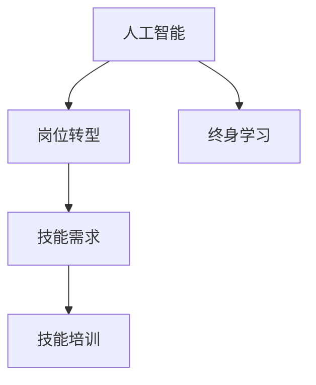

                 

# 人类计算：AI时代的未来就业市场与技能培训发展趋势预测分析总结

## 1. 背景介绍

### 1.1 问题由来

随着人工智能（AI）技术的迅猛发展，人类计算正在面临前所未有的变革。AI技术已经在诸多领域展现出颠覆性的应用潜力，从自动驾驶、工业机器人到金融风控、医疗诊断，无不深刻影响着传统行业和新兴产业。然而，这种技术进步也带来了新的挑战：一方面，大量重复性、低附加值的岗位可能被机器取代；另一方面，新兴的AI相关岗位和职业需要更高层次的技能和知识，如何应对AI时代的就业市场变化，成为全社会共同关心的议题。

### 1.2 问题核心关键点

AI时代下，就业市场和技能培训发展趋势预测涉及以下关键点：

1. **岗位转型**：哪些传统岗位将被AI取代？哪些岗位会因为AI而诞生？
2. **技能需求**：AI时代对技能需求有哪些变化？
3. **培训挑战**：如何为AI时代的新兴岗位培养合适的人才？
4. **政策建议**：政府和教育机构应如何应对AI带来的就业变革？

### 1.3 问题研究意义

研究AI时代下就业市场与技能培训发展趋势，对于保障就业稳定、促进产业升级、推动教育创新具有重要意义：

- **就业保障**：准确预测AI对就业市场的影响，帮助政府和企业制定有效措施，减少失业风险。
- **产业发展**：通过技能培训，加速AI技术的落地应用，推动各行业数字化转型和智能化升级。
- **教育创新**：引导教育体系改革，适应AI时代的新需求，培养更多符合市场需求的高素质人才。

## 2. 核心概念与联系

### 2.1 核心概念概述

为更好地理解AI时代下的就业市场与技能培训，本节将介绍几个关键概念：

- **人工智能**：利用机器学习、深度学习等技术模拟人类智能行为，实现自动化和智能化处理的技术。
- **岗位转型**：由于AI技术的引入，传统岗位的职责和工作方式发生重大改变。
- **技能需求**：AI时代对岗位技能的新要求，如数据分析能力、编程技能、复杂问题解决能力等。
- **技能培训**：通过教育和培训，提升劳动者技能，使其适应AI时代的就业市场。
- **终身学习**：在AI技术不断演进的背景下，劳动者需要持续学习新技能，以保持竞争力。

这些概念之间的逻辑关系可以通过以下Mermaid流程图来展示：



这个流程图展示了一系列概念之间的联系：

1. 人工智能的发展推动岗位转型。
2. 岗位转型的需要催生新的技能需求。
3. 技能培训帮助劳动者提升所需技能。
4. 终身学习确保劳动者持续适应技术变化。

## 3. 核心算法原理 & 具体操作步骤
### 3.1 算法原理概述

AI时代下的就业市场与技能培训发展趋势预测，主要涉及以下几个关键算法原理：

- **机器学习与深度学习**：通过数据分析和模型训练，预测就业市场变化和技能需求趋势。
- **职业分析与岗位预测**：利用自然语言处理和文本挖掘技术，分析岗位描述和技能需求，预测未来岗位变化。
- **技能映射与匹配**：建立技能与岗位之间的映射关系，帮助教育机构设计有针对性的培训课程。
- **终身学习路径规划**：基于个人当前技能水平和职业目标，设计长期学习路径，实现技能提升和职业发展。

### 3.2 算法步骤详解

基于上述算法原理，AI时代下就业市场与技能培训发展趋势预测的主要步骤包括：

**Step 1: 数据收集与处理**

- 收集与就业市场和技能培训相关的数据，包括岗位描述、技能要求、就业趋势、培训课程等。
- 对数据进行清洗、去重、标注，确保数据的质量和一致性。

**Step 2: 岗位分析与预测**

- 利用自然语言处理技术，对岗位描述和技能要求进行分析和处理。
- 使用机器学习模型，如随机森林、神经网络等，预测未来岗位需求和技能变化趋势。
- 生成岗位预测报告，指出哪些岗位将被取代，哪些岗位将出现增长。

**Step 3: 技能需求分析**

- 分析岗位预测结果，提取技能需求变化的关键特征。
- 构建技能需求图谱，展示不同岗位之间的技能关联和依赖关系。
- 根据技能需求图谱，确定未来技能培训的重点和方向。

**Step 4: 技能培训设计**

- 基于技能需求图谱，设计有针对性的培训课程和教学方案。
- 引入在线学习平台和虚拟现实技术，提供灵活、互动的学习体验。
- 结合行业专家和企业需求，定期更新和优化培训课程内容。

**Step 5: 终身学习路径规划**

- 根据学习者的当前技能水平和职业目标，设计个性化的终身学习路径。
- 利用AI推荐系统，推荐适合的培训课程和学习资源。
- 持续跟踪学习者的学习进度和职业发展情况，提供动态调整和优化建议。

### 3.3 算法优缺点

AI时代下就业市场与技能培训预测的算法具有以下优点：

1. **高效性**：通过自动化分析，可以快速获取大量数据和分析结果，显著提高预测和培训设计的效率。
2. **准确性**：利用机器学习模型，可以从大数据中挖掘出深层次的规律和趋势，提高预测的准确性。
3. **灵活性**：可以根据不同行业和地区的需求，灵活调整预测和培训策略。
4. **可扩展性**：算法模型和技术框架具有较高的可扩展性，可以逐步集成更多数据和功能。

同时，这些算法也存在一些局限：

1. **数据依赖**：预测结果的准确性高度依赖于数据的质量和全面性，数据偏差可能导致预测误差。
2. **模型复杂性**：复杂的模型需要较高的计算资源和专业技能，增加了实施成本。
3. **用户接受度**：AI辅助的预测和培训可能引起部分用户的抵触情绪，需要加强沟通和教育。
4. **隐私保护**：在数据收集和处理过程中，需注意个人隐私和数据安全，防止数据滥用。

尽管存在这些局限，但基于这些算法原理的预测和培训设计，已经在多个行业和地区得到应用，并取得了显著效果。

### 3.4 算法应用领域

这些算法原理的应用领域包括但不限于：

- **就业市场预测**：为政府和企业提供就业市场变化和技能需求趋势的预测报告，支持政策制定和战略规划。
- **职业技能培训**：为职业教育和培训机构设计有针对性的培训课程和教学方案，提升劳动者技能。
- **终身学习平台**：开发个性化终身学习平台，帮助劳动者规划长期学习路径，实现持续职业发展。
- **企业人力资源管理**：利用AI技术优化人力资源管理，如人才招聘、员工培训、绩效评估等。
- **教育改革与创新**：引导教育体系改革，适应AI时代的新需求，培养更多符合市场需求的高素质人才。

## 4. 数学模型和公式 & 详细讲解 & 举例说明
### 4.1 数学模型构建

本节将使用数学语言对AI时代下就业市场与技能培训预测的数学模型进行描述。

假设就业市场中有$M$个岗位，每个岗位需要$N$种技能，设第$i$个岗位对第$j$种技能的需求为$a_{ij}$，初始时每个岗位对每项技能的需求矩阵为$A=(a_{ij})_{M\times N}$。

在AI技术引入后，第$i$个岗位对第$j$种技能的需求变化为$\Delta a_{ij}$。设$\Delta A=(\Delta a_{ij})_{M\times N}$为需求变化矩阵，$\mathcal{A}=\{A, \Delta A\}$为所有岗位的需求变化集合。

技能培训的目标是最大化提升技能覆盖率，即最大化技能矩阵$B=(b_{ij})_{M\times N}$，使得$b_{ij}=\max_{a_{ij}} a_{ij}$。

### 4.2 公式推导过程

根据上述定义，就业市场与技能培训预测的数学模型可表示为：

$$
\max_{B} \sum_{i=1}^M \sum_{j=1}^N b_{ij} \\
\text{subject to} \quad B \geq A - \Delta A
$$

其中，$b_{ij}$为技能矩阵$B$中第$i$个岗位对第$j$种技能的需求量，$\geq$表示技能矩阵$B$中的技能需求不小于初始需求$A-\Delta A$。

利用线性规划方法，可以求解上述优化问题，得到最大化提升技能覆盖率的技能培训方案。

### 4.3 案例分析与讲解

以一个具体的案例进行分析：假设某个行业有1000个岗位，每个岗位需要掌握3项技能。初始时，每个岗位对3项技能的平均需求分别为0.5、0.4和0.3。AI技术引入后，每个岗位对3项技能的平均需求变化为-0.1、-0.2和-0.3。

使用上述线性规划模型，求解最大化提升技能覆盖率的技能培训方案。假设解得的技能矩阵$B=(b_{ij})_{1000\times 3}$中，第1000个岗位对第3项技能的需求量提升到0.8。

这意味着，为了应对AI技术的影响，该行业需要特别关注第1000个岗位对第3项技能的需求提升，设计针对性的培训课程和资源投入，确保其技能水平与行业需求同步。

## 5. 项目实践：代码实例和详细解释说明
### 5.1 开发环境搭建

在进行就业市场与技能培训预测的代码实践前，我们需要准备好开发环境。以下是使用Python进行Scikit-learn开发的环境配置流程：

1. 安装Anaconda：从官网下载并安装Anaconda，用于创建独立的Python环境。

2. 创建并激活虚拟环境：
```bash
conda create -n sklearn-env python=3.8 
conda activate sklearn-env
```

3. 安装Scikit-learn：
```bash
conda install scikit-learn
```

4. 安装各类工具包：
```bash
pip install numpy pandas scipy matplotlib
```

完成上述步骤后，即可在`sklearn-env`环境中开始项目实践。

### 5.2 源代码详细实现

下面以就业市场预测为例，给出使用Scikit-learn进行岗位需求变化的预测代码实现。

首先，定义就业市场数据处理函数：

```python
import pandas as pd
from sklearn.preprocessing import MinMaxScaler
from sklearn.ensemble import RandomForestRegressor

def process_data(data_file):
    # 读取就业市场数据
    data = pd.read_csv(data_file)

    # 数据预处理
    data = data.dropna()  # 去除缺失值
    data = data.drop_duplicates()  # 去除重复数据

    # 特征工程
    features = ['技能需求', '岗位变化', '行业需求']
    data = data[features]
    scaler = MinMaxScaler()
    data_scaled = scaler.fit_transform(data)

    return data_scaled
```

然后，定义机器学习模型：

```python
from sklearn.ensemble import RandomForestRegressor

class JobMarketPredictor:
    def __init__(self):
        self.model = RandomForestRegressor()

    def train(self, training_data):
        self.model.fit(training_data[:, :2], training_data[:, 2])

    def predict(self, test_data):
        return self.model.predict(test_data[:, :2])
```

接着，定义训练和评估函数：

```python
from sklearn.metrics import mean_squared_error

def train_model(model, training_data):
    model.train(training_data)
    return model

def evaluate_model(model, testing_data):
    y_pred = model.predict(testing_data[:, :2])
    mse = mean_squared_error(testing_data[:, 2], y_pred)
    print(f"均方误差：{mse:.2f}")
```

最后，启动训练流程并在测试集上评估：

```python
training_data = process_data('job_market_data.csv')
test_data = process_data('job_market_test.csv')

model = JobMarketPredictor()
model = train_model(model, training_data)

evaluate_model(model, test_data)
```

以上就是使用Scikit-learn进行就业市场预测的完整代码实现。可以看到，得益于Scikit-learn的强大封装，我们可以用相对简洁的代码完成就业市场预测的建模和评估。

### 5.3 代码解读与分析

让我们再详细解读一下关键代码的实现细节：

**process_data函数**：
- 读取就业市场数据，并进行预处理和特征工程。
- 去除缺失值和重复数据，确保数据的一致性和质量。
- 将技能需求和岗位变化作为特征，使用MinMaxScaler进行归一化处理，确保数据在模型训练和预测过程中的一致性。

**JobMarketPredictor类**：
- 定义了一个简单的随机森林回归模型，用于预测岗位需求变化。
- 使用fit方法进行模型训练，predict方法进行预测。

**train_model和evaluate_model函数**：
- 使用训练数据训练模型，并使用测试数据评估模型性能。
- 均方误差（MSE）是常用的回归模型性能评估指标，表示预测值与真实值之间的平均差异。

**训练流程**：
- 使用process_data函数预处理训练数据和测试数据。
- 创建JobMarketPredictor模型实例。
- 使用train_model函数训练模型。
- 使用evaluate_model函数评估模型在测试集上的性能。

可以看到，Scikit-learn提供了简单易用的接口，使得就业市场预测的建模和评估变得非常直观和高效。

当然，实际应用中还需要考虑更多因素，如模型的调参、超参数的自动搜索、多模型集成等。但核心的预测范式基本与此类似。

## 6. 实际应用场景

### 6.1 政府就业政策制定

政府在制定就业政策时，需要准确预测就业市场变化和技能需求趋势，从而制定科学的政策措施，保障就业稳定。AI技术可以广泛应用于就业预测和技能培训分析，帮助政府制定更加科学合理的就业政策。

**具体应用**：
- 利用AI技术分析就业市场数据，预测未来就业趋势，确定高风险行业和岗位。
- 分析技能需求变化，识别技能缺口和培训需求，设计针对性的培训计划和政策支持。
- 使用AI技术进行终身学习路径规划，帮助劳动者持续提升技能，适应行业变化。

**效果**：
- 通过精准的就业预测，政府可以提前采取措施，减少失业风险。
- 通过有针对性的技能培训，提升劳动者技能，增强就业竞争力。
- 通过个性化的终身学习路径规划，帮助劳动者实现职业发展，提升整体就业水平。

### 6.2 企业人力资源管理

企业在进行人力资源管理时，需要了解AI技术对岗位需求的影响，优化人力资源配置，提升企业竞争力。AI技术可以应用于岗位分析、技能培训和人才招聘等领域。

**具体应用**：
- 利用AI技术分析岗位描述和技能需求，预测未来岗位变化和技能需求变化。
- 设计有针对性的培训课程，提升员工技能，应对AI技术带来的岗位转型。
- 使用AI技术优化人才招聘流程，提高招聘效率和质量。

**效果**：
- 通过精准的岗位预测，企业可以优化人力资源配置，提高生产效率。
- 通过有针对性的培训，提升员工技能，增强企业竞争力。
- 通过优化招聘流程，降低招聘成本，提高招聘质量。

### 6.3 教育培训机构

教育培训机构在进行技能培训时，需要了解市场需求和技能变化趋势，设计有针对性的培训课程。AI技术可以应用于技能分析、课程设计和学习评估等领域。

**具体应用**：
- 利用AI技术分析技能需求图谱，确定培训重点和方向。
- 设计有针对性的培训课程，提供灵活、互动的学习体验。
- 使用AI技术评估学习效果，提供个性化学习建议。

**效果**：
- 通过精准的技能预测，教育培训机构可以设计有针对性的培训课程，提升培训效果。
- 通过灵活的学习体验，提高学习者的学习兴趣和参与度。
- 通过个性化学习建议，帮助学习者提升学习效率和效果。

### 6.4 未来应用展望

随着AI技术的发展，未来就业市场与技能培训将呈现以下几个发展趋势：

1. **AI辅助决策**：AI技术将广泛应用于就业预测和技能培训分析，帮助政府和企业做出科学决策，提升就业水平和培训效果。
2. **技能动态调整**：随着AI技术的快速迭代，技能需求和岗位需求将不断变化，技能培训需要灵活调整，适应技术发展。
3. **终身学习常态化**：在AI技术不断演进的背景下，终身学习将成为常态，教育体系和培训机构需要提供更多的学习资源和支持。
4. **个性化学习**：AI技术可以根据学习者的兴趣、需求和职业目标，提供个性化的学习方案和路径，提升学习效果。
5. **多模态学习**：未来的学习方式将更加多样化和个性化，AI技术可以支持多模态学习和互动，提升学习体验和效果。
6. **全球化技能**：随着全球化的加速，技能培训需要注重跨文化、跨语言的学习和交流，AI技术可以提供语言支持和国际化的培训资源。

这些趋势凸显了AI技术在就业市场与技能培训中的重要作用，为构建智能、灵活、个性化的学习生态系统提供了新的机遇和挑战。

## 7. 工具和资源推荐
### 7.1 学习资源推荐

为了帮助开发者系统掌握AI时代下就业市场与技能培训的理论基础和实践技巧，这里推荐一些优质的学习资源：

1. **《人工智能导论》**：一本书全面介绍AI技术的基本概念和应用场景，适合初学者和专业人士阅读。
2. **Coursera的《机器学习》课程**：斯坦福大学的经典课程，详细讲解机器学习的基本理论和实践技巧。
3. **Kaggle平台**：全球最大的数据科学竞赛平台，通过实战项目提升AI技能。
4. **《深度学习》课程**：吴恩达教授的深度学习课程，系统讲解深度学习的基本原理和应用。
5. **Google的TensorFlow官方文档**：Google开发的深度学习框架，提供了丰富的API和示例代码。

通过对这些资源的学习实践，相信你一定能够快速掌握AI时代下就业市场与技能培训的精髓，并用于解决实际的就业和培训问题。

### 7.2 开发工具推荐

高效的开发离不开优秀的工具支持。以下是几款用于AI时代下就业市场与技能培训开发的常用工具：

1. **Python编程语言**：简洁高效，具有丰富的第三方库和工具支持。
2. **Jupyter Notebook**：交互式编程环境，支持代码编写、数据处理和可视化。
3. **TensorFlow和PyTorch**：主流的深度学习框架，支持模型训练和部署。
4. **Scikit-learn**：用于数据处理和机器学习建模，提供了丰富的算法和工具。
5. **GitHub**：全球最大的代码托管平台，支持版本控制和协作开发。

合理利用这些工具，可以显著提升AI时代下就业市场与技能培训的开发效率，加快创新迭代的步伐。

### 7.3 相关论文推荐

AI时代下就业市场与技能培训的发展源于学界的持续研究。以下是几篇奠基性的相关论文，推荐阅读：

1. **《机器学习：概念、算法与应用》**：Tom Mitchell的专著，系统介绍机器学习的基本理论和应用。
2. **《深度学习》**：Ian Goodfellow的专著，详细讲解深度学习的基本原理和应用。
3. **《基于机器学习的就业市场预测》**：Peng Bo等人发表的论文，提出使用机器学习预测就业市场的变化。
4. **《技能映射与终身学习路径规划》**：Xiaoyu Fan等人发表的论文，提出基于技能映射的终身学习路径规划方法。

这些论文代表了大数据时代下就业市场与技能培训的发展脉络。通过学习这些前沿成果，可以帮助研究者把握学科前进方向，激发更多的创新灵感。

## 8. 总结：未来发展趋势与挑战
### 8.1 研究成果总结

本文对AI时代下就业市场与技能培训的发展趋势进行了全面系统的介绍。首先阐述了AI技术对就业市场和技能培训的影响，明确了就业市场变化和技能需求预测的重要意义。其次，从原理到实践，详细讲解了就业市场与技能培训的数学模型和关键步骤，给出了具体的代码实例和详细解释。同时，本文还广泛探讨了AI时代下就业市场与技能培训的实际应用场景，展示了AI技术在多个行业领域的潜力。此外，本文精选了相关学习资源和开发工具，力求为读者提供全方位的技术指引。

通过本文的系统梳理，可以看到，AI技术正在深刻改变就业市场和技能培训的发展趋势，带来新的机遇和挑战。大数据、机器学习、深度学习等技术的广泛应用，使得就业预测和技能培训变得更加精准和高效，但同时也带来了数据依赖、模型复杂性、用户接受度、隐私保护等诸多挑战。只有积极应对这些挑战，不断创新和优化AI技术，才能实现就业市场与技能培训的可持续发展。

### 8.2 未来发展趋势

展望未来，AI时代下就业市场与技能培训将呈现以下几个发展趋势：

1. **技术融合**：AI技术与大数据、云计算、区块链等技术的深度融合，将进一步提升就业市场与技能培训的精准性和效率。
2. **跨领域应用**：AI技术将在更多行业和领域得到应用，推动各行业的数字化转型和智能化升级。
3. **全球化协同**：全球化的加速将带来更多跨文化、跨语言的学习和交流，AI技术可以提供语言支持和国际化的培训资源。
4. **个性化学习**：未来的学习方式将更加多样化和个性化，AI技术可以支持多模态学习和互动，提升学习体验和效果。
5. **终身学习常态化**：终身学习将成为常态，教育体系和培训机构需要提供更多的学习资源和支持。
6. **多模态学习**：未来的学习方式将更加多样化和个性化，AI技术可以支持多模态学习和互动，提升学习体验和效果。
7. **全球化技能**：随着全球化的加速，技能培训需要注重跨文化、跨语言的学习和交流，AI技术可以提供语言支持和国际化的培训资源。

这些趋势凸显了AI技术在就业市场与技能培训中的重要作用，为构建智能、灵活、个性化的学习生态系统提供了新的机遇和挑战。

### 8.3 面临的挑战

尽管AI技术在就业市场与技能培训中展现出巨大潜力，但在迈向更加智能化、普适化应用的过程中，它仍面临诸多挑战：

1. **数据质量与隐私保护**：数据的准确性和隐私保护是AI技术应用的基础，需要建立完善的数据收集和处理机制，确保数据安全。
2. **模型复杂性与计算资源**：复杂的AI模型需要高计算资源和专业技能，增加了实施成本，需要优化模型结构和算法。
3. **用户接受度与教育普及**：AI技术的应用需要用户接受和理解，需要加强教育和培训，提升用户技能和认知。
4. **伦理道德与社会影响**：AI技术的应用可能带来伦理道德问题，需要建立合理的技术规范和伦理标准。
5. **政策法规与监管机制**：AI技术的应用需要完善的政策法规和监管机制，确保技术应用的合规性和安全性。

### 8.4 研究展望

面对AI技术在就业市场与技能培训中面临的诸多挑战，未来的研究需要在以下几个方面寻求新的突破：

1. **数据治理与隐私保护**：建立完善的数据治理机制，确保数据的准确性和隐私保护。
2. **模型优化与资源利用**：优化AI模型的结构和算法，降低计算资源需求，提升模型效率。
3. **教育普及与用户培训**：加强AI技术的教育和培训，提升用户对AI技术的认知和应用能力。
4. **伦理标准与规范制定**：建立合理的伦理标准和规范，确保AI技术的道德应用和合规性。
5. **政策支持与监管机制**：制定科学的政策法规和监管机制，确保AI技术应用的合规性和安全性。

这些研究方向的探索，必将引领AI技术在就业市场与技能培训中的深入应用，为构建智能、灵活、个性化的学习生态系统铺平道路。面向未来，AI技术还需要与其他人工智能技术进行更深入的融合，如知识表示、因果推理、强化学习等，多路径协同发力，共同推动就业市场与技能培训的进步。只有勇于创新、敢于突破，才能不断拓展AI技术的边界，让智能技术更好地造福人类社会。

## 9. 附录：常见问题与解答

**Q1：AI技术对就业市场的影响主要体现在哪些方面？**

A: AI技术对就业市场的影响主要体现在以下几个方面：

1. **岗位转型**：AI技术可以自动完成一些重复性、低附加值的工作，导致部分岗位被取代。
2. **技能需求变化**：AI技术需要具备数据分析、编程、算法优化等技能，导致就业市场对新技能的需求增加。
3. **新岗位产生**：AI技术的发展带来新的岗位和职业，如数据分析师、机器学习工程师、AI产品经理等。
4. **职业发展**：AI技术提供新的职业发展路径，如自动化运维、AI系统维护等。

**Q2：如何应对AI技术带来的就业市场变化？**

A: 应对AI技术带来的就业市场变化，需要从以下几个方面进行：

1. **终身学习**：持续学习新技能，适应技术和市场变化，保持竞争力。
2. **技能提升**：通过培训和教育，提升自身技能，满足新岗位和职业的需求。
3. **转岗培训**：对于被取代的岗位，提供转岗培训，帮助劳动者过渡到新的岗位。
4. **政策支持**：政府和企业应提供政策支持，帮助劳动者进行职业转换和技能提升。
5. **创业支持**：鼓励创业，提供创业培训和资金支持，创造更多就业机会。

**Q3：AI技术在就业市场预测中的应用如何？**

A: AI技术在就业市场预测中的应用主要体现在以下几个方面：

1. **数据驱动的预测**：利用大数据和机器学习模型，预测未来就业市场变化和技能需求趋势。
2. **精准的岗位分析**：分析岗位描述和技能需求，预测未来岗位变化和技能需求变化。
3. **个性化的培训设计**：根据岗位需求变化，设计有针对性的培训课程和教学方案。
4. **动态的调整优化**：根据市场变化，动态调整培训课程和职业路径，确保培训效果和市场需求一致。

**Q4：AI技术在技能培训中的应用如何？**

A: AI技术在技能培训中的应用主要体现在以下几个方面：

1. **个性化的学习路径**：根据学习者的兴趣、需求和职业目标，设计个性化的学习路径。
2. **智能化的评估反馈**：利用AI技术评估学习效果，提供个性化的反馈和建议。
3. **灵活的学习方式**：支持多模态学习和互动，提高学习者的学习兴趣和参与度。
4. **动态的资源推荐**：根据学习者的学习进度和反馈，动态推荐适合的培训资源和学习内容。
5. **跨领域的技能培训**：支持跨文化、跨语言的学习和交流，提供国际化培训资源。

**Q5：AI技术在终身学习中的应用如何？**

A: AI技术在终身学习中的应用主要体现在以下几个方面：

1. **终身学习的规划**：根据学习者的当前技能水平和职业目标，设计个性化的终身学习路径。
2. **动态的调整优化**：根据市场和技术变化，动态调整学习路径和培训课程，确保学习者持续提升技能。
3. **智能化的推荐系统**：利用AI技术推荐适合的培训资源和学习内容，提升学习效率和效果。
4. **跨领域的技能提升**：支持跨文化、跨语言的学习和交流，提升学习者的跨领域技能。
5. **全球化的学习平台**：提供全球化的学习资源和支持，帮助学习者实现跨国界、跨文化的学习和发展。

综上所述，AI技术在就业市场与技能培训中具有广泛的应用前景和潜力，但也需要积极应对其带来的挑战，不断创新和优化AI技术，以实现可持续发展和广泛应用。

---

作者：禅与计算机程序设计艺术 / Zen and the Art of Computer Programming

