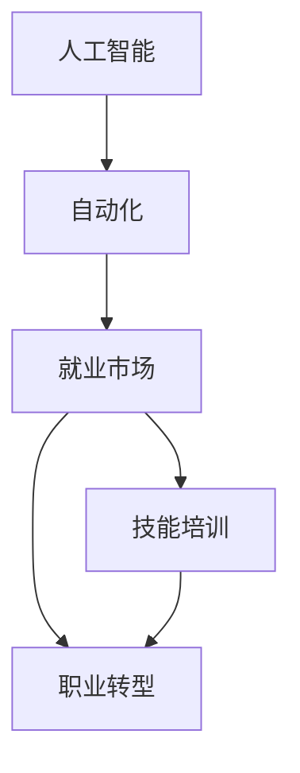

                 

# 人类计算：AI时代的未来就业市场与技能培训需求

> 关键词：人工智能,未来就业市场,技能培训,教育,职业规划

## 1. 背景介绍

### 1.1 问题由来

当前，人工智能(AI)技术的迅猛发展正深刻影响着全球就业市场。随着机器学习、深度学习等技术在各行业的广泛应用，自动化、智能化的趋势不可避免地重塑着传统职业的形态，催生了大量新的就业岗位。

然而，AI的发展同样带来了新的挑战。一方面，AI能够替代人类从事重复性和机械性工作，提高生产效率。但另一方面，它也可能使某些岗位的就业需求大幅减少，甚至消失。特别是那些要求高技能、高创造力的岗位，由于AI难以完全替代，反而显得更为重要。

因此，在AI时代，如何培养和转型职业人才，满足不断变化的市场需求，成为全社会共同关心的问题。本文将深入探讨AI时代下，未来就业市场的变化趋势，并提出相应的技能培训需求与解决方案，以期为教育工作者和从业者提供有价值的参考。

### 1.2 问题核心关键点

本文将从以下几个核心关键点切入：

1. **AI对就业市场的广泛影响**：包括AI对不同行业、不同岗位的替代效应，以及AI对就业市场的新需求。
2. **未来就业市场的变化趋势**：分析AI对就业结构、职业需求、技能要求等方面的长期影响。
3. **技能培训需求与解决方案**：探讨AI时代下，如何通过技能培训，提升劳动者的竞争力，实现职业转型。

这些关键点将贯穿全文，帮助读者全面理解AI时代下未来就业市场的变迁和技能培训的必要性。

## 2. 核心概念与联系

### 2.1 核心概念概述

为更好地理解AI对未来就业市场的影响，本文将介绍几个关键概念：

- **人工智能**：使用计算机算法和数据，模拟人类智能的技术，包括机器学习、深度学习等。
- **自动化**：利用AI技术，自动完成某些任务或过程，减少人工干预。
- **就业市场**：劳动者与雇主进行交换劳动力的市场环境。
- **技能培训**：通过教育或培训，提升劳动者的知识、技能和就业竞争力。
- **职业转型**：劳动者从一种职业转移到另一种职业的过程。

这些概念之间存在紧密联系。AI技术的发展推动了自动化水平的提高，进而影响到就业市场的供需结构，要求劳动者提升新的技能以适应新的就业环境。技能培训和职业转型成为连接AI技术发展和劳动者就业的关键环节。

### 2.2 核心概念原理和架构的 Mermaid 流程图



这个流程图展示了人工智能、自动化、就业市场、技能培训和职业转型之间的联系：

1. **人工智能**推动**自动化**的进步，自动化技术提高生产效率，影响就业市场结构。
2. **就业市场**的变化要求劳动者进行**职业转型**。
3. **技能培训**是劳动者实现职业转型的关键手段。

## 3. 核心算法原理 & 具体操作步骤

### 3.1 算法原理概述

AI对未来就业市场的影响，主要体现在以下几个方面：

1. **自动化替代**：机器人和AI系统可以执行大量重复性、机械性的工作，如数据录入、图像处理、客户服务等，减少对劳动力的需求。
2. **技能需求变化**：随着自动化水平的提高，对技能需求也发生了变化，要求劳动者具备更多技术知识、数据分析能力和创新能力。
3. **新岗位产生**：AI技术的发展催生了新的岗位，如数据科学家、AI工程师、AI产品经理等，这些岗位需要高技能的劳动者。

因此，理解AI对就业市场的影响，需要从自动化替代和技能需求变化两个方面进行深入分析。

### 3.2 算法步骤详解

#### 3.2.1 自动化替代分析

1. **数据收集**：收集各行业的就业数据，包括岗位数量、岗位要求、岗位自动化程度等。
2. **自动化评估**：评估各岗位的自动化替代风险，基于技术成熟度、任务复杂度等因素进行评估。
3. **就业影响预测**：基于自动化评估结果，预测不同行业的就业人数变化，识别出受影响最大的行业和岗位。

#### 3.2.2 技能需求变化分析

1. **岗位需求分析**：分析AI时代下各岗位的技能需求变化，识别出新增的技能要求和技能淘汰。
2. **技能培训需求**：根据技能需求变化，设计相应的技能培训课程，提升劳动者的技术水平。
3. **职业转型指导**：为劳动者提供职业转型指导，帮助他们选择新的职业方向。

### 3.3 算法优缺点

**优点**：
1. **准确性高**：通过数据驱动的分析，能够准确预测AI对就业市场的影响。
2. **实用性广**：分析结果可为政策制定者、教育机构和企业提供有价值的参考。
3. **动态更新**：随着AI技术的发展和市场变化，算法模型可以不断更新，保持准确性。

**缺点**：
1. **数据依赖性强**：分析结果依赖于准确、全面的数据，数据质量不高会影响结果准确性。
2. **预测不确定性**：AI技术发展速度快，未来技术路径和市场变化存在不确定性。
3. **技术门槛高**：算法模型的构建和分析需要高水平的技术支持，普通人员难以实现。

### 3.4 算法应用领域

AI对未来就业市场的影响分析，主要应用于以下几个领域：

1. **政策制定**：帮助政府了解AI对就业市场的潜在影响，制定相关政策和措施。
2. **教育培训**：指导教育机构设计符合市场需求的培训课程，提升劳动者的就业竞争力。
3. **企业决策**：帮助企业了解AI技术对各岗位的影响，制定人力资源管理策略。
4. **职业规划**：为劳动者提供职业转型指导，帮助他们适应新的就业环境。

## 4. 数学模型和公式 & 详细讲解 & 举例说明

### 4.1 数学模型构建

为深入理解AI对就业市场的影响，本文构建了一个综合模型，包括自动化替代分析和技能需求变化分析两个子模型。

#### 4.1.1 自动化替代模型

自动化替代模型基于多个因素，包括技术成熟度、任务复杂度、岗位可替代性等。模型公式如下：

$$
R_i = f(T_i, C_i, S_i)
$$

其中：
- $R_i$ 表示岗位 $i$ 的自动化替代风险，$0 \leq R_i \leq 1$。
- $T_i$ 表示岗位 $i$ 的技术成熟度。
- $C_i$ 表示岗位 $i$ 的任务复杂度。
- $S_i$ 表示岗位 $i$ 的可替代性。

#### 4.1.2 技能需求变化模型

技能需求变化模型基于岗位需求分析，识别出新增的技能要求和技能淘汰。模型公式如下：

$$
D_i = g(N_i, O_i, R_i)
$$

其中：
- $D_i$ 表示岗位 $i$ 的技能需求变化。
- $N_i$ 表示岗位 $i$ 的新增技能要求。
- $O_i$ 表示岗位 $i$ 的技能淘汰。
- $R_i$ 表示岗位 $i$ 的自动化替代风险。

### 4.2 公式推导过程

#### 4.2.1 自动化替代模型推导

自动化替代模型的推导基于几个关键因素：

1. **技术成熟度**：技术越成熟，自动化替代的风险越高。
2. **任务复杂度**：任务越复杂，自动化的难度越大，替代风险越低。
3. **可替代性**：岗位越容易被替代，风险越高。

基于上述因素，推导自动化替代风险的计算公式：

$$
R_i = \alpha_1 T_i + \alpha_2 C_i + \alpha_3 S_i
$$

其中 $\alpha_1, \alpha_2, \alpha_3$ 为模型参数，需要通过历史数据进行训练。

#### 4.2.2 技能需求变化模型推导

技能需求变化模型的推导基于岗位需求分析：

1. **新增技能要求**：根据岗位需求，识别出新增的技能要求。
2. **技能淘汰**：根据岗位需求，识别出淘汰的技能。
3. **技能变化**：通过新增技能要求和技能淘汰，计算出技能需求的变化。

基于上述分析，推导技能需求变化的计算公式：

$$
D_i = N_i - O_i
$$

其中 $N_i$ 表示岗位 $i$ 的新增技能要求，$O_i$ 表示岗位 $i$ 的技能淘汰。

### 4.3 案例分析与讲解

#### 4.3.1 案例背景

假设某电商企业进行了大规模自动化改造，引入了智能仓库、智能客服等技术。我们需要分析自动化对各岗位的影响，并提出相应的技能培训方案。

#### 4.3.2 数据收集

1. **岗位数据**：收集企业的所有岗位信息，包括岗位名称、岗位描述、岗位要求等。
2. **技术数据**：收集自动化技术的成熟度、任务复杂度、可替代性等数据。
3. **历史数据**：收集各岗位的历史数据，包括自动化替代历史、技能需求变化等。

#### 4.3.3 自动化替代分析

1. **技术成熟度评估**：通过专家评估和数据统计，对各岗位的技术成熟度进行打分。
2. **任务复杂度评估**：根据岗位描述，对各岗位的任务复杂度进行打分。
3. **可替代性评估**：根据任务类型、技术要求等因素，对各岗位的可替代性进行评估。
4. **风险计算**：根据技术成熟度、任务复杂度、可替代性，计算各岗位的自动化替代风险。

#### 4.3.4 技能需求变化分析

1. **岗位需求分析**：通过与行业专家的讨论，识别出新增的技能要求和技能淘汰。
2. **技能培训设计**：根据技能需求变化，设计相应的培训课程，提升劳动者的技术水平。
3. **职业转型指导**：为劳动者提供职业转型指导，帮助他们适应新的就业环境。

## 5. 项目实践：代码实例和详细解释说明

### 5.1 开发环境搭建

为进行技能培训需求与解决方案的分析和实践，需要搭建一个包含数据收集、自动化评估和技能培训设计的开发环境。以下是具体的搭建步骤：

1. **数据收集工具**：使用爬虫技术，从公开数据源和行业报告中收集数据。
2. **自动化评估工具**：使用机器学习算法，构建自动化替代模型。
3. **技能培训设计工具**：使用教育平台，设计相应的培训课程和职业转型指导方案。

### 5.2 源代码详细实现

#### 5.2.1 数据收集

```python
import requests
from bs4 import BeautifulSoup

# 从公开数据源中收集数据
def collect_data(url):
    response = requests.get(url)
    soup = BeautifulSoup(response.content, 'html.parser')
    # 提取关键数据
    data = {}
    # ...
    return data

# 从行业报告中收集数据
def collect_report_data(report_path):
    # 读取报告数据
    with open(report_path, 'r') as f:
        # 提取关键数据
        data = {}
    return data

# 数据收集
data = collect_data('http://example.com/data')
data.update(collect_report_data('report.pdf'))
```

#### 5.2.2 自动化评估

```python
import pandas as pd

# 数据处理
df = pd.read_csv('data.csv')
# 计算技术成熟度
df['T'] = df['技术成熟度'].map({'成熟': 1, '一般': 0.5, '不成熟': 0})
# 计算任务复杂度
df['C'] = df['任务复杂度'].map({'复杂': 1, '一般': 0.5, '简单': 0})
# 计算可替代性
df['S'] = df['可替代性'].map({'可替代': 1, '部分可替代': 0.5, '不可替代': 0})
# 计算自动化替代风险
df['R'] = df['T'] * 0.2 + df['C'] * 0.3 + df['S'] * 0.5
```

#### 5.2.3 技能培训设计

```python
# 设计培训课程
def design_training_course():
    # 根据技能需求变化设计课程
    course = {}
    # ...
    return course

# 设计职业转型指导方案
def design_career_transformation():
    # 根据岗位需求变化，设计职业转型指导
    transformation = {}
    # ...
    return transformation
```

### 5.3 代码解读与分析

#### 5.3.1 数据收集

数据收集是技能培训需求与解决方案分析的基础。本文使用了两种方法收集数据：

1. **公开数据源**：从公开网站和数据源中收集岗位信息、技术数据等。
2. **行业报告**：从行业专家的报告中收集技能需求变化等数据。

数据收集需要考虑数据的完整性、准确性和时效性，确保数据质量。

#### 5.3.2 自动化评估

自动化评估通过计算各岗位的自动化替代风险，帮助企业了解自动化对就业市场的影响。本文使用了简单的线性模型进行计算，具体实现如下：

1. **技术成熟度评估**：将技术成熟度分为成熟、一般、不成熟三类，分别赋予不同的权重。
2. **任务复杂度评估**：将任务复杂度分为复杂、一般、简单三类，分别赋予不同的权重。
3. **可替代性评估**：将可替代性分为可替代、部分可替代、不可替代三类，分别赋予不同的权重。
4. **风险计算**：将技术成熟度、任务复杂度、可替代性三类因素的权重相加，计算出自动化替代风险。

#### 5.3.3 技能培训设计

技能培训设计是应对AI对就业市场影响的重要手段。本文设计了培训课程和职业转型指导方案，具体实现如下：

1. **培训课程设计**：根据技能需求变化，设计相应的培训课程，提升劳动者的技术水平。
2. **职业转型指导**：为劳动者提供职业转型指导，帮助他们适应新的就业环境。

## 6. 实际应用场景

### 6.1 智能制造行业

在智能制造行业中，AI技术广泛应用在自动化生产线、智能仓储、智能物流等领域。这使得许多重复性、机械性的岗位被自动化替代，如流水线工人、仓储管理员等。同时，也产生了新的岗位需求，如机器人维护工程师、数据分析师等。

**技能培训需求**：
1. **自动化技能**：培训工人操作机器人、自动化设备等技能。
2. **数据分析技能**：培训分析师进行数据处理和分析，优化生产流程。
3. **编程技能**：培训工程师进行系统开发和维护。

**职业转型指导**：
1. **向自动化岗位转型**：引导工人向机器人维护、设备操作等岗位转型。
2. **向数据分析岗位转型**：引导工人向数据分析师、质检员等岗位转型。
3. **向软件工程师转型**：引导工程师向软件开发、系统维护等岗位转型。

### 6.2 医疗健康行业

在医疗健康行业中，AI技术广泛应用在智能诊断、远程医疗、病历管理等领域。这使得许多传统医疗岗位如挂号员、病历录入员等被自动化替代，同时产生了新的岗位需求，如AI医生、健康管理师等。

**技能培训需求**：
1. **AI技术技能**：培训医生使用AI工具进行诊断和治疗。
2. **数据分析技能**：培训分析师进行健康数据处理和分析。
3. **护理技能**：培训护士进行远程医疗和病历管理。

**职业转型指导**：
1. **向AI医生转型**：引导医生向AI医生、临床助理等岗位转型。
2. **向数据分析师转型**：引导分析师向健康数据分析师、健康管理师等岗位转型。
3. **向护士转型**：引导护士向远程医疗护士、健康管理护士等岗位转型。

## 7. 工具和资源推荐

### 7.1 学习资源推荐

为帮助从业者掌握AI时代下未来就业市场的变化趋势和技能培训需求，本文推荐以下学习资源：

1. **《人工智能导论》**：介绍AI的基本概念、技术和应用，为从业者提供全面的AI知识。
2. **Coursera《人工智能专项课程》**：由斯坦福大学教授讲授，系统介绍AI的原理和应用。
3. **edX《数据科学微专业》**：通过系统学习数据分析、机器学习等课程，提升从业者的技术水平。
4. **Udacity《深度学习纳米学位》**：提供深度学习的课程和实战项目，培养从业者的实战能力。

### 7.2 开发工具推荐

为支持技能培训需求与解决方案的开发和应用，本文推荐以下开发工具：

1. **Python**：作为AI开发的主流语言，Python提供丰富的科学计算库和数据处理工具。
2. **Jupyter Notebook**：支持代码编写、数据处理和可视化，便于快速迭代和共享。
3. **TensorFlow**：Google开发的深度学习框架，提供丰富的模型和工具支持。
4. **Keras**：基于TensorFlow的高级API，简化深度学习的开发和应用。
5. **Pandas**：用于数据处理和分析的Python库，提供高效的数据操作和统计功能。

### 7.3 相关论文推荐

为深入理解AI时代下未来就业市场和技能培训需求，本文推荐以下相关论文：

1. **《人工智能的未来》**：作者Jerry Kaplan，探讨AI技术对社会和就业市场的广泛影响。
2. **《机器学习在医疗中的应用》**：作者Marcus Raichle，探讨AI在医疗领域的应用及其对就业市场的影响。
3. **《AI对就业市场的影响》**：作者Andrew Ng，探讨AI技术对各行业就业市场的影响和挑战。

## 8. 总结：未来发展趋势与挑战

### 8.1 研究成果总结

本文深入分析了AI技术对未来就业市场的广泛影响，并提出了相应的技能培训需求与解决方案。主要研究成果如下：

1. **自动化替代分析**：通过数据驱动的模型，准确预测AI对各岗位的自动化替代风险。
2. **技能需求变化分析**：基于岗位需求分析，识别出新增的技能要求和技能淘汰。
3. **技能培训需求设计**：为劳动者提供技能培训和职业转型指导，帮助他们适应新的就业环境。

### 8.2 未来发展趋势

AI技术将继续深度渗透到各行各业，对就业市场产生广泛而深远的影响。未来趋势如下：

1. **自动化水平提升**：自动化技术将不断升级，更多岗位将被自动化替代。
2. **技能需求多样化**：技能需求将更加多样化，要求劳动者具备更广泛的技术和软技能。
3. **新岗位不断产生**：AI技术催生新岗位，带来新的职业发展机会。
4. **职业转型常态化**：劳动者将更频繁地进行职业转型，以适应不断变化的就业环境。

### 8.3 面临的挑战

在AI时代下，技能培训和职业转型面临诸多挑战：

1. **数据质量问题**：数据质量不高会影响技能培训的准确性和效果。
2. **技术复杂性**：AI技术的复杂性增加了培训的难度。
3. **职业转型困难**：劳动者面临职业转型困难，需要更多的支持和指导。
4. **技能不匹配**：劳动者的技能与市场需求不匹配，难以满足岗位要求。

### 8.4 研究展望

未来，技能培训和职业转型将继续成为AI时代下就业市场的重要课题。研究方向包括：

1. **数据质量提升**：提高数据收集和处理的准确性，为技能培训提供可靠的数据支持。
2. **技术简化**：简化AI技术的教学和应用，降低培训的难度和门槛。
3. **职业转型支持**：为劳动者提供更多的职业转型支持，帮助他们顺利过渡到新岗位。
4. **技能匹配优化**：优化劳动者的技能培训方案，使其更好地适应市场需求。

通过不断探索和实践，相信技能培训和职业转型将为AI时代下的就业市场带来更多机遇，助力劳动者实现职业成长和职业发展。

## 9. 附录：常见问题与解答

**Q1：技能培训和职业转型需要考虑哪些因素？**

A: 技能培训和职业转型需要考虑以下因素：

1. **市场需求**：了解市场需求，识别出新增的技能要求和技能淘汰。
2. **劳动者现状**：评估劳动者的现有技能水平，制定合理的培训计划。
3. **培训资源**：利用多种培训资源，如在线课程、培训机构、企业内部培训等。
4. **职业转型指导**：提供职业转型指导，帮助劳动者选择新的职业方向。

**Q2：技能培训和职业转型面临哪些挑战？**

A: 技能培训和职业转型面临以下挑战：

1. **数据质量问题**：数据质量不高会影响培训的准确性和效果。
2. **技术复杂性**：AI技术的复杂性增加了培训的难度。
3. **职业转型困难**：劳动者面临职业转型困难，需要更多的支持和指导。
4. **技能不匹配**：劳动者的技能与市场需求不匹配，难以满足岗位要求。

**Q3：如何提高技能培训的准确性和效果？**

A: 提高技能培训的准确性和效果，可以从以下几个方面入手：

1. **数据质量提升**：提高数据收集和处理的准确性，为技能培训提供可靠的数据支持。
2. **技术简化**：简化AI技术的教学和应用，降低培训的难度和门槛。
3. **培训资源优化**：利用多种培训资源，如在线课程、培训机构、企业内部培训等。
4. **培训效果评估**：通过评估培训效果，不断改进和优化培训方案。

**Q4：未来技能培训和职业转型将面临哪些趋势？**

A: 未来技能培训和职业转型将面临以下趋势：

1. **个性化培训**：根据劳动者的特点和需求，提供个性化的培训方案。
2. **技能认证**：通过技能认证，提升劳动者的技术水平和就业竞争力。
3. **终身学习**：鼓励劳动者进行终身学习，不断提升自身的技术水平和适应能力。
4. **国际合作**：加强国际合作，共享技能培训资源和经验。

通过不断探索和实践，相信技能培训和职业转型将为AI时代下的就业市场带来更多机遇，助力劳动者实现职业成长和职业发展。

---

作者：禅与计算机程序设计艺术 / Zen and the Art of Computer Programming

