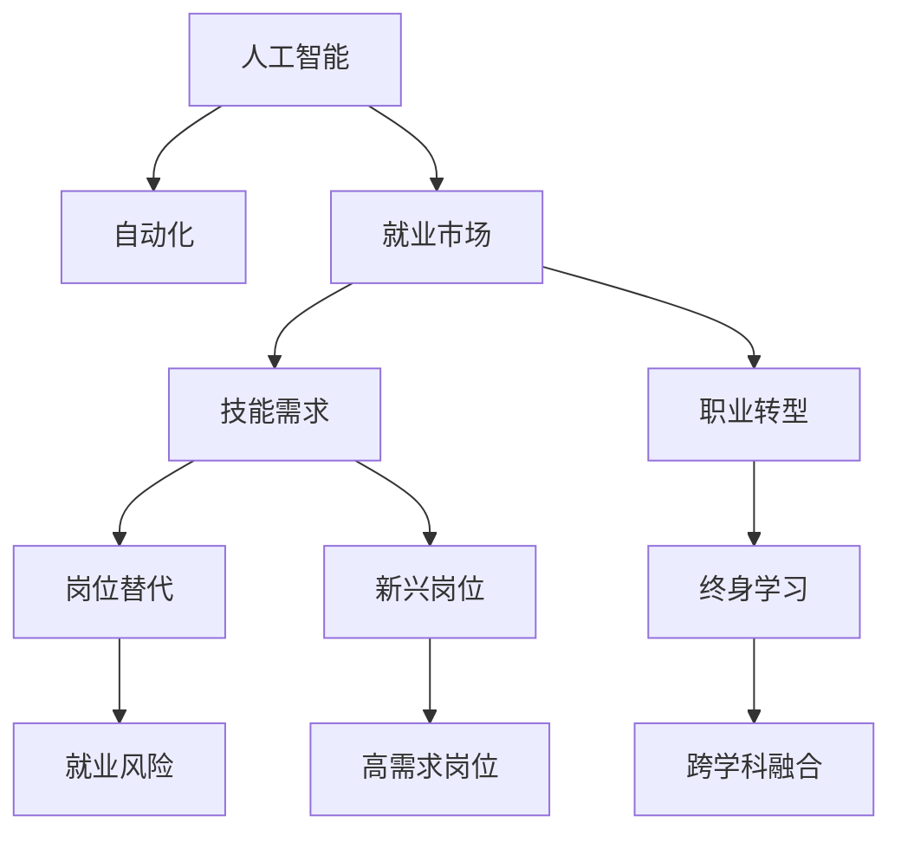

                 

# 人类计算：AI时代的未来就业机会和技能需求

> 关键词：人工智能,自动化,就业市场,技能需求,职业转型

## 1. 背景介绍

### 1.1 问题由来
随着人工智能(AI)技术的迅猛发展，自动化和智能化的浪潮正在全球范围内席卷各行各业。AI在生产、服务、教育、医疗等多个领域中的应用，正在重塑着人类的工作方式和就业结构。这场变革既是机遇，也是挑战。一方面，AI技术能够极大地提升生产效率和品质，创造新的经济价值；另一方面，也带来了传统行业从业人员的就业压力和技能需求的变化。如何应对AI时代带来的变化，实现技术与人的协同进步，成为当前社会和产业界共同面临的重要课题。

### 1.2 问题核心关键点
AI时代的就业和技能需求变化主要体现在以下几个关键点：

1. **自动化取代传统岗位**：机器人和AI算法在自动化生产线、客服机器人、数据分析等领域的大规模应用，正在取代大量重复性、低技能岗位。
2. **新兴岗位的涌现**：AI技术催生了诸如数据科学家、机器学习工程师、AI伦理顾问等新兴职业，对高技能人才的需求日益增加。
3. **技能结构的转变**：从简单的手工操作和机械记忆转向创新设计、复杂分析和决策支持。
4. **终身学习的重要性**：持续学习和自我更新能力成为个人职业发展的必备条件。
5. **跨学科融合的需求**：AI技术需要结合心理学、社会学、伦理学等多学科知识，形成更为全面的解决方案。

本文将重点探讨这些关键点，并分析AI时代对就业市场和技能需求的影响。

## 2. 核心概念与联系

### 2.1 核心概念概述

为更好地理解AI时代就业市场的变化及其对技能需求的影响，本节将介绍几个密切相关的核心概念：

1. **人工智能(AI)**：指通过算法、模型和数据实现的计算机系统，能够执行通常需要人类智能的任务，如图像识别、自然语言处理、决策优化等。
2. **自动化(Automation)**：指使用机器和算法自动执行任务，从而提高效率和准确性。自动化的发展推动了技术进步和生产率的提升。
3. **就业市场**：指劳动力供需关系，受多种因素影响，包括政策、经济、技术等。AI时代，就业市场正在经历结构性的变化。
4. **技能需求**：指岗位对员工所需的技能和知识要求，随着AI技术的普及，这些需求也在发生改变。
5. **职业转型**：指从一种职业转换到另一种职业的过程，在AI时代，职业转型成为应对技术变革的重要策略。

这些核心概念之间的逻辑关系可以通过以下Mermaid流程图来展示：



这个流程图展示了这个话题的多个核心概念及其之间的关系：

1. 人工智能的发展推动了自动化技术的应用，从而影响就业市场。
2. 就业市场的变化带动了技能需求的变化。
3. 新兴岗位的出现和传统岗位的替代，促使员工需要进行职业转型。
4. 终身学习和跨学科融合成为职业转型的关键因素。

这些概念共同构成了AI时代就业市场和技能需求变化的框架，帮助我们理解和应对未来的挑战。

## 3. 核心算法原理 & 具体操作步骤
### 3.1 算法原理概述

AI时代就业市场和技能需求的变化，与AI技术和算法的原理密切相关。核心算法原理主要包括：

1. **自动化算法**：如机器学习、深度学习、自然语言处理等，这些算法能够模拟人类智能，完成各种复杂的任务。
2. **数据驱动决策**：AI系统通过分析大数据，预测未来趋势和优化决策，从而影响就业市场。
3. **模型优化**：通过不断的训练和优化，AI模型能够不断提高性能，从而推动技术进步和市场需求的变化。

### 3.2 算法步骤详解

AI时代就业市场和技能需求的变化，可以大致分为以下几个关键步骤：

1. **数据收集与分析**：收集大量关于就业市场和技能需求的数据，包括岗位需求、员工技能、培训资源等，进行数据分析和趋势预测。
2. **模型训练与优化**：基于数据分析结果，构建和训练AI模型，不断优化模型参数，提升预测准确性。
3. **政策制定与实施**：根据模型预测结果，制定相关政策，如职业培训计划、教育改革等，以应对就业市场变化。
4. **市场反馈与调整**：通过市场反馈，对模型和政策进行调整和优化，确保其适应性。

### 3.3 算法优缺点

AI时代就业市场和技能需求的变化，具有以下优点和缺点：

**优点**：

1. **效率提升**：AI算法可以处理大规模数据，快速识别市场趋势和技能需求变化，从而提升决策效率。
2. **精度提高**：通过不断的模型优化，AI预测的准确性不断提高，能够提供更可靠的决策依据。
3. **动态适应**：AI模型能够根据市场变化动态调整，保持其预测的及时性和准确性。

**缺点**：

1. **依赖数据质量**：AI预测的准确性依赖于数据的质量和完整性，数据偏差可能导致预测错误。
2. **模型复杂性**：复杂的AI模型可能难以解释和调试，增加技术应用难度。
3. **伦理风险**：AI在决策过程中可能引入偏见，影响公平性和透明度。

### 3.4 算法应用领域

AI时代就业市场和技能需求的变化，广泛应用于以下几个领域：

1. **教育培训**：通过AI分析市场需求，设计有针对性的职业培训课程，提升员工技能。
2. **人力资源管理**：使用AI优化招聘流程，提升员工匹配度和留存率，减少人员流失。
3. **职业规划**：基于AI分析，为员工提供个性化的职业发展建议和路径规划。
4. **政策制定**：通过AI预测未来就业趋势，制定相关政策，促进就业市场平衡。

## 4. 数学模型和公式 & 详细讲解 & 举例说明

### 4.1 数学模型构建

为了更好地理解AI对就业市场的影响，我们建立一个简单的数学模型：

设 $X_t$ 为第 $t$ 时间的就业市场规模，$Y_t$ 为第 $t$ 时间的技能需求向量，$A_t$ 为第 $t$ 时间的自动化技术进步，$D_t$ 为第 $t$ 时间的市场数据质量，$S_t$ 为第 $t$ 时间的政策干预效果。

根据这些变量，我们可以构建如下的数学模型：

$$
X_{t+1} = f(X_t, Y_t, A_t, D_t, S_t)
$$

其中 $f$ 为市场动态模型，描述就业市场规模的变化规律。

### 4.2 公式推导过程

根据上述模型，我们可以进行如下推导：

1. **就业市场规模**：
   $$
   X_{t+1} = X_t + \delta f(X_t, Y_t, A_t, D_t, S_t)
   $$
   其中 $\delta$ 为市场动态的增长率。

2. **技能需求向量**：
   $$
   Y_{t+1} = g(X_t, Y_t, A_t, D_t, S_t)
   $$
   其中 $g$ 为技能需求变化的模型。

3. **自动化技术进步**：
   $$
   A_{t+1} = h(A_t, D_t, S_t)
   $$
   其中 $h$ 为技术进步的模型。

4. **市场数据质量**：
   $$
   D_{t+1} = k(D_t, S_t)
   $$
   其中 $k$ 为数据质量变化的模型。

5. **政策干预效果**：
   $$
   S_{t+1} = l(S_t, D_t)
   $$
   其中 $l$ 为政策干预效果的模型。

### 4.3 案例分析与讲解

假设某技术公司决定使用AI算法分析市场变化，并根据分析结果制定培训计划。首先，公司收集历史就业市场数据和技能需求数据，使用AI模型进行分析，得到以下结果：

- 自动化技术进步使生产效率提高30%，预计在未来两年内，生产线上的人员需求将减少20%。
- 市场数据质量提升5%，AI预测的就业市场变化更加准确。
- 公司政策干预效果显著，培训计划使员工技能提升10%。

基于这些结果，公司决定在生产线上引入机器人，并设计个性化的职业培训计划，提升员工适应新岗位的能力。

## 5. 项目实践：代码实例和详细解释说明

### 5.1 开发环境搭建

在进行AI就业市场和技能需求分析项目时，我们需要准备好开发环境。以下是使用Python进行数据分析和建模的环境配置流程：

1. 安装Anaconda：从官网下载并安装Anaconda，用于创建独立的Python环境。

2. 创建并激活虚拟环境：
```bash
conda create -n aicomp python=3.8 
conda activate aicomp
```

3. 安装PyTorch、Pandas、Numpy、Matplotlib、Scikit-learn等库：
```bash
pip install pytorch pandas numpy matplotlib scikit-learn
```

4. 安装相关数据分析库：
```bash
pip install statsmodels seaborn
```

完成上述步骤后，即可在`aicomp`环境中开始项目开发。

### 5.2 源代码详细实现

以下是一个使用PyTorch进行AI就业市场和技能需求分析的Python代码实现。

```python
import torch
import pandas as pd
import numpy as np
import matplotlib.pyplot as plt
from sklearn.linear_model import LinearRegression
from sklearn.metrics import mean_squared_error

# 读取数据
data = pd.read_csv('employment.csv')

# 数据预处理
X = data[['employment_rate', 'technology_level', 'data_quality', 'policy_effect']]
y = data['skills_demand']

# 构建线性回归模型
model = LinearRegression()

# 模型训练
model.fit(X, y)

# 模型评估
y_pred = model.predict(X)
mse = mean_squared_error(y, y_pred)
plt.scatter(y, y_pred)
plt.xlabel('实际技能需求')
plt.ylabel('预测技能需求')
plt.title('技能需求预测')
plt.show()

# 模型预测
future_data = pd.read_csv('future_employment.csv')
future_X = future_data[['employment_rate', 'technology_level', 'data_quality', 'policy_effect']]
future_y_pred = model.predict(future_X)
print(future_y_pred)
```

### 5.3 代码解读与分析

让我们再详细解读一下关键代码的实现细节：

**数据预处理**：
- `pd.read_csv`：从CSV文件中读取数据。
- `data[['employment_rate', 'technology_level', 'data_quality', 'policy_effect']]`：选择需要的特征。
- `y`：设置目标变量。

**模型训练**：
- `LinearRegression()`：创建线性回归模型。
- `model.fit(X, y)`：训练模型，其中 `X` 为特征矩阵， `y` 为目标变量。

**模型评估**：
- `mean_squared_error`：计算模型预测的均方误差。
- `plt.scatter`：绘制实际值与预测值的散点图。
- `plt.xlabel`、`plt.ylabel`、`plt.title`：设置图表的标题和轴标签。

**模型预测**：
- `pd.read_csv`：读取未来数据。
- `future_X`：选择需要的特征。
- `model.predict(future_X)`：预测未来的技能需求。
- `print(future_y_pred)`：输出预测结果。

以上代码实现了一个简单的线性回归模型，用于预测未来技能需求。通过比较实际值与预测值，可以评估模型的性能。

## 6. 实际应用场景

### 6.1 智能制造

在智能制造领域，AI技术广泛应用于生产线自动化和智能化管理。通过AI算法优化生产流程和质量控制，减少人力成本，提升生产效率。同时，AI系统能够根据生产数据进行实时分析，预测设备故障和生产瓶颈，提前进行维护和优化。

### 6.2 金融科技

金融科技领域中，AI技术应用于风险控制、投资决策、客户服务等方面。AI算法能够分析大量金融数据，识别风险点，提供投资建议，优化客户体验。同时，AI还可以进行智能投顾，提供个性化的金融服务。

### 6.3 智慧医疗

智慧医疗中，AI技术用于疾病诊断、药物研发、患者管理等环节。通过深度学习算法，AI系统能够准确识别医学影像，提供诊断建议，辅助医生进行决策。同时，AI还可以分析患者数据，进行疾病预测和个性化治疗方案设计。

### 6.4 未来应用展望

随着AI技术的不断进步，AI在各个领域的深层次应用将会更加广泛。未来，AI将进一步推动就业市场和技能需求的变化，催生更多的新兴职业和技能需求。例如：

1. **智能运维工程师**：负责智能系统的运维和管理，确保系统的稳定性和可靠性。
2. **数据治理专家**：负责数据质量管理和数据治理，确保数据的准确性和完整性。
3. **AI伦理顾问**：负责AI系统的伦理审查和安全保障，确保AI系统的公平性和透明性。

## 7. 工具和资源推荐

### 7.1 学习资源推荐

为了帮助开发者系统掌握AI技术在就业市场和技能需求分析中的应用，这里推荐一些优质的学习资源：

1. Coursera《机器学习》课程：由斯坦福大学Andrew Ng教授主讲，涵盖了机器学习的基本概念和算法，适合初学者和进阶者。
2. Udacity《深度学习专项》课程：涵盖深度学习的基本理论和实践，通过项目实战提高学习效果。
3. Kaggle数据科学竞赛：提供大量的数据集和挑战，通过实际问题提升分析能力和算法应用能力。
4. 《Deep Learning with Python》书籍：由François Chollet撰写，全面介绍了深度学习的基本原理和TensorFlow的使用方法。
5. 《Human in the Loop》报告：由AI伦理研究机构发布，探讨AI技术对就业市场和伦理的影响。

通过对这些资源的学习实践，相信你一定能够系统掌握AI技术在就业市场和技能需求分析中的应用。

### 7.2 开发工具推荐

高效的开发离不开优秀的工具支持。以下是几款用于AI就业市场和技能需求分析开发的常用工具：

1. PyTorch：基于Python的开源深度学习框架，灵活动态的计算图，适合快速迭代研究。
2. TensorFlow：由Google主导开发的开源深度学习框架，生产部署方便，适合大规模工程应用。
3. Scikit-learn：Python机器学习库，提供丰富的数据处理和模型训练功能。
4. Jupyter Notebook：交互式的数据分析和模型开发环境，支持Python代码的在线执行。
5. Weights & Biases：模型训练的实验跟踪工具，可以记录和可视化模型训练过程中的各项指标，方便对比和调优。
6. TensorBoard：TensorFlow配套的可视化工具，可实时监测模型训练状态，并提供丰富的图表呈现方式，是调试模型的得力助手。

合理利用这些工具，可以显著提升AI就业市场和技能需求分析的开发效率，加快创新迭代的步伐。

### 7.3 相关论文推荐

AI时代就业市场和技能需求的变化，涉及多个研究方向。以下是几篇奠基性的相关论文，推荐阅读：

1. "Predicting Future Job Changes in the U.S. Labor Market"：使用时间序列分析预测未来就业市场变化。
2. "The Impact of AI on Jobs and Employment"：分析AI技术对就业市场的影响。
3. "The rise and fall of the AI superjob"：探讨AI技术对新兴岗位的驱动作用。
4. "Human-AI Collaboration in the Age of Machine Intelligence"：探讨人机协同的未来趋势。
5. "Ethics of AI in the Workplace"：探讨AI伦理在职场中的应用和挑战。

这些论文代表了大规模AI应用在就业市场和技能需求变化领域的研究方向，阅读这些论文将有助于理解AI技术的深层次影响。

## 8. 总结：未来发展趋势与挑战

### 8.1 总结

本文对AI时代就业市场和技能需求的变化进行了全面系统的探讨。首先阐述了AI技术的发展和自动化对就业市场的冲击，明确了AI技术在各个领域的应用及其带来的机会和挑战。其次，从算法原理和具体操作步骤的角度，详细讲解了AI就业市场分析的数学模型和实现方法。同时，本文还探讨了AI技术在智能制造、金融科技、智慧医疗等多个领域的实际应用，展示了AI技术的多样性和潜力。此外，本文精选了相关的学习资源和开发工具，力求为读者提供全方位的技术指导。

通过本文的系统梳理，可以看到，AI技术在就业市场和技能需求分析中的应用，正在深刻影响各个行业的发展。AI技术不仅提升了生产效率和决策质量，也带来了就业结构和职业转型的变化。未来，AI技术将继续推动就业市场的动态调整和技能需求的变化，我们需要不断学习和适应，以应对这一变革带来的挑战。

### 8.2 未来发展趋势

展望未来，AI就业市场和技能需求的变化将呈现以下几个趋势：

1. **技术深化**：随着AI算法的不断优化，AI技术将更加精准、高效，能够更好地适应和驱动就业市场变化。
2. **岗位优化**：AI技术将推动岗位优化和升级，新兴岗位和交叉领域的职业将不断涌现，需要更加复合的技能。
3. **技能迁移**：通过持续学习和跨学科训练，员工能够更容易地适应新的岗位需求，提高职业竞争力。
4. **伦理引导**：随着AI技术的普及，AI伦理和治理将成为重要课题，引导AI技术在职场中的应用。

### 8.3 面临的挑战

尽管AI技术带来了诸多机遇，但在就业市场和技能需求变化的过程中，也面临着诸多挑战：

1. **技能断层**：AI技术对传统岗位的替代可能导致部分员工技能过时，需要重新培训。
2. **伦理争议**：AI技术可能带来数据隐私、决策公平等伦理问题，需要制定相应的政策和规范。
3. **资源不均**：AI技术的高门槛可能导致资源分配不均，加剧社会不平等。
4. **技术不确定性**：AI技术的发展速度和应用效果具有不确定性，需要持续跟踪和评估。

### 8.4 研究展望

为了应对AI就业市场和技能需求变化带来的挑战，未来的研究需要在以下几个方面寻求新的突破：

1. **教育改革**：通过改革教育体系，培养更多具备跨学科知识和技能的人才。
2. **职业培训**：设计有针对性的职业培训计划，帮助员工适应新兴岗位的需求。
3. **政策支持**：制定相关政策，促进AI技术的普及和应用，平衡就业市场变化。
4. **伦理规范**：建立AI伦理规范，确保AI技术的公平性、透明性和可解释性。
5. **技术融合**：推动AI技术与其他领域技术的融合，形成更为全面的解决方案。

这些研究方向的探索，将有助于推动AI技术在就业市场和技能需求变化中的健康发展，确保AI技术的普及惠及全社会。总之，AI技术的发展需要多方面的努力和协作，只有共同应对挑战，才能实现技术与人的协同进步，构建更为智能和公平的社会。

## 9. 附录：常见问题与解答

**Q1：AI时代对传统岗位有哪些影响？**

A: AI技术的发展正在替代传统岗位中重复性、低技能的工作，如生产线操作、客服机器人等。这些岗位的自动化和智能化将大幅提升生产效率和质量，但同时也带来了就业风险和技能需求的变化。

**Q2：如何提升员工技能以适应AI时代？**

A: 持续学习和跨学科培训是提升员工技能的关键。企业和员工应制定个性化的学习计划，参加在线课程、工作坊和研讨会，提升技术能力和综合素质。

**Q3：AI技术对就业市场的长期影响是什么？**

A: AI技术将推动就业市场的动态调整，新兴岗位和跨领域职业将不断涌现。职业转型和终身学习将成为未来就业市场的常态，员工需要不断适应和更新技能。

**Q4：AI伦理和治理面临哪些挑战？**

A: AI伦理和治理面临数据隐私、决策公平、技术透明性等挑战。需要制定相应的政策和规范，确保AI技术的应用符合伦理和法律要求。

**Q5：AI技术在各个行业的应用前景如何？**

A: AI技术在智能制造、金融科技、智慧医疗等各个行业都有广泛的应用前景。AI技术将推动行业创新和转型，带来新的经济价值和市场机会。

---

作者：禅与计算机程序设计艺术 / Zen and the Art of Computer Programming

