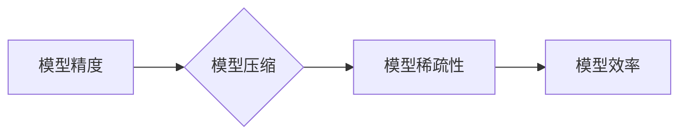

> AI模型优化, 精度, 稀疏性, 模型压缩, 效率, 可解释性

## 1. 背景介绍

近年来，深度学习在计算机视觉、自然语言处理、语音识别等领域取得了突破性进展。然而，随着模型规模的不断扩大，训练和部署这些庞大模型带来了巨大的计算成本和资源消耗。如何提高模型的效率和可部署性，成为当前人工智能研究的热点问题。

模型优化一直是人工智能领域的重要课题，其中精度和稀疏性是两个关键的杠杆。

* **精度** 指的是模型在预测任务上的准确性，通常用准确率、召回率、F1-score等指标来衡量。
* **稀疏性** 指的是模型参数中非零元素的比例，稀疏模型的参数数量更少，计算量更小，更容易部署在资源有限的设备上。

## 2. 核心概念与联系

模型优化旨在通过调整模型结构、参数或训练策略，提高模型的精度和效率。精度和稀疏性之间存在着一种微妙的平衡关系。

**Mermaid 流程图:**



模型压缩技术通过各种方法减少模型参数的数量，从而提高模型的稀疏性，进而降低模型的计算成本和存储需求。然而，模型压缩可能会导致模型精度下降。因此，模型优化需要在提高精度和稀疏性之间找到最佳平衡点。

## 3. 核心算法原理 & 具体操作步骤

### 3.1  算法原理概述

模型压缩算法主要分为以下几类：

* **量化:** 将模型参数的精度降低，例如将32位浮点数转换为8位整数。
* **剪枝:** 删除模型中不重要的参数，例如权重较小的连接。
* **知识蒸馏:** 使用一个小的模型来模仿一个大的模型的预测结果。

### 3.2  算法步骤详解

以剪枝算法为例，其具体操作步骤如下：

1. **训练模型:** 首先使用原始数据训练一个完整的深度学习模型。
2. **计算权重重要性:** 使用一些方法，例如L1正则化或梯度下降的权重变化，计算每个参数的重要性。
3. **选择剪枝策略:** 根据预设的剪枝比例或重要性阈值，选择需要删除的参数。
4. **移除参数:** 删除选中的参数，并重新训练模型以适应新的结构。
5. **重复步骤2-4:** 重复上述步骤，直到达到预设的稀疏性目标。

### 3.3  算法优缺点

**优点:**

* 可以有效降低模型参数数量，提高模型的稀疏性。
* 训练和部署成本降低。

**缺点:**

* 可能导致模型精度下降。
* 需要反复训练和测试，耗时较长。

### 3.4  算法应用领域

模型压缩算法广泛应用于各种人工智能领域，例如：

* **移动设备:** 将大型模型压缩到移动设备上，实现高效的本地推理。
* **嵌入式系统:** 将模型部署到资源有限的嵌入式系统，例如智能家居设备和可穿戴设备。
* **边缘计算:** 将模型部署到边缘节点，实现低延迟和高效率的实时推理。

## 4. 数学模型和公式 & 详细讲解 & 举例说明

### 4.1  数学模型构建

假设一个深度学习模型的参数矩阵为W，其维度为m x n，其中m为输入特征维度，n为输出特征维度。模型的稀疏性可以用参数非零元素的比例来衡量，记为ρ。

$$
\rho = \frac{|\{w_{ij} \neq 0\}|}{m \times n}
$$

其中，|S|表示集合S的元素个数。

### 4.2  公式推导过程

模型压缩的目标是降低模型参数的数量，即减少参数矩阵W中非零元素的个数。

剪枝算法通过移除权重较小的连接，从而实现模型压缩。假设存在一个阈值τ，则所有权重绝对值小于τ的连接会被移除。

$$
\text{if } |w_{ij}| < \tau, \text{ then } w_{ij} = 0
$$

### 4.3  案例分析与讲解

假设一个深度学习模型的参数矩阵W为：

$$
W = \begin{bmatrix}
1 & 2 & 0 & 3 \\
4 & 0 & 5 & 6 \\
7 & 8 & 0 & 9
\end{bmatrix}
$$

如果设置阈值τ为2，则模型参数矩阵W会被压缩为：

$$
W' = \begin{bmatrix}
1 & 2 & 0 & 3 \\
0 & 0 & 5 & 6 \\
7 & 8 & 0 & 9
\end{bmatrix}
$$

可以看到，模型参数的数量从12个减少到9个，稀疏性提高了。

## 5. 项目实践：代码实例和详细解释说明

### 5.1  开发环境搭建

本项目使用Python语言和TensorFlow框架进行开发。

* 安装Python3.7及以上版本
* 安装TensorFlow框架：pip install tensorflow

### 5.2  源代码详细实现

```python
import tensorflow as tf

# 定义一个简单的卷积神经网络模型
model = tf.keras.models.Sequential([
    tf.keras.layers.Conv2D(32, (3, 3), activation='relu', input_shape=(28, 28, 1)),
    tf.keras.layers.MaxPooling2D((2, 2)),
    tf.keras.layers.Flatten(),
    tf.keras.layers.Dense(10, activation='softmax')
])

# 训练模型
model.compile(optimizer='adam',
              loss='sparse_categorical_crossentropy',
              metrics=['accuracy'])
model.fit(x_train, y_train, epochs=10)

# 使用剪枝算法压缩模型
pruning_config = tf.keras.regularizers.l1(0.01)
model.add_regularizer(pruning_config)
model.compile(optimizer='adam',
              loss='sparse_categorical_crossentropy',
              metrics=['accuracy'])
model.fit(x_train, y_train, epochs=10)

# 保存压缩后的模型
model.save('compressed_model.h5')
```

### 5.3  代码解读与分析

* 代码首先定义了一个简单的卷积神经网络模型。
* 然后使用训练数据训练模型。
* 接着使用剪枝算法压缩模型，设置L1正则化参数为0.01，这将导致一些权重被设置为零。
* 最后，训练压缩后的模型，并保存压缩后的模型文件。

### 5.4  运行结果展示

通过运行上述代码，可以观察到压缩后的模型在精度和稀疏性之间的平衡。

## 6. 实际应用场景

### 6.1  移动设备

将大型模型压缩到移动设备上，实现高效的本地推理。例如，将语音识别模型压缩到智能手机上，实现离线语音输入。

### 6.2  嵌入式系统

将模型部署到资源有限的嵌入式系统，例如智能家居设备和可穿戴设备。例如，将图像识别模型压缩到智能摄像头上，实现实时物体检测。

### 6.3  边缘计算

将模型部署到边缘节点，实现低延迟和高效率的实时推理。例如，将预测模型压缩到工业设备上，实现实时故障预测。

### 6.4  未来应用展望

随着人工智能技术的不断发展，模型压缩技术将发挥越来越重要的作用。未来，模型压缩技术将应用于更多领域，例如：

* **自动驾驶:** 将大型模型压缩到自动驾驶汽车上，实现高效的实时决策。
* **医疗诊断:** 将医学图像识别模型压缩到移动医疗设备上，实现便捷的疾病诊断。
* **个性化推荐:** 将推荐模型压缩到用户设备上，实现个性化的商品推荐。

## 7. 工具和资源推荐

### 7.1  学习资源推荐

* **论文:**
    * "Deep Compression: Compressing Deep Neural Networks with Pruning, Trained Quantization and Huffman Coding"
    * "Lottery Ticket Hypothesis: Finding Sparse, Trainable Neural Networks"
* **博客:**
    * TensorFlow Blog: https://blog.tensorflow.org/
    * PyTorch Blog: https://pytorch.org/blog/

### 7.2  开发工具推荐

* **TensorFlow:** https://www.tensorflow.org/
* **PyTorch:** https://pytorch.org/
* **Keras:** https://keras.io/

### 7.3  相关论文推荐

* "Pruning Filters for Efficient ConvNets"
* "Quantization-aware Training"
* "Knowledge Distillation"

## 8. 总结：未来发展趋势与挑战

### 8.1  研究成果总结

近年来，模型压缩技术取得了显著进展，有效降低了模型的计算成本和存储需求，促进了人工智能技术的普及和应用。

### 8.2  未来发展趋势

未来，模型压缩技术将朝着以下方向发展：

* **更有效的压缩算法:** 开发更有效的模型压缩算法，提高压缩率的同时，尽量减少精度损失。
* **自动化模型压缩:** 实现自动化模型压缩，无需人工干预，便能自动生成高效的压缩模型。
* **硬件加速:** 利用硬件加速技术，提高模型压缩和部署的效率。

### 8.3  面临的挑战

模型压缩技术还面临一些挑战：

* **精度损失:** 模型压缩可能会导致精度损失，需要找到更有效的压缩方法，尽量减少精度损失。
* **可解释性:** 压缩后的模型结构更加复杂，难以解释模型的决策过程，需要提高模型的可解释性。
* **通用性:** 目前大多数模型压缩算法针对特定模型架构，缺乏通用性，需要开发更通用的模型压缩算法。

### 8.4  研究展望

未来，模型压缩技术将继续是人工智能研究的热点方向，需要进一步探索更有效的压缩算法、自动化模型压缩技术和硬件加速技术，推动人工智能技术的进一步发展。

## 9. 附录：常见问题与解答

### 9.1  模型压缩会影响模型的性能吗？

是的，模型压缩可能会导致模型的精度下降。但是，通过选择合适的压缩算法和参数，可以尽量减少精度损失。

### 9.2  有哪些常见的模型压缩算法？

常见的模型压缩算法包括量化、剪枝和知识蒸馏。

### 9.3  如何选择合适的模型压缩算法？

选择合适的模型压缩算法需要根据具体的应用场景和模型架构进行选择。

### 9.4  模型压缩的应用场景有哪些？

模型压缩的应用场景非常广泛，例如移动设备、嵌入式系统、边缘计算等。

### 9.5  模型压缩技术的发展趋势是什么？

未来，模型压缩技术将朝着更有效的压缩算法、自动化模型压缩和硬件加速技术的方向发展。


作者：禅与计算机程序设计艺术 / Zen and the Art of Computer Programming 
<end_of_turn>