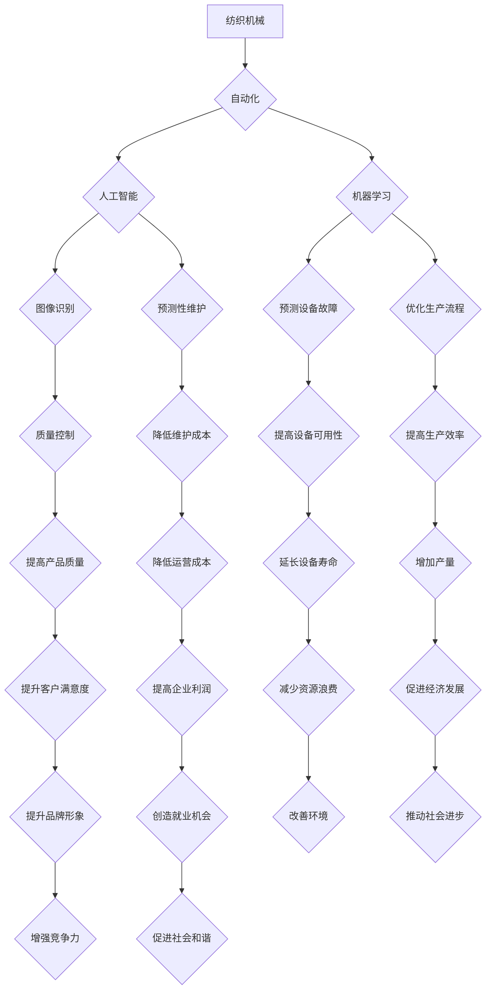

> 纺织机械自动化、人工智能、机器学习、工业4.0、社会影响、就业市场、经济发展

## 1. 背景介绍

纺织业作为人类文明的重要组成部分，经历了从手工纺织到机械化生产的漫长演变。近年来，随着人工智能（AI）、机器学习（ML）等技术的快速发展，纺织机械自动化正迎来新的突破。自动化技术在纺织生产中应用越来越广泛，从织布机到染色设备，从裁剪到缝纫，几乎所有环节都开始被智能化和自动化。

这种自动化浪潮带来的不仅仅是生产效率的提升，更重要的是对社会结构、经济发展和就业市场等方面产生深远的影响。本文将深入探讨纺织机械自动化的社会效应，分析其带来的机遇和挑战，并展望未来发展趋势。

## 2. 核心概念与联系

**2.1 纺织机械自动化**

纺织机械自动化是指利用计算机、传感器、机器人等技术，对纺织生产过程进行控制和优化，实现生产过程的智能化和自动化。

**2.2 人工智能（AI）**

人工智能是指模拟人类智能行为的计算机系统。在纺织机械自动化中，AI技术被用于图像识别、预测性维护、质量控制等方面，提高生产效率和产品质量。

**2.3 机器学习（ML）**

机器学习是人工智能的一个分支，它通过算法学习数据，并从中发现模式和规律，从而进行预测和决策。在纺织机械自动化中，ML技术被用于预测设备故障、优化生产流程、控制纺织材料的特性等。

**2.4 工业4.0**

工业4.0是指将物理世界和数字世界融合的第四次工业革命。纺织机械自动化是工业4.0的重要组成部分，它通过数字化、网络化、智能化等手段，实现生产过程的智能化和可视化。

**2.5 社会影响**

纺织机械自动化对社会的影响是多方面的，包括就业市场、经济发展、环境保护等方面。

**2.6 流程图**



## 3. 核心算法原理 & 具体操作步骤

### 3.1  算法原理概述

纺织机械自动化的核心算法主要包括机器学习算法、控制算法和优化算法。

* **机器学习算法:** 用于从生产数据中学习模式和规律，例如预测设备故障、优化生产流程、控制纺织材料的特性等。常见的机器学习算法包括支持向量机（SVM）、决策树、神经网络等。

* **控制算法:** 用于控制纺织机械的运动和操作，例如控制织布机的梭子运动、控制染色设备的温度和压力等。常见的控制算法包括PID控制、模糊控制等。

* **优化算法:** 用于优化生产过程中的各种参数，例如优化生产计划、优化生产流程、优化材料使用等。常见的优化算法包括遗传算法、模拟退火算法等。

### 3.2  算法步骤详解

以预测设备故障为例，详细说明机器学习算法的具体操作步骤：

1. **数据收集:** 收集设备运行数据，包括传感器数据、操作日志、维修记录等。
2. **数据预处理:** 对收集到的数据进行清洗、转换、归一化等处理，使其适合机器学习算法的训练。
3. **模型选择:** 选择合适的机器学习算法，例如支持向量机、决策树、神经网络等。
4. **模型训练:** 使用预处理后的数据训练选择的机器学习模型，使其能够学习设备故障的模式和规律。
5. **模型评估:** 使用测试数据评估模型的性能，例如准确率、召回率、F1-score等。
6. **模型部署:** 将训练好的模型部署到生产环境中，用于实时预测设备故障。

### 3.3  算法优缺点

**优点:**

* 提高生产效率：通过预测设备故障、优化生产流程等，可以提高生产效率。
* 降低运营成本：通过预测设备故障、降低维护成本等，可以降低运营成本。
* 提高产品质量：通过质量控制、材料特性控制等，可以提高产品质量。

**缺点:**

* 数据依赖性强：机器学习算法需要大量的数据进行训练，如果数据质量不高或数据量不足，模型性能会受到影响。
* 模型解释性差：一些机器学习算法的内部机制比较复杂，难以解释模型的决策结果。
* 技术门槛高：开发和部署机器学习模型需要一定的技术门槛。

### 3.4  算法应用领域

纺织机械自动化的核心算法在纺织行业各个环节都有广泛的应用，例如：

* **设备故障预测:** 通过分析设备运行数据，预测设备故障，及时进行维护，避免设备停机。
* **生产流程优化:** 通过分析生产数据，优化生产流程，提高生产效率和降低成本。
* **质量控制:** 通过图像识别、传感器数据分析等技术，对产品质量进行实时监控和控制。
* **材料特性控制:** 通过机器学习算法，控制纺织材料的特性，例如颜色、强度、柔软度等。

## 4. 数学模型和公式 & 详细讲解 & 举例说明

### 4.1  数学模型构建

在纺织机械自动化中，常用的数学模型包括：

* **控制模型:** 用于描述纺织机械的运动和操作，例如控制织布机的梭子运动、控制染色设备的温度和压力等。控制模型通常是微分方程或差分方程。

* **优化模型:** 用于优化生产过程中的各种参数，例如优化生产计划、优化生产流程、优化材料使用等。优化模型通常是线性规划模型、非线性规划模型或整数规划模型。

* **预测模型:** 用于预测设备故障、生产效率、产品质量等。预测模型通常是机器学习模型，例如支持向量机、决策树、神经网络等。

### 4.2  公式推导过程

以控制织布机的梭子运动为例，推导控制模型的公式：

假设织布机的梭子运动可以用以下微分方程描述：

$$m\ddot{x} + c\dot{x} + kx = u$$

其中：

* $m$ 是梭子的质量
* $c$ 是梭子的阻尼系数
* $k$ 是梭子的弹簧系数
* $x$ 是梭子的位移
* $\dot{x}$ 是梭子的速度
* $\ddot{x}$ 是梭子的加速度
* $u$ 是控制信号

### 4.3  案例分析与讲解

以预测设备故障为例，分析机器学习模型的应用案例：

一家纺织企业利用机器学习模型预测织布机的故障，收集了织布机运行数据，包括传感器数据、操作日志、维修记录等。通过训练机器学习模型，可以预测织布机的故障概率，并给出故障的类型和时间。

通过预测设备故障，这家纺织企业可以提前进行维护，避免设备停机，提高生产效率和降低运营成本。

## 5. 项目实践：代码实例和详细解释说明

### 5.1  开发环境搭建

* 操作系统：Ubuntu 20.04 LTS
* Python 版本：3.8.10
* 必要的库：TensorFlow、Keras、NumPy、Pandas等

### 5.2  源代码详细实现

```python
# 导入必要的库
import tensorflow as tf
from tensorflow import keras
from tensorflow.keras import layers

# 定义模型结构
model = keras.Sequential(
    [
        layers.Dense(64, activation="relu", input_shape=(10,)),
        layers.Dense(32, activation="relu"),
        layers.Dense(1, activation="sigmoid"),
    ]
)

# 编译模型
model.compile(
    optimizer="adam", loss="binary_crossentropy", metrics=["accuracy"]
)

# 训练模型
model.fit(X_train, y_train, epochs=10, batch_size=32)

# 评估模型
loss, accuracy = model.evaluate(X_test, y_test)
print("Loss:", loss)
print("Accuracy:", accuracy)
```

### 5.3  代码解读与分析

* 代码首先导入必要的库。
* 然后定义一个简单的多层感知机模型，包含三个全连接层和一个sigmoid激活函数的输出层。
* 模型使用Adam优化器、二元交叉熵损失函数和准确率作为评估指标进行编译。
* 接着使用训练数据训练模型，设置训练轮数为10，每次训练批大小为32。
* 最后使用测试数据评估模型的性能，打印损失和准确率。

### 5.4  运行结果展示

训练完成后，可以查看模型的训练过程和最终的性能指标，例如损失函数的变化趋势、准确率的变化趋势等。

## 6. 实际应用场景

### 6.1  智能纺织生产线

智能纺织生产线利用传感器、机器人、人工智能等技术，实现纺织生产过程的自动化和智能化。例如，可以利用机器视觉技术识别布料缺陷，利用机器人手臂进行自动裁剪和缝纫等操作。

### 6.2  个性化定制

纺织机械自动化可以实现个性化定制，例如根据客户需求定制服装款式、颜色、尺寸等。

### 6.3  可持续发展

纺织机械自动化可以提高生产效率和降低资源消耗，从而促进纺织行业的可持续发展。例如，可以利用机器学习算法优化材料使用，减少废料产生。

### 6.4  未来应用展望

未来，纺织机械自动化将更加智能化和个性化，例如：

* 利用增强现实（AR）和虚拟现实（VR）技术，为纺织设计师提供更直观的视觉体验。
* 利用3D打印技术，实现个性化服装的快速定制。
* 利用生物材料和可降解材料，开发更加环保的纺织产品。

## 7. 工具和资源推荐

### 7.1  学习资源推荐

* **在线课程:** Coursera、edX、Udacity等平台提供人工智能、机器学习等方面的在线课程。
* **书籍:** 《深度学习》、《机器学习实战》等书籍可以帮助读者深入了解人工智能和机器学习的原理和应用。
* **开源项目:** TensorFlow、PyTorch等开源项目可以帮助读者实践人工智能和机器学习的知识。

### 7.2  开发工具推荐

* **Python:** Python是一种流行的编程语言，广泛应用于人工智能和机器学习领域。
* **TensorFlow:** TensorFlow是一个开源的机器学习框架，提供丰富的工具和资源。
* **Keras:** Keras是一个基于TensorFlow的深度学习框架，易于使用和扩展。

### 7.3  相关论文推荐

* **《ImageNet Classification with Deep Convolutional Neural Networks》**
* **《Attention Is All You Need》**
* **《BERT: Pre-training of Deep Bidirectional Transformers for Language Understanding》**

## 8. 总结：未来发展趋势与挑战

### 8.1  研究成果总结

纺织机械自动化取得了显著的成果，例如提高了生产效率、降低了运营成本、提高了产品质量等。

### 8.2  未来发展趋势

未来，纺织机械自动化将朝着更加智能化、个性化、可持续化的方向发展。

### 8.3  面临的挑战

