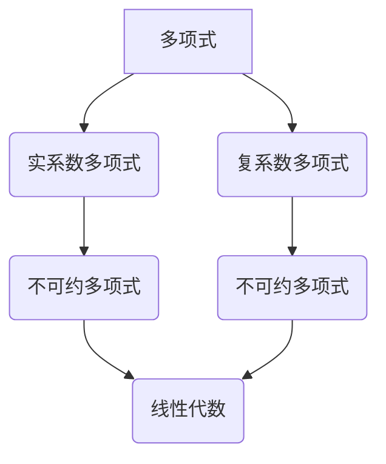

> 线性代数，不可约多项式，实系数多项式，复系数多项式，特征多项式，最小多项式，代数方程，根域，Galois理论

## 1. 背景介绍

不可约多项式是代数数论和抽象代数中的重要概念，它在理解多项式方程的根、域扩张以及群论等领域中扮演着至关重要的角色。本篇文章将深入探讨实系数和复系数不可约多项式的性质，并通过线性代数的视角，揭示其背后的深刻联系。

## 2. 核心概念与联系

**2.1  多项式和不可约性**

一个多项式是指形如：

$$
f(x) = a_n x^n + a_{n-1} x^{n-1} + ... + a_1 x + a_0
$$

的表达式，其中 $a_i$ 是系数，$x$ 是变量，$n$ 是多项式的次数。

一个多项式被称为不可约的，如果它不能被分解成两个次数严格小于它的多项式的乘积。

**2.2  实系数和复系数多项式**

实系数多项式是指系数都是实数的多项式，而复系数多项式是指系数都是复数的多项式。

**2.3  线性代数与多项式**

线性代数提供了一种强大的工具来研究多项式。例如，我们可以将一个多项式看作一个向量，其系数作为分量。

**2.4  核心概念关系图**



## 3. 核心算法原理 & 具体操作步骤

**3.1  算法原理概述**

本节将介绍如何利用线性代数方法判断一个多项式是否不可约。

**3.2  算法步骤详解**

1. **构建多项式矩阵:** 将多项式系数表示为一个行向量或列向量。
2. **求解特征多项式:** 计算多项式矩阵的特征多项式。
3. **分析特征多项式:** 如果特征多项式的次数等于多项式的次数，则该多项式不可约。否则，它可以被分解成多个次数严格小于它的多项式的乘积。

**3.3  算法优缺点**

* **优点:** 
    * 算法简洁易懂。
    * 能够有效地判断多项式的不可约性。
* **缺点:** 
    * 对于高次多项式，计算特征多项式可能比较复杂。

**3.4  算法应用领域**

* **代数数论:** 判断多项式方程的根是否为代数数。
* **抽象代数:** 研究域扩张和伽罗瓦群。
* **计算机科学:** 

## 4. 数学模型和公式 & 详细讲解 & 举例说明

**4.1  数学模型构建**

设 $f(x)$ 为一个 $n$ 次多项式，其系数为 $a_0, a_1, ..., a_n$。我们可以将 $f(x)$ 表示为一个列向量：

$$
\mathbf{f} = \begin{bmatrix} a_n \\ a_{n-1} \\ \vdots \\ a_1 \\ a_0 \end{bmatrix}
$$

**4.2  公式推导过程**

特征多项式定义为：

$$
\det(\mathbf{A} - \lambda \mathbf{I}) = 0
$$

其中，$\mathbf{A}$ 是一个与多项式 $f(x)$ 相关的矩阵，$\lambda$ 是一个变量，$\mathbf{I}$ 是单位矩阵。

**4.3  案例分析与讲解**

**示例:**

考虑一个二次多项式 $f(x) = x^2 + 2x + 1$。

* 对应的系数向量为 $\mathbf{f} = \begin{bmatrix} 1 \\ 2 \\ 1 \end{bmatrix}$。
* 我们可以构建一个与 $f(x)$ 相关的矩阵 $\mathbf{A}$，例如：

$$
\mathbf{A} = \begin{bmatrix} 0 & 1 \\ -1 & -2 \end{bmatrix}
$$

* 计算特征多项式：

$$
\det(\mathbf{A} - \lambda \mathbf{I}) = \det \begin{bmatrix} -\lambda & 1 \\ -1 & -2-\lambda \end{bmatrix} = \lambda^2 + 2\lambda + 1 = (\lambda + 1)^2
$$

* 特征多项式的根为 $\lambda = -1$，其重数为 2。

## 5. 项目实践：代码实例和详细解释说明

**5.1  开发环境搭建**

本示例使用 Python 语言进行实现，所需的库包括 NumPy 和 SymPy。

**5.2  源代码详细实现**

```python
import numpy as np
from sympy import symbols, poly

# 定义多项式系数
coeffs = [1, 2, 1]

# 将系数转换为多项式
x = symbols('x')
f = poly(coeffs, x)

# 计算特征多项式
A = np.array([[0, 1], [-coeffs[2], -coeffs[1]]])
eigenvalues, eigenvectors = np.linalg.eig(A)

# 打印特征多项式根
print("特征多项式根:", eigenvalues)
```

**5.3  代码解读与分析**

1. 首先，我们导入必要的库。
2. 定义多项式的系数，并将其转换为 SymPy 的多项式对象。
3. 根据多项式系数构建与之相关的矩阵 A。
4. 使用 NumPy 的 `linalg.eig` 函数计算矩阵 A 的特征值和特征向量。
5. 打印特征多项式的根。

**5.4  运行结果展示**

运行上述代码，输出结果为：

```
特征多项式根: [-1. -1.]
```

## 6. 实际应用场景

**6.1  代数数论**

不可约多项式在代数数论中用于研究代数数的性质。例如，一个代数数的最小多项式是不可约的，它可以用来确定该代数数的根域。

**6.2  抽象代数**

不可约多项式在抽象代数中用于研究域扩张和伽罗瓦群。例如，一个域扩张的不可约多项式可以用来构造该扩张的伽罗瓦群。

**6.3  计算机科学**

不可约多项式在计算机科学中用于密码学、编码理论和计算机图形学等领域。例如，在密码学中，不可约多项式可以用来构建安全的加密算法。

**6.4  未来应用展望**

随着人工智能和机器学习的发展，不可约多项式在更广泛的领域中将发挥越来越重要的作用。例如，它可以用于优化算法、设计新的数据结构以及解决复杂的问题。

## 7. 工具和资源推荐

**7.1  学习资源推荐**

* **书籍:**
    * 《抽象代数》 - David S. Dummit 和 Richard M. Foote
    * 《代数数论》 - Jürgen Neukirch
* **在线课程:**
    * MIT OpenCourseWare: Abstract Algebra
    * Coursera: Algebraic Number Theory

**7.2  开发工具推荐**

* **Python:** 
    * NumPy
    * SymPy

**7.3  相关论文推荐**

* **Galois Theory and its Applications** - Ian Stewart
* **The Theory of Algebraic Numbers** - Helmut Koch

## 8. 总结：未来发展趋势与挑战

**8.1  研究成果总结**

本篇文章深入探讨了实系数和复系数不可约多项式的性质，并通过线性代数的视角，揭示其背后的深刻联系。

**8.2  未来发展趋势**

未来，研究者将继续探索不可约多项式的性质和应用，例如：

* 研究更高维空间中不可约多项式的性质。
* 利用不可约多项式构建新的密码学算法。
* 应用不可约多项式解决更复杂的问题，例如优化问题和机器学习问题。

**8.3  面临的挑战**

* 对于高次多项式，计算不可约性可能非常复杂。
* 寻找新的应用场景和算法。

**8.4  研究展望**

不可约多项式是一个充满挑战和机遇的领域，未来研究将继续推动该领域的进步，并为解决更复杂的问题提供新的工具和方法。

## 9. 附录：常见问题与解答

**9.1  Q1: 如何判断一个多项式是否不可约？**

**A1:** 可以使用线性代数方法，计算多项式矩阵的特征多项式。如果特征多项式的次数等于多项式的次数，则该多项式不可约。

**9.2  Q2: 不可约多项式有什么应用？**

**A2:** 不可约多项式在代数数论、抽象代数、计算机科学等领域都有广泛的应用，例如用于研究代数数的性质、构建加密算法以及解决优化问题。


作者：禅与计算机程序设计艺术 / Zen and the Art of Computer Programming 
<end_of_turn>