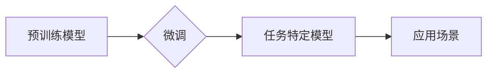

> 组件化AI, 预训练模型, 微调, 迁移学习, 模型效率, 泛化能力, 领域适应性

## 1. 背景介绍

人工智能（AI）技术近年来取得了飞速发展，预训练模型（如GPT-3、BERT、DALL-E）的出现更是推动了AI应用的广泛普及。这些模型通过在海量数据上进行预训练，学习了丰富的语言和视觉知识，为下游任务提供了强大的基础。然而，预训练模型的规模庞大，部署成本高，且可能存在领域适应性差的问题。

组件化AI应运而生，旨在通过将AI模型分解成可复用的组件，实现模型的灵活组合、高效训练和部署。组件化AI的核心思想是将预训练模型作为基础组件，通过微调的方式将其适配到特定任务和领域。

## 2. 核心概念与联系

### 2.1 预训练模型

预训练模型是指在大量公共数据上进行训练，学习到通用知识和表示能力的模型。这些模型通常具有强大的泛化能力，可以应用于多种下游任务。

### 2.2 微调

微调是指在预训练模型的基础上，使用特定任务的数据进行进一步训练，以提高模型在该任务上的性能。微调可以有效地减少训练数据和时间，同时提高模型的准确率。

### 2.3 组件化AI

组件化AI是指将AI模型分解成可复用的组件，并通过组合和配置这些组件来构建更复杂的AI系统。组件化AI可以提高模型的灵活性和可扩展性，并促进模型的复用和共享。

**组件化AI架构**



## 3. 核心算法原理 & 具体操作步骤

### 3.1 算法原理概述

组件化AI的核心算法原理是基于预训练模型的微调技术。通过微调预训练模型，可以将模型的通用知识和表示能力应用于特定任务，提高模型的性能。

### 3.2 算法步骤详解

1. **选择预训练模型:** 根据任务需求选择合适的预训练模型。
2. **数据预处理:** 对任务数据进行预处理，例如文本清洗、图像裁剪等。
3. **微调模型参数:** 使用微调策略，例如学习率衰减、权重冻结等，对预训练模型的参数进行微调。
4. **评估模型性能:** 使用验证集评估模型的性能，并根据性能调整微调参数。
5. **部署模型:** 将微调后的模型部署到实际应用场景中。

### 3.3 算法优缺点

**优点:**

* **提高模型性能:** 微调可以有效地提高模型在特定任务上的性能。
* **减少训练数据和时间:** 微调只需要使用少量任务数据，可以显著减少训练时间和成本。
* **提高模型泛化能力:** 预训练模型的通用知识可以帮助模型更好地泛化到新的数据。

**缺点:**

* **需要预训练模型:** 微调需要依赖于预训练模型，如果没有合适的预训练模型，则无法进行微调。
* **微调参数需要调整:** 微调参数的设置对模型性能有重要影响，需要进行仔细的调整。
* **可能存在过拟合:** 如果微调数据量过小，则可能导致模型过拟合。

### 3.4 算法应用领域

组件化AI和微调技术广泛应用于以下领域:

* **自然语言处理:** 文本分类、情感分析、机器翻译等。
* **计算机视觉:** 图像识别、目标检测、图像分割等。
* **语音识别:** 语音转文本、语音合成等。
* **推荐系统:** 商品推荐、用户画像等。

## 4. 数学模型和公式 & 详细讲解 & 举例说明

### 4.1 数学模型构建

微调过程可以看作是一个优化问题，目标是找到最优的模型参数，使得模型在特定任务上的性能达到最大。

假设模型的输出为 $y$，目标变量为 $t$，损失函数为 $L(y,t)$，则微调的目标函数为：

$$
\min_{\theta} L(y,t)
$$

其中，$\theta$ 表示模型的参数。

### 4.2 公式推导过程

微调过程通常使用梯度下降算法来优化模型参数。梯度下降算法的基本思想是：沿着梯度的负方向更新模型参数，直到损失函数达到最小值。

梯度下降算法的更新公式为：

$$
\theta = \theta - \eta \nabla_{\theta} L(y,t)
$$

其中，$\eta$ 表示学习率，$\nabla_{\theta} L(y,t)$ 表示损失函数对模型参数的梯度。

### 4.3 案例分析与讲解

例如，在文本分类任务中，可以使用交叉熵损失函数来衡量模型的性能。交叉熵损失函数的公式为：

$$
L(y,t) = - \sum_{i=1}^{N} t_i \log(y_i)
$$

其中，$N$ 表示样本数量，$t_i$ 表示真实标签，$y_i$ 表示模型预测的概率。

在微调过程中，可以使用梯度下降算法来更新模型参数，以最小化交叉熵损失函数。

## 5. 项目实践：代码实例和详细解释说明

### 5.1 开发环境搭建

* Python 3.7+
* TensorFlow/PyTorch
* CUDA (可选)

### 5.2 源代码详细实现

```python
import tensorflow as tf

# 加载预训练模型
model = tf.keras.applications.ResNet50(weights='imagenet')

# 冻结预训练模型的权重
for layer in model.layers:
    layer.trainable = False

# 添加新的分类层
x = model.output
x = tf.keras.layers.GlobalAveragePooling2D()(x)
x = tf.keras.layers.Dense(10, activation='softmax')(x)

# 创建模型
model = tf.keras.Model(inputs=model.input, outputs=x)

# 编译模型
model.compile(optimizer='adam',
              loss='categorical_crossentropy',
              metrics=['accuracy'])

# 微调模型
model.fit(train_data, train_labels, epochs=10)
```

### 5.3 代码解读与分析

* 代码首先加载预训练的ResNet50模型，并冻结其所有层的权重。
* 然后，添加一个新的分类层，用于将图像分类为10个类别。
* 最后，使用Adam优化器和交叉熵损失函数对模型进行微调。

### 5.4 运行结果展示

微调后的模型可以用于图像分类任务，并可以评估其准确率等指标。

## 6. 实际应用场景

### 6.1 医疗诊断

组件化AI可以用于辅助医生进行疾病诊断，例如通过微调预训练的图像识别模型，识别病理图像中的异常区域。

### 6.2 金融风险评估

组件化AI可以用于评估金融风险，例如通过微调预训练的文本分类模型，识别欺诈交易。

### 6.3 个性化推荐

组件化AI可以用于提供个性化推荐，例如通过微调预训练的推荐模型，推荐用户感兴趣的商品或服务。

### 6.4 未来应用展望

组件化AI技术在未来将有更广泛的应用场景，例如：

* **自动驾驶:** 组件化AI可以用于构建自动驾驶系统的感知、决策和控制模块。
* **机器人:** 组件化AI可以用于开发更智能的机器人，使其能够更好地理解和响应人类指令。
* **工业自动化:** 组件化AI可以用于提高工业生产效率，例如通过自动识别和分类产品缺陷。

## 7. 工具和资源推荐

### 7.1 学习资源推荐

* **书籍:**
    * 《深度学习》
    * 《自然语言处理》
    * 《计算机视觉》
* **在线课程:**
    * Coursera
    * edX
    * Udacity

### 7.2 开发工具推荐

* **TensorFlow:** 开源深度学习框架
* **PyTorch:** 开源深度学习框架
* **HuggingFace:** 预训练模型库和工具

### 7.3 相关论文推荐

* **BERT: Pre-training of Deep Bidirectional Transformers for Language Understanding**
* **GPT-3: Language Models are Few-Shot Learners**
* **DALL-E: Creating Images from Text**

## 8. 总结：未来发展趋势与挑战

### 8.1 研究成果总结

组件化AI和微调技术取得了显著的进展，为AI应用的普及和发展提供了重要的技术支撑。

### 8.2 未来发展趋势

* **模型规模和能力的提升:** 预训练模型的规模和能力将继续提升，从而提高模型的泛化能力和性能。
* **组件化AI的标准化和规范化:** 组件化AI的标准化和规范化将促进模型的复用和共享。
* **边缘计算和部署的优化:** 组件化AI将更加注重边缘计算和部署的优化，以降低模型的部署成本和延迟。

### 8.3 面临的挑战

* **数据获取和标注:** 组件化AI的训练需要大量高质量的数据，数据获取和标注仍然是一个挑战。
* **模型解释性和可解释性:** 组件化AI模型的复杂性使得其解释性和可解释性成为一个挑战。
* **伦理和安全问题:** 组件化AI的应用可能带来伦理和安全问题，需要进行深入的探讨和研究。

### 8.4 研究展望

未来，组件化AI的研究将继续深入，探索更有效的模型训练和部署方法，并解决数据获取、模型解释性和伦理安全等挑战，推动AI技术向更广泛的领域应用。

## 9. 附录：常见问题与解答

### 9.1 什么是组件化AI？

组件化AI是指将AI模型分解成可复用的组件，并通过组合和配置这些组件来构建更复杂的AI系统。

### 9.2 微调的优势是什么？

微调可以有效地提高模型在特定任务上的性能，减少训练数据和时间，并提高模型的泛化能力。

### 9.3 如何选择合适的预训练模型？

选择预训练模型需要根据任务需求和数据特点进行考虑。

### 9.4 微调过程中需要注意什么？

微调过程中需要调整微调参数，例如学习率和权重冻结策略，以获得最佳的性能。

### 9.5 组件化AI的未来发展趋势是什么？

组件化AI的未来发展趋势包括模型规模和能力的提升、组件化AI的标准化和规范化、边缘计算和部署的优化等。


作者：禅与计算机程序设计艺术 / Zen and the Art of Computer Programming 
<end_of_turn>