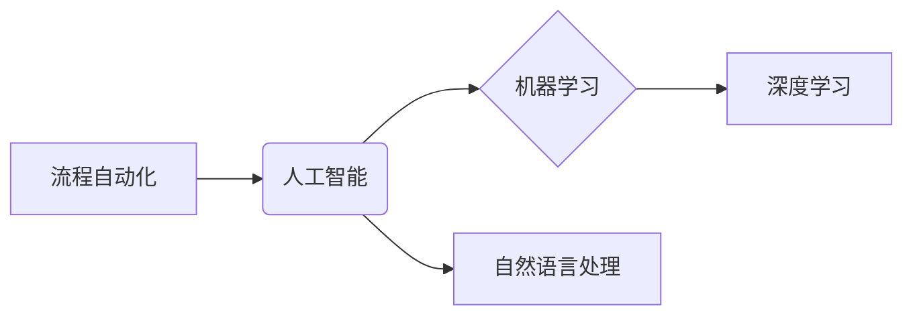

# 自动化领域的未来发展方向

> 关键词：

> 自动化、人工智能、机器学习、深度学习、自然语言处理、流程自动化、机器人技术、云计算

## 1. 背景介绍

自动化技术作为科技发展的重要驱动力，已深刻地改变了人类生产生活方式。从工业革命的自动化生产线到如今人工智能驱动的智能家居，自动化技术不断推动着社会进步。随着计算机技术、人工智能技术和网络技术的飞速发展，自动化领域迎来了前所未有的机遇和挑战。

当前，自动化技术已广泛应用于各个领域，例如：

* **制造业:** 自动化生产线、机器人焊接、智能仓储管理等，提高生产效率和产品质量。
* **金融业:** 自动化交易、风险管理、客户服务等，降低运营成本和风险，提升服务效率。
* **医疗保健:** 自动化诊断、手术机器人、药物研发等，提高医疗诊断准确率和治疗效果。
* **交通运输:** 自动驾驶汽车、无人机物流、智能交通管理等，提高交通安全性和效率。

## 2. 核心概念与联系

自动化技术的核心概念包括：

* **流程自动化:** 通过软件工具和技术，自动执行重复性任务和流程，提高效率和减少人为错误。
* **人工智能 (AI):** 使计算机能够像人类一样学习、推理和决策，从而实现智能化自动化。
* **机器学习 (ML):** 一种人工智能技术，通过算法从数据中学习，不断改进自身性能。
* **深度学习 (DL):** 一种机器学习技术，利用多层神经网络模拟人类大脑的学习机制，能够处理更复杂的数据和任务。
* **自然语言处理 (NLP):** 使计算机能够理解和处理人类语言，例如文本分析、机器翻译、语音识别等。

这些核心概念相互关联，共同推动着自动化技术的进步。例如，流程自动化可以利用人工智能技术，实现更智能化的自动化流程；机器学习可以帮助自动化系统从数据中学习，不断优化自身性能；深度学习可以使自动化系统具备更强的智能化能力，例如图像识别、语音理解等。

**核心概念架构图:**



## 3. 核心算法原理 & 具体操作步骤

### 3.1  算法原理概述

自动化领域中，许多算法都基于机器学习和深度学习的原理。这些算法通过训练模型，学习数据中的模式和规律，从而实现自动化决策和预测。

例如，**决策树算法**是一种常用的机器学习算法，它通过构建树形结构来表示决策规则，并根据输入数据进行分类或预测。

**支持向量机 (SVM)** 是一种基于几何空间的分类算法，它试图找到一个最佳的超平面，将不同类别的数据点分开。

**神经网络算法** 则模拟了人类大脑的神经元结构，通过多层神经网络进行特征提取和学习，能够处理更复杂的数据和任务。

### 3.2  算法步骤详解

以决策树算法为例，其具体操作步骤如下：

1. **数据预处理:** 对输入数据进行清洗、转换和特征工程，使其适合模型训练。
2. **选择特征:** 选择最能代表数据特征的变量，用于构建决策树。
3. **构建决策树:** 根据数据特征，递归地构建决策树，每个节点代表一个决策规则，每个分支代表一个可能的决策结果。
4. **剪枝:** 对构建好的决策树进行剪枝，避免过拟合，提高模型泛化能力。
5. **模型评估:** 使用测试数据评估模型的性能，例如准确率、召回率等。

### 3.3  算法优缺点

每个算法都有其自身的优缺点，需要根据实际应用场景选择合适的算法。

例如，决策树算法易于理解和解释，但容易过拟合；SVM算法具有较好的泛化能力，但训练过程复杂；神经网络算法能够处理更复杂的数据，但训练时间长，参数设置困难。

### 3.4  算法应用领域

自动化领域中，各种算法广泛应用于不同的场景，例如：

* **图像识别:** 使用卷积神经网络 (CNN) 算法识别图像中的物体、场景和人脸。
* **语音识别:** 使用循环神经网络 (RNN) 算法识别语音中的文字和指令。
* **自然语言处理:** 使用Transformer模型进行文本分类、机器翻译、文本摘要等任务。
* **预测分析:** 使用回归算法预测未来趋势，例如销售预测、风险评估等。

## 4. 数学模型和公式 & 详细讲解 & 举例说明

### 4.1  数学模型构建

在自动化领域，数学模型是描述系统行为和关系的重要工具。例如，在机器学习中，模型参数的更新过程可以用梯度下降算法来描述，其数学公式如下：

$$
\theta = \theta - \alpha \nabla J(\theta)
$$

其中：

* $\theta$ 是模型参数
* $\alpha$ 是学习率
* $J(\theta)$ 是损失函数，用于衡量模型预测结果与真实值的误差
* $\nabla J(\theta)$ 是损失函数的梯度，表示参数更新的方向

### 4.2  公式推导过程

梯度下降算法通过迭代更新模型参数，不断降低损失函数的值，从而使模型预测结果越来越准确。

公式推导过程如下：

1. 计算损失函数 $J(\theta)$ 的梯度 $\nabla J(\theta)$。
2. 根据梯度方向更新模型参数 $\theta$，公式为：

$$
\theta = \theta - \alpha \nabla J(\theta)
$$

其中，$\alpha$ 是学习率，控制了参数更新的步长。

3. 重复步骤 1 和 2，直到损失函数达到最小值或满足其他停止条件。

### 4.3  案例分析与讲解

例如，在训练一个图像分类模型时，损失函数可以是交叉熵损失函数，其公式如下：

$$
J(\theta) = -\sum_{i=1}^{N} y_i \log(p_i)
$$

其中：

* $N$ 是样本数量
* $y_i$ 是真实标签
* $p_i$ 是模型预测的概率

通过梯度下降算法，不断更新模型参数，使交叉熵损失函数的值最小化，从而提高模型的图像分类准确率。

## 5. 项目实践：代码实例和详细解释说明

### 5.1  开发环境搭建

为了实现自动化项目，需要搭建相应的开发环境。

例如，使用 Python 语言进行机器学习开发，需要安装 Python 语言环境、机器学习库 (例如 TensorFlow、PyTorch) 和数据处理库 (例如 Pandas、NumPy)。

### 5.2  源代码详细实现

以下是一个简单的机器学习项目代码实例，用于预测房价：

```python
import pandas as pd
from sklearn.model_selection import train_test_split
from sklearn.linear_model import LinearRegression
from sklearn.metrics import mean_squared_error

# 加载房价数据
data = pd.read_csv('house_price.csv')

# 选择特征和目标变量
features = ['size', 'location', 'bedrooms']
target = 'price'

# 将数据分为训练集和测试集
X_train, X_test, y_train, y_test = train_test_split(data[features], data[target], test_size=0.2)

# 创建线性回归模型
model = LinearRegression()

# 训练模型
model.fit(X_train, y_train)

# 预测测试集数据
y_pred = model.predict(X_test)

# 计算模型性能
mse = mean_squared_error(y_test, y_pred)
print(f'Mean Squared Error: {mse}')
```

### 5.3  代码解读与分析

这段代码首先加载房价数据，然后选择特征和目标变量。接着，将数据分为训练集和测试集，用于训练和评估模型。

代码创建了一个线性回归模型，并使用训练集数据训练模型。最后，使用测试集数据预测房价，并计算模型性能指标 Mean Squared Error (MSE)。

### 5.4  运行结果展示

运行这段代码后，会输出模型的 MSE 值，表示模型预测房价的准确度。

## 6. 实际应用场景

### 6.1  自动化流程

自动化流程可以应用于各种场景，例如：

* **企业流程自动化:** 自动化审批流程、报销流程、合同管理流程等，提高效率和降低成本。
* **IT运维自动化:** 自动化服务器部署、系统监控、故障处理等，提高运维效率和稳定性。
* **软件开发自动化:** 自动化代码构建、测试、部署等，提高开发效率和软件质量。

### 6.2  智能机器人

智能机器人可以应用于制造业、服务业、医疗保健等领域，例如：

* **工业机器人:** 自动化生产线上的焊接、喷漆、装配等任务，提高生产效率和产品质量。
* **服务机器人:** 在酒店、餐厅、医院等场所提供服务，例如客房服务、送餐、陪护等。
* **医疗机器人:** 协助医生进行手术、治疗、诊断等，提高医疗效率和安全性。

### 6.3  智能驾驶

智能驾驶技术可以应用于自动驾驶汽车、无人机等领域，例如：

* **自动驾驶汽车:** 自动驾驶汽车可以实现自动行驶、泊车、避障等功能，提高交通安全性和效率。
* **无人机:** 无人机可以用于物流运输、农业监测、灾害救援等，提高效率和安全性。

### 6.4  未来应用展望

随着人工智能、机器学习、深度学习等技术的不断发展，自动化技术将应用于更多领域，例如：

* **个性化教育:** 根据学生的学习情况，提供个性化的学习内容和教学方式。
* **智能家居:** 通过智能设备和传感器，实现家居环境的自动化控制和智能化管理。
* **医疗诊断:** 利用人工智能技术，辅助医生进行疾病诊断和治疗方案制定。

## 7. 工具和资源推荐

### 7.1  学习资源推荐

* **在线课程:** Coursera、edX、Udacity 等平台提供丰富的自动化技术课程。
* **书籍:** 《Python机器学习实战》、《深度学习》等书籍可以帮助深入学习自动化技术。
* **博客和论坛:** 关注自动化技术领域的博客和论坛，例如 Towards Data Science、Machine Learning Mastery 等。

### 7.2  开发工具推荐

* **Python:** 作为自动化领域最常用的编程语言，Python 拥有丰富的库和框架，例如 TensorFlow、PyTorch、Scikit-learn 等。
* **R:** 另一种常用的统计分析和机器学习语言，R 拥有强大的数据分析和可视化功能。
* **云计算平台:** AWS、Azure、GCP 等云计算平台提供丰富的自动化服务和工具，例如 Lambda、Azure Functions、Cloud Functions 等。

### 7.3  相关论文推荐

* **《ImageNet Classification with Deep Convolutional Neural Networks》:** 介绍了深度卷积神经网络在图像分类领域的应用。
* **《Attention Is All You Need》:** 介绍了 Transformer 模型，一种新的序列建模方法，在自然语言处理领域取得了突破性进展。
* **《Deep Reinforcement Learning》:** 介绍了深度强化学习算法，能够解决复杂决策问题。

## 8. 总结：未来发展趋势与挑战

### 8.1  研究成果总结

自动化技术近年来取得了显著进展，人工智能、机器学习、深度学习等技术不断突破，推动着自动化技术向更智能化、更自动化方向发展。

### 8.2  未来发展趋势

未来，自动化技术将朝着以下几个方向发展：

* **更智能化:** 利用更先进的 AI 算法，使自动化系统具备更强的智能化能力，例如自主学习、决策和推理。
* **更自动化:** 通过流程自动化、机器人技术等手段，实现更多任务的自动化，提高效率和降低成本。
* **更安全可靠:** 加强自动化系统的安全性和可靠性，确保其在实际应用中能够安全稳定运行。
* **更普惠化:** 将自动化技术应用于更多领域，惠及更多人。

### 8.3  面临的挑战

自动化技术的发展也面临着一些挑战，例如：


* **数据安全和隐私保护:** 自动化系统需要处理大量数据，如何确保数据的安全和隐私是一个重要问题。
* **伦理道德问题:** 随着自动化系统的智能化程度不断提高，如何确保其符合伦理道德规范是一个需要思考的问题。
* **就业市场的影响:** 自动化技术可能会取代一些传统的工作岗位，如何应对就业市场变化是一个挑战。
* **技术复杂性:** 自动化技术的实现需要多学科知识的融合，技术门槛较高。

### 8.4  研究展望

为了应对挑战，推动自动化技术持续发展，未来的研究方向包括：

* **可解释人工智能:** 提高 AI 算法的可解释性，使人们更容易理解和信任自动化系统的决策。
* **安全可靠的人工智能:** 研究开发更安全可靠的 AI 算法和系统，确保其在实际应用中不会造成危害。
* **人机协作:** 研究如何实现人与自动化系统的高效协作，充分发挥各自的优势。
* **自动化技术的普惠化:** 推动自动化技术在更多领域的应用，让更多人受益于科技进步。


## 9. 附录：常见问题与解答

### 9.1  什么是 RPA？

RPA (Robotic Process Automation) 是一种软件自动化技术，通过模拟人类操作计算机完成重复性任务。

### 9.2  人工智能会取代人类工作吗？

人工智能可能会取代一些传统的工作岗位，但也会创造新的工作机会。未来，人与人工智能将协同工作，共同创造价值。

### 9.3  如何学习自动化技术？

可以通过在线课程、书籍、博客和论坛等途径学习自动化技术。建议选择适合自己的学习方式，并坚持学习和实践。


## 作者：禅与计算机程序设计艺术 / Zen and the Art of Computer Programming 
