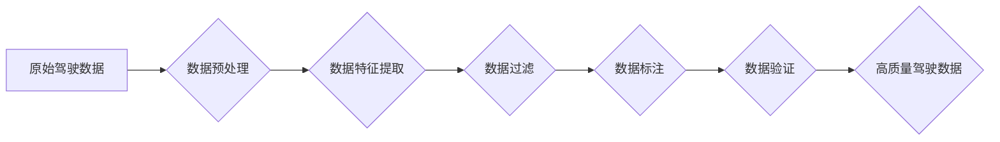

> 自动驾驶, 数据筛选, 机器学习, 深度学习, 算法优化, 数据质量, 驾驶行为分析

## 1. 背景介绍

自动驾驶技术作为未来交通运输的重要发展方向，其核心在于构建一个能够感知环境、理解道路规则、做出安全决策的智能系统。而数据的质量直接决定了自动驾驶系统的性能和安全性。大量原始驾驶数据中往往包含噪声、异常值和不完整信息，这些都会对自动驾驶算法的训练和测试产生负面影响。因此，如何有效地筛选和处理自动驾驶数据，提取高质量的驾驶行为特征，成为自动驾驶技术发展中的关键问题。

## 2. 核心概念与联系

**2.1 数据筛选的意义**

自动驾驶数据筛选是指从原始驾驶数据中提取出符合特定条件和质量标准的数据，去除噪声、异常值和不完整信息，以提高数据质量和有效性。

**2.2 数据筛选的流程**

数据筛选流程通常包括以下几个步骤：

1. **数据预处理:** 清洗数据，处理缺失值、异常值等问题。
2. **数据特征提取:** 从原始数据中提取驾驶行为特征，例如速度、加速度、转向角度、车距等。
3. **数据过滤:** 根据预设的筛选条件，过滤掉不符合要求的数据。
4. **数据标注:** 对筛选后的数据进行标注，例如标注驾驶行为类型、路况信息等。
5. **数据验证:** 对筛选后的数据进行验证，确保数据质量和有效性。

**2.3 数据筛选与自动驾驶算法的关系**

数据筛选直接影响自动驾驶算法的训练和测试效果。高质量的数据可以帮助自动驾驶算法更好地学习驾驶规则和驾驶行为模式，从而提高自动驾驶系统的性能和安全性。

**2.4 数据筛选的挑战**

自动驾驶数据筛选面临着以下挑战：

1. 数据量大，处理难度大。
2. 数据类型多样，特征提取复杂。
3. 筛选标准难以确定，需要根据具体应用场景进行调整。
4. 数据标注成本高，需要专业人员进行标注。

**2.5 Mermaid 流程图**



## 3. 核心算法原理 & 具体操作步骤

**3.1 算法原理概述**

数据筛选算法通常基于机器学习或深度学习技术，通过训练模型来识别和过滤掉不符合要求的数据。常见的算法包括：

* **异常值检测算法:** 识别和过滤掉数据中的异常值，例如K-Means聚类、Isolation Forest等。
* **分类算法:** 将数据分类为不同的类别，例如支持向量机、决策树、随机森林等。
* **回归算法:** 预测数据中的连续值，例如线性回归、逻辑回归等。

**3.2 算法步骤详解**

1. **数据准备:** 收集原始驾驶数据，并进行预处理，例如清洗数据、处理缺失值等。
2. **特征选择:** 选择与驾驶行为相关的特征，例如速度、加速度、转向角度、车距等。
3. **模型训练:** 使用选定的算法训练模型，并根据训练结果评估模型的性能。
4. **数据筛选:** 将原始数据输入到训练好的模型中，根据模型的预测结果筛选出符合要求的数据。
5. **结果评估:** 对筛选后的数据进行评估，例如计算数据质量指标、验证筛选效果等。

**3.3 算法优缺点**

* **优点:** 可以自动识别和过滤掉不符合要求的数据，提高数据质量和有效性。
* **缺点:** 需要大量的训练数据，模型训练成本较高，算法选择和参数设置需要根据具体应用场景进行调整。

**3.4 算法应用领域**

数据筛选算法广泛应用于自动驾驶领域，例如：

* **自动驾驶数据标注:** 自动识别和标注驾驶行为类型、路况信息等。
* **自动驾驶算法训练:** 提供高质量的训练数据，提高自动驾驶算法的性能和安全性。
* **自动驾驶系统测试:** 筛选出符合测试条件的数据，提高测试效率和准确性。

## 4. 数学模型和公式 & 详细讲解 & 举例说明

**4.1 数学模型构建**

假设我们想要筛选出驾驶行为安全的驾驶数据，我们可以构建一个基于驾驶行为特征的数学模型。例如，我们可以使用以下公式来计算驾驶行为的安全评分：

$$
Safety Score = \alpha \cdot Speed + \beta \cdot Acceleration + \gamma \cdot Steering Angle + \delta \cdot Distance
$$

其中：

* $Safety Score$：驾驶行为的安全评分
* $Speed$：驾驶速度
* $Acceleration$：驾驶加速度
* $Steering Angle$：驾驶转向角度
* $Distance$：与前车距离
* $\alpha$, $\beta$, $\gamma$, $\delta$：权重系数

**4.2 公式推导过程**

权重系数的确定可以通过专家经验、统计分析或机器学习算法来进行。例如，我们可以根据驾驶安全事故的统计数据，确定不同驾驶行为特征的权重系数。

**4.3 案例分析与讲解**

假设我们收集了一组驾驶数据，其中包含驾驶速度、加速度、转向角度和与前车距离等特征。我们可以使用上述公式来计算每个驾驶行为的安全评分。然后，我们可以根据安全评分阈值，筛选出安全驾驶行为的数据。

## 5. 项目实践：代码实例和详细解释说明

**5.1 开发环境搭建**

* 操作系统：Ubuntu 20.04
* Python 版本：3.8
* 必要的库：pandas, numpy, scikit-learn

**5.2 源代码详细实现**

```python
import pandas as pd
from sklearn.cluster import KMeans

# 加载驾驶数据
data = pd.read_csv('driving_data.csv')

# 选择驾驶行为特征
features = ['Speed', 'Acceleration', 'Steering Angle', 'Distance']
X = data[features]

# 使用K-Means算法进行聚类
kmeans = KMeans(n_clusters=3)
kmeans.fit(X)

# 获取聚类标签
labels = kmeans.labels_

# 根据聚类标签筛选数据
safe_data = data[labels == 0]

# 保存筛选后的数据
safe_data.to_csv('safe_driving_data.csv', index=False)
```

**5.3 代码解读与分析**

* 代码首先加载驾驶数据，并选择与驾驶行为相关的特征。
* 然后，使用K-Means算法进行聚类，将驾驶数据分为不同的类别。
* 根据聚类标签，筛选出安全驾驶行为的数据。
* 最后，将筛选后的数据保存到文件中。

**5.4 运行结果展示**

运行代码后，将生成一个名为`safe_driving_data.csv`的文件，其中包含筛选后的安全驾驶数据。

## 6. 实际应用场景

**6.1 自动驾驶数据标注**

数据筛选算法可以帮助自动驾驶数据标注人员快速识别和标注安全驾驶行为，提高标注效率和准确性。

**6.2 自动驾驶算法训练**

高质量的驾驶数据可以帮助自动驾驶算法更好地学习驾驶规则和驾驶行为模式，从而提高自动驾驶系统的性能和安全性。

**6.3 自动驾驶系统测试**

筛选出符合测试条件的数据，可以提高自动驾驶系统测试的效率和准确性。

**6.4 未来应用展望**

随着自动驾驶技术的不断发展，数据筛选算法将发挥越来越重要的作用。未来，数据筛选算法将更加智能化、自动化，能够更好地满足自动驾驶技术的需要。

## 7. 工具和资源推荐

**7.1 学习资源推荐**

* **书籍:**
    * 《机器学习》 - 周志华
    * 《深度学习》 - Ian Goodfellow
* **在线课程:**
    * Coursera: Machine Learning
    * Udacity: Deep Learning Nanodegree

**7.2 开发工具推荐**

* **Python:** 
    * pandas
    * numpy
    * scikit-learn
* **数据可视化工具:**
    * Matplotlib
    * Seaborn

**7.3 相关论文推荐**

* **论文标题:** A Survey on Data Quality in Autonomous Driving
* **作者:** [作者姓名]
* **期刊:** [期刊名称]

## 8. 总结：未来发展趋势与挑战

**8.1 研究成果总结**

本文介绍了自动驾驶数据筛选的必要性、核心概念、算法原理、实践案例以及未来应用展望。数据筛选算法可以有效提高自动驾驶数据的质量，为自动驾驶算法的训练和测试提供高质量的数据支持。

**8.2 未来发展趋势**

* **算法智能化:** 未来数据筛选算法将更加智能化，能够自动识别和过滤掉各种类型的异常数据。
* **自动化程度:** 数据筛选流程将更加自动化，能够减少人工干预。
* **多模态数据融合:** 未来数据筛选算法将能够融合多种类型的驾驶数据，例如图像、视频、传感器数据等，提高数据筛选的准确性和有效性。

**8.3 面临的挑战**

* **数据标注成本:** 高质量的驾驶数据标注成本较高，需要进一步降低标注成本。
* **算法鲁棒性:** 数据筛选算法需要更加鲁棒，能够应对各种复杂和不确定的驾驶场景。
* **数据隐私保护:** 数据筛选过程中需要保护驾驶者的隐私信息。

**8.4 研究展望**

未来，我们将继续研究数据筛选算法，提高算法的智能化、自动化和鲁棒性，为自动驾驶技术的健康发展提供高质量的数据支持。

## 9. 附录：常见问题与解答

**9.1 常见问题:**

* **如何选择合适的算法？**

选择合适的算法需要根据具体应用场景和数据特点进行选择。例如，如果数据分布较为均匀，可以使用K-Means算法；如果数据分布较为复杂，可以使用DBSCAN算法。

* **如何确定权重系数？**

权重系数的确定可以通过专家经验、统计分析或机器学习算法来进行。

* **如何评估数据筛选效果？**

可以根据数据质量指标，例如准确率、召回率、F1-score等，评估数据筛选效果。

**9.2 常见问题解答:**

* **如何提高数据筛选的准确率？**

可以尝试使用更复杂的算法，或者增加训练数据量。
* **如何降低数据筛选的成本？**

可以尝试使用自动化工具，或者使用云计算平台进行数据处理。


作者：禅与计算机程序设计艺术 / Zen and the Art of Computer Programming 
<end_of_turn>