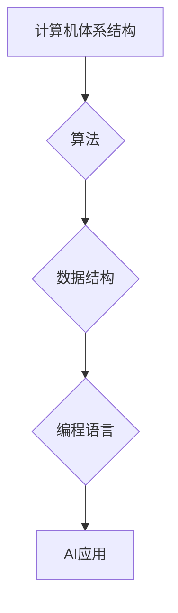

> 计算机基础、人工智能、算法、数据结构、机器学习、深度学习、神经网络

## 1. 背景介绍

人工智能（AI）正以惊人的速度发展，它正在改变着我们生活的方方面面。从自动驾驶汽车到智能语音助手，AI技术的应用无处不在。然而，AI技术的进步离不开扎实的计算机基础知识。

计算机基础知识为AI提供了坚实的基础，它涵盖了计算机体系结构、算法、数据结构、编程语言等多个方面。这些知识点是AI算法的构建基石，是AI系统运行的保障。

## 2. 核心概念与联系

**2.1 计算机体系结构**

计算机体系结构是计算机硬件和软件的组织方式，它决定了计算机如何处理数据和执行指令。AI算法的执行需要大量的计算资源，而计算机体系结构决定了这些资源的利用效率。例如，GPU（图形处理单元）的并行计算能力使其成为深度学习算法的理想平台。

**2.2 算法**

算法是解决特定问题的步骤序列，是AI的核心。AI算法的设计和实现需要对算法的原理、复杂度和效率有深入的理解。常见的AI算法包括：

* **机器学习算法:** 这些算法允许计算机从数据中学习，无需明确编程。常见的机器学习算法包括线性回归、逻辑回归、决策树、支持向量机、k近邻算法等。
* **深度学习算法:** 深度学习算法是一种更高级的机器学习算法，它使用多层神经网络来模拟人类大脑的学习过程。常见的深度学习算法包括卷积神经网络（CNN）、循环神经网络（RNN）等。

**2.3 数据结构**

数据结构是用于组织和存储数据的特定方式，它影响着算法的效率和可读性。AI算法通常需要处理海量数据，因此选择合适的的数据结构至关重要。常见的AI数据结构包括：

* **数组:** 用于存储一组元素的线性结构。
* **链表:** 用于存储一组元素的链式结构。
* **树:** 用于存储层次结构的数据。
* **图:** 用于存储节点和边之间的关系。

**2.4 编程语言**

编程语言是用于编写和执行计算机程序的工具。AI开发通常使用Python、Java、C++等编程语言。这些语言提供了丰富的库和框架，可以简化AI算法的开发和部署。

**Mermaid 流程图**



## 3. 核心算法原理 & 具体操作步骤

### 3.1 算法原理概述

机器学习算法的核心原理是通过学习数据中的模式来预测未来结果。这些算法通常分为监督学习、无监督学习和强化学习三大类。

* **监督学习:** 训练数据包含输入特征和对应的输出标签，算法的目标是学习一个映射关系，将输入特征映射到输出标签。例如，分类问题（如垃圾邮件识别）和回归问题（如房价预测）都属于监督学习。
* **无监督学习:** 训练数据不包含输出标签，算法的目标是发现数据中的隐藏结构或模式。例如，聚类算法（如K-means聚类）和降维算法（如主成分分析）都属于无监督学习。
* **强化学习:** 算法通过与环境交互来学习，目标是最大化累积的奖励。例如，游戏AI和机器人控制都属于强化学习。

### 3.2 算法步骤详解

以线性回归算法为例，详细说明其步骤：

1. **数据准备:** 收集和预处理训练数据，将数据转换为算法可理解的格式。
2. **特征选择:** 选择与目标变量相关的特征作为输入。
3. **模型训练:** 使用训练数据训练线性回归模型，学习模型参数。
4. **模型评估:** 使用测试数据评估模型的性能，例如计算均方误差（MSE）。
5. **模型调优:** 根据评估结果调整模型参数，提高模型性能。
6. **模型部署:** 将训练好的模型部署到实际应用场景中。

### 3.3 算法优缺点

**优点:**

* 算法简单易懂，易于实现。
* 训练速度快，计算资源需求低。

**缺点:**

* 只能处理线性关系，对非线性关系的拟合能力有限。
* 对异常值敏感，容易受到噪声的影响。

### 3.4 算法应用领域

线性回归算法广泛应用于以下领域：

* **预测分析:** 预测销售额、股票价格等。
* **风险评估:** 评估贷款风险、信用风险等。
* **广告投放:** 预测广告点击率、转化率等。

## 4. 数学模型和公式 & 详细讲解 & 举例说明

### 4.1 数学模型构建

线性回归模型的数学模型如下：

$$
y = \theta_0 + \theta_1x_1 + \theta_2x_2 + ... + \theta_nx_n + \epsilon
$$

其中：

* $y$ 是目标变量。
* $x_1, x_2, ..., x_n$ 是输入特征。
* $\theta_0, \theta_1, \theta_2, ..., \theta_n$ 是模型参数。
* $\epsilon$ 是误差项。

### 4.2 公式推导过程

模型参数的学习过程是通过最小化误差函数来实现的。常用的误差函数是均方误差（MSE）：

$$
MSE = \frac{1}{n} \sum_{i=1}^{n} (y_i - \hat{y}_i)^2
$$

其中：

* $n$ 是样本数量。
* $y_i$ 是第 $i$ 个样本的目标变量值。
* $\hat{y}_i$ 是模型预测的第 $i$ 个样本的目标变量值。

通过梯度下降算法，可以迭代更新模型参数，使得MSE最小化。

### 4.3 案例分析与讲解

假设我们想要预测房屋价格，输入特征包括房屋面积、房间数量、地理位置等。我们可以使用线性回归模型来建立房屋价格预测模型。

通过训练数据，模型会学习到房屋面积、房间数量等特征与房屋价格之间的关系，并得出相应的模型参数。然后，我们可以使用这个模型来预测新房子的价格。

## 5. 项目实践：代码实例和详细解释说明

### 5.1 开发环境搭建

* 操作系统：Windows/macOS/Linux
* Python 版本：3.6+
* 库依赖：NumPy、Pandas、Scikit-learn

### 5.2 源代码详细实现

```python
import numpy as np
from sklearn.linear_model import LinearRegression
from sklearn.model_selection import train_test_split

# 加载数据
data = pd.read_csv('house_price.csv')

# 选择特征和目标变量
X = data[['area', 'rooms']]
y = data['price']

# 将数据分为训练集和测试集
X_train, X_test, y_train, y_test = train_test_split(X, y, test_size=0.2, random_state=42)

# 创建线性回归模型
model = LinearRegression()

# 训练模型
model.fit(X_train, y_train)

# 预测测试集数据
y_pred = model.predict(X_test)

# 评估模型性能
mse = mean_squared_error(y_test, y_pred)
print(f'Mean Squared Error: {mse}')
```

### 5.3 代码解读与分析

* 首先，我们加载数据并选择特征和目标变量。
* 然后，我们将数据分为训练集和测试集，用于训练和评估模型。
* 接下来，我们创建线性回归模型并使用训练数据进行训练。
* 训练完成后，我们可以使用模型预测测试集数据，并评估模型性能。

### 5.4 运行结果展示

运行代码后，会输出模型的均方误差（MSE）值。MSE值越小，模型的预测性能越好。

## 6. 实际应用场景

### 6.1 医疗诊断

AI算法可以分析患者的医疗影像数据，例如X光片、CT扫描和MRI扫描，帮助医生诊断疾病。

### 6.2 金融风险评估

AI算法可以分析客户的财务数据，评估其贷款风险和信用风险。

### 6.3 自动驾驶

AI算法可以帮助汽车感知周围环境，做出驾驶决策，实现自动驾驶。

### 6.4 未来应用展望

随着计算机基础知识的不断发展，AI技术的应用场景将更加广泛。例如，AI将被应用于个性化教育、精准医疗、智能制造等领域。

## 7. 工具和资源推荐

### 7.1 学习资源推荐

* **在线课程:** Coursera、edX、Udacity等平台提供丰富的AI课程。
* **书籍:** 《深度学习》、《机器学习实战》等书籍是学习AI的基础教材。
* **开源项目:** TensorFlow、PyTorch等开源项目提供了丰富的AI工具和资源。

### 7.2 开发工具推荐

* **Python:** 广泛用于AI开发，拥有丰富的AI库和框架。
* **Jupyter Notebook:** 用于编写和执行Python代码，方便进行数据分析和模型开发。
* **TensorFlow:** Google开发的开源深度学习框架。
* **PyTorch:** Facebook开发的开源深度学习框架。

### 7.3 相关论文推荐

* **《ImageNet Classification with Deep Convolutional Neural Networks》**
* **《Attention Is All You Need》**
* **《Generative Adversarial Networks》**

## 8. 总结：未来发展趋势与挑战

### 8.1 研究成果总结

近年来，AI技术取得了长足的进步，在各个领域都取得了显著的应用成果。

### 8.2 未来发展趋势

* **模型规模和复杂度不断提升:** 未来，AI模型将更加强大，能够处理更加复杂的任务。
* **边缘计算和分布式训练:** AI模型将更加轻量化，能够在边缘设备上运行，并利用分布式训练技术提高训练效率。
* **跨模态学习:** AI模型将能够处理多种数据类型，例如文本、图像、音频等。

### 8.3 面临的挑战

* **数据安全和隐私保护:** AI算法依赖于大量数据，如何保证数据安全和隐私保护是一个重要的挑战。
* **算法可解释性和公平性:** AI算法的决策过程往往难以理解，如何提高算法的可解释性和公平性是一个重要的研究方向。
* **伦理问题:** AI技术的应用可能会带来一些伦理问题，例如算法偏见、工作岗位替代等，需要引起社会广泛关注和讨论。

### 8.4 研究展望

未来，AI技术将继续发展，为人类社会带来更多福祉。我们需要加强对AI技术的理解和研究，并积极应对AI技术带来的挑战，确保AI技术能够安全、有效地服务于人类。

## 9. 附录：常见问题与解答

**Q1: 什么是机器学习？**

A1: 机器学习是一种人工智能技术，它允许计算机从数据中学习，无需明确编程。

**Q2: 什么是深度学习？**

A2: 深度学习是一种更高级的机器学习算法，它使用多层神经网络来模拟人类大脑的学习过程。

**Q3: 如何选择合适的AI算法？**

A3: 选择合适的AI算法需要根据具体任务和数据特点进行选择。例如，对于分类问题，可以使用逻辑回归或支持向量机算法；对于回归问题，可以使用线性回归或决策树算法。

**作者：禅与计算机程序设计艺术 / Zen and the Art of Computer Programming**


<end_of_turn>